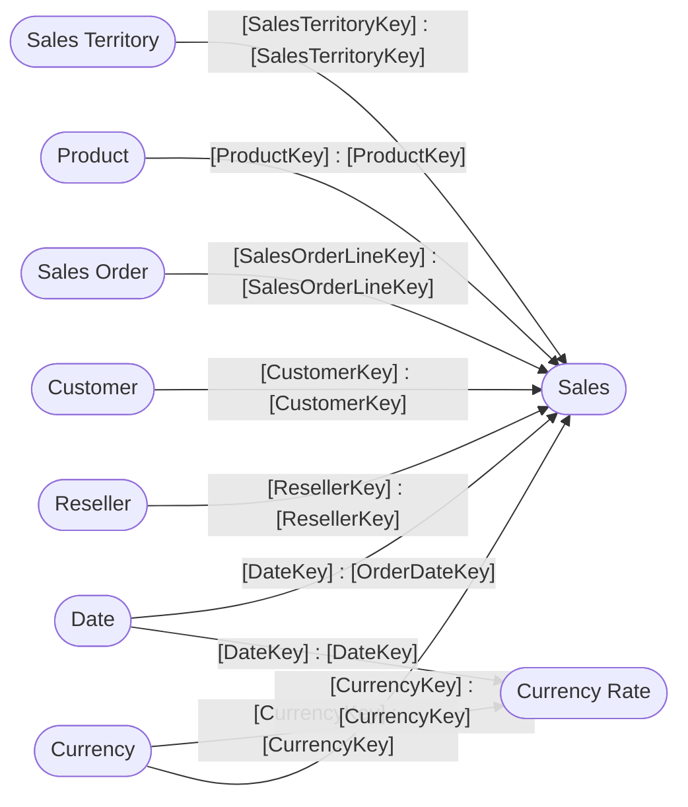

----

[Home](./index.md) > [Adventure Works DW 2020.pbix](Adventure%20Works%20DW%202020.pbix.md)

| [Information](#information) | [Model information](#model-information) | [Model relationships](#model-relationships) | [Business objects](#business-objects) | [Measures](#measures) | [Relationships](#relationships) | [Hierarchies](#hierarchies) | [Columns](#columns) | [Report sections](#report-sections) |

----

# Information

Documentation for file **Adventure Works DW 2020.pbix**.

# Model information

| Param  | Value  |
|---|---|
| **Analyzed pbix file name** | `Adventure Works DW 2020.pbix` | 
| **Catalog name** | `cec697f9-66bf-45ba-88c0-40173f7aa7a9` | 
| **Port** | `61445`|
| **Description** | `-NaN-` | 
| **Date modified** | `2023-07-06T22:33:29` | 
| **Compatibility level** | `1567` | 

[Up](#)
# Model relationships

[Up](#)

# Business objects

| ID | NAME | DESCRIPTION | 
|----|------|-------------|
| 12 | Customer | n/a |
| 183 | Date | Filters the Sales table using sales order date |
| 382 | Sales Territory | n/a |
| 458 | Product | n/a |
| 561 | Sales Order | n/a |
| 4380 | Sales | n/a |
| 5597 | Reseller | n/a |
| 12588 | Currency Rate | n/a |
| 12591 | Currency | n/a |

[Up](#)
# Measures

<table>
    <tr>
        <th> ID </th><th> TABLE </th><th> NAME </th><th> DESCRIPTION </th><th> EXPRESSION </th><th> IS_HIDDEN </th><th> STATE </th>
    </tr>
</table>

[Up](#)
# Relationships 

| ID | FROM_TABLE | TO_TABLE | FROM:TO CARDINALITY | NAME | IS_ACTIVE  |
|----|------------|----------|---------------------|------|------------|
| 5049 | Sales[SalesTerritoryKey] | Sales Territory[SalesTerritoryKey] | 2:1 | c4007daa-09a5-455d-ac3b-d8338a0e4468 | True |
| 5052 | Sales[ProductKey] | Product[ProductKey] | 2:1 | fe440ad4-cbfb-4a8c-9b24-4d02f59a009f | True |
| 5055 | Sales[SalesOrderLineKey] | Sales Order[SalesOrderLineKey] | 1:1 | ddc90e12-74d0-451e-87b6-3bc8d773bf07 | True |
| 5098 | Sales[CustomerKey] | Customer[CustomerKey] | 2:1 | 3921d624-3ba4-40ca-b78d-61fe4ebc7659 | True |
| 5115 | Sales[OrderDateKey] | Date[DateKey] | 2:1 | ad03fb2c-8d99-47eb-bdab-0e52920c9d3f | True |
| 5132 | Sales[DueDateKey] | Date[DateKey] | 2:1 | a390c257-6a75-4c82-aab5-270f564d26b0 | False |
| 5149 | Sales[ShipDateKey] | Date[DateKey] | 2:1 | fcf11ed1-afec-495f-8897-4461f7a9d501 | False |
| 5863 | Sales[ResellerKey] | Reseller[ResellerKey] | 2:1 | f72f8f53-10b5-4d0a-82ea-19e584697a64 | True |
| 12868 | Currency Rate[CurrencyKey] | Currency[CurrencyKey] | 2:1 | 7153500f-96dc-4ed3-a64a-05fecdf74cae | True |
| 12869 | Currency Rate[DateKey] | Date[DateKey] | 2:1 | 4634537b-3d3d-485d-8c60-847a3cfce4dc | True |
| 13378 | Sales[CurrencyKey] | Currency[CurrencyKey] | 2:1 | 290237c5-c261-400f-a435-e66531b43cb3 | True |

[Up](#)
# Hierarchies 

| ID | TABLE | NAME | DESCRIPTION  | IS_HIDDEN | 
|----|----------|------|--------------|-----------|
| 2700 |Customer | Geography | n/a | False | 
| 2657 |Date | Fiscal | n/a | False | 
| 6579 |Sales Territory | Sales Territories | n/a | False | 
| 2316 |Product | Products | n/a | False | 
| 2276 |Sales Order | Sales Orders | n/a | False | 
| 6116 |Reseller | Geography | n/a | False | 

[Up](#)
# Columns 

<table>
    <tr>
        <th> ID </th><th> TABLE </th><th> EXPLICIT_NAME </th><th> DESCRIPTION </th><th> IS_HIDDEN </th><th> EXPRESSION </th>
    </tr>
<tr>
        <td> 114 </td><td> Customer </td><td> Customer ID </td><td> n/a </td><td> False </td><td><code> n/a </code></td>
    </tr>

<tr>
        <td> 115 </td><td> Customer </td><td> Customer </td><td> n/a </td><td> False </td><td><code> n/a </code></td>
    </tr>

<tr>
        <td> 116 </td><td> Customer </td><td> City </td><td> n/a </td><td> False </td><td><code> n/a </code></td>
    </tr>

<tr>
        <td> 117 </td><td> Customer </td><td> State-Province </td><td> n/a </td><td> False </td><td><code> n/a </code></td>
    </tr>

<tr>
        <td> 118 </td><td> Customer </td><td> Country-Region </td><td> n/a </td><td> False </td><td><code> n/a </code></td>
    </tr>

<tr>
        <td> 119 </td><td> Customer </td><td> Postal Code </td><td> n/a </td><td> False </td><td><code> n/a </code></td>
    </tr>

<tr>
        <td> 192 </td><td> Date </td><td> Date </td><td> n/a </td><td> False </td><td><code> n/a </code></td>
    </tr>

<tr>
        <td> 200 </td><td> Date </td><td> Fiscal Year </td><td> n/a </td><td> False </td><td><code> n/a </code></td>
    </tr>

<tr>
        <td> 201 </td><td> Date </td><td> Fiscal Quarter </td><td> n/a </td><td> False </td><td><code> n/a </code></td>
    </tr>

<tr>
        <td> 202 </td><td> Date </td><td> Month </td><td> n/a </td><td> False </td><td><code> n/a </code></td>
    </tr>

<tr>
        <td> 7091 </td><td> Date </td><td> Full Date </td><td> n/a </td><td> False </td><td><code> n/a </code></td>
    </tr>

<tr>
        <td> 12331 </td><td> Date </td><td> Month Number Of Year </td><td> n/a </td><td> False </td><td><code> n/a </code></td>
    </tr>

<tr>
        <td> 387 </td><td> Sales Territory </td><td> Region </td><td> n/a </td><td> False </td><td><code> n/a </code></td>
    </tr>

<tr>
        <td> 388 </td><td> Sales Territory </td><td> Country </td><td> n/a </td><td> False </td><td><code> n/a </code></td>
    </tr>

<tr>
        <td> 389 </td><td> Sales Territory </td><td> Group </td><td> n/a </td><td> False </td><td><code> n/a </code></td>
    </tr>

<tr>
        <td> 463 </td><td> Product </td><td> Product </td><td> n/a </td><td> False </td><td><code> n/a </code></td>
    </tr>

<tr>
        <td> 464 </td><td> Product </td><td> Standard Cost </td><td> n/a </td><td> False </td><td><code> n/a </code></td>
    </tr>

<tr>
        <td> 465 </td><td> Product </td><td> Color </td><td> n/a </td><td> False </td><td><code> n/a </code></td>
    </tr>

<tr>
        <td> 466 </td><td> Product </td><td> List Price </td><td> n/a </td><td> False </td><td><code> n/a </code></td>
    </tr>

<tr>
        <td> 467 </td><td> Product </td><td> Model </td><td> n/a </td><td> False </td><td><code> n/a </code></td>
    </tr>

<tr>
        <td> 468 </td><td> Product </td><td> Subcategory </td><td> n/a </td><td> False </td><td><code> n/a </code></td>
    </tr>

<tr>
        <td> 469 </td><td> Product </td><td> Category </td><td> n/a </td><td> False </td><td><code> n/a </code></td>
    </tr>

<tr>
        <td> 2416 </td><td> Product </td><td> SKU </td><td> Stock-keeping unit </td><td> False </td><td><code> n/a </code></td>
    </tr>

<tr>
        <td> 10779 </td><td> Product </td><td> Safety Stock Level </td><td> n/a </td><td> False </td><td><code> n/a </code></td>
    </tr>

<tr>
        <td> 10787 </td><td> Product </td><td> Reorder Point </td><td> n/a </td><td> False </td><td><code> n/a </code></td>
    </tr>

<tr>
        <td> 10795 </td><td> Product </td><td> Class </td><td> n/a </td><td> False </td><td><code> n/a </code></td>
    </tr>

<tr>
        <td> 566 </td><td> Sales Order </td><td> Sales Order </td><td> n/a </td><td> False </td><td><code> n/a </code></td>
    </tr>

<tr>
        <td> 567 </td><td> Sales Order </td><td> Sales Order Line </td><td> n/a </td><td> False </td><td><code> n/a </code></td>
    </tr>

<tr>
        <td> 4531 </td><td> Sales Order </td><td> Channel </td><td> n/a </td><td> False </td><td><code> n/a </code></td>
    </tr>

<tr>
        <td> 4393 </td><td> Sales </td><td> Order Quantity </td><td> n/a </td><td> False </td><td><code> n/a </code></td>
    </tr>

<tr>
        <td> 4394 </td><td> Sales </td><td> Unit Price </td><td> n/a </td><td> False </td><td><code> n/a </code></td>
    </tr>

<tr>
        <td> 4395 </td><td> Sales </td><td> Extended Amount </td><td> n/a </td><td> False </td><td><code> n/a </code></td>
    </tr>

<tr>
        <td> 4396 </td><td> Sales </td><td> Product Standard Cos..(21) </td><td> n/a </td><td> False </td><td><code> n/a </code></td>
    </tr>

<tr>
        <td> 4397 </td><td> Sales </td><td> Total Product Cost </td><td> n/a </td><td> False </td><td><code> n/a </code></td>
    </tr>

<tr>
        <td> 4398 </td><td> Sales </td><td> Sales Amount </td><td> n/a </td><td> False </td><td><code> n/a </code></td>
    </tr>

<tr>
        <td> 10222 </td><td> Sales </td><td> Unit Price Discount ..(23) </td><td> n/a </td><td> False </td><td><code> n/a </code></td>
    </tr>

<tr>
        <td> 5602 </td><td> Reseller </td><td> Business Type </td><td> n/a </td><td> False </td><td><code> n/a </code></td>
    </tr>

<tr>
        <td> 5603 </td><td> Reseller </td><td> Reseller </td><td> n/a </td><td> False </td><td><code> n/a </code></td>
    </tr>

<tr>
        <td> 5604 </td><td> Reseller </td><td> City </td><td> n/a </td><td> False </td><td><code> n/a </code></td>
    </tr>

<tr>
        <td> 5605 </td><td> Reseller </td><td> State-Province </td><td> n/a </td><td> False </td><td><code> n/a </code></td>
    </tr>

<tr>
        <td> 5606 </td><td> Reseller </td><td> Country-Region </td><td> n/a </td><td> False </td><td><code> n/a </code></td>
    </tr>

<tr>
        <td> 5607 </td><td> Reseller </td><td> Postal Code </td><td> n/a </td><td> False </td><td><code> n/a </code></td>
    </tr>

<tr>
        <td> 5883 </td><td> Reseller </td><td> Reseller ID </td><td> n/a </td><td> False </td><td><code> n/a </code></td>
    </tr>

<tr>
        <td> 12596 </td><td> Currency Rate </td><td> Average Rate </td><td> n/a </td><td> False </td><td><code> n/a </code></td>
    </tr>

<tr>
        <td> 12597 </td><td> Currency Rate </td><td> End Of Day Rate </td><td> n/a </td><td> False </td><td><code> n/a </code></td>
    </tr>

<tr>
        <td> 12599 </td><td> Currency </td><td> Code </td><td> n/a </td><td> False </td><td><code> n/a </code></td>
    </tr>

<tr>
        <td> 12600 </td><td> Currency </td><td> Currency </td><td> n/a </td><td> False </td><td><code> n/a </code></td>
    </tr>

<tr>
        <td> 12601 </td><td> Currency </td><td> Format String </td><td> n/a </td><td> False </td><td><code> n/a </code></td>
    </tr>

</table>

# Report sections

## Introduction

| Param  | Value  |
|---|---|
| **ID** | `0` |
| **Name** | `ReportSection` |
| **Display Name** | `Introduction` |
| **Filters** | `[]` |
| **Ordinal** | `0` |
| **Visual containers number** | `2` |

[Up](#)

### Container 8e32815c186232f25e33 

| Param  | Value  |
|---|---|
| **Name:** | `8e32815c186232f25e33` |
| **Type:** | `['n/a']` |
| **Business objects:**  | `n/a` | 
| **Attributes:**  | n/a | 

[Up](#)

### Container dbb7aa4447e4690db31e 

| Param  | Value  |
|---|---|
| **Name:** | `dbb7aa4447e4690db31e` |
| **Type:** | `['n/a']` |
| **Business objects:**  | `n/a` | 
| **Attributes:**  | n/a | 

[Up](#)

----

Generated at 16.12.2023 22:12:22 by <a href='https://github.com/dop12/pbix_doc'>PBIX DOC PROJECT</a> Git version: 5347a61

