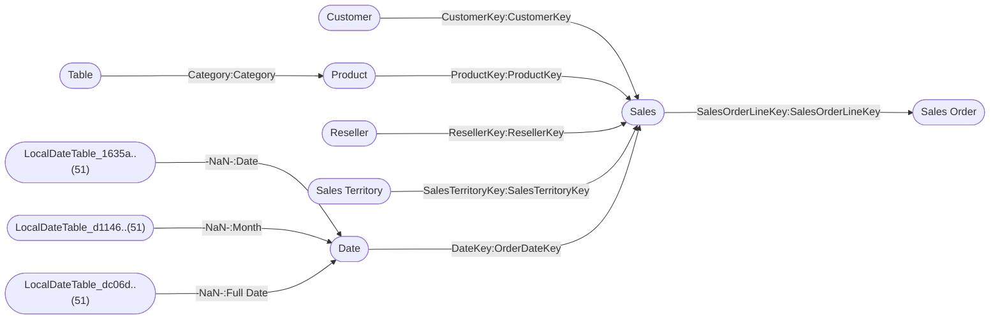

----

[Home](./index.md) > [AdventureWorks Sales.pbix](AdventureWorks%20Sales.pbix.md)

| [Information](#information) | [Model information](#model-information) | [Model relationships](#model-relationships) | [Business objects](#business-objects) | [Measures](#measures) | [Relationships](#relationships) | [Hierarchies](#hierarchies) | [Columns](#columns) | [Report sections](#report-sections) |

----

# Information

Documentation for file **AdventureWorks Sales.pbix**.

# Model information

| Param  | Value  |
|---|---|
| **Analyzed pbix file name** | `AdventureWorks Sales.pbix` | 
| **Catalog name** | `44711856-430d-45f3-bdd8-79b920d87216` | 
| **Port** | `61470`|
| **Description** | `-NaN-` | 
| **Date modified** | `2023-12-16T19:21:06` | 
| **Compatibility level** | `1567` | 

[Up](#)
# Model relationships

[Up](#)

# Business objects

| ID | NAME | DESCRIPTION | 
|----|------|-------------|
| 12 | Customer | n/a |
| 183 | Date | n/a |
| 572 | Product | n/a |
| 690 | Reseller | n/a |
| 805 | Sales | n/a |
| 980 | Sales Order | n/a |
| 1078 | Sales Territory | n/a |
| 3642 | Table | n/a |

[Up](#)
# Measures

<table>
    <tr>
        <th> ID </th><th> TABLE </th><th> NAME </th><th> DESCRIPTION </th><th> EXPRESSION </th><th> IS_HIDDEN </th><th> STATE </th>
    </tr>
<tr>
        <td> 19 </td><td> DateTableTemplate_78..(54) </td><td>  </td><td> n/a </td><td> <code> YEAR([Date]) </code></td><td> True </td><td>  1 </td> 
    </tr>
<tr>
        <td> 20 </td><td> DateTableTemplate_78..(54) </td><td>  </td><td> n/a </td><td> <code> MONTH([Date]) </code></td><td> True </td><td>  1 </td> 
    </tr>
<tr>
        <td> 21 </td><td> DateTableTemplate_78..(54) </td><td>  </td><td> n/a </td><td> <code> FORMAT([Date], "MMMM") </code></td><td> True </td><td>  1 </td> 
    </tr>
<tr>
        <td> 22 </td><td> DateTableTemplate_78..(54) </td><td>  </td><td> n/a </td><td> <code> INT(([MonthNo] + 2) / 3) </code></td><td> True </td><td>  1 </td> 
    </tr>
<tr>
        <td> 23 </td><td> DateTableTemplate_78..(54) </td><td>  </td><td> n/a </td><td> <code> "Qtr " & [QuarterNo] </code></td><td> True </td><td>  1 </td> 
    </tr>
<tr>
        <td> 24 </td><td> DateTableTemplate_78..(54) </td><td>  </td><td> n/a </td><td> <code> DAY([Date]) </code></td><td> True </td><td>  1 </td> 
    </tr>
<tr>
        <td> 201 </td><td> LocalDateTable_1635a..(51) </td><td>  </td><td> n/a </td><td> <code> YEAR([Date]) </code></td><td> True </td><td>  1 </td> 
    </tr>
<tr>
        <td> 202 </td><td> LocalDateTable_1635a..(51) </td><td>  </td><td> n/a </td><td> <code> MONTH([Date]) </code></td><td> True </td><td>  1 </td> 
    </tr>
<tr>
        <td> 203 </td><td> LocalDateTable_1635a..(51) </td><td>  </td><td> n/a </td><td> <code> FORMAT([Date], "MMMM") </code></td><td> True </td><td>  1 </td> 
    </tr>
<tr>
        <td> 204 </td><td> LocalDateTable_1635a..(51) </td><td>  </td><td> n/a </td><td> <code> INT(([MonthNo] + 2) / 3) </code></td><td> True </td><td>  1 </td> 
    </tr>
<tr>
        <td> 205 </td><td> LocalDateTable_1635a..(51) </td><td>  </td><td> n/a </td><td> <code> "Qtr " & [QuarterNo] </code></td><td> True </td><td>  1 </td> 
    </tr>
<tr>
        <td> 206 </td><td> LocalDateTable_1635a..(51) </td><td>  </td><td> n/a </td><td> <code> DAY([Date]) </code></td><td> True </td><td>  1 </td> 
    </tr>
<tr>
        <td> 211 </td><td> LocalDateTable_d1146..(51) </td><td>  </td><td> n/a </td><td> <code> YEAR([Date]) </code></td><td> True </td><td>  1 </td> 
    </tr>
<tr>
        <td> 212 </td><td> LocalDateTable_d1146..(51) </td><td>  </td><td> n/a </td><td> <code> MONTH([Date]) </code></td><td> True </td><td>  1 </td> 
    </tr>
<tr>
        <td> 213 </td><td> LocalDateTable_d1146..(51) </td><td>  </td><td> n/a </td><td> <code> FORMAT([Date], "MMMM") </code></td><td> True </td><td>  1 </td> 
    </tr>
<tr>
        <td> 214 </td><td> LocalDateTable_d1146..(51) </td><td>  </td><td> n/a </td><td> <code> INT(([MonthNo] + 2) / 3) </code></td><td> True </td><td>  1 </td> 
    </tr>
<tr>
        <td> 215 </td><td> LocalDateTable_d1146..(51) </td><td>  </td><td> n/a </td><td> <code> "Qtr " & [QuarterNo] </code></td><td> True </td><td>  1 </td> 
    </tr>
<tr>
        <td> 216 </td><td> LocalDateTable_d1146..(51) </td><td>  </td><td> n/a </td><td> <code> DAY([Date]) </code></td><td> True </td><td>  1 </td> 
    </tr>
<tr>
        <td> 219 </td><td> LocalDateTable_dc06d..(51) </td><td>  </td><td> n/a </td><td> <code> YEAR([Date]) </code></td><td> True </td><td>  1 </td> 
    </tr>
<tr>
        <td> 220 </td><td> LocalDateTable_dc06d..(51) </td><td>  </td><td> n/a </td><td> <code> MONTH([Date]) </code></td><td> True </td><td>  1 </td> 
    </tr>
<tr>
        <td> 221 </td><td> LocalDateTable_dc06d..(51) </td><td>  </td><td> n/a </td><td> <code> FORMAT([Date], "MMMM") </code></td><td> True </td><td>  1 </td> 
    </tr>
<tr>
        <td> 222 </td><td> LocalDateTable_dc06d..(51) </td><td>  </td><td> n/a </td><td> <code> INT(([MonthNo] + 2) / 3) </code></td><td> True </td><td>  1 </td> 
    </tr>
<tr>
        <td> 223 </td><td> LocalDateTable_dc06d..(51) </td><td>  </td><td> n/a </td><td> <code> "Qtr " & [QuarterNo] </code></td><td> True </td><td>  1 </td> 
    </tr>
<tr>
        <td> 224 </td><td> LocalDateTable_dc06d..(51) </td><td>  </td><td> n/a </td><td> <code> DAY([Date]) </code></td><td> True </td><td>  1 </td> 
    </tr>
<tr>
        <td> 3742 </td><td> Product </td><td>  </td><td> n/a </td><td> <code> RELATED('Table'[Sorting]) </code></td><td> False </td><td>  1 </td> 
    </tr>
</table>

[Up](#)
# Relationships 

| ID | FROM_TABLE | TO_TABLE | FROM:TO CARDINALITY | NAME | IS_ACTIVE  |
|----|------------|----------|---------------------|------|------------|
| 195 | Date[Date] | LocalDateTable_1635a..(51)[-NaN-] | 2:1 | 88371ba8-2389-41b4-a22f-bcb756732d3b | True |
| 196 | Date[Month] | LocalDateTable_d1146..(51)[-NaN-] | 2:1 | 586c9eeb-fe2f-431d-a8c4-9723ce217f20 | True |
| 197 | Date[Full Date] | LocalDateTable_dc06d..(51)[-NaN-] | 2:1 | 401217e9-9553-4835-a527-fd574f68046d | True |
| 3224 | Sales[CustomerKey] | Customer[CustomerKey] | 2:1 | e3030baf-8c61-408d-a80e-04714277dcd3 | True |
| 3227 | Sales[ProductKey] | Product[ProductKey] | 2:1 | a0a78efb-3ce3-472a-993a-b92e31c0e3cd | True |
| 3230 | Sales[ResellerKey] | Reseller[ResellerKey] | 2:1 | 0ef2b150-bb90-4b8f-8537-fc236873591c | True |
| 3233 | Sales Order[SalesOrderLineKey] | Sales[SalesOrderLineKey] | 1:1 | 29b21f6a-77ef-4b3b-a0c0-e4111f87627b | True |
| 3238 | Sales[SalesTerritoryKey] | Sales Territory[SalesTerritoryKey] | 2:1 | cecf591c-1f02-44a6-bff1-1c753a0b4835 | True |
| 3305 | Sales[OrderDateKey] | Date[DateKey] | 2:1 | 8e31fd7b-1e63-43a9-8a47-33876ae8aed6 | True |
| 3322 | Sales[DueDateKey] | Date[DateKey] | 2:1 | dfb7bf63-667c-4abb-b494-7424c4e34b60 | False |
| 3339 | Sales[ShipDateKey] | Date[DateKey] | 2:1 | 6a63bfea-7b52-4e05-85f4-63a0f9b8991f | False |
| 3725 | Product[Category] | Table[Category] | 2:1 | 93a2e7c9-4a15-47be-93c0-06eceb139103 | True |

[Up](#)
# Hierarchies 

| ID | TABLE | NAME | DESCRIPTION  | IS_HIDDEN | 
|----|----------|------|--------------|-----------|
| 3356 |Customer | Geography | n/a | False | 
| 27 |DateTableTemplate_78..(54) | Date Hierarchy | n/a | False | 
| 3399 |Date | Fiscal | n/a | False | 
| 230 |LocalDateTable_1635a..(51) | Date Hierarchy | n/a | False | 
| 231 |LocalDateTable_d1146..(51) | Date Hierarchy | n/a | False | 
| 232 |LocalDateTable_dc06d..(51) | Date Hierarchy | n/a | False | 
| 3476 |Product | Products | n/a | False | 
| 3518 |Reseller | Geography | n/a | False | 
| 3561 |Sales Order | Sales Orders | n/a | False | 
| 3601 |Sales Territory | Sales Territories | n/a | False | 

[Up](#)
# Columns 

<table>
    <tr>
        <th> ID </th><th> TABLE </th><th> EXPLICIT_NAME </th><th> DESCRIPTION </th><th> IS_HIDDEN </th><th> EXPRESSION </th>
    </tr>
<tr>
        <td> 114 </td><td> Customer </td><td> Customer ID </td><td> n/a </td><td> False </td><td><code> n/a </code></td>
    </tr>

<tr>
        <td> 115 </td><td> Customer </td><td> Customer </td><td> n/a </td><td> False </td><td><code> n/a </code></td>
    </tr>

<tr>
        <td> 116 </td><td> Customer </td><td> City </td><td> n/a </td><td> False </td><td><code> n/a </code></td>
    </tr>

<tr>
        <td> 117 </td><td> Customer </td><td> State-Province </td><td> n/a </td><td> False </td><td><code> n/a </code></td>
    </tr>

<tr>
        <td> 118 </td><td> Customer </td><td> Country-Region </td><td> n/a </td><td> False </td><td><code> n/a </code></td>
    </tr>

<tr>
        <td> 119 </td><td> Customer </td><td> Postal Code </td><td> n/a </td><td> False </td><td><code> n/a </code></td>
    </tr>

<tr>
        <td> 199 </td><td> Date </td><td> Date </td><td> n/a </td><td> False </td><td><code> n/a </code></td>
    </tr>

<tr>
        <td> 207 </td><td> Date </td><td> Fiscal Year </td><td> n/a </td><td> False </td><td><code> n/a </code></td>
    </tr>

<tr>
        <td> 208 </td><td> Date </td><td> Fiscal Quarter </td><td> n/a </td><td> False </td><td><code> n/a </code></td>
    </tr>

<tr>
        <td> 209 </td><td> Date </td><td> Month </td><td> n/a </td><td> False </td><td><code> n/a </code></td>
    </tr>

<tr>
        <td> 217 </td><td> Date </td><td> Full Date </td><td> n/a </td><td> False </td><td><code> n/a </code></td>
    </tr>

<tr>
        <td> 576 </td><td> Product </td><td> SKU </td><td> n/a </td><td> False </td><td><code> n/a </code></td>
    </tr>

<tr>
        <td> 577 </td><td> Product </td><td> Product </td><td> n/a </td><td> False </td><td><code> n/a </code></td>
    </tr>

<tr>
        <td> 578 </td><td> Product </td><td> Standard Cost </td><td> n/a </td><td> False </td><td><code> n/a </code></td>
    </tr>

<tr>
        <td> 579 </td><td> Product </td><td> Color </td><td> n/a </td><td> False </td><td><code> n/a </code></td>
    </tr>

<tr>
        <td> 580 </td><td> Product </td><td> List Price </td><td> n/a </td><td> False </td><td><code> n/a </code></td>
    </tr>

<tr>
        <td> 581 </td><td> Product </td><td> Model </td><td> n/a </td><td> False </td><td><code> n/a </code></td>
    </tr>

<tr>
        <td> 582 </td><td> Product </td><td> Subcategory </td><td> n/a </td><td> False </td><td><code> n/a </code></td>
    </tr>

<tr>
        <td> 583 </td><td> Product </td><td> Category </td><td> n/a </td><td> False </td><td><code> n/a </code></td>
    </tr>

<tr>
        <td> 3742 </td><td> Product </td><td> Sorting </td><td> n/a </td><td> False </td><td><code> RELATED('Table'[Sorting]) </code></td>
    </tr>

<tr>
        <td> 694 </td><td> Reseller </td><td> Reseller ID </td><td> n/a </td><td> False </td><td><code> n/a </code></td>
    </tr>

<tr>
        <td> 695 </td><td> Reseller </td><td> Business Type </td><td> n/a </td><td> False </td><td><code> n/a </code></td>
    </tr>

<tr>
        <td> 696 </td><td> Reseller </td><td> Reseller </td><td> n/a </td><td> False </td><td><code> n/a </code></td>
    </tr>

<tr>
        <td> 697 </td><td> Reseller </td><td> City </td><td> n/a </td><td> False </td><td><code> n/a </code></td>
    </tr>

<tr>
        <td> 698 </td><td> Reseller </td><td> State-Province </td><td> n/a </td><td> False </td><td><code> n/a </code></td>
    </tr>

<tr>
        <td> 699 </td><td> Reseller </td><td> Country-Region </td><td> n/a </td><td> False </td><td><code> n/a </code></td>
    </tr>

<tr>
        <td> 700 </td><td> Reseller </td><td> Postal Code </td><td> n/a </td><td> False </td><td><code> n/a </code></td>
    </tr>

<tr>
        <td> 816 </td><td> Sales </td><td> Order Quantity </td><td> n/a </td><td> False </td><td><code> n/a </code></td>
    </tr>

<tr>
        <td> 817 </td><td> Sales </td><td> Unit Price </td><td> n/a </td><td> False </td><td><code> n/a </code></td>
    </tr>

<tr>
        <td> 818 </td><td> Sales </td><td> Extended Amount </td><td> n/a </td><td> False </td><td><code> n/a </code></td>
    </tr>

<tr>
        <td> 819 </td><td> Sales </td><td> Unit Price Discount ..(23) </td><td> n/a </td><td> False </td><td><code> n/a </code></td>
    </tr>

<tr>
        <td> 820 </td><td> Sales </td><td> Product Standard Cos..(21) </td><td> n/a </td><td> False </td><td><code> n/a </code></td>
    </tr>

<tr>
        <td> 821 </td><td> Sales </td><td> Total Product Cost </td><td> n/a </td><td> False </td><td><code> n/a </code></td>
    </tr>

<tr>
        <td> 822 </td><td> Sales </td><td> Sales Amount </td><td> n/a </td><td> False </td><td><code> n/a </code></td>
    </tr>

<tr>
        <td> 983 </td><td> Sales Order </td><td> Channel </td><td> n/a </td><td> False </td><td><code> n/a </code></td>
    </tr>

<tr>
        <td> 985 </td><td> Sales Order </td><td> Sales Order </td><td> n/a </td><td> False </td><td><code> n/a </code></td>
    </tr>

<tr>
        <td> 986 </td><td> Sales Order </td><td> Sales Order Line </td><td> n/a </td><td> False </td><td><code> n/a </code></td>
    </tr>

<tr>
        <td> 1082 </td><td> Sales Territory </td><td> Region </td><td> n/a </td><td> False </td><td><code> n/a </code></td>
    </tr>

<tr>
        <td> 1083 </td><td> Sales Territory </td><td> Country </td><td> n/a </td><td> False </td><td><code> n/a </code></td>
    </tr>

<tr>
        <td> 1084 </td><td> Sales Territory </td><td> Group </td><td> n/a </td><td> False </td><td><code> n/a </code></td>
    </tr>

<tr>
        <td> 3645 </td><td> Table </td><td> Category </td><td> n/a </td><td> False </td><td><code> n/a </code></td>
    </tr>

<tr>
        <td> 3646 </td><td> Table </td><td> Sorting </td><td> n/a </td><td> False </td><td><code> n/a </code></td>
    </tr>

</table>

# Report sections

## Page 1

| Param  | Value  |
|---|---|
| **ID** | `0` |
| **Name** | `ReportSection` |
| **Display Name** | `Page 1` |
| **Filters** | `[]` |
| **Ordinal** | `0` |
| **Visual containers number** | `6` |

[Up](#)

### Container 4815acfc1f588ed839c4 

| Param  | Value  |
|---|---|
| **Name:** | `4815acfc1f588ed839c4` |
| **Type:** | `areaChart` |
| **Business objects:**  | `Date, Sales` | 
| **Attributes:**  | Aggregation: Sum(Sales.Sales Amount)  Measure: Sales.Sales Amount by Due Date  HierarchyLevel: Date.Fiscal.Month | 

[Up](#)

### Container 43718bfbc9b53930dbee 

| Param  | Value  |
|---|---|
| **Name:** | `43718bfbc9b53930dbee` |
| **Type:** | `map` |
| **Business objects:**  | `Sales, Reseller` | 
| **Attributes:**  | Aggregation: Sum(Sales.Order Quantity)  Column: Reseller.Country-Region | 

[Up](#)

### Container 3a1aeaede6fc79fe5066 

| Param  | Value  |
|---|---|
| **Name:** | `3a1aeaede6fc79fe5066` |
| **Type:** | `pivotTable` |
| **Business objects:**  | `Product, Reseller, Sales` | 
| **Attributes:**  | Column: Product.Category  Column: Reseller.Business Type  Aggregation: Sum(Sales.Sales Amount) | 

[Up](#)

### Container 75c624f501f3c20eb760 

| Param  | Value  |
|---|---|
| **Name:** | `75c624f501f3c20eb760` |
| **Type:** | `slicer` |
| **Business objects:**  | `Date` | 
| **Attributes:**  | HierarchyLevel: Date.Fiscal.Year  HierarchyLevel: Date.Fiscal.Month | 

[Up](#)

### Container e62f8d740cd4f569300d 

| Param  | Value  |
|---|---|
| **Name:** | `e62f8d740cd4f569300d` |
| **Type:** | `['n/a']` |
| **Business objects:**  | `n/a` | 
| **Attributes:**  | n/a | 

[Up](#)

### Container ddc669d1ed997bf82754 

| Param  | Value  |
|---|---|
| **Name:** | `ddc669d1ed997bf82754` |
| **Type:** | `['n/a']` |
| **Business objects:**  | `n/a` | 
| **Attributes:**  | n/a | 

[Up](#)

## Page 2

| Param  | Value  |
|---|---|
| **ID** | `` |
| **Name** | `ReportSection350b6b55132e00f8ba89` |
| **Display Name** | `Page 2` |
| **Filters** | `[]` |
| **Ordinal** | `1` |
| **Visual containers number** | `1` |

[Up](#)

### Container 81c88ed0eeabf5421b8f 

| Param  | Value  |
|---|---|
| **Name:** | `81c88ed0eeabf5421b8f` |
| **Type:** | `pivotTable` |
| **Business objects:**  | `Product, Reseller, Sales` | 
| **Attributes:**  | Column: Product.Category  Column: Reseller.Business Type  Aggregation: Sum(Sales.Sales Amount) | 

[Up](#)

## Page 3

| Param  | Value  |
|---|---|
| **ID** | `` |
| **Name** | `ReportSectiona113e22f3ad54b8397d8` |
| **Display Name** | `Page 3` |
| **Filters** | `[]` |
| **Ordinal** | `2` |
| **Visual containers number** | `1` |

[Up](#)

### Container ec25b2f7759b3fd44c1d 

| Param  | Value  |
|---|---|
| **Name:** | `ec25b2f7759b3fd44c1d` |
| **Type:** | `areaChart` |
| **Business objects:**  | `Date, Sales` | 
| **Attributes:**  | HierarchyLevel: Date.Fiscal.Month  Aggregation: Sum(Sales.Sales Amount)  Measure: Sales.Sales Amount by Due Date | 

[Up](#)

----

Generated at 16.12.2023 22:30:29 by <a href='https://github.com/dop12/pbix_doc'>PBIX DOC PROJECT</a> Git version: ef36a14

