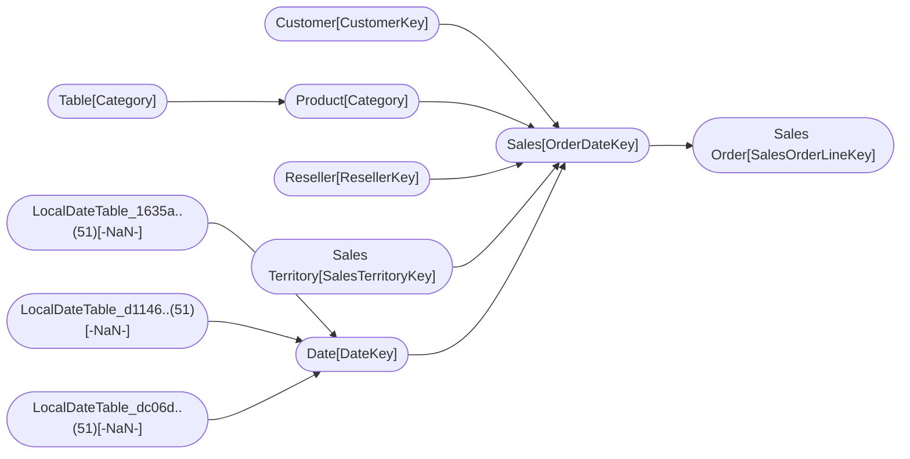

----

[Home](../home.md) > [AdventureWorks_Sales.pbix](index.md)

[Information](#information) | [Model information](#model-information) | [Model relationships](#model-relationships) | [Business objects](#business-objects) | [Measures](#measures) | [Relationships](#relationships) | [Hierarchies](#hierarchies) | [Columns](#columns) | 

----

# Information

Documentation for file **AdventureWorks_Sales.pbix**.

# Model information

| Param  | Value  |
|---|---|
| **Catalog name** | `418255b2-96be-4dcd-9ddd-0a2ecea747a0` | 
| **Port** | `61006`|
| **Description** | `-NaN-` | 
| **Date modified** | `2023-11-22T21:37:51` | 
| **Compatibility level** | `1567` | 

[Up](#)
# Model relationships

[Up](#)
# Business objects

| ID | NAME | DESCRIPTION | 
|----|------|-------------|
| 12 | Customer | -NaN- |
| 183 | Date | -NaN- |
| 572 | Product | -NaN- |
| 690 | Reseller | -NaN- |
| 805 | Sales | -NaN- |
| 980 | Sales Order | -NaN- |
| 1078 | Sales Territory | -NaN- |
| 3642 | Table | -NaN- |

[Up](#)
# Measures

| ID | TABLE | NAME | DESCRIPTION | EXPRESSION | IS_HIDDEN | STATE |
|----|-------|------|-------------|------------|-----------|-------|
| 19 | DateTableTemplate_78..(54) |  | -NaN- | YEAR([Date]) | True |  1 |  
| 20 | DateTableTemplate_78..(54) |  | -NaN- | MONTH([Date]) | True |  1 |  
| 21 | DateTableTemplate_78..(54) |  | -NaN- | FORMAT([Date], "MMMM") | True |  1 |  
| 22 | DateTableTemplate_78..(54) |  | -NaN- | INT(([MonthNo] + 2) / 3) | True |  1 |  
| 23 | DateTableTemplate_78..(54) |  | -NaN- | "Qtr " & [QuarterNo] | True |  1 |  
| 24 | DateTableTemplate_78..(54) |  | -NaN- | DAY([Date]) | True |  1 |  
| 201 | LocalDateTable_1635a..(51) |  | -NaN- | YEAR([Date]) | True |  1 |  
| 202 | LocalDateTable_1635a..(51) |  | -NaN- | MONTH([Date]) | True |  1 |  
| 203 | LocalDateTable_1635a..(51) |  | -NaN- | FORMAT([Date], "MMMM") | True |  1 |  
| 204 | LocalDateTable_1635a..(51) |  | -NaN- | INT(([MonthNo] + 2) / 3) | True |  1 |  
| 205 | LocalDateTable_1635a..(51) |  | -NaN- | "Qtr " & [QuarterNo] | True |  1 |  
| 206 | LocalDateTable_1635a..(51) |  | -NaN- | DAY([Date]) | True |  1 |  
| 211 | LocalDateTable_d1146..(51) |  | -NaN- | YEAR([Date]) | True |  1 |  
| 212 | LocalDateTable_d1146..(51) |  | -NaN- | MONTH([Date]) | True |  1 |  
| 213 | LocalDateTable_d1146..(51) |  | -NaN- | FORMAT([Date], "MMMM") | True |  1 |  
| 214 | LocalDateTable_d1146..(51) |  | -NaN- | INT(([MonthNo] + 2) / 3) | True |  1 |  
| 215 | LocalDateTable_d1146..(51) |  | -NaN- | "Qtr " & [QuarterNo] | True |  1 |  
| 216 | LocalDateTable_d1146..(51) |  | -NaN- | DAY([Date]) | True |  1 |  
| 219 | LocalDateTable_dc06d..(51) |  | -NaN- | YEAR([Date]) | True |  1 |  
| 220 | LocalDateTable_dc06d..(51) |  | -NaN- | MONTH([Date]) | True |  1 |  
| 221 | LocalDateTable_dc06d..(51) |  | -NaN- | FORMAT([Date], "MMMM") | True |  1 |  
| 222 | LocalDateTable_dc06d..(51) |  | -NaN- | INT(([MonthNo] + 2) / 3) | True |  1 |  
| 223 | LocalDateTable_dc06d..(51) |  | -NaN- | "Qtr " & [QuarterNo] | True |  1 |  
| 224 | LocalDateTable_dc06d..(51) |  | -NaN- | DAY([Date]) | True |  1 |  
| 3742 | Product |  | -NaN- | RELATED('Table'[Sorting]) | False |  1 |  

[Up](#)
# Relationships 

| ID | FROM_TABLE | TO_TABLE | FROM:TO CARDINALITY | NAME | IS_ACTIVE  |
|----|------------|----------|-----:---------------|------|------------|
| 195 | Date[Date] | LocalDateTable_1635a..(51)[-NaN-] | 2:1 | 88371ba8-2389-41b4-a22f-bcb756732d3b | True |
| 196 | Date[Month] | LocalDateTable_d1146..(51)[-NaN-] | 2:1 | 586c9eeb-fe2f-431d-a8c4-9723ce217f20 | True |
| 197 | Date[Full Date] | LocalDateTable_dc06d..(51)[-NaN-] | 2:1 | 401217e9-9553-4835-a527-fd574f68046d | True |
| 3224 | Sales[CustomerKey] | Customer[CustomerKey] | 2:1 | e3030baf-8c61-408d-a80e-04714277dcd3 | True |
| 3227 | Sales[ProductKey] | Product[ProductKey] | 2:1 | a0a78efb-3ce3-472a-993a-b92e31c0e3cd | True |
| 3230 | Sales[ResellerKey] | Reseller[ResellerKey] | 2:1 | 0ef2b150-bb90-4b8f-8537-fc236873591c | True |
| 3233 | Sales Order[SalesOrderLineKey] | Sales[SalesOrderLineKey] | 1:1 | 29b21f6a-77ef-4b3b-a0c0-e4111f87627b | True |
| 3238 | Sales[SalesTerritoryKey] | Sales Territory[SalesTerritoryKey] | 2:1 | cecf591c-1f02-44a6-bff1-1c753a0b4835 | True |
| 3305 | Sales[OrderDateKey] | Date[DateKey] | 2:1 | 8e31fd7b-1e63-43a9-8a47-33876ae8aed6 | True |
| 3322 | Sales[DueDateKey] | Date[DateKey] | 2:1 | dfb7bf63-667c-4abb-b494-7424c4e34b60 | False |
| 3339 | Sales[ShipDateKey] | Date[DateKey] | 2:1 | 6a63bfea-7b52-4e05-85f4-63a0f9b8991f | False |
| 3725 | Product[Category] | Table[Category] | 2:1 | 93a2e7c9-4a15-47be-93c0-06eceb139103 | True |

[Up](#)
# Hierarchies 

| ID | TABLE | NAME | DESCRIPTION  | IS_HIDDEN | 
|----|----------|------|--------------|-----------|
| 3356 |Customer | Geography | -NaN- | False | 
| 27 |DateTableTemplate_78..(54) | Date Hierarchy | -NaN- | False | 
| 3399 |Date | Fiscal | -NaN- | False | 
| 230 |LocalDateTable_1635a..(51) | Date Hierarchy | -NaN- | False | 
| 231 |LocalDateTable_d1146..(51) | Date Hierarchy | -NaN- | False | 
| 232 |LocalDateTable_dc06d..(51) | Date Hierarchy | -NaN- | False | 
| 3476 |Product | Products | -NaN- | False | 
| 3518 |Reseller | Geography | -NaN- | False | 
| 3561 |Sales Order | Sales Orders | -NaN- | False | 
| 3601 |Sales Territory | Sales Territories | -NaN- | False | 

[Up](#)
# Columns 

| ID | TABLE | EXPLICIT_NAME | DESCRIPTION | IS_HIDDEN | EXPRESSION |
|----|-------|---------------|-------------|-----------|------------|
| 114 | Customer | Customer ID | -NaN- | False | -NaN- |
| 115 | Customer | Customer | -NaN- | False | -NaN- |
| 116 | Customer | City | -NaN- | False | -NaN- |
| 117 | Customer | State-Province | -NaN- | False | -NaN- |
| 118 | Customer | Country-Region | -NaN- | False | -NaN- |
| 119 | Customer | Postal Code | -NaN- | False | -NaN- |
| 199 | Date | Date | -NaN- | False | -NaN- |
| 207 | Date | Fiscal Year | -NaN- | False | -NaN- |
| 208 | Date | Fiscal Quarter | -NaN- | False | -NaN- |
| 209 | Date | Month | -NaN- | False | -NaN- |
| 217 | Date | Full Date | -NaN- | False | -NaN- |
| 576 | Product | SKU | -NaN- | False | -NaN- |
| 577 | Product | Product | -NaN- | False | -NaN- |
| 578 | Product | Standard Cost | -NaN- | False | -NaN- |
| 579 | Product | Color | -NaN- | False | -NaN- |
| 580 | Product | List Price | -NaN- | False | -NaN- |
| 581 | Product | Model | -NaN- | False | -NaN- |
| 582 | Product | Subcategory | -NaN- | False | -NaN- |
| 583 | Product | Category | -NaN- | False | -NaN- |
| 3742 | Product | Sorting | -NaN- | False | RELATED('Table'[Sorting]) |
| 694 | Reseller | Reseller ID | -NaN- | False | -NaN- |
| 695 | Reseller | Business Type | -NaN- | False | -NaN- |
| 696 | Reseller | Reseller | -NaN- | False | -NaN- |
| 697 | Reseller | City | -NaN- | False | -NaN- |
| 698 | Reseller | State-Province | -NaN- | False | -NaN- |
| 699 | Reseller | Country-Region | -NaN- | False | -NaN- |
| 700 | Reseller | Postal Code | -NaN- | False | -NaN- |
| 816 | Sales | Order Quantity | -NaN- | False | -NaN- |
| 817 | Sales | Unit Price | -NaN- | False | -NaN- |
| 818 | Sales | Extended Amount | -NaN- | False | -NaN- |
| 819 | Sales | Unit Price Discount ..(23) | -NaN- | False | -NaN- |
| 820 | Sales | Product Standard Cos..(21) | -NaN- | False | -NaN- |
| 821 | Sales | Total Product Cost | -NaN- | False | -NaN- |
| 822 | Sales | Sales Amount | -NaN- | False | -NaN- |
| 983 | Sales Order | Channel | -NaN- | False | -NaN- |
| 985 | Sales Order | Sales Order | -NaN- | False | -NaN- |
| 986 | Sales Order | Sales Order Line | -NaN- | False | -NaN- |
| 1082 | Sales Territory | Region | -NaN- | False | -NaN- |
| 1083 | Sales Territory | Country | -NaN- | False | -NaN- |
| 1084 | Sales Territory | Group | -NaN- | False | -NaN- |
| 3645 | Table | Category | -NaN- | False | -NaN- |
| 3646 | Table | Sorting | -NaN- | False | -NaN- |

----

Generated at 26.11.2023 22:45:14 by <a href='https://github.com/dop12/pbix_doc'>PBIX DOC PROJECT</a> Git version: b2be5b2

