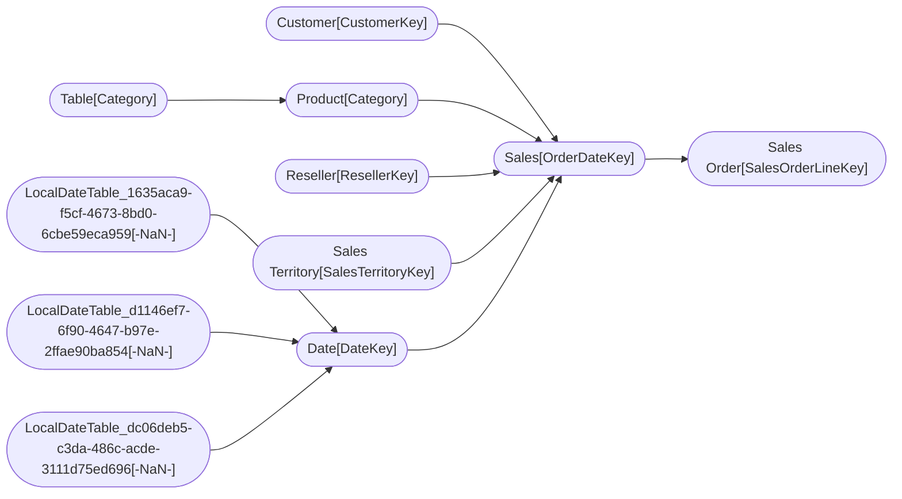

----

[Home](../home.md) > [AdventureWorks_Sales.pbix](index.md)

[Information](#information) | [Model information](#model-information) | [Model relationships](#model-relationships) | [Business objects](#business-objects) | [Measures](#measures) | [Relationships](#relationships) | [Hierarchies](#hierarchies) | [Columns](#columns) | 

----

# Information

Documentation for file **AdventureWorks_Sales.pbix**.

# Model information

| Param  | Value  |
|---|---|
| **Catalog name** | `418255b2-96be-4dcd-9ddd-0a2ecea747a0` | 
| **Port** | `61006`|
| **Description** | `-NaN-` | 
| **Date modified** | `2023-11-22T21:37:51` | 
| **Compatibility level** | `1567` | 

[Up](#)
# Model relationships

[Up](#)
# Business objects

| ID| NAME | DESCRIPTION | MODIFIED_TIME | STRUCTURE_MODIFIED_TIME |
|---|-------------|-----------------:|---------------: |---------------:|
| 12 | Customer | -NaN- | 2022-09-22T22:59:56 |  2020-12-16T22:06:01 |
| 183 | Date | -NaN- | 2022-09-22T22:59:56 |  2020-12-16T22:07:07 |
| 572 | Product | -NaN- | 2022-09-22T22:59:56 |  2020-12-16T23:04:32 |
| 690 | Reseller | -NaN- | 2022-09-22T22:59:56 |  2020-12-16T22:09:20 |
| 805 | Sales | -NaN- | 2022-09-22T22:59:56 |  2020-12-16T22:02:59 |
| 980 | Sales Order | -NaN- | 2022-09-22T22:59:56 |  2020-12-16T22:09:47 |
| 1078 | Sales Territory | -NaN- | 2022-09-22T22:59:56 |  2020-12-16T22:10:09 |
| 3642 | Table | -NaN- | 2022-09-22T22:59:56 |  2020-12-16T23:04:03 |

[Up](#)
# Measures

| ID | TABLE | NAME | DESCRIPTION | EXPRESSION | IS_HIDDEN | STATE |
|----|-------|------|-------------|------------|-----------|-------|
| 19 | DateTableTemplate_788642c5-9a9d-4431-b350-9f47f7e53393 |  | -NaN- | YEAR([Date]) | True |  1 |  
| 20 | DateTableTemplate_788642c5-9a9d-4431-b350-9f47f7e53393 |  | -NaN- | MONTH([Date]) | True |  1 |  
| 21 | DateTableTemplate_788642c5-9a9d-4431-b350-9f47f7e53393 |  | -NaN- | FORMAT([Date], "MMMM") | True |  1 |  
| 22 | DateTableTemplate_788642c5-9a9d-4431-b350-9f47f7e53393 |  | -NaN- | INT(([MonthNo] + 2) / 3) | True |  1 |  
| 23 | DateTableTemplate_788642c5-9a9d-4431-b350-9f47f7e53393 |  | -NaN- | "Qtr " & [QuarterNo] | True |  1 |  
| 24 | DateTableTemplate_788642c5-9a9d-4431-b350-9f47f7e53393 |  | -NaN- | DAY([Date]) | True |  1 |  
| 201 | LocalDateTable_1635aca9-f5cf-4673-8bd0-6cbe59eca959 |  | -NaN- | YEAR([Date]) | True |  1 |  
| 202 | LocalDateTable_1635aca9-f5cf-4673-8bd0-6cbe59eca959 |  | -NaN- | MONTH([Date]) | True |  1 |  
| 203 | LocalDateTable_1635aca9-f5cf-4673-8bd0-6cbe59eca959 |  | -NaN- | FORMAT([Date], "MMMM") | True |  1 |  
| 204 | LocalDateTable_1635aca9-f5cf-4673-8bd0-6cbe59eca959 |  | -NaN- | INT(([MonthNo] + 2) / 3) | True |  1 |  
| 205 | LocalDateTable_1635aca9-f5cf-4673-8bd0-6cbe59eca959 |  | -NaN- | "Qtr " & [QuarterNo] | True |  1 |  
| 206 | LocalDateTable_1635aca9-f5cf-4673-8bd0-6cbe59eca959 |  | -NaN- | DAY([Date]) | True |  1 |  
| 211 | LocalDateTable_d1146ef7-6f90-4647-b97e-2ffae90ba854 |  | -NaN- | YEAR([Date]) | True |  1 |  
| 212 | LocalDateTable_d1146ef7-6f90-4647-b97e-2ffae90ba854 |  | -NaN- | MONTH([Date]) | True |  1 |  
| 213 | LocalDateTable_d1146ef7-6f90-4647-b97e-2ffae90ba854 |  | -NaN- | FORMAT([Date], "MMMM") | True |  1 |  
| 214 | LocalDateTable_d1146ef7-6f90-4647-b97e-2ffae90ba854 |  | -NaN- | INT(([MonthNo] + 2) / 3) | True |  1 |  
| 215 | LocalDateTable_d1146ef7-6f90-4647-b97e-2ffae90ba854 |  | -NaN- | "Qtr " & [QuarterNo] | True |  1 |  
| 216 | LocalDateTable_d1146ef7-6f90-4647-b97e-2ffae90ba854 |  | -NaN- | DAY([Date]) | True |  1 |  
| 219 | LocalDateTable_dc06deb5-c3da-486c-acde-3111d75ed696 |  | -NaN- | YEAR([Date]) | True |  1 |  
| 220 | LocalDateTable_dc06deb5-c3da-486c-acde-3111d75ed696 |  | -NaN- | MONTH([Date]) | True |  1 |  
| 221 | LocalDateTable_dc06deb5-c3da-486c-acde-3111d75ed696 |  | -NaN- | FORMAT([Date], "MMMM") | True |  1 |  
| 222 | LocalDateTable_dc06deb5-c3da-486c-acde-3111d75ed696 |  | -NaN- | INT(([MonthNo] + 2) / 3) | True |  1 |  
| 223 | LocalDateTable_dc06deb5-c3da-486c-acde-3111d75ed696 |  | -NaN- | "Qtr " & [QuarterNo] | True |  1 |  
| 224 | LocalDateTable_dc06deb5-c3da-486c-acde-3111d75ed696 |  | -NaN- | DAY([Date]) | True |  1 |  
| 3742 | Product |  | -NaN- | RELATED('Table'[Sorting]) | False |  1 |  

[Up](#)
# Relationships 

| ID | FROM_TABLE_ID | FROM_CARDINALITY | TO_TABLE_ID | TO_CARDINALITY | NAME | IS_ACTIVE  |
|----|---------------|------------------|-------------|----------------|------|------------|
| 195 | Date[Date] | 2 | LocalDateTable_1635aca9-f5cf-4673-8bd0-6cbe59eca959[-NaN-] | 1 | 88371ba8-2389-41b4-a22f-bcb756732d3b | True |
| 196 | Date[Month] | 2 | LocalDateTable_d1146ef7-6f90-4647-b97e-2ffae90ba854[-NaN-] | 1 | 586c9eeb-fe2f-431d-a8c4-9723ce217f20 | True |
| 197 | Date[Full Date] | 2 | LocalDateTable_dc06deb5-c3da-486c-acde-3111d75ed696[-NaN-] | 1 | 401217e9-9553-4835-a527-fd574f68046d | True |
| 3224 | Sales[CustomerKey] | 2 | Customer[CustomerKey] | 1 | e3030baf-8c61-408d-a80e-04714277dcd3 | True |
| 3227 | Sales[ProductKey] | 2 | Product[ProductKey] | 1 | a0a78efb-3ce3-472a-993a-b92e31c0e3cd | True |
| 3230 | Sales[ResellerKey] | 2 | Reseller[ResellerKey] | 1 | 0ef2b150-bb90-4b8f-8537-fc236873591c | True |
| 3233 | Sales Order[SalesOrderLineKey] | 1 | Sales[SalesOrderLineKey] | 1 | 29b21f6a-77ef-4b3b-a0c0-e4111f87627b | True |
| 3238 | Sales[SalesTerritoryKey] | 2 | Sales Territory[SalesTerritoryKey] | 1 | cecf591c-1f02-44a6-bff1-1c753a0b4835 | True |
| 3305 | Sales[OrderDateKey] | 2 | Date[DateKey] | 1 | 8e31fd7b-1e63-43a9-8a47-33876ae8aed6 | True |
| 3322 | Sales[DueDateKey] | 2 | Date[DateKey] | 1 | dfb7bf63-667c-4abb-b494-7424c4e34b60 | False |
| 3339 | Sales[ShipDateKey] | 2 | Date[DateKey] | 1 | 6a63bfea-7b52-4e05-85f4-63a0f9b8991f | False |
| 3725 | Product[Category] | 2 | Table[Category] | 1 | 93a2e7c9-4a15-47be-93c0-06eceb139103 | True |

[Up](#)
# Hierarchies 

| ID| TABLE_ID | NAME | DESCRIPTION  | IS_HIDDEN | STATE | HIERARCHY_STORAGE_ID | MODIFIED_TIME | STRUCTURE_MODIFIED_TIME | REFRESHED_TIME | DISPLAY_FOLDER | HIDEMEMBERS | LINEAGETAG | SOURCELINEAGETAG |
|--------------|--------------|--------------|--------------|--------------|--------------|--------------|--------------|--------------|--------------|--------------| ----------- | ---------- | ---------------- |
| 3356 |Customer(12) | Geography | -NaN- | False | 1 | 3398 | 2022-09-22T22:59:56 |  2020-12-16T22:06:47 |  2020-12-16T22:07:32 | 0 | e2eae803-1a4b-4f7e-b72b-95f398746ca5 | -NaN- | 
| 27 |DateTableTemplate_788642c5-9a9d-4431-b350-9f47f7e53393(15) | Date Hierarchy | -NaN- | False | 1 | 112 | 2022-09-22T22:59:56 |  2020-12-16T21:46:12 |  2020-12-16T21:46:16 | 0 | 91a69be6-4b9c-41d7-952f-47c1d9c3997b | -NaN- | 
| 3399 |Date(183) | Fiscal | -NaN- | False | 1 | 3405 | 2022-09-22T22:59:56 |  2020-12-16T22:07:26 |  2020-12-16T22:07:32 | 0 | 2afdb215-375e-4ac4-9ba4-7541cab5d927 | -NaN- | 
| 230 |LocalDateTable_1635aca9-f5cf-4673-8bd0-6cbe59eca959(186) | Date Hierarchy | -NaN- | False | 1 | 569 | 2022-09-22T22:59:56 |  2020-12-16T21:46:15 |  2020-12-16T21:46:22 | 0 | 783cfd06-6261-4859-82a4-2e5cf47fe988 | -NaN- | 
| 231 |LocalDateTable_d1146ef7-6f90-4647-b97e-2ffae90ba854(189) | Date Hierarchy | -NaN- | False | 1 | 570 | 2022-09-22T22:59:56 |  2020-12-16T21:46:15 |  2020-12-16T21:46:22 | 0 | 5a7c852b-1ff3-4257-b69f-91b15ae60acb | -NaN- | 
| 232 |LocalDateTable_dc06deb5-c3da-486c-acde-3111d75ed696(192) | Date Hierarchy | -NaN- | False | 1 | 571 | 2022-09-22T22:59:56 |  2020-12-16T21:46:15 |  2020-12-16T21:46:22 | 0 | 2f2238c7-1e1c-4c94-aa0e-cee1b8f893d8 | -NaN- | 
| 3476 |Product(572) | Products | -NaN- | False | 1 | 3482 | 2022-09-22T22:59:56 |  2020-12-16T22:08:50 |  2020-12-16T23:04:54 | 0 | c6fdb5c0-f0bd-416e-aa26-167ee668f317 | -NaN- | 
| 3518 |Reseller(690) | Geography | -NaN- | False | 1 | 3525 | 2022-09-22T22:59:56 |  2020-12-16T22:09:31 |  2020-12-16T22:09:37 | 0 | 81e7318d-2363-4e56-92b6-cd0c41be2453 | -NaN- | 
| 3561 |Sales Order(980) | Sales Orders | -NaN- | False | 1 | 3565 | 2022-09-22T22:59:56 |  2020-12-16T22:09:51 |  2020-12-16T22:10:03 | 0 | 50630276-1986-4b90-859f-f355f7d16941 | -NaN- | 
| 3601 |Sales Territory(1078) | Sales Territories | -NaN- | False | 1 | 3606 | 2022-09-22T22:59:56 |  2020-12-16T22:10:16 |  2020-12-16T22:10:23 | 0 | db78d396-cf8e-4440-a5dc-8e5795a54e56 | -NaN- | 

[Up](#)
# Columns 

| ID| TABLE_ID | EXPLICIT_NAME | INFERRED_NAME  | EXPLICIT_DATA_TYPE | INFERRED_DATA_TYPE | DATA_CATEGORY | DESCRIPTION | IS_HIDDEN | STATE | IS_UNIQUE | IS_KEY | IS_NULLABLE | ALIGNMENT | TABLE_DETAIL_POSITION | IS_DEFAULT_LABEL | IS_DEFAULT_IMAGE | SUMMARIZE_BY | COLUMN_STORAGE_ID | TYPE | SOURCE_COLUMN | COLUMN_ORIGIN_ID | EXPRESSION | FORMAT_STRING | IS_AVAILABLE_IN_MDX | SORT_BY_COLUMN_ID | ATTRIBUTE_HIERARCHY_ID | MODIFIED_TIME | STRUCTURE_MODIFIED_TIME | REFRESHED_TIME | SYSTEM_FLAGS | KEEP_UNIQUE_ROWS | DISPLAY_ORDINAL | ERROR_MESSAGE | SOURCE_PROVIDER_TYPE | DISPLAY_FOLDER |
|--------------|---------------|---------------|---------------|---------------|---------------|---------------|---------------|---------------|---------------|---------------|---------------|---------------|---------------|---------------|---------------|---------------|---------------|---------------|---------------|---------------|---------------|---------------|---------------|---------------|---------------|---------------|---------------|---------------|---------------|---------------|---------------|---------------|---------------|---------------|---------------|
| 13 | Customer(12) | RowNumber-2662979B-1795-4F74-8F37-6A1BA8059B61 | -NaN- | 6 | 19 | -NaN- | -NaN- |  True |  1 |  True |  True |  False |  1 |  -1 |  False |  False |  1 |  67 |  3 |  -NaN- |  -NaN- |  -NaN- |  -NaN- |  True |  -NaN- |  14 |  2020-12-16T21:46:12 |  2020-12-16T21:46:12 |  1699-12-31T00:00:00 |  0 |  False |  0 |   -NaN- |   -NaN- |   -NaN- |  
| 113 | Customer(12) | CustomerKey | -NaN- | 6 | 19 | -NaN- | -NaN- |  True |  1 |  False |  False |  True |  1 |  -1 |  False |  False |  2 |  148 |  1 |  CustomerKey |  -NaN- |  -NaN- |  0 |  True |  -NaN- |  141 |  2022-09-22T22:59:56 |  2023-11-22T21:37:51 |  1699-12-31T00:00:00 |  0 |  False |  0 |   -NaN- |   -NaN- |   -NaN- |  
| 114 | Customer(12) | Customer ID | -NaN- | 2 | 19 | -NaN- | -NaN- |  False |  1 |  False |  False |  True |  1 |  -1 |  False |  False |  2 |  152 |  1 |  Customer ID |  -NaN- |  -NaN- |  -NaN- |  True |  -NaN- |  142 |  2022-09-22T22:59:56 |  2020-12-16T21:46:15 |  1699-12-31T00:00:00 |  0 |  False |  0 |   -NaN- |   -NaN- |   -NaN- |  
| 115 | Customer(12) | Customer | -NaN- | 2 | 19 | -NaN- | -NaN- |  False |  1 |  False |  False |  True |  1 |  -1 |  False |  False |  2 |  156 |  1 |  Customer |  -NaN- |  -NaN- |  -NaN- |  True |  -NaN- |  143 |  2022-09-22T22:59:56 |  2020-12-16T21:46:15 |  1699-12-31T00:00:00 |  0 |  False |  0 |   -NaN- |   -NaN- |   -NaN- |  
| 116 | Customer(12) | City | -NaN- | 2 | 19 | -NaN- | -NaN- |  False |  1 |  False |  False |  True |  1 |  -1 |  False |  False |  2 |  160 |  1 |  City |  -NaN- |  -NaN- |  -NaN- |  True |  -NaN- |  144 |  2022-09-22T22:59:56 |  2020-12-16T21:46:15 |  1699-12-31T00:00:00 |  0 |  False |  0 |   -NaN- |   -NaN- |   -NaN- |  
| 117 | Customer(12) | State-Province | -NaN- | 2 | 19 | -NaN- | -NaN- |  False |  1 |  False |  False |  True |  1 |  -1 |  False |  False |  2 |  164 |  1 |  State-Province |  -NaN- |  -NaN- |  -NaN- |  True |  -NaN- |  145 |  2022-09-22T22:59:56 |  2020-12-16T21:46:15 |  1699-12-31T00:00:00 |  0 |  False |  0 |   -NaN- |   -NaN- |   -NaN- |  
| 118 | Customer(12) | Country-Region | -NaN- | 2 | 19 | -NaN- | -NaN- |  False |  1 |  False |  False |  True |  1 |  -1 |  False |  False |  2 |  168 |  1 |  Country-Region |  -NaN- |  -NaN- |  -NaN- |  True |  -NaN- |  146 |  2022-09-22T22:59:56 |  2020-12-16T21:46:15 |  1699-12-31T00:00:00 |  0 |  False |  0 |   -NaN- |   -NaN- |   -NaN- |  
| 119 | Customer(12) | Postal Code | -NaN- | 2 | 19 | -NaN- | -NaN- |  False |  1 |  False |  False |  True |  1 |  -1 |  False |  False |  2 |  172 |  1 |  Postal Code |  -NaN- |  -NaN- |  -NaN- |  True |  -NaN- |  147 |  2022-09-22T22:59:56 |  2020-12-16T21:46:15 |  1699-12-31T00:00:00 |  0 |  False |  0 |   -NaN- |   -NaN- |   -NaN- |  
| 16 | DateTableTemplate_788642c5-9a9d-4431-b350-9f47f7e53393(15) | RowNumber-2662979B-1795-4F74-8F37-6A1BA8059B61 | -NaN- | 6 | 19 | -NaN- | -NaN- |  True |  1 |  True |  True |  False |  1 |  -1 |  False |  False |  1 |  71 |  3 |  -NaN- |  -NaN- |  -NaN- |  -NaN- |  True |  -NaN- |  17 |  2020-12-16T21:46:12 |  2020-12-16T21:46:12 |  1699-12-31T00:00:00 |  2 |  False |  0 |   -NaN- |   -NaN- |   -NaN- |  
| 18 | DateTableTemplate_788642c5-9a9d-4431-b350-9f47f7e53393(15) | -NaN- | Date | 1 | 9 | PaddedDateTableDates | -NaN- |  True |  1 |  False |  False |  True |  1 |  -1 |  False |  False |  2 |  75 |  4 |  [Date] |  -NaN- |  -NaN- |  -NaN- |  True |  -NaN- |  50 |  2022-09-22T22:59:56 |  2020-12-16T21:46:12 |  1699-12-31T00:00:00 |  2 |  False |  0 |   -NaN- |   -NaN- |   -NaN- |  
| 19 | DateTableTemplate_788642c5-9a9d-4431-b350-9f47f7e53393(15) | Year | -NaN- | 1 | 6 | Years | -NaN- |  True |  1 |  False |  False |  True |  1 |  -1 |  False |  False |  2 |  79 |  2 |  -NaN- |  -NaN- |  YEAR([Date]) |  -NaN- |  True |  -NaN- |  51 |  2022-09-22T22:59:56 |  2020-12-16T21:46:12 |  2020-12-16T21:46:16 |  2 |  False |  0 |   -NaN- |   -NaN- |   -NaN- |  
| 20 | DateTableTemplate_788642c5-9a9d-4431-b350-9f47f7e53393(15) | MonthNo | -NaN- | 1 | 6 | MonthOfYear | -NaN- |  True |  1 |  False |  False |  True |  1 |  -1 |  False |  False |  2 |  83 |  2 |  -NaN- |  -NaN- |  MONTH([Date]) |  -NaN- |  True |  -NaN- |  52 |  2022-09-22T22:59:56 |  2020-12-16T21:46:12 |  2020-12-16T21:46:16 |  2 |  False |  0 |   -NaN- |   -NaN- |   -NaN- |  
| 21 | DateTableTemplate_788642c5-9a9d-4431-b350-9f47f7e53393(15) | Month | -NaN- | 1 | 2 | Months | -NaN- |  True |  1 |  False |  False |  True |  1 |  -1 |  False |  False |  2 |  87 |  2 |  -NaN- |  -NaN- |  FORMAT([Date], "MMMM") |  -NaN- |  True |  20.0 |  53 |  2022-09-22T22:59:56 |  2020-12-16T21:46:12 |  2020-12-16T21:46:16 |  2 |  False |  0 |   -NaN- |   -NaN- |   -NaN- |  
| 22 | DateTableTemplate_788642c5-9a9d-4431-b350-9f47f7e53393(15) | QuarterNo | -NaN- | 1 | 6 | QuarterOfYear | -NaN- |  True |  1 |  False |  False |  True |  1 |  -1 |  False |  False |  2 |  91 |  2 |  -NaN- |  -NaN- |  INT(([MonthNo] + 2) / 3) |  -NaN- |  True |  -NaN- |  54 |  2022-09-22T22:59:56 |  2020-12-16T21:46:12 |  2020-12-16T21:46:16 |  2 |  False |  0 |   -NaN- |   -NaN- |   -NaN- |  
| 23 | DateTableTemplate_788642c5-9a9d-4431-b350-9f47f7e53393(15) | Quarter | -NaN- | 1 | 2 | Quarters | -NaN- |  True |  1 |  False |  False |  True |  1 |  -1 |  False |  False |  2 |  95 |  2 |  -NaN- |  -NaN- |  "Qtr " & [QuarterNo] |  -NaN- |  True |  22.0 |  55 |  2022-09-22T22:59:56 |  2020-12-16T21:46:12 |  2020-12-16T21:46:16 |  2 |  False |  0 |   -NaN- |   -NaN- |   -NaN- |  
| 24 | DateTableTemplate_788642c5-9a9d-4431-b350-9f47f7e53393(15) | Day | -NaN- | 1 | 6 | DayOfMonth | -NaN- |  True |  1 |  False |  False |  True |  1 |  -1 |  False |  False |  2 |  99 |  2 |  -NaN- |  -NaN- |  DAY([Date]) |  -NaN- |  True |  -NaN- |  56 |  2022-09-22T22:59:56 |  2020-12-16T21:46:12 |  2020-12-16T21:46:16 |  2 |  False |  0 |   -NaN- |   -NaN- |   -NaN- |  
| 184 | Date(183) | RowNumber-2662979B-1795-4F74-8F37-6A1BA8059B61 | -NaN- | 6 | 19 | -NaN- | -NaN- |  True |  1 |  True |  True |  False |  1 |  -1 |  False |  False |  1 |  403 |  3 |  -NaN- |  -NaN- |  -NaN- |  -NaN- |  True |  -NaN- |  185 |  2020-12-16T21:46:15 |  2020-12-16T21:46:15 |  1699-12-31T00:00:00 |  0 |  False |  0 |   -NaN- |   -NaN- |   -NaN- |  
| 198 | Date(183) | DateKey | -NaN- | 6 | 19 | -NaN- | -NaN- |  True |  1 |  False |  False |  True |  1 |  -1 |  False |  False |  2 |  419 |  1 |  DateKey |  -NaN- |  -NaN- |  0 |  True |  -NaN- |  355 |  2022-09-22T22:59:56 |  2023-11-22T21:37:51 |  1699-12-31T00:00:00 |  0 |  False |  0 |   -NaN- |   -NaN- |   -NaN- |  
| 199 | Date(183) | Date | -NaN- | 9 | 19 | -NaN- | -NaN- |  False |  1 |  False |  False |  True |  1 |  -1 |  False |  False |  2 |  423 |  1 |  Date |  -NaN- |  -NaN- |  Long Date |  True |  -NaN- |  356 |  2022-09-22T22:59:56 |  2020-12-16T21:46:15 |  1699-12-31T00:00:00 |  0 |  False |  0 |   -NaN- |   -NaN- |   -NaN- |  
| 207 | Date(183) | Fiscal Year | -NaN- | 2 | 19 | -NaN- | -NaN- |  False |  1 |  False |  False |  True |  1 |  -1 |  False |  False |  2 |  455 |  1 |  Fiscal Year |  -NaN- |  -NaN- |  -NaN- |  True |  -NaN- |  364 |  2022-09-22T22:59:56 |  2020-12-16T21:46:15 |  1699-12-31T00:00:00 |  0 |  False |  0 |   -NaN- |   -NaN- |   -NaN- |  
| 208 | Date(183) | Fiscal Quarter | -NaN- | 2 | 19 | -NaN- | -NaN- |  False |  1 |  False |  False |  True |  1 |  -1 |  False |  False |  2 |  459 |  1 |  Fiscal Quarter |  -NaN- |  -NaN- |  -NaN- |  True |  -NaN- |  365 |  2022-09-22T22:59:56 |  2020-12-16T21:46:15 |  1699-12-31T00:00:00 |  0 |  False |  0 |   -NaN- |   -NaN- |   -NaN- |  
| 209 | Date(183) | Month | -NaN- | 9 | 19 | -NaN- | -NaN- |  False |  1 |  False |  False |  True |  1 |  -1 |  False |  False |  2 |  463 |  1 |  Month |  -NaN- |  -NaN- |  Long Date |  True |  -NaN- |  366 |  2022-09-22T22:59:56 |  2020-12-16T21:46:15 |  1699-12-31T00:00:00 |  0 |  False |  0 |   -NaN- |   -NaN- |   -NaN- |  
| 217 | Date(183) | Full Date | -NaN- | 9 | 19 | -NaN- | -NaN- |  False |  1 |  False |  False |  True |  1 |  -1 |  False |  False |  2 |  495 |  1 |  Full Date |  -NaN- |  -NaN- |  Long Date |  True |  -NaN- |  374 |  2022-09-22T22:59:56 |  2020-12-16T21:46:15 |  1699-12-31T00:00:00 |  0 |  False |  0 |   -NaN- |   -NaN- |   -NaN- |  
| 225 | Date(183) | MonthKey | -NaN- | 6 | 19 | -NaN- | -NaN- |  True |  1 |  False |  False |  True |  1 |  -1 |  False |  False |  6 |  527 |  1 |  MonthKey |  -NaN- |  -NaN- |  0 |  True |  -NaN- |  382 |  2022-09-22T22:59:56 |  2023-11-22T21:37:51 |  1699-12-31T00:00:00 |  0 |  False |  0 |   -NaN- |   -NaN- |   -NaN- |  
| 187 | LocalDateTable_1635aca9-f5cf-4673-8bd0-6cbe59eca959(186) | RowNumber-2662979B-1795-4F74-8F37-6A1BA8059B61 | -NaN- | 6 | 19 | -NaN- | -NaN- |  True |  1 |  True |  True |  False |  1 |  -1 |  False |  False |  1 |  407 |  3 |  -NaN- |  -NaN- |  -NaN- |  -NaN- |  True |  -NaN- |  188 |  2020-12-16T21:46:15 |  2020-12-16T21:46:15 |  1699-12-31T00:00:00 |  2 |  False |  0 |   -NaN- |   -NaN- |   -NaN- |  
| 200 | LocalDateTable_1635aca9-f5cf-4673-8bd0-6cbe59eca959(186) | -NaN- | Date | 1 | 9 | PaddedDateTableDates | -NaN- |  True |  1 |  False |  False |  True |  1 |  -1 |  False |  False |  2 |  427 |  4 |  [Date] |  -NaN- |  -NaN- |  -NaN- |  True |  -NaN- |  357 |  2022-09-22T22:59:56 |  2020-12-16T21:46:15 |  1699-12-31T00:00:00 |  2 |  False |  0 |   -NaN- |   -NaN- |   -NaN- |  
| 201 | LocalDateTable_1635aca9-f5cf-4673-8bd0-6cbe59eca959(186) | Year | -NaN- | 1 | 6 | Years | -NaN- |  True |  1 |  False |  False |  True |  1 |  -1 |  False |  False |  2 |  431 |  2 |  -NaN- |  -NaN- |  YEAR([Date]) |  -NaN- |  True |  -NaN- |  358 |  2022-09-22T22:59:56 |  2020-12-16T21:46:15 |  2020-12-16T21:46:22 |  2 |  False |  0 |   -NaN- |   -NaN- |   -NaN- |  
| 202 | LocalDateTable_1635aca9-f5cf-4673-8bd0-6cbe59eca959(186) | MonthNo | -NaN- | 1 | 6 | MonthOfYear | -NaN- |  True |  1 |  False |  False |  True |  1 |  -1 |  False |  False |  2 |  435 |  2 |  -NaN- |  -NaN- |  MONTH([Date]) |  -NaN- |  True |  -NaN- |  359 |  2022-09-22T22:59:56 |  2020-12-16T21:46:15 |  2020-12-16T21:46:22 |  2 |  False |  0 |   -NaN- |   -NaN- |   -NaN- |  
| 203 | LocalDateTable_1635aca9-f5cf-4673-8bd0-6cbe59eca959(186) | Month | -NaN- | 1 | 2 | Months | -NaN- |  True |  1 |  False |  False |  True |  1 |  -1 |  False |  False |  2 |  439 |  2 |  -NaN- |  -NaN- |  FORMAT([Date], "MMMM") |  -NaN- |  True |  202.0 |  360 |  2022-09-22T22:59:56 |  2020-12-16T21:46:15 |  2020-12-16T21:46:22 |  2 |  False |  0 |   -NaN- |   -NaN- |   -NaN- |  
| 204 | LocalDateTable_1635aca9-f5cf-4673-8bd0-6cbe59eca959(186) | QuarterNo | -NaN- | 1 | 6 | QuarterOfYear | -NaN- |  True |  1 |  False |  False |  True |  1 |  -1 |  False |  False |  2 |  443 |  2 |  -NaN- |  -NaN- |  INT(([MonthNo] + 2) / 3) |  -NaN- |  True |  -NaN- |  361 |  2022-09-22T22:59:56 |  2020-12-16T21:46:15 |  2020-12-16T21:46:22 |  2 |  False |  0 |   -NaN- |   -NaN- |   -NaN- |  
| 205 | LocalDateTable_1635aca9-f5cf-4673-8bd0-6cbe59eca959(186) | Quarter | -NaN- | 1 | 2 | Quarters | -NaN- |  True |  1 |  False |  False |  True |  1 |  -1 |  False |  False |  2 |  447 |  2 |  -NaN- |  -NaN- |  "Qtr " & [QuarterNo] |  -NaN- |  True |  204.0 |  362 |  2022-09-22T22:59:56 |  2020-12-16T21:46:15 |  2020-12-16T21:46:22 |  2 |  False |  0 |   -NaN- |   -NaN- |   -NaN- |  
| 206 | LocalDateTable_1635aca9-f5cf-4673-8bd0-6cbe59eca959(186) | Day | -NaN- | 1 | 6 | DayOfMonth | -NaN- |  True |  1 |  False |  False |  True |  1 |  -1 |  False |  False |  2 |  451 |  2 |  -NaN- |  -NaN- |  DAY([Date]) |  -NaN- |  True |  -NaN- |  363 |  2022-09-22T22:59:56 |  2020-12-16T21:46:15 |  2020-12-16T21:46:22 |  2 |  False |  0 |   -NaN- |   -NaN- |   -NaN- |  
| 190 | LocalDateTable_d1146ef7-6f90-4647-b97e-2ffae90ba854(189) | RowNumber-2662979B-1795-4F74-8F37-6A1BA8059B61 | -NaN- | 6 | 19 | -NaN- | -NaN- |  True |  1 |  True |  True |  False |  1 |  -1 |  False |  False |  1 |  411 |  3 |  -NaN- |  -NaN- |  -NaN- |  -NaN- |  True |  -NaN- |  191 |  2020-12-16T21:46:15 |  2020-12-16T21:46:15 |  1699-12-31T00:00:00 |  2 |  False |  0 |   -NaN- |   -NaN- |   -NaN- |  
| 210 | LocalDateTable_d1146ef7-6f90-4647-b97e-2ffae90ba854(189) | -NaN- | Date | 1 | 9 | PaddedDateTableDates | -NaN- |  True |  1 |  False |  False |  True |  1 |  -1 |  False |  False |  2 |  467 |  4 |  [Date] |  -NaN- |  -NaN- |  -NaN- |  True |  -NaN- |  367 |  2022-09-22T22:59:56 |  2020-12-16T21:46:15 |  1699-12-31T00:00:00 |  2 |  False |  0 |   -NaN- |   -NaN- |   -NaN- |  
| 211 | LocalDateTable_d1146ef7-6f90-4647-b97e-2ffae90ba854(189) | Year | -NaN- | 1 | 6 | Years | -NaN- |  True |  1 |  False |  False |  True |  1 |  -1 |  False |  False |  2 |  471 |  2 |  -NaN- |  -NaN- |  YEAR([Date]) |  -NaN- |  True |  -NaN- |  368 |  2022-09-22T22:59:56 |  2020-12-16T21:46:15 |  2020-12-16T21:46:22 |  2 |  False |  0 |   -NaN- |   -NaN- |   -NaN- |  
| 212 | LocalDateTable_d1146ef7-6f90-4647-b97e-2ffae90ba854(189) | MonthNo | -NaN- | 1 | 6 | MonthOfYear | -NaN- |  True |  1 |  False |  False |  True |  1 |  -1 |  False |  False |  2 |  475 |  2 |  -NaN- |  -NaN- |  MONTH([Date]) |  -NaN- |  True |  -NaN- |  369 |  2022-09-22T22:59:56 |  2020-12-16T21:46:15 |  2020-12-16T21:46:22 |  2 |  False |  0 |   -NaN- |   -NaN- |   -NaN- |  
| 213 | LocalDateTable_d1146ef7-6f90-4647-b97e-2ffae90ba854(189) | Month | -NaN- | 1 | 2 | Months | -NaN- |  True |  1 |  False |  False |  True |  1 |  -1 |  False |  False |  2 |  479 |  2 |  -NaN- |  -NaN- |  FORMAT([Date], "MMMM") |  -NaN- |  True |  212.0 |  370 |  2022-09-22T22:59:56 |  2020-12-16T21:46:15 |  2020-12-16T21:46:22 |  2 |  False |  0 |   -NaN- |   -NaN- |   -NaN- |  
| 214 | LocalDateTable_d1146ef7-6f90-4647-b97e-2ffae90ba854(189) | QuarterNo | -NaN- | 1 | 6 | QuarterOfYear | -NaN- |  True |  1 |  False |  False |  True |  1 |  -1 |  False |  False |  2 |  483 |  2 |  -NaN- |  -NaN- |  INT(([MonthNo] + 2) / 3) |  -NaN- |  True |  -NaN- |  371 |  2022-09-22T22:59:56 |  2020-12-16T21:46:15 |  2020-12-16T21:46:22 |  2 |  False |  0 |   -NaN- |   -NaN- |   -NaN- |  
| 215 | LocalDateTable_d1146ef7-6f90-4647-b97e-2ffae90ba854(189) | Quarter | -NaN- | 1 | 2 | Quarters | -NaN- |  True |  1 |  False |  False |  True |  1 |  -1 |  False |  False |  2 |  487 |  2 |  -NaN- |  -NaN- |  "Qtr " & [QuarterNo] |  -NaN- |  True |  214.0 |  372 |  2022-09-22T22:59:56 |  2020-12-16T21:46:15 |  2020-12-16T21:46:22 |  2 |  False |  0 |   -NaN- |   -NaN- |   -NaN- |  
| 216 | LocalDateTable_d1146ef7-6f90-4647-b97e-2ffae90ba854(189) | Day | -NaN- | 1 | 6 | DayOfMonth | -NaN- |  True |  1 |  False |  False |  True |  1 |  -1 |  False |  False |  2 |  491 |  2 |  -NaN- |  -NaN- |  DAY([Date]) |  -NaN- |  True |  -NaN- |  373 |  2022-09-22T22:59:56 |  2020-12-16T21:46:15 |  2020-12-16T21:46:22 |  2 |  False |  0 |   -NaN- |   -NaN- |   -NaN- |  
| 193 | LocalDateTable_dc06deb5-c3da-486c-acde-3111d75ed696(192) | RowNumber-2662979B-1795-4F74-8F37-6A1BA8059B61 | -NaN- | 6 | 19 | -NaN- | -NaN- |  True |  1 |  True |  True |  False |  1 |  -1 |  False |  False |  1 |  415 |  3 |  -NaN- |  -NaN- |  -NaN- |  -NaN- |  True |  -NaN- |  194 |  2020-12-16T21:46:15 |  2020-12-16T21:46:15 |  1699-12-31T00:00:00 |  2 |  False |  0 |   -NaN- |   -NaN- |   -NaN- |  
| 218 | LocalDateTable_dc06deb5-c3da-486c-acde-3111d75ed696(192) | -NaN- | Date | 1 | 9 | PaddedDateTableDates | -NaN- |  True |  1 |  False |  False |  True |  1 |  -1 |  False |  False |  2 |  499 |  4 |  [Date] |  -NaN- |  -NaN- |  -NaN- |  True |  -NaN- |  375 |  2022-09-22T22:59:56 |  2020-12-16T21:46:15 |  1699-12-31T00:00:00 |  2 |  False |  0 |   -NaN- |   -NaN- |   -NaN- |  
| 219 | LocalDateTable_dc06deb5-c3da-486c-acde-3111d75ed696(192) | Year | -NaN- | 1 | 6 | Years | -NaN- |  True |  1 |  False |  False |  True |  1 |  -1 |  False |  False |  2 |  503 |  2 |  -NaN- |  -NaN- |  YEAR([Date]) |  -NaN- |  True |  -NaN- |  376 |  2022-09-22T22:59:56 |  2020-12-16T21:46:15 |  2020-12-16T21:46:22 |  2 |  False |  0 |   -NaN- |   -NaN- |   -NaN- |  
| 220 | LocalDateTable_dc06deb5-c3da-486c-acde-3111d75ed696(192) | MonthNo | -NaN- | 1 | 6 | MonthOfYear | -NaN- |  True |  1 |  False |  False |  True |  1 |  -1 |  False |  False |  2 |  507 |  2 |  -NaN- |  -NaN- |  MONTH([Date]) |  -NaN- |  True |  -NaN- |  377 |  2022-09-22T22:59:56 |  2020-12-16T21:46:15 |  2020-12-16T21:46:22 |  2 |  False |  0 |   -NaN- |   -NaN- |   -NaN- |  
| 221 | LocalDateTable_dc06deb5-c3da-486c-acde-3111d75ed696(192) | Month | -NaN- | 1 | 2 | Months | -NaN- |  True |  1 |  False |  False |  True |  1 |  -1 |  False |  False |  2 |  511 |  2 |  -NaN- |  -NaN- |  FORMAT([Date], "MMMM") |  -NaN- |  True |  220.0 |  378 |  2022-09-22T22:59:56 |  2020-12-16T21:46:15 |  2020-12-16T21:46:22 |  2 |  False |  0 |   -NaN- |   -NaN- |   -NaN- |  
| 222 | LocalDateTable_dc06deb5-c3da-486c-acde-3111d75ed696(192) | QuarterNo | -NaN- | 1 | 6 | QuarterOfYear | -NaN- |  True |  1 |  False |  False |  True |  1 |  -1 |  False |  False |  2 |  515 |  2 |  -NaN- |  -NaN- |  INT(([MonthNo] + 2) / 3) |  -NaN- |  True |  -NaN- |  379 |  2022-09-22T22:59:56 |  2020-12-16T21:46:15 |  2020-12-16T21:46:22 |  2 |  False |  0 |   -NaN- |   -NaN- |   -NaN- |  
| 223 | LocalDateTable_dc06deb5-c3da-486c-acde-3111d75ed696(192) | Quarter | -NaN- | 1 | 2 | Quarters | -NaN- |  True |  1 |  False |  False |  True |  1 |  -1 |  False |  False |  2 |  519 |  2 |  -NaN- |  -NaN- |  "Qtr " & [QuarterNo] |  -NaN- |  True |  222.0 |  380 |  2022-09-22T22:59:56 |  2020-12-16T21:46:15 |  2020-12-16T21:46:22 |  2 |  False |  0 |   -NaN- |   -NaN- |   -NaN- |  
| 224 | LocalDateTable_dc06deb5-c3da-486c-acde-3111d75ed696(192) | Day | -NaN- | 1 | 6 | DayOfMonth | -NaN- |  True |  1 |  False |  False |  True |  1 |  -1 |  False |  False |  2 |  523 |  2 |  -NaN- |  -NaN- |  DAY([Date]) |  -NaN- |  True |  -NaN- |  381 |  2022-09-22T22:59:56 |  2020-12-16T21:46:15 |  2020-12-16T21:46:22 |  2 |  False |  0 |   -NaN- |   -NaN- |   -NaN- |  
| 573 | Product(572) | RowNumber-2662979B-1795-4F74-8F37-6A1BA8059B61 | -NaN- | 6 | 19 | -NaN- | -NaN- |  True |  1 |  True |  True |  False |  1 |  -1 |  False |  False |  1 |  640 |  3 |  -NaN- |  -NaN- |  -NaN- |  -NaN- |  True |  -NaN- |  574 |  2020-12-16T21:46:15 |  2020-12-16T21:46:15 |  1699-12-31T00:00:00 |  0 |  False |  0 |   -NaN- |   -NaN- |   -NaN- |  
| 575 | Product(572) | ProductKey | -NaN- | 6 | 19 | -NaN- | -NaN- |  True |  1 |  False |  False |  True |  1 |  -1 |  False |  False |  2 |  644 |  1 |  ProductKey |  -NaN- |  -NaN- |  0 |  True |  -NaN- |  626 |  2022-09-22T22:59:56 |  2023-11-22T21:37:51 |  1699-12-31T00:00:00 |  0 |  False |  0 |   -NaN- |   -NaN- |   -NaN- |  
| 576 | Product(572) | SKU | -NaN- | 2 | 19 | -NaN- | -NaN- |  False |  1 |  False |  False |  True |  1 |  -1 |  False |  False |  2 |  648 |  1 |  SKU |  -NaN- |  -NaN- |  -NaN- |  True |  -NaN- |  627 |  2022-09-22T22:59:56 |  2020-12-16T21:46:15 |  1699-12-31T00:00:00 |  0 |  False |  0 |   -NaN- |   -NaN- |   -NaN- |  
| 577 | Product(572) | Product | -NaN- | 2 | 19 | -NaN- | -NaN- |  False |  1 |  False |  False |  True |  1 |  -1 |  False |  False |  2 |  652 |  1 |  Product |  -NaN- |  -NaN- |  -NaN- |  True |  -NaN- |  628 |  2022-09-22T22:59:56 |  2020-12-16T21:46:15 |  1699-12-31T00:00:00 |  0 |  False |  0 |   -NaN- |   -NaN- |   -NaN- |  
| 578 | Product(572) | Standard Cost | -NaN- | 8 | 19 | -NaN- | -NaN- |  False |  1 |  False |  False |  True |  1 |  -1 |  False |  False |  3 |  656 |  1 |  Standard Cost |  -NaN- |  -NaN- |  -NaN- |  True |  -NaN- |  629 |  2022-09-22T22:59:56 |  2020-12-16T21:46:15 |  1699-12-31T00:00:00 |  0 |  False |  0 |   -NaN- |   -NaN- |   -NaN- |  
| 579 | Product(572) | Color | -NaN- | 2 | 19 | -NaN- | -NaN- |  False |  1 |  False |  False |  True |  1 |  -1 |  False |  False |  2 |  660 |  1 |  Color |  -NaN- |  -NaN- |  -NaN- |  True |  -NaN- |  630 |  2022-09-22T22:59:56 |  2020-12-16T21:46:15 |  1699-12-31T00:00:00 |  0 |  False |  0 |   -NaN- |   -NaN- |   -NaN- |  
| 580 | Product(572) | List Price | -NaN- | 8 | 19 | -NaN- | -NaN- |  False |  1 |  False |  False |  True |  1 |  -1 |  False |  False |  3 |  664 |  1 |  List Price |  -NaN- |  -NaN- |  -NaN- |  True |  -NaN- |  631 |  2022-09-22T22:59:56 |  2020-12-16T21:46:15 |  1699-12-31T00:00:00 |  0 |  False |  0 |   -NaN- |   -NaN- |   -NaN- |  
| 581 | Product(572) | Model | -NaN- | 2 | 19 | -NaN- | -NaN- |  False |  1 |  False |  False |  True |  1 |  -1 |  False |  False |  2 |  668 |  1 |  Model |  -NaN- |  -NaN- |  -NaN- |  True |  -NaN- |  632 |  2022-09-22T22:59:56 |  2020-12-16T21:46:15 |  1699-12-31T00:00:00 |  0 |  False |  0 |   -NaN- |   -NaN- |   -NaN- |  
| 582 | Product(572) | Subcategory | -NaN- | 2 | 19 | -NaN- | -NaN- |  False |  1 |  False |  False |  True |  1 |  -1 |  False |  False |  2 |  672 |  1 |  Subcategory |  -NaN- |  -NaN- |  -NaN- |  True |  -NaN- |  633 |  2022-09-22T22:59:56 |  2020-12-16T21:46:15 |  1699-12-31T00:00:00 |  0 |  False |  0 |   -NaN- |   -NaN- |   -NaN- |  
| 583 | Product(572) | Category | -NaN- | 2 | 19 | -NaN- | -NaN- |  False |  1 |  False |  False |  True |  1 |  -1 |  False |  False |  2 |  676 |  1 |  Category |  -NaN- |  -NaN- |  -NaN- |  True |  3742.0 |  634 |  2022-09-22T22:59:56 |  2020-12-16T21:46:15 |  1699-12-31T00:00:00 |  0 |  False |  0 |   -NaN- |   -NaN- |   -NaN- |  
| 3742 | Product(572) | Sorting | -NaN- | 1 | 6 | -NaN- | -NaN- |  False |  1 |  False |  False |  True |  1 |  -1 |  False |  False |  3 |  3744 |  2 |  -NaN- |  -NaN- |  RELATED('Table'[Sorting]) |  0 |  True |  -NaN- |  3743 |  2022-09-22T22:59:56 |  2020-12-16T23:04:32 |  2020-12-16T23:04:45 |  0 |  False |  0 |   -NaN- |   -NaN- |   -NaN- |  
| 691 | Reseller(690) | RowNumber-2662979B-1795-4F74-8F37-6A1BA8059B61 | -NaN- | 6 | 19 | -NaN- | -NaN- |  True |  1 |  True |  True |  False |  1 |  -1 |  False |  False |  1 |  760 |  3 |  -NaN- |  -NaN- |  -NaN- |  -NaN- |  True |  -NaN- |  692 |  2020-12-16T21:46:15 |  2020-12-16T21:46:15 |  1699-12-31T00:00:00 |  0 |  False |  0 |   -NaN- |   -NaN- |   -NaN- |  
| 693 | Reseller(690) | ResellerKey | -NaN- | 6 | 19 | -NaN- | -NaN- |  True |  1 |  False |  False |  True |  1 |  -1 |  False |  False |  2 |  764 |  1 |  ResellerKey |  -NaN- |  -NaN- |  0 |  True |  -NaN- |  747 |  2022-09-22T22:59:56 |  2023-11-22T21:37:51 |  1699-12-31T00:00:00 |  0 |  False |  0 |   -NaN- |   -NaN- |   -NaN- |  
| 694 | Reseller(690) | Reseller ID | -NaN- | 2 | 19 | -NaN- | -NaN- |  False |  1 |  False |  False |  True |  1 |  -1 |  False |  False |  2 |  768 |  1 |  Reseller ID |  -NaN- |  -NaN- |  -NaN- |  True |  -NaN- |  748 |  2022-09-22T22:59:56 |  2020-12-16T21:46:15 |  1699-12-31T00:00:00 |  0 |  False |  0 |   -NaN- |   -NaN- |   -NaN- |  
| 695 | Reseller(690) | Business Type | -NaN- | 2 | 19 | -NaN- | -NaN- |  False |  1 |  False |  False |  True |  1 |  -1 |  False |  False |  2 |  772 |  1 |  Business Type |  -NaN- |  -NaN- |  -NaN- |  True |  -NaN- |  749 |  2022-09-22T22:59:56 |  2020-12-16T21:46:15 |  1699-12-31T00:00:00 |  0 |  False |  0 |   -NaN- |   -NaN- |   -NaN- |  
| 696 | Reseller(690) | Reseller | -NaN- | 2 | 19 | -NaN- | -NaN- |  False |  1 |  False |  False |  True |  1 |  -1 |  False |  False |  2 |  776 |  1 |  Reseller |  -NaN- |  -NaN- |  -NaN- |  True |  -NaN- |  750 |  2022-09-22T22:59:56 |  2020-12-16T21:46:15 |  1699-12-31T00:00:00 |  0 |  False |  0 |   -NaN- |   -NaN- |   -NaN- |  
| 697 | Reseller(690) | City | -NaN- | 2 | 19 | -NaN- | -NaN- |  False |  1 |  False |  False |  True |  1 |  -1 |  False |  False |  2 |  780 |  1 |  City |  -NaN- |  -NaN- |  -NaN- |  True |  -NaN- |  751 |  2022-09-22T22:59:56 |  2020-12-16T21:46:15 |  1699-12-31T00:00:00 |  0 |  False |  0 |   -NaN- |   -NaN- |   -NaN- |  
| 698 | Reseller(690) | State-Province | -NaN- | 2 | 19 | -NaN- | -NaN- |  False |  1 |  False |  False |  True |  1 |  -1 |  False |  False |  2 |  784 |  1 |  State-Province |  -NaN- |  -NaN- |  -NaN- |  True |  -NaN- |  752 |  2022-09-22T22:59:56 |  2020-12-16T21:46:15 |  1699-12-31T00:00:00 |  0 |  False |  0 |   -NaN- |   -NaN- |   -NaN- |  
| 699 | Reseller(690) | Country-Region | -NaN- | 2 | 19 | -NaN- | -NaN- |  False |  1 |  False |  False |  True |  1 |  -1 |  False |  False |  2 |  788 |  1 |  Country-Region |  -NaN- |  -NaN- |  -NaN- |  True |  -NaN- |  753 |  2022-09-22T22:59:56 |  2020-12-16T21:46:15 |  1699-12-31T00:00:00 |  0 |  False |  0 |   -NaN- |   -NaN- |   -NaN- |  
| 700 | Reseller(690) | Postal Code | -NaN- | 2 | 19 | -NaN- | -NaN- |  False |  1 |  False |  False |  True |  1 |  -1 |  False |  False |  2 |  792 |  1 |  Postal Code |  -NaN- |  -NaN- |  -NaN- |  True |  -NaN- |  754 |  2022-09-22T22:59:56 |  2020-12-16T21:46:15 |  1699-12-31T00:00:00 |  0 |  False |  0 |   -NaN- |   -NaN- |   -NaN- |  
| 806 | Sales(805) | RowNumber-2662979B-1795-4F74-8F37-6A1BA8059B61 | -NaN- | 6 | 19 | -NaN- | -NaN- |  True |  1 |  True |  True |  False |  1 |  -1 |  False |  False |  1 |  900 |  3 |  -NaN- |  -NaN- |  -NaN- |  -NaN- |  True |  -NaN- |  807 |  2020-12-16T21:46:15 |  2020-12-16T21:46:15 |  1699-12-31T00:00:00 |  0 |  False |  0 |   -NaN- |   -NaN- |   -NaN- |  
| 808 | Sales(805) | SalesOrderLineKey | -NaN- | 6 | 19 | -NaN- | -NaN- |  True |  1 |  False |  False |  True |  1 |  -1 |  False |  False |  2 |  904 |  1 |  SalesOrderLineKey |  -NaN- |  -NaN- |  0 |  True |  -NaN- |  880 |  2022-09-22T22:59:56 |  2023-11-22T21:37:51 |  1699-12-31T00:00:00 |  0 |  False |  0 |   -NaN- |   -NaN- |   -NaN- |  
| 809 | Sales(805) | ResellerKey | -NaN- | 6 | 19 | -NaN- | -NaN- |  True |  1 |  False |  False |  True |  1 |  -1 |  False |  False |  2 |  908 |  1 |  ResellerKey |  -NaN- |  -NaN- |  0 |  True |  -NaN- |  881 |  2022-09-22T22:59:56 |  2023-11-22T21:37:51 |  1699-12-31T00:00:00 |  0 |  False |  0 |   -NaN- |   -NaN- |   -NaN- |  
| 810 | Sales(805) | CustomerKey | -NaN- | 6 | 19 | -NaN- | -NaN- |  True |  1 |  False |  False |  True |  1 |  -1 |  False |  False |  2 |  912 |  1 |  CustomerKey |  -NaN- |  -NaN- |  0 |  True |  -NaN- |  882 |  2022-09-22T22:59:56 |  2023-11-22T21:37:51 |  1699-12-31T00:00:00 |  0 |  False |  0 |   -NaN- |   -NaN- |   -NaN- |  
| 811 | Sales(805) | ProductKey | -NaN- | 6 | 19 | -NaN- | -NaN- |  True |  1 |  False |  False |  True |  1 |  -1 |  False |  False |  2 |  916 |  1 |  ProductKey |  -NaN- |  -NaN- |  0 |  True |  -NaN- |  883 |  2022-09-22T22:59:56 |  2023-11-22T21:37:51 |  1699-12-31T00:00:00 |  0 |  False |  0 |   -NaN- |   -NaN- |   -NaN- |  
| 812 | Sales(805) | OrderDateKey | -NaN- | 6 | 19 | -NaN- | -NaN- |  True |  1 |  False |  False |  True |  1 |  -1 |  False |  False |  2 |  920 |  1 |  OrderDateKey |  -NaN- |  -NaN- |  0 |  True |  -NaN- |  884 |  2022-09-22T22:59:56 |  2023-11-22T21:37:51 |  1699-12-31T00:00:00 |  0 |  False |  0 |   -NaN- |   -NaN- |   -NaN- |  
| 813 | Sales(805) | DueDateKey | -NaN- | 6 | 19 | -NaN- | -NaN- |  True |  1 |  False |  False |  True |  1 |  -1 |  False |  False |  6 |  924 |  1 |  DueDateKey |  -NaN- |  -NaN- |  0 |  True |  -NaN- |  885 |  2022-09-22T22:59:56 |  2023-11-22T21:37:51 |  1699-12-31T00:00:00 |  0 |  False |  0 |   -NaN- |   -NaN- |   -NaN- |  
| 814 | Sales(805) | ShipDateKey | -NaN- | 6 | 19 | -NaN- | -NaN- |  True |  1 |  False |  False |  True |  1 |  -1 |  False |  False |  6 |  928 |  1 |  ShipDateKey |  -NaN- |  -NaN- |  0 |  True |  -NaN- |  886 |  2022-09-22T22:59:56 |  2023-11-22T21:37:51 |  1699-12-31T00:00:00 |  0 |  False |  0 |   -NaN- |   -NaN- |   -NaN- |  
| 815 | Sales(805) | SalesTerritoryKey | -NaN- | 6 | 19 | -NaN- | -NaN- |  True |  1 |  False |  False |  True |  1 |  -1 |  False |  False |  2 |  932 |  1 |  SalesTerritoryKey |  -NaN- |  -NaN- |  0 |  True |  -NaN- |  887 |  2022-09-22T22:59:56 |  2023-11-22T21:37:51 |  1699-12-31T00:00:00 |  0 |  False |  0 |   -NaN- |   -NaN- |   -NaN- |  
| 816 | Sales(805) | Order Quantity | -NaN- | 6 | 19 | -NaN- | -NaN- |  False |  1 |  False |  False |  True |  1 |  -1 |  False |  False |  3 |  936 |  1 |  Order Quantity |  -NaN- |  -NaN- |  0 |  True |  -NaN- |  888 |  2022-09-22T22:59:56 |  2020-12-16T21:46:15 |  1699-12-31T00:00:00 |  0 |  False |  0 |   -NaN- |   -NaN- |   -NaN- |  
| 817 | Sales(805) | Unit Price | -NaN- | 8 | 19 | -NaN- | -NaN- |  False |  1 |  False |  False |  True |  1 |  -1 |  False |  False |  3 |  940 |  1 |  Unit Price |  -NaN- |  -NaN- |  -NaN- |  True |  -NaN- |  889 |  2022-09-22T22:59:56 |  2020-12-16T21:46:15 |  1699-12-31T00:00:00 |  0 |  False |  0 |   -NaN- |   -NaN- |   -NaN- |  
| 818 | Sales(805) | Extended Amount | -NaN- | 8 | 19 | -NaN- | -NaN- |  False |  1 |  False |  False |  True |  1 |  -1 |  False |  False |  3 |  944 |  1 |  Extended Amount |  -NaN- |  -NaN- |  -NaN- |  True |  -NaN- |  890 |  2022-09-22T22:59:56 |  2020-12-16T21:46:15 |  1699-12-31T00:00:00 |  0 |  False |  0 |   -NaN- |   -NaN- |   -NaN- |  
| 819 | Sales(805) | Unit Price Discount Pct | -NaN- | 6 | 19 | -NaN- | -NaN- |  False |  1 |  False |  False |  True |  1 |  -1 |  False |  False |  3 |  948 |  1 |  Unit Price Discount Pct |  -NaN- |  -NaN- |  0 |  True |  -NaN- |  891 |  2022-09-22T22:59:56 |  2020-12-16T21:46:15 |  1699-12-31T00:00:00 |  0 |  False |  0 |   -NaN- |   -NaN- |   -NaN- |  
| 820 | Sales(805) | Product Standard Cost | -NaN- | 8 | 19 | -NaN- | -NaN- |  False |  1 |  False |  False |  True |  1 |  -1 |  False |  False |  3 |  952 |  1 |  Product Standard Cost |  -NaN- |  -NaN- |  -NaN- |  True |  -NaN- |  892 |  2022-09-22T22:59:56 |  2020-12-16T21:46:15 |  1699-12-31T00:00:00 |  0 |  False |  0 |   -NaN- |   -NaN- |   -NaN- |  
| 821 | Sales(805) | Total Product Cost | -NaN- | 8 | 19 | -NaN- | -NaN- |  False |  1 |  False |  False |  True |  1 |  -1 |  False |  False |  3 |  956 |  1 |  Total Product Cost |  -NaN- |  -NaN- |  -NaN- |  True |  -NaN- |  893 |  2022-09-22T22:59:56 |  2020-12-16T21:46:15 |  1699-12-31T00:00:00 |  0 |  False |  0 |   -NaN- |   -NaN- |   -NaN- |  
| 822 | Sales(805) | Sales Amount | -NaN- | 8 | 19 | -NaN- | -NaN- |  False |  1 |  False |  False |  True |  1 |  -1 |  False |  False |  3 |  960 |  1 |  Sales Amount |  -NaN- |  -NaN- |  -NaN- |  True |  -NaN- |  894 |  2022-09-22T22:59:56 |  2020-12-16T21:46:15 |  1699-12-31T00:00:00 |  0 |  False |  0 |   -NaN- |   -NaN- |   -NaN- |  
| 981 | Sales Order(980) | RowNumber-2662979B-1795-4F74-8F37-6A1BA8059B61 | -NaN- | 6 | 19 | -NaN- | -NaN- |  True |  1 |  True |  True |  False |  1 |  -1 |  False |  False |  1 |  1053 |  3 |  -NaN- |  -NaN- |  -NaN- |  -NaN- |  True |  -NaN- |  982 |  2020-12-16T21:46:15 |  2020-12-16T21:46:15 |  1699-12-31T00:00:00 |  0 |  False |  0 |   -NaN- |   -NaN- |   -NaN- |  
| 983 | Sales Order(980) | Channel | -NaN- | 2 | 19 | -NaN- | -NaN- |  False |  1 |  False |  False |  True |  1 |  -1 |  False |  False |  2 |  1057 |  1 |  Channel |  -NaN- |  -NaN- |  -NaN- |  True |  -NaN- |  1044 |  2022-09-22T22:59:56 |  2020-12-16T21:46:15 |  1699-12-31T00:00:00 |  0 |  False |  0 |   -NaN- |   -NaN- |   -NaN- |  
| 984 | Sales Order(980) | SalesOrderLineKey | -NaN- | 6 | 19 | -NaN- | -NaN- |  True |  1 |  False |  False |  True |  1 |  -1 |  False |  False |  2 |  1061 |  1 |  SalesOrderLineKey |  -NaN- |  -NaN- |  0 |  True |  -NaN- |  1045 |  2022-09-22T22:59:56 |  2023-11-22T21:37:51 |  1699-12-31T00:00:00 |  0 |  False |  0 |   -NaN- |   -NaN- |   -NaN- |  
| 985 | Sales Order(980) | Sales Order | -NaN- | 2 | 19 | -NaN- | -NaN- |  False |  1 |  False |  False |  True |  1 |  -1 |  False |  False |  2 |  1065 |  1 |  Sales Order |  -NaN- |  -NaN- |  -NaN- |  True |  -NaN- |  1046 |  2022-09-22T22:59:56 |  2020-12-16T21:46:15 |  1699-12-31T00:00:00 |  0 |  False |  0 |   -NaN- |   -NaN- |   -NaN- |  
| 986 | Sales Order(980) | Sales Order Line | -NaN- | 2 | 19 | -NaN- | -NaN- |  False |  1 |  False |  False |  True |  1 |  -1 |  False |  False |  2 |  1069 |  1 |  Sales Order Line |  -NaN- |  -NaN- |  -NaN- |  True |  -NaN- |  1047 |  2022-09-22T22:59:56 |  2020-12-16T21:46:15 |  1699-12-31T00:00:00 |  0 |  False |  0 |   -NaN- |   -NaN- |   -NaN- |  
| 1079 | Sales Territory(1078) | RowNumber-2662979B-1795-4F74-8F37-6A1BA8059B61 | -NaN- | 6 | 19 | -NaN- | -NaN- |  True |  1 |  True |  True |  False |  1 |  -1 |  False |  False |  1 |  1117 |  3 |  -NaN- |  -NaN- |  -NaN- |  -NaN- |  True |  -NaN- |  1080 |  2020-12-16T21:46:16 |  2020-12-16T21:46:16 |  1699-12-31T00:00:00 |  0 |  False |  0 |   -NaN- |   -NaN- |   -NaN- |  
| 1081 | Sales Territory(1078) | SalesTerritoryKey | -NaN- | 6 | 19 | -NaN- | -NaN- |  True |  1 |  False |  False |  True |  1 |  -1 |  False |  False |  2 |  1121 |  1 |  SalesTerritoryKey |  -NaN- |  -NaN- |  0 |  True |  -NaN- |  1108 |  2022-09-22T22:59:56 |  2023-11-22T21:37:51 |  1699-12-31T00:00:00 |  0 |  False |  0 |   -NaN- |   -NaN- |   -NaN- |  
| 1082 | Sales Territory(1078) | Region | -NaN- | 2 | 19 | -NaN- | -NaN- |  False |  1 |  False |  False |  True |  1 |  -1 |  False |  False |  2 |  1125 |  1 |  Region |  -NaN- |  -NaN- |  -NaN- |  True |  -NaN- |  1109 |  2022-09-22T22:59:56 |  2020-12-16T21:46:16 |  1699-12-31T00:00:00 |  0 |  False |  0 |   -NaN- |   -NaN- |   -NaN- |  
| 1083 | Sales Territory(1078) | Country | -NaN- | 2 | 19 | -NaN- | -NaN- |  False |  1 |  False |  False |  True |  1 |  -1 |  False |  False |  2 |  1129 |  1 |  Country |  -NaN- |  -NaN- |  -NaN- |  True |  -NaN- |  1110 |  2022-09-22T22:59:56 |  2020-12-16T21:46:16 |  1699-12-31T00:00:00 |  0 |  False |  0 |   -NaN- |   -NaN- |   -NaN- |  
| 1084 | Sales Territory(1078) | Group | -NaN- | 2 | 19 | -NaN- | -NaN- |  False |  1 |  False |  False |  True |  1 |  -1 |  False |  False |  2 |  1133 |  1 |  Group |  -NaN- |  -NaN- |  -NaN- |  True |  -NaN- |  1111 |  2022-09-22T22:59:56 |  2020-12-16T21:46:16 |  1699-12-31T00:00:00 |  0 |  False |  0 |   -NaN- |   -NaN- |   -NaN- |  
| 3643 | Table(3642) | RowNumber-2662979B-1795-4F74-8F37-6A1BA8059B61 | -NaN- | 6 | 19 | -NaN- | -NaN- |  True |  1 |  True |  True |  False |  1 |  -1 |  False |  False |  1 |  3659 |  3 |  -NaN- |  -NaN- |  -NaN- |  -NaN- |  True |  -NaN- |  3644 |  2020-12-16T23:04:03 |  2020-12-16T23:04:03 |  1699-12-31T00:00:00 |  0 |  False |  0 |   -NaN- |   -NaN- |   -NaN- |  
| 3645 | Table(3642) | Category | -NaN- | 2 | 19 | -NaN- | -NaN- |  False |  1 |  False |  False |  True |  1 |  -1 |  False |  False |  2 |  3663 |  1 |  Category |  -NaN- |  -NaN- |  -NaN- |  True |  -NaN- |  3652 |  2022-09-22T22:59:56 |  2020-12-16T23:04:03 |  1699-12-31T00:00:00 |  0 |  False |  0 |   -NaN- |   -NaN- |   -NaN- |  
| 3646 | Table(3642) | Sorting | -NaN- | 6 | 19 | -NaN- | -NaN- |  False |  1 |  False |  False |  True |  1 |  -1 |  False |  False |  2 |  3667 |  1 |  Sorting |  -NaN- |  -NaN- |  0 |  True |  -NaN- |  3653 |  2022-09-22T22:59:56 |  2020-12-16T23:04:03 |  1699-12-31T00:00:00 |  0 |  False |  0 |   -NaN- |   -NaN- |   -NaN- |  

----

----

Generated at 26.11.2023 21:43:27 by <a href='https://github.com/dop12/pbix_doc'>PBIX DOC PROJECT</a> Git version: 0ed5aad

