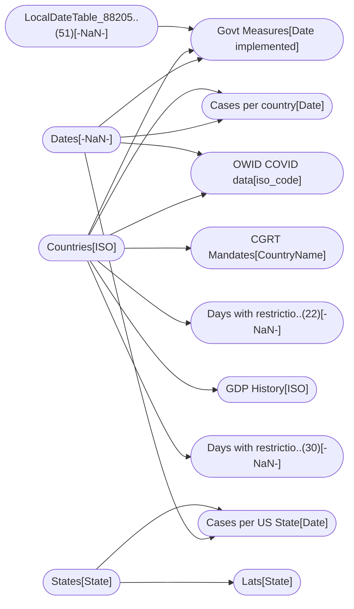

----

[Home](./index.md) > [COVID Bakeoff.pbix](COVID%20Bakeoff.pbix.md)

| [Information](#information) | [Model information](#model-information) | [Model relationships](#model-relationships) | [Business objects](#business-objects) | [Measures](#measures) | [Relationships](#relationships) | [Hierarchies](#hierarchies) | [Columns](#columns) | [Report sections](#report-sections) |

----

# Information

Documentation for file **COVID Bakeoff.pbix**.

# Model information

| Param  | Value  |
|---|---|
| **Analyzed pbix file name** | `COVID Bakeoff.pbix` | 
| **Catalog name** | `793fcaeb-ec0f-4901-9f8d-d305977aea6d` | 
| **Port** | `59980`|
| **Description** | `-NaN-` | 
| **Date modified** | `2023-12-16T19:10:57` | 
| **Compatibility level** | `1567` | 

[Up](#)
# Model relationships

[Up](#)

# Business objects

| ID | NAME | DESCRIPTION | 
|----|------|-------------|
| 9434 | Countries | n/a |
| 12586 | States | n/a |
| 13949 | Cases per US State | n/a |
| 14538 | Dates | n/a |
| 27375 | OWID COVID data | n/a |
| 46487 | Days with restrictions grouped | n/a |
| 48648 | GDP History | n/a |

[Up](#)
# Measures

<table>
    <tr>
        <th> ID </th><th> TABLE </th><th> NAME </th><th> DESCRIPTION </th><th> EXPRESSION </th><th> IS_HIDDEN </th><th> STATE </th>
    </tr>
<tr>
        <td> 19 </td><td> DateTableTemplate_3f..(54) </td><td>  </td><td> n/a </td><td> <code> YEAR([Date]) </code></td><td> True </td><td>  1 </td> 
    </tr>
<tr>
        <td> 20 </td><td> DateTableTemplate_3f..(54) </td><td>  </td><td> n/a </td><td> <code> MONTH([Date]) </code></td><td> True </td><td>  1 </td> 
    </tr>
<tr>
        <td> 21 </td><td> DateTableTemplate_3f..(54) </td><td>  </td><td> n/a </td><td> <code> FORMAT([Date], "MMMM") </code></td><td> True </td><td>  1 </td> 
    </tr>
<tr>
        <td> 22 </td><td> DateTableTemplate_3f..(54) </td><td>  </td><td> n/a </td><td> <code> INT(([MonthNo] + 2) / 3) </code></td><td> True </td><td>  1 </td> 
    </tr>
<tr>
        <td> 23 </td><td> DateTableTemplate_3f..(54) </td><td>  </td><td> n/a </td><td> <code> "Qtr " & [QuarterNo] </code></td><td> True </td><td>  1 </td> 
    </tr>
<tr>
        <td> 24 </td><td> DateTableTemplate_3f..(54) </td><td>  </td><td> n/a </td><td> <code> DAY([Date]) </code></td><td> True </td><td>  1 </td> 
    </tr>
<tr>
        <td> 9694 </td><td> Govt Measures </td><td>  </td><td> n/a </td><td> <code> CALCULATE(MAX('OWID COVID data'[New vaccinations smoothed per million]), RELATEDTABLE('OWID COVID data')) </code></td><td> True </td><td>  1 </td> 
    </tr>
<tr>
        <td> 13270 </td><td> Govt Measures </td><td>  </td><td> n/a </td><td> <code> CALCULATE(AVERAGE('Cases per country'[IncrementalCases]), RELATEDTABLE('Cases per country')) </code></td><td> True </td><td>  1 </td> 
    </tr>
<tr>
        <td> 20747 </td><td> Govt Measures </td><td>  </td><td> n/a </td><td> <code> CALCULATE(AVERAGE('Cases per country'[IncrementalCases]), FILTER(Dates, Dates[Date] = 'Govt Measures'[Date implemented]+60)) - 'Govt Measures'[Daily Cases When Implemented] </code></td><td> True </td><td>  1 </td> 
    </tr>
<tr>
        <td> 21636 </td><td> Govt Measures </td><td>  </td><td> n/a </td><td> <code> SWITCH(
  TRUE,
  ISBLANK('Govt Measures'[NON_COMPLIANCE]),
  "(Blank)",
  'Govt Measures'[NON_COMPLIANCE] IN {"Arrest/Detention",
    "Up to detention"},
  "Arrest",
  'Govt Measures'[NON_COMPLIANCE] IN {"Deportation",
    "Refusal to enter the country"},
  "Deportation/entry refused",
  'Govt Measures'[NON_COMPLIANCE] IN {"Fines"},
  "Fines",
  'Govt Measures'[NON_COMPLIANCE] IN {"Legal",
    "Legal action"},
  "Legal",
  'Govt Measures'[NON_COMPLIANCE] IN {"Not applicable",
    "Not Available"},
  "Not applicable",
  'Govt Measures'[NON_COMPLIANCE]
) </code></td><td> True </td><td>  1 </td> 
    </tr>
<tr>
        <td> 2926 </td><td> LocalDateTable_88205..(51) </td><td>  </td><td> n/a </td><td> <code> YEAR([Date]) </code></td><td> True </td><td>  1 </td> 
    </tr>
<tr>
        <td> 2927 </td><td> LocalDateTable_88205..(51) </td><td>  </td><td> n/a </td><td> <code> MONTH([Date]) </code></td><td> True </td><td>  1 </td> 
    </tr>
<tr>
        <td> 2928 </td><td> LocalDateTable_88205..(51) </td><td>  </td><td> n/a </td><td> <code> FORMAT([Date], "MMMM") </code></td><td> True </td><td>  1 </td> 
    </tr>
<tr>
        <td> 2929 </td><td> LocalDateTable_88205..(51) </td><td>  </td><td> n/a </td><td> <code> INT(([MonthNo] + 2) / 3) </code></td><td> True </td><td>  1 </td> 
    </tr>
<tr>
        <td> 2930 </td><td> LocalDateTable_88205..(51) </td><td>  </td><td> n/a </td><td> <code> "Qtr " & [QuarterNo] </code></td><td> True </td><td>  1 </td> 
    </tr>
<tr>
        <td> 2931 </td><td> LocalDateTable_88205..(51) </td><td>  </td><td> n/a </td><td> <code> DAY([Date]) </code></td><td> True </td><td>  1 </td> 
    </tr>
<tr>
        <td> 22186 </td><td> States </td><td>  </td><td> n/a </td><td> <code> CALCULATE(MAX('Cases per US State'[CumulativeCases])) </code></td><td> True </td><td>  1 </td> 
    </tr>
<tr>
        <td> 22241 </td><td> States </td><td>  </td><td> n/a </td><td> <code> States[State] </code></td><td> True </td><td>  1 </td> 
    </tr>
<tr>
        <td> 37476 </td><td> States </td><td>  </td><td> n/a </td><td> <code> SWITCH(
  TRUE,
  ISBLANK('States'[State]),
  "(Blank)",
  'States'[State] IN {"American Samoa",
    "Guam",
    "Marshall Islands",
    "Puerto Rico",
    "Virgin Islands"},
  "Islands and Territories",
  'States'[State] IN {"Alabama",
    "Alaska",
    "Arizona",
    "Arkansas",
    "California",
    "Colorado",
    "Connecticut",
    "Delaware",
    "District of Columbia",
    "Florida",
    "Georgia",
    "Hawaii",
    "Idaho",
    "Illinois",
    "Indiana",
    "Iowa",
    "Kansas",
    "Kentucky",
    "Louisiana",
    "Maine",
    "Maryland",
    "Massachusetts",
    "Michigan",
    "Minnesota",
    "Mississippi",
    "Missouri",
    "Montana",
    "Nebraska",
    "Nevada",
    "New Hampshire",
    "New Jersey",
    "New Mexico",
    "New York",
    "North Carolina",
    "North Dakota",
    "Ohio",
    "Oklahoma",
    "Oregon",
    "Pennsylvania",
    "Rhode Island",
    "South Carolina",
    "South Dakota",
    "Tennessee",
    "Texas",
    "Utah",
    "Vermont",
    "Virginia",
    "Washington",
    "West Virginia",
    "Wisconsin",
    "Wyoming"},
  "Main states",
  'States'[State]
) </code></td><td> True </td><td>  1 </td> 
    </tr>
<tr>
        <td> 58092 </td><td> States </td><td>  </td><td> n/a </td><td> <code> SWITCH(States[State], "New Hampshire", 1, "New Mexico", 2, "Connecticut", 3, "Rhode Island", 4, "Massachusetts", 5, 7) </code></td><td> True </td><td>  1 </td> 
    </tr>
<tr>
        <td> 58247 </td><td> States </td><td>  </td><td> n/a </td><td> <code> SWITCH(
  TRUE,
  ISBLANK('States'[State]),
  "(Blank)",
  'States'[State] IN {"New Mexico",
    "Rhode Island",
    "South Dakota"},
  "Fully vaccinated",
  'States'[State] IN {"Connecticut",
    "Massachusetts",
    "New Hampshire"},
  "One dose",
  "Other"
) </code></td><td> True </td><td>  1 </td> 
    </tr>
<tr>
        <td> 60480 </td><td> States </td><td>  </td><td> n/a </td><td> <code> IF(States[Average Temperature ] < 67.7, "Below", "Above") </code></td><td> True </td><td>  1 </td> 
    </tr>
<tr>
        <td> 60577 </td><td> States </td><td>  </td><td> n/a </td><td> <code> SWITCH(
  TRUE,
  ISBLANK('States'[State]),
  "(Blank)",
  'States'[State] IN {"Alaska",
    "Colorado",
    "Connecticut",
    "Delaware",
    "District of Columbia",
    "Idaho",
    "Illinois",
    "Indiana",
    "Iowa",
    "Maine",
    "Marshall Islands",
    "Maryland",
    "Massachusetts",
    "Michigan",
    "Minnesota",
    "Missouri",
    "Montana",
    "Nebraska",
    "New Hampshire",
    "New Jersey",
    "New York",
    "North Dakota",
    "Ohio",
    "Oklahoma",
    "Oregon",
    "Pennsylvania",
    "Puerto Rico",
    "Rhode Island",
    "South Dakota",
    "Vermont",
    "Virgin Islands",
    "Virginia",
    "Washington",
    "West Virginia",
    "Wisconsin",
    "Wyoming"},
  "Cooler",
  'States'[State] IN {"Alabama",
    "American Samoa",
    "Arizona",
    "Arkansas",
    "California",
    "Florida",
    "Georgia",
    "Guam",
    "Hawaii",
    "Kansas",
    "Kentucky",
    "Louisiana",
    "Mississippi",
    "Nevada",
    "New Mexico",
    "North Carolina",
    "South Carolina",
    "Tennessee",
    "Texas",
    "Utah"},
  "Hotter",
  'States'[State]
) </code></td><td> False </td><td>  1 </td> 
    </tr>
<tr>
        <td> 58199 </td><td> Dates </td><td>  </td><td> n/a </td><td> <code> WEEKNUM(Dates[Date]) </code></td><td> False </td><td>  1 </td> 
    </tr>
<tr>
        <td> 58303 </td><td> Dates </td><td>  </td><td> n/a </td><td> <code> (Dates[Date] - WEEKDAY(Dates[Date]))+1 </code></td><td> True </td><td>  1 </td> 
    </tr>
</table>

[Up](#)
# Relationships 

| ID | FROM_TABLE | TO_TABLE | FROM:TO CARDINALITY | NAME | IS_ACTIVE  |
|----|------------|----------|---------------------|------|------------|
| 2900 | Govt Measures[Entry date] | LocalDateTable_88205..(51)[-NaN-] | 2:1 | e1e86f08-cc1c-48f2-9aba-4fddf579fca6 | True |
| 9525 | Govt Measures[ISO] | Countries[ISO] | 2:1 | 21e6f44d-7bfc-44b6-90f5-c5b12555f93c | True |
| 13253 | Cases per country[Country] | Countries[Country] | 2:1 | 372580c9-5cdd-42e1-b7df-a310955cfc7f | True |
| 14521 | Cases per US State[State] | States[State] | 2:1 | c14fb59b-c328-4d1c-a16f-3a6785d951ee | True |
| 14943 | Cases per US State[Date] | Dates[-NaN-] | 2:1 | 11823667-7f2f-429a-b8ac-6dcac9e557f6 | True |
| 15000 | Cases per country[Date] | Dates[-NaN-] | 2:1 | 86a185cb-34f7-4885-84cf-00e80c51d513 | True |
| 16218 | Govt Measures[Date implemented] | Dates[-NaN-] | 2:1 | 7b9dc434-4b9a-44b4-a37e-9c1070c8f7aa | True |
| 30458 | OWID COVID data[date] | Dates[-NaN-] | 2:1 | 1957136d-e5f3-41f9-882f-43cf3fee2558 | True |
| 30492 | OWID COVID data[iso_code] | Countries[ISO] | 2:1 | 01f08640-cf1f-411c-a63c-59944b68ec84 | True |
| 43951 | CGRT Mandates[CountryName] | Countries[Country] | 2:1 | 9472a507-8991-430e-83d6-a8656c4d63f0 | True |
| 46831 | Days with restrictio..(22)[-NaN-] | Countries[ISO] | 2:1 | 522630e3-279d-4eb5-84b0-619f26212b0c | True |
| 48840 | GDP History[ISO] | Countries[ISO] | 2:1 | e784db96-1975-42e1-ba75-bd9bea95df5b | True |
| 49693 | Days with restrictio..(30)[-NaN-] | Countries[ISO] | 2:1 | c6a5f2eb-1ee1-418e-b460-a95554874641 | True |
| 60441 | Lats[State] | States[State] | 1:1 | 865d7d72-6b99-4118-8e48-dc22864cd6c5 | True |

[Up](#)
# Hierarchies 

| ID | TABLE | NAME | DESCRIPTION  | IS_HIDDEN | 
|----|----------|------|--------------|-----------|
| 27 |DateTableTemplate_3f..(54) | Date Hierarchy | n/a | False | 
| 2937 |LocalDateTable_88205..(51) | Date Hierarchy | n/a | False | 

[Up](#)
# Columns 

<table>
    <tr>
        <th> ID </th><th> TABLE </th><th> EXPLICIT_NAME </th><th> DESCRIPTION </th><th> IS_HIDDEN </th><th> EXPRESSION </th>
    </tr>
<tr>
        <td> 9437 </td><td> Countries </td><td> ISO </td><td> n/a </td><td> False </td><td><code> n/a </code></td>
    </tr>

<tr>
        <td> 9438 </td><td> Countries </td><td> Country </td><td> n/a </td><td> False </td><td><code> n/a </code></td>
    </tr>

<tr>
        <td> 26883 </td><td> Countries </td><td> Continent </td><td> n/a </td><td> False </td><td><code> n/a </code></td>
    </tr>

<tr>
        <td> 32798 </td><td> Countries </td><td> Population </td><td> n/a </td><td> False </td><td><code> n/a </code></td>
    </tr>

<tr>
        <td> 32807 </td><td> Countries </td><td> Growth Rate </td><td> n/a </td><td> False </td><td><code> n/a </code></td>
    </tr>

<tr>
        <td> 32818 </td><td> Countries </td><td> Flag </td><td> n/a </td><td> False </td><td><code> n/a </code></td>
    </tr>

<tr>
        <td> 32829 </td><td> Countries </td><td> Area (km2) </td><td> n/a </td><td> False </td><td><code> n/a </code></td>
    </tr>

<tr>
        <td> 32840 </td><td> Countries </td><td> Density </td><td> n/a </td><td> False </td><td><code> n/a </code></td>
    </tr>

<tr>
        <td> 12589 </td><td> States </td><td> State </td><td> n/a </td><td> False </td><td><code> n/a </code></td>
    </tr>

<tr>
        <td> 41766 </td><td> States </td><td> Flag </td><td> n/a </td><td> False </td><td><code> n/a </code></td>
    </tr>

<tr>
        <td> 60577 </td><td> States </td><td> March Temperatures </td><td> n/a </td><td> False </td><td><code> SWITCH(
  TRUE,
  ISBLANK('States'[State]),
  "(Blank)",
  'States'[State] IN {"Alaska",
    "Colorado",
    "Connecticut",
    "Delaware",
    "District of Columbia",
    "Idaho",
    "Illinois",
    "Indiana",
    "Iowa",
    "Maine",
    "Marshall Islands",
    "Maryland",
    "Massachusetts",
    "Michigan",
    "Minnesota",
    "Missouri",
    "Montana",
    "Nebraska",
    "New Hampshire",
    "New Jersey",
    "New York",
    "North Dakota",
    "Ohio",
    "Oklahoma",
    "Oregon",
    "Pennsylvania",
    "Puerto Rico",
    "Rhode Island",
    "South Dakota",
    "Vermont",
    "Virgin Islands",
    "Virginia",
    "Washington",
    "West Virginia",
    "Wisconsin",
    "Wyoming"},
  "Cooler",
  'States'[State] IN {"Alabama",
    "American Samoa",
    "Arizona",
    "Arkansas",
    "California",
    "Florida",
    "Georgia",
    "Guam",
    "Hawaii",
    "Kansas",
    "Kentucky",
    "Louisiana",
    "Mississippi",
    "Nevada",
    "New Mexico",
    "North Carolina",
    "South Carolina",
    "Tennessee",
    "Texas",
    "Utah"},
  "Hotter",
  'States'[State]
) </code></td>
    </tr>

<tr>
        <td> 12652 </td><td> Cases per country </td><td> Key </td><td> n/a </td><td> False </td><td><code> n/a </code></td>
    </tr>

<tr>
        <td> 12653 </td><td> Cases per country </td><td> GeoLevel </td><td> n/a </td><td> False </td><td><code> n/a </code></td>
    </tr>

<tr>
        <td> 12654 </td><td> Cases per country </td><td> Date </td><td> n/a </td><td> False </td><td><code> n/a </code></td>
    </tr>

<tr>
        <td> 12666 </td><td> Cases per country </td><td> Country </td><td> n/a </td><td> False </td><td><code> n/a </code></td>
    </tr>

<tr>
        <td> 13956 </td><td> Cases per US State </td><td> Key </td><td> n/a </td><td> False </td><td><code> n/a </code></td>
    </tr>

<tr>
        <td> 13957 </td><td> Cases per US State </td><td> Date </td><td> n/a </td><td> False </td><td><code> n/a </code></td>
    </tr>

<tr>
        <td> 13965 </td><td> Cases per US State </td><td> CumulativeCases </td><td> n/a </td><td> False </td><td><code> n/a </code></td>
    </tr>

<tr>
        <td> 13966 </td><td> Cases per US State </td><td> CumulativeDeaths </td><td> n/a </td><td> False </td><td><code> n/a </code></td>
    </tr>

<tr>
        <td> 13969 </td><td> Cases per US State </td><td> State </td><td> n/a </td><td> False </td><td><code> n/a </code></td>
    </tr>

<tr>
        <td> 36592 </td><td> Cases per US State </td><td> Incremental cases </td><td> n/a </td><td> False </td><td><code> n/a </code></td>
    </tr>

<tr>
        <td> 36601 </td><td> Cases per US State </td><td> IncrementalDeaths </td><td> n/a </td><td> False </td><td><code> n/a </code></td>
    </tr>

<tr>
        <td> 36612 </td><td> Cases per US State </td><td> total_vaccinations </td><td> n/a </td><td> False </td><td><code> n/a </code></td>
    </tr>

<tr>
        <td> 36623 </td><td> Cases per US State </td><td> total_distributed </td><td> n/a </td><td> False </td><td><code> n/a </code></td>
    </tr>

<tr>
        <td> 36634 </td><td> Cases per US State </td><td> people_vaccinated </td><td> n/a </td><td> False </td><td><code> n/a </code></td>
    </tr>

<tr>
        <td> 36656 </td><td> Cases per US State </td><td> total_vaccinations_p..(30) </td><td> n/a </td><td> False </td><td><code> n/a </code></td>
    </tr>

<tr>
        <td> 36667 </td><td> Cases per US State </td><td> people_fully_vaccina..(23) </td><td> n/a </td><td> False </td><td><code> n/a </code></td>
    </tr>

<tr>
        <td> 36678 </td><td> Cases per US State </td><td> people_vaccinated_pe..(29) </td><td> n/a </td><td> False </td><td><code> n/a </code></td>
    </tr>

<tr>
        <td> 36689 </td><td> Cases per US State </td><td> distributed_per_hund..(23) </td><td> n/a </td><td> False </td><td><code> n/a </code></td>
    </tr>

<tr>
        <td> 36700 </td><td> Cases per US State </td><td> daily_vaccinations_r..(22) </td><td> n/a </td><td> False </td><td><code> n/a </code></td>
    </tr>

<tr>
        <td> 36711 </td><td> Cases per US State </td><td> daily_vaccinations </td><td> n/a </td><td> False </td><td><code> n/a </code></td>
    </tr>

<tr>
        <td> 36722 </td><td> Cases per US State </td><td> daily_vaccinations_p..(30) </td><td> n/a </td><td> False </td><td><code> n/a </code></td>
    </tr>

<tr>
        <td> 36733 </td><td> Cases per US State </td><td> share_doses_used </td><td> n/a </td><td> False </td><td><code> n/a </code></td>
    </tr>

<tr>
        <td> 14589 </td><td> Dates </td><td> -NaN- </td><td> n/a </td><td> False </td><td><code> n/a </code></td>
    </tr>

<tr>
        <td> 58199 </td><td> Dates </td><td> Week Number </td><td> n/a </td><td> False </td><td><code> WEEKNUM(Dates[Date]) </code></td>
    </tr>

<tr>
        <td> 27382 </td><td> OWID COVID data </td><td> iso_code </td><td> n/a </td><td> False </td><td><code> n/a </code></td>
    </tr>

<tr>
        <td> 27384 </td><td> OWID COVID data </td><td> location </td><td> n/a </td><td> False </td><td><code> n/a </code></td>
    </tr>

<tr>
        <td> 27396 </td><td> OWID COVID data </td><td> Total deaths </td><td> n/a </td><td> False </td><td><code> n/a </code></td>
    </tr>

<tr>
        <td> 27397 </td><td> OWID COVID data </td><td> New deaths </td><td> n/a </td><td> False </td><td><code> n/a </code></td>
    </tr>

<tr>
        <td> 27398 </td><td> OWID COVID data </td><td> New deaths smoothed </td><td> n/a </td><td> False </td><td><code> n/a </code></td>
    </tr>

<tr>
        <td> 27402 </td><td> OWID COVID data </td><td> Total deaths per mil..(24) </td><td> n/a </td><td> False </td><td><code> n/a </code></td>
    </tr>

<tr>
        <td> 27403 </td><td> OWID COVID data </td><td> New deaths per milli..(22) </td><td> n/a </td><td> False </td><td><code> n/a </code></td>
    </tr>

<tr>
        <td> 27404 </td><td> OWID COVID data </td><td> New deaths smoothed ..(31) </td><td> n/a </td><td> False </td><td><code> n/a </code></td>
    </tr>

<tr>
        <td> 27405 </td><td> OWID COVID data </td><td> Reproduction rate </td><td> n/a </td><td> False </td><td><code> n/a </code></td>
    </tr>

<tr>
        <td> 27406 </td><td> OWID COVID data </td><td> ICU patients </td><td> n/a </td><td> False </td><td><code> n/a </code></td>
    </tr>

<tr>
        <td> 27407 </td><td> OWID COVID data </td><td> ICU patients per mil..(24) </td><td> n/a </td><td> False </td><td><code> n/a </code></td>
    </tr>

<tr>
        <td> 27408 </td><td> OWID COVID data </td><td> Hospital patients </td><td> n/a </td><td> False </td><td><code> n/a </code></td>
    </tr>

<tr>
        <td> 27409 </td><td> OWID COVID data </td><td> Hospital patients pe..(29) </td><td> n/a </td><td> False </td><td><code> n/a </code></td>
    </tr>

<tr>
        <td> 27410 </td><td> OWID COVID data </td><td> Weekly ICU admission..(21) </td><td> n/a </td><td> False </td><td><code> n/a </code></td>
    </tr>

<tr>
        <td> 27411 </td><td> OWID COVID data </td><td> Weekly ICU admissisi..(35) </td><td> n/a </td><td> False </td><td><code> n/a </code></td>
    </tr>

<tr>
        <td> 27412 </td><td> OWID COVID data </td><td> weekly_hosp_admissio..(22) </td><td> n/a </td><td> False </td><td><code> n/a </code></td>
    </tr>

<tr>
        <td> 27413 </td><td> OWID COVID data </td><td> Weekly hospital admi..(38) </td><td> n/a </td><td> False </td><td><code> n/a </code></td>
    </tr>

<tr>
        <td> 27414 </td><td> OWID COVID data </td><td> new_tests </td><td> n/a </td><td> False </td><td><code> n/a </code></td>
    </tr>

<tr>
        <td> 27415 </td><td> OWID COVID data </td><td> total_tests </td><td> n/a </td><td> False </td><td><code> n/a </code></td>
    </tr>

<tr>
        <td> 27416 </td><td> OWID COVID data </td><td> Total tests per thou..(24) </td><td> n/a </td><td> False </td><td><code> n/a </code></td>
    </tr>

<tr>
        <td> 27417 </td><td> OWID COVID data </td><td> New tests per thousa..(23) </td><td> n/a </td><td> False </td><td><code> n/a </code></td>
    </tr>

<tr>
        <td> 27418 </td><td> OWID COVID data </td><td> new_tests_smoothed </td><td> n/a </td><td> False </td><td><code> n/a </code></td>
    </tr>

<tr>
        <td> 27419 </td><td> OWID COVID data </td><td> new_tests_smoothed_p..(31) </td><td> n/a </td><td> False </td><td><code> n/a </code></td>
    </tr>

<tr>
        <td> 27420 </td><td> OWID COVID data </td><td> positive_rate </td><td> n/a </td><td> False </td><td><code> n/a </code></td>
    </tr>

<tr>
        <td> 27422 </td><td> OWID COVID data </td><td> tests_units </td><td> n/a </td><td> False </td><td><code> n/a </code></td>
    </tr>

<tr>
        <td> 27423 </td><td> OWID COVID data </td><td> total_vaccinations </td><td> n/a </td><td> False </td><td><code> n/a </code></td>
    </tr>

<tr>
        <td> 27424 </td><td> OWID COVID data </td><td> people_vaccinated </td><td> n/a </td><td> False </td><td><code> n/a </code></td>
    </tr>

<tr>
        <td> 27425 </td><td> OWID COVID data </td><td> people_fully_vaccina..(23) </td><td> n/a </td><td> False </td><td><code> n/a </code></td>
    </tr>

<tr>
        <td> 27426 </td><td> OWID COVID data </td><td> new_vaccinations </td><td> n/a </td><td> False </td><td><code> n/a </code></td>
    </tr>

<tr>
        <td> 27427 </td><td> OWID COVID data </td><td> new_vaccinations_smo..(25) </td><td> n/a </td><td> False </td><td><code> n/a </code></td>
    </tr>

<tr>
        <td> 27428 </td><td> OWID COVID data </td><td> Total vaccinations p..(30) </td><td> n/a </td><td> False </td><td><code> n/a </code></td>
    </tr>

<tr>
        <td> 27429 </td><td> OWID COVID data </td><td> People vaccinated pe..(29) </td><td> n/a </td><td> False </td><td><code> n/a </code></td>
    </tr>

<tr>
        <td> 27430 </td><td> OWID COVID data </td><td> People fully vaccina..(35) </td><td> n/a </td><td> False </td><td><code> n/a </code></td>
    </tr>

<tr>
        <td> 27431 </td><td> OWID COVID data </td><td> New vaccinations smo..(37) </td><td> n/a </td><td> False </td><td><code> n/a </code></td>
    </tr>

<tr>
        <td> 27432 </td><td> OWID COVID data </td><td> stringency_index </td><td> n/a </td><td> False </td><td><code> n/a </code></td>
    </tr>

<tr>
        <td> 27433 </td><td> OWID COVID data </td><td> Population </td><td> n/a </td><td> False </td><td><code> n/a </code></td>
    </tr>

<tr>
        <td> 27434 </td><td> OWID COVID data </td><td> Population density </td><td> n/a </td><td> False </td><td><code> n/a </code></td>
    </tr>

<tr>
        <td> 27435 </td><td> OWID COVID data </td><td> Median age </td><td> n/a </td><td> False </td><td><code> n/a </code></td>
    </tr>

<tr>
        <td> 27437 </td><td> OWID COVID data </td><td> Aged 70 and old </td><td> n/a </td><td> False </td><td><code> n/a </code></td>
    </tr>

<tr>
        <td> 27438 </td><td> OWID COVID data </td><td> GDP per capita </td><td> n/a </td><td> False </td><td><code> n/a </code></td>
    </tr>

<tr>
        <td> 27439 </td><td> OWID COVID data </td><td> Extreme poverty </td><td> n/a </td><td> False </td><td><code> n/a </code></td>
    </tr>

<tr>
        <td> 27440 </td><td> OWID COVID data </td><td> Cardiovascular death..(25) </td><td> n/a </td><td> False </td><td><code> n/a </code></td>
    </tr>

<tr>
        <td> 27441 </td><td> OWID COVID data </td><td> Diabetes prevalence </td><td> n/a </td><td> False </td><td><code> n/a </code></td>
    </tr>

<tr>
        <td> 27442 </td><td> OWID COVID data </td><td> Female smoking rate </td><td> n/a </td><td> False </td><td><code> n/a </code></td>
    </tr>

<tr>
        <td> 27443 </td><td> OWID COVID data </td><td> Male smoking rate </td><td> n/a </td><td> False </td><td><code> n/a </code></td>
    </tr>

<tr>
        <td> 27444 </td><td> OWID COVID data </td><td> Handwashing faciliti..(32) </td><td> n/a </td><td> False </td><td><code> n/a </code></td>
    </tr>

<tr>
        <td> 27445 </td><td> OWID COVID data </td><td> Hospital beds per th..(26) </td><td> n/a </td><td> False </td><td><code> n/a </code></td>
    </tr>

<tr>
        <td> 27446 </td><td> OWID COVID data </td><td> Life expectancy </td><td> n/a </td><td> False </td><td><code> n/a </code></td>
    </tr>

<tr>
        <td> 27447 </td><td> OWID COVID data </td><td> human_development_in..(23) </td><td> n/a </td><td> False </td><td><code> n/a </code></td>
    </tr>

<tr>
        <td> 47009 </td><td> Days with restrictio..(30) </td><td> -NaN- </td><td> n/a </td><td> False </td><td><code> n/a </code></td>
    </tr>

<tr>
        <td> 47750 </td><td> Days with restrictio..(30) </td><td> -NaN- </td><td> n/a </td><td> False </td><td><code> n/a </code></td>
    </tr>

<tr>
        <td> 47752 </td><td> Days with restrictio..(30) </td><td> -NaN- </td><td> n/a </td><td> False </td><td><code> n/a </code></td>
    </tr>

<tr>
        <td> 47754 </td><td> Days with restrictio..(30) </td><td> -NaN- </td><td> n/a </td><td> False </td><td><code> n/a </code></td>
    </tr>

<tr>
        <td> 47756 </td><td> Days with restrictio..(30) </td><td> -NaN- </td><td> n/a </td><td> False </td><td><code> n/a </code></td>
    </tr>

<tr>
        <td> 47758 </td><td> Days with restrictio..(30) </td><td> -NaN- </td><td> n/a </td><td> False </td><td><code> n/a </code></td>
    </tr>

<tr>
        <td> 47760 </td><td> Days with restrictio..(30) </td><td> -NaN- </td><td> n/a </td><td> False </td><td><code> n/a </code></td>
    </tr>

<tr>
        <td> 47764 </td><td> Days with restrictio..(30) </td><td> -NaN- </td><td> n/a </td><td> False </td><td><code> n/a </code></td>
    </tr>

<tr>
        <td> 47766 </td><td> Days with restrictio..(30) </td><td> -NaN- </td><td> n/a </td><td> False </td><td><code> n/a </code></td>
    </tr>

<tr>
        <td> 47768 </td><td> Days with restrictio..(30) </td><td> -NaN- </td><td> n/a </td><td> False </td><td><code> n/a </code></td>
    </tr>

<tr>
        <td> 49686 </td><td> Days with restrictio..(30) </td><td> -NaN- </td><td> n/a </td><td> False </td><td><code> n/a </code></td>
    </tr>

<tr>
        <td> 48651 </td><td> GDP History </td><td> ISO </td><td> n/a </td><td> False </td><td><code> n/a </code></td>
    </tr>

<tr>
        <td> 48652 </td><td> GDP History </td><td> Country </td><td> n/a </td><td> False </td><td><code> n/a </code></td>
    </tr>

<tr>
        <td> 48653 </td><td> GDP History </td><td> Year </td><td> n/a </td><td> False </td><td><code> n/a </code></td>
    </tr>

<tr>
        <td> 48654 </td><td> GDP History </td><td> GDP (bn) </td><td> n/a </td><td> False </td><td><code> n/a </code></td>
    </tr>

<tr>
        <td> 48655 </td><td> GDP History </td><td> % change </td><td> n/a </td><td> False </td><td><code> n/a </code></td>
    </tr>

<tr>
        <td> 60612 </td><td> Lats </td><td> Average Temperature  </td><td> n/a </td><td> False </td><td><code> n/a </code></td>
    </tr>

</table>

# Report sections

## Global Vaccinations

| Param  | Value  |
|---|---|
| **ID** | `` |
| **Name** | `ReportSection7bdccf651d98bc34a50d` |
| **Display Name** | `Global Vaccinations` |
| **Filters** | `[{"name":"Filter78d8b4de5d2e0a98aeb7","expression":{"Column":{"Expression":{"SourceRef":{"Entity":"Countries"}},"Property":"Country"}},"filter":{"Version":2,"From":[{"Name":"c","Entity":"Countries","Type":0}],"Where":[{"Condition":{"Not":{"Expression":{"In":{"Expressions":[{"Column":{"Expression":{"SourceRef":{"Source":"c"}},"Property":"Country"}}],"Values":[[{"Literal":{"Value":"null"}}]]}}}}}]},"type":"Categorical","howCreated":1,"objects":{"general":[{"properties":{"isInvertedSelectionMode":{"expr":{"Literal":{"Value":"true"}}}}}]}},{"name":"Filterf730e423025a13632cbb","expression":{"Column":{"Expression":{"SourceRef":{"Entity":"Countries"}},"Property":"Population"}},"filter":{"Version":2,"From":[{"Name":"c","Entity":"Countries","Type":0}],"Where":[{"Condition":{"Comparison":{"ComparisonKind":1,"Left":{"Column":{"Expression":{"SourceRef":{"Source":"c"}},"Property":"Population"}},"Right":{"Literal":{"Value":"1000000L"}}}}}]},"type":"Advanced","howCreated":1}]` |
| **Ordinal** | `0` |
| **Visual containers number** | `8` |

[Up](#)

### Container ddcbc8f094b45898734c 

| Param  | Value  |
|---|---|
| **Name:** | `ddcbc8f094b45898734c` |
| **Type:** | `lineStackedColumnComboChart` |
| **Business objects:**  | `Dates, OWID COVID data` | 
| **Attributes:**  | Column: Dates.Date  Measure: OWID COVID data.Cases 7d Mvg Avg per million  Measure: OWID COVID data.Share of Population vaccinated  Measure: OWID COVID data.Daily Change (for formatting) | 

[Up](#)

### Container fcb8ffb4d02bed39ca81 

| Param  | Value  |
|---|---|
| **Name:** | `fcb8ffb4d02bed39ca81` |
| **Type:** | `map` |
| **Business objects:**  | `Countries, OWID COVID data` | 
| **Attributes:**  | Column: Countries.COUNTRY  Measure: OWID COVID data.Share of Population vaccinated  Column: Countries.Continent | 

[Up](#)

### Container 519ef34108ec0583040c 

| Param  | Value  |
|---|---|
| **Name:** | `519ef34108ec0583040c` |
| **Type:** | `barChart` |
| **Business objects:**  | `Countries, OWID COVID data` | 
| **Attributes:**  | Column: Countries.COUNTRY  Aggregation: Sum(Countries.Population)  Measure: owid-covid-data.Measure | 

[Up](#)

### Container 622d8d411cb970245b80 

| Param  | Value  |
|---|---|
| **Name:** | `622d8d411cb970245b80` |
| **Type:** | `['n/a']` |
| **Business objects:**  | `n/a` | 
| **Attributes:**  | n/a | 

[Up](#)

### Container 3539983f0735879e9bab 

| Param  | Value  |
|---|---|
| **Name:** | `3539983f0735879e9bab` |
| **Type:** | `['n/a']` |
| **Business objects:**  | `n/a` | 
| **Attributes:**  | n/a | 

[Up](#)

### Container bb0df01c43a0310bc0e7 

| Param  | Value  |
|---|---|
| **Name:** | `bb0df01c43a0310bc0e7` |
| **Type:** | `['n/a']` |
| **Business objects:**  | `n/a` | 
| **Attributes:**  | n/a | 

[Up](#)

### Container fe5aff94e14edca2c3c5 

| Param  | Value  |
|---|---|
| **Name:** | `fe5aff94e14edca2c3c5` |
| **Type:** | `['n/a']` |
| **Business objects:**  | `n/a` | 
| **Attributes:**  | n/a | 

[Up](#)

### Container 5e331d513983020b450b 

| Param  | Value  |
|---|---|
| **Name:** | `5e331d513983020b450b` |
| **Type:** | `['n/a']` |
| **Business objects:**  | `n/a` | 
| **Attributes:**  | n/a | 

[Up](#)

## Cases/Vaccines animation

| Param  | Value  |
|---|---|
| **ID** | `` |
| **Name** | `ReportSectiond98e33c37b4b84be4c71` |
| **Display Name** | `Cases/Vaccines animation` |
| **Filters** | `[{"name":"Filter2e9285e275a8d5bee683","expression":{"Column":{"Expression":{"SourceRef":{"Entity":"Countries"}},"Property":"Country"}},"filter":{"Version":2,"From":[{"Name":"c","Entity":"Countries","Type":0}],"Where":[{"Condition":{"In":{"Expressions":[{"Column":{"Expression":{"SourceRef":{"Source":"c"}},"Property":"Country"}}],"Values":[[{"Literal":{"Value":"'United States'"}}]]}}}]},"type":"Categorical","howCreated":5}]` |
| **Ordinal** | `1` |
| **Visual containers number** | `8` |

[Up](#)

### Container d97b3d9fcb3933228dd5 

| Param  | Value  |
|---|---|
| **Name:** | `d97b3d9fcb3933228dd5` |
| **Type:** | `scatterChart` |
| **Business objects:**  | `States, Cases per US State, Dates` | 
| **Attributes:**  | Column: States.State  Measure: Cases per US State.Full vaccinations per hundred  Measure: Cases per US State.Change from 12/27  Column: Dates.Start of week  Measure: Cases per US State.% Fully Vacc'd | 

[Up](#)

### Container c9b375b77ee90a500d9d 

| Param  | Value  |
|---|---|
| **Name:** | `c9b375b77ee90a500d9d` |
| **Type:** | `tableEx` |
| **Business objects:**  | `Cases per US State, States` | 
| **Attributes:**  | Column: States.State  Column: States.Flag  Measure: Cases per US State.% Fully Vacc'd  Measure: Cases per US State.% One+ Shots | 

[Up](#)

### Container 48bd049742ed42450d63 

| Param  | Value  |
|---|---|
| **Name:** | `48bd049742ed42450d63` |
| **Type:** | `['n/a']` |
| **Business objects:**  | `n/a` | 
| **Attributes:**  | n/a | 

[Up](#)

### Container bafc37cdd0426e5d2b1a 

| Param  | Value  |
|---|---|
| **Name:** | `bafc37cdd0426e5d2b1a` |
| **Type:** | `['n/a']` |
| **Business objects:**  | `n/a` | 
| **Attributes:**  | n/a | 

[Up](#)

### Container 6160c3f43aa17718cc9a 

| Param  | Value  |
|---|---|
| **Name:** | `6160c3f43aa17718cc9a` |
| **Type:** | `['n/a']` |
| **Business objects:**  | `n/a` | 
| **Attributes:**  | n/a | 

[Up](#)

### Container 27467d84a6ca4263093e 

| Param  | Value  |
|---|---|
| **Name:** | `27467d84a6ca4263093e` |
| **Type:** | `['n/a']` |
| **Business objects:**  | `n/a` | 
| **Attributes:**  | n/a | 

[Up](#)

### Container 7d22164a640142e07ee3 

| Param  | Value  |
|---|---|
| **Name:** | `7d22164a640142e07ee3` |
| **Type:** | `['n/a']` |
| **Business objects:**  | `n/a` | 
| **Attributes:**  | n/a | 

[Up](#)

### Container 21943438d0631b302128 

| Param  | Value  |
|---|---|
| **Name:** | `21943438d0631b302128` |
| **Type:** | `['n/a']` |
| **Business objects:**  | `n/a` | 
| **Attributes:**  | n/a | 

[Up](#)

## US Vaccinations

| Param  | Value  |
|---|---|
| **ID** | `` |
| **Name** | `ReportSectionad3b556fac31b946e0c1` |
| **Display Name** | `US Vaccinations` |
| **Filters** | `[]` |
| **Ordinal** | `2` |
| **Visual containers number** | `17` |

[Up](#)

### Container ff141d62080ee0093753 

| Param  | Value  |
|---|---|
| **Name:** | `ff141d62080ee0093753` |
| **Type:** | `tableEx` |
| **Business objects:**  | `Cases per US State, States` | 
| **Attributes:**  | Column: States.State  Column: States.Flag  Aggregation: Avg(States.Average Temperature )  Measure: Cases per US State.% Fully Vacc'd | 

[Up](#)

### Container fd55bac8bed0e0839138 

| Param  | Value  |
|---|---|
| **Name:** | `fd55bac8bed0e0839138` |
| **Type:** | `lineStackedColumnComboChart` |
| **Business objects:**  | `States, Dates, Cases per US State` | 
| **Attributes:**  | Column: Dates.Date  Measure: Cases per US State.Cases per million 7d avg  Measure: Cases per US State.Full vaccinations per hundred  Column: States.State (by cases)  Measure: Cases per US State.Daily Change US (for formatting) | 

[Up](#)

### Container 0162742b4a9ea636b1aa 

| Param  | Value  |
|---|---|
| **Name:** | `0162742b4a9ea636b1aa` |
| **Type:** | `shapeMap` |
| **Business objects:**  | `States` | 
| **Attributes:**  | Column: States.State  Aggregation: CountNonNull(States.Average Temperature ) | 

[Up](#)

### Container b33722933088628b099c 

| Param  | Value  |
|---|---|
| **Name:** | `b33722933088628b099c` |
| **Type:** | `['n/a']` |
| **Business objects:**  | `n/a` | 
| **Attributes:**  | n/a | 

[Up](#)

### Container 680ca02c81deb525780e 

| Param  | Value  |
|---|---|
| **Name:** | `680ca02c81deb525780e` |
| **Type:** | `['n/a']` |
| **Business objects:**  | `n/a` | 
| **Attributes:**  | n/a | 

[Up](#)

### Container 33b5f3ffbae906c84310 

| Param  | Value  |
|---|---|
| **Name:** | `33b5f3ffbae906c84310` |
| **Type:** | `['n/a']` |
| **Business objects:**  | `n/a` | 
| **Attributes:**  | n/a | 

[Up](#)

### Container b5ef6399410706e87ed0 

| Param  | Value  |
|---|---|
| **Name:** | `b5ef6399410706e87ed0` |
| **Type:** | `['n/a']` |
| **Business objects:**  | `n/a` | 
| **Attributes:**  | n/a | 

[Up](#)

### Container 5979aee1094b093d4540 

| Param  | Value  |
|---|---|
| **Name:** | `5979aee1094b093d4540` |
| **Type:** | `['n/a']` |
| **Business objects:**  | `n/a` | 
| **Attributes:**  | n/a | 

[Up](#)

### Container 46396bdbbdec0797860c 

| Param  | Value  |
|---|---|
| **Name:** | `46396bdbbdec0797860c` |
| **Type:** | `['n/a']` |
| **Business objects:**  | `n/a` | 
| **Attributes:**  | n/a | 

[Up](#)

### Container 18dcc26163d31548ab0a 

| Param  | Value  |
|---|---|
| **Name:** | `18dcc26163d31548ab0a` |
| **Type:** | `['n/a']` |
| **Business objects:**  | `n/a` | 
| **Attributes:**  | n/a | 

[Up](#)

### Container 37f0d1f4a4e9c89c7a3c 

| Param  | Value  |
|---|---|
| **Name:** | `37f0d1f4a4e9c89c7a3c` |
| **Type:** | `['n/a']` |
| **Business objects:**  | `n/a` | 
| **Attributes:**  | n/a | 

[Up](#)

### Container ab70b341856d3c14c37d 

| Param  | Value  |
|---|---|
| **Name:** | `ab70b341856d3c14c37d` |
| **Type:** | `['n/a']` |
| **Business objects:**  | `n/a` | 
| **Attributes:**  | n/a | 

[Up](#)

### Container 5d28c15f216eb4b0e5cb 

| Param  | Value  |
|---|---|
| **Name:** | `5d28c15f216eb4b0e5cb` |
| **Type:** | `['n/a']` |
| **Business objects:**  | `n/a` | 
| **Attributes:**  | n/a | 

[Up](#)

### Container 833a99a20b29ec64727c 

| Param  | Value  |
|---|---|
| **Name:** | `833a99a20b29ec64727c` |
| **Type:** | `['n/a']` |
| **Business objects:**  | `n/a` | 
| **Attributes:**  | n/a | 

[Up](#)

### Container 5f352452dae53e652601 

| Param  | Value  |
|---|---|
| **Name:** | `5f352452dae53e652601` |
| **Type:** | `['n/a']` |
| **Business objects:**  | `n/a` | 
| **Attributes:**  | n/a | 

[Up](#)

### Container 43d203491a07ebb4132b 

| Param  | Value  |
|---|---|
| **Name:** | `43d203491a07ebb4132b` |
| **Type:** | `['n/a']` |
| **Business objects:**  | `n/a` | 
| **Attributes:**  | n/a | 

[Up](#)

### Container 68100741a5d1174e79be 

| Param  | Value  |
|---|---|
| **Name:** | `68100741a5d1174e79be` |
| **Type:** | `lineStackedColumnComboChart` |
| **Business objects:**  | `Dates, Cases per US State, States` | 
| **Attributes:**  | Column: Dates.Date  Measure: Cases per US State.Cases per million 7d avg  Measure: Cases per US State.Full vaccinations per hundred  GroupRef: States.March Temperatures | 

[Up](#)

## <- Demo 1 | Demo 2 ->

| Param  | Value  |
|---|---|
| **ID** | `` |
| **Name** | `ReportSection2ebf34c58e6cb05ff932` |
| **Display Name** | `<- Demo 1 | Demo 2 ->` |
| **Filters** | `[]` |
| **Ordinal** | `3` |
| **Visual containers number** | `0` |

[Up](#)

## Vaccinations analysis (start)

| Param  | Value  |
|---|---|
| **ID** | `` |
| **Name** | `ReportSection9348de90cdb7d56fa044` |
| **Display Name** | `Vaccinations analysis (start)` |
| **Filters** | `[{"name":"Filterb8365039dd10ecbe7c44","expression":{"Column":{"Expression":{"SourceRef":{"Entity":"Dates"}},"Property":"Date"}},"filter":{"Version":2,"From":[{"Name":"d","Entity":"Dates","Type":0}],"Where":[{"Condition":{"And":{"Left":{"Comparison":{"ComparisonKind":2,"Left":{"Column":{"Expression":{"SourceRef":{"Source":"d"}},"Property":"Date"}},"Right":{"DateSpan":{"Expression":{"Literal":{"Value":"datetime'2020-04-04T00:00:00'"}},"TimeUnit":5}}}},"Right":{"Comparison":{"ComparisonKind":4,"Left":{"Column":{"Expression":{"SourceRef":{"Source":"d"}},"Property":"Date"}},"Right":{"DateSpan":{"Expression":{"Literal":{"Value":"datetime'2021-04-07T00:00:00'"}},"TimeUnit":5}}}}}}}]},"type":"Advanced","howCreated":1}]` |
| **Ordinal** | `4` |
| **Visual containers number** | `13` |

[Up](#)

### Container bb138ed8833603195536 

| Param  | Value  |
|---|---|
| **Name:** | `bb138ed8833603195536` |
| **Type:** | `['n/a']` |
| **Business objects:**  | `n/a` | 
| **Attributes:**  | n/a | 

[Up](#)

### Container 2fcdf3582ac016120092 

| Param  | Value  |
|---|---|
| **Name:** | `2fcdf3582ac016120092` |
| **Type:** | `['n/a']` |
| **Business objects:**  | `n/a` | 
| **Attributes:**  | n/a | 

[Up](#)

### Container 1c5bb13fad005304cd28 

| Param  | Value  |
|---|---|
| **Name:** | `1c5bb13fad005304cd28` |
| **Type:** | `['n/a']` |
| **Business objects:**  | `n/a` | 
| **Attributes:**  | n/a | 

[Up](#)

### Container 3fac96590354093397a3 

| Param  | Value  |
|---|---|
| **Name:** | `3fac96590354093397a3` |
| **Type:** | `lineChart` |
| **Business objects:**  | `Cases per US State, Dates` | 
| **Attributes:**  | Column: Dates.Date  Aggregation: Sum(Cases per US State.distributed_per_hundred) | 

[Up](#)

### Container eea85a81620bbc38e636 

| Param  | Value  |
|---|---|
| **Name:** | `eea85a81620bbc38e636` |
| **Type:** | `barChart` |
| **Business objects:**  | `States, Cases per US State` | 
| **Attributes:**  | Column: States.State  Measure: Cases per US State.Vaccines distributed | 

[Up](#)

### Container 2a0bb1f10210cc293b42 

| Param  | Value  |
|---|---|
| **Name:** | `2a0bb1f10210cc293b42` |
| **Type:** | `['n/a']` |
| **Business objects:**  | `n/a` | 
| **Attributes:**  | n/a | 

[Up](#)

### Container f5c62cb204b088304ce3 

| Param  | Value  |
|---|---|
| **Name:** | `f5c62cb204b088304ce3` |
| **Type:** | `['n/a']` |
| **Business objects:**  | `n/a` | 
| **Attributes:**  | n/a | 

[Up](#)

### Container 76b642e9c6400276bd9b 

| Param  | Value  |
|---|---|
| **Name:** | `76b642e9c6400276bd9b` |
| **Type:** | `['n/a']` |
| **Business objects:**  | `n/a` | 
| **Attributes:**  | n/a | 

[Up](#)

### Container a78e58c4c15018c09d07 

| Param  | Value  |
|---|---|
| **Name:** | `a78e58c4c15018c09d07` |
| **Type:** | `['n/a']` |
| **Business objects:**  | `n/a` | 
| **Attributes:**  | n/a | 

[Up](#)

### Container 7e8e5a39a93a31ed4025 

| Param  | Value  |
|---|---|
| **Name:** | `7e8e5a39a93a31ed4025` |
| **Type:** | `['n/a']` |
| **Business objects:**  | `n/a` | 
| **Attributes:**  | n/a | 

[Up](#)

### Container a1ae05fd5413a37c2478 

| Param  | Value  |
|---|---|
| **Name:** | `a1ae05fd5413a37c2478` |
| **Type:** | `['n/a']` |
| **Business objects:**  | `n/a` | 
| **Attributes:**  | n/a | 

[Up](#)

### Container 488871e07527783d00d3 

| Param  | Value  |
|---|---|
| **Name:** | `488871e07527783d00d3` |
| **Type:** | `['n/a']` |
| **Business objects:**  | `n/a` | 
| **Attributes:**  | n/a | 

[Up](#)

### Container e0467c667eac32333562 

| Param  | Value  |
|---|---|
| **Name:** | `e0467c667eac32333562` |
| **Type:** | `['n/a']` |
| **Business objects:**  | `n/a` | 
| **Attributes:**  | n/a | 

[Up](#)

## Vaccinations analysis (Finished)

| Param  | Value  |
|---|---|
| **ID** | `` |
| **Name** | `ReportSectiona9739bd9d6eec7056cdc` |
| **Display Name** | `Vaccinations analysis (Finished)` |
| **Filters** | `[{"name":"Filterb8365039dd10ecbe7c44","expression":{"Column":{"Expression":{"SourceRef":{"Entity":"Dates"}},"Property":"Date"}},"filter":{"Version":2,"From":[{"Name":"d","Entity":"Dates","Type":0}],"Where":[{"Condition":{"And":{"Left":{"Comparison":{"ComparisonKind":2,"Left":{"Column":{"Expression":{"SourceRef":{"Source":"d"}},"Property":"Date"}},"Right":{"DateSpan":{"Expression":{"Literal":{"Value":"datetime'2020-04-04T00:00:00'"}},"TimeUnit":5}}}},"Right":{"Comparison":{"ComparisonKind":4,"Left":{"Column":{"Expression":{"SourceRef":{"Source":"d"}},"Property":"Date"}},"Right":{"DateSpan":{"Expression":{"Literal":{"Value":"datetime'2021-04-07T00:00:00'"}},"TimeUnit":5}}}}}}}]},"type":"Advanced","howCreated":1}]` |
| **Ordinal** | `5` |
| **Visual containers number** | `15` |

[Up](#)

### Container bb138ed8833603195536 

| Param  | Value  |
|---|---|
| **Name:** | `bb138ed8833603195536` |
| **Type:** | `['n/a']` |
| **Business objects:**  | `n/a` | 
| **Attributes:**  | n/a | 

[Up](#)

### Container 2fcdf3582ac016120092 

| Param  | Value  |
|---|---|
| **Name:** | `2fcdf3582ac016120092` |
| **Type:** | `['n/a']` |
| **Business objects:**  | `n/a` | 
| **Attributes:**  | n/a | 

[Up](#)

### Container 1c5bb13fad005304cd28 

| Param  | Value  |
|---|---|
| **Name:** | `1c5bb13fad005304cd28` |
| **Type:** | `['n/a']` |
| **Business objects:**  | `n/a` | 
| **Attributes:**  | n/a | 

[Up](#)

### Container c730b80a021077ea39c0 

| Param  | Value  |
|---|---|
| **Name:** | `c730b80a021077ea39c0` |
| **Type:** | `lineChart` |
| **Business objects:**  | `Dates, Cases per US State` | 
| **Attributes:**  | Column: Dates.Date  Aggregation: Sum(Cases per US State.Incremental cases) | 

[Up](#)

### Container 3fac96590354093397a3 

| Param  | Value  |
|---|---|
| **Name:** | `3fac96590354093397a3` |
| **Type:** | `lineChart` |
| **Business objects:**  | `Cases per US State, Dates` | 
| **Attributes:**  | Column: Dates.Date  Aggregation: Sum(Cases per US State.distributed_per_hundred) | 

[Up](#)

### Container f85a91f1b042b0069d6d 

| Param  | Value  |
|---|---|
| **Name:** | `f85a91f1b042b0069d6d` |
| **Type:** | `map` |
| **Business objects:**  | `States, Cases per US State` | 
| **Attributes:**  | Column: States.State  Aggregation: Sum(Cases per US State.Incremental cases) | 

[Up](#)

### Container eea85a81620bbc38e636 

| Param  | Value  |
|---|---|
| **Name:** | `eea85a81620bbc38e636` |
| **Type:** | `barChart` |
| **Business objects:**  | `States, Cases per US State` | 
| **Attributes:**  | Column: States.State  Measure: Cases per US State.Vaccines distributed | 

[Up](#)

### Container 2a0bb1f10210cc293b42 

| Param  | Value  |
|---|---|
| **Name:** | `2a0bb1f10210cc293b42` |
| **Type:** | `['n/a']` |
| **Business objects:**  | `n/a` | 
| **Attributes:**  | n/a | 

[Up](#)

### Container f5c62cb204b088304ce3 

| Param  | Value  |
|---|---|
| **Name:** | `f5c62cb204b088304ce3` |
| **Type:** | `['n/a']` |
| **Business objects:**  | `n/a` | 
| **Attributes:**  | n/a | 

[Up](#)

### Container 76b642e9c6400276bd9b 

| Param  | Value  |
|---|---|
| **Name:** | `76b642e9c6400276bd9b` |
| **Type:** | `['n/a']` |
| **Business objects:**  | `n/a` | 
| **Attributes:**  | n/a | 

[Up](#)

### Container a78e58c4c15018c09d07 

| Param  | Value  |
|---|---|
| **Name:** | `a78e58c4c15018c09d07` |
| **Type:** | `['n/a']` |
| **Business objects:**  | `n/a` | 
| **Attributes:**  | n/a | 

[Up](#)

### Container 7e8e5a39a93a31ed4025 

| Param  | Value  |
|---|---|
| **Name:** | `7e8e5a39a93a31ed4025` |
| **Type:** | `['n/a']` |
| **Business objects:**  | `n/a` | 
| **Attributes:**  | n/a | 

[Up](#)

### Container a1ae05fd5413a37c2478 

| Param  | Value  |
|---|---|
| **Name:** | `a1ae05fd5413a37c2478` |
| **Type:** | `['n/a']` |
| **Business objects:**  | `n/a` | 
| **Attributes:**  | n/a | 

[Up](#)

### Container 488871e07527783d00d3 

| Param  | Value  |
|---|---|
| **Name:** | `488871e07527783d00d3` |
| **Type:** | `['n/a']` |
| **Business objects:**  | `n/a` | 
| **Attributes:**  | n/a | 

[Up](#)

### Container e0467c667eac32333562 

| Param  | Value  |
|---|---|
| **Name:** | `e0467c667eac32333562` |
| **Type:** | `['n/a']` |
| **Business objects:**  | `n/a` | 
| **Attributes:**  | n/a | 

[Up](#)

## Case rate influencers

| Param  | Value  |
|---|---|
| **ID** | `` |
| **Name** | `ReportSection7018f710b5d2aba96c32` |
| **Display Name** | `Case rate influencers` |
| **Filters** | `[{"name":"Filterbe118e413e550076b95c","expression":{"Column":{"Expression":{"SourceRef":{"Entity":"Countries"}},"Property":"Continent"}},"filter":{"Version":2,"From":[{"Name":"c","Entity":"Countries","Type":0}],"Where":[{"Condition":{"Not":{"Expression":{"In":{"Expressions":[{"Column":{"Expression":{"SourceRef":{"Source":"c"}},"Property":"Continent"}}],"Values":[[{"Literal":{"Value":"null"}}]]}}}}}]},"type":"Categorical","howCreated":1,"objects":{"general":[{"properties":{"isInvertedSelectionMode":{"expr":{"Literal":{"Value":"true"}}}}}]}}]` |
| **Ordinal** | `6` |
| **Visual containers number** | `7` |

[Up](#)

### Container a4882d869e5c72190851 

| Param  | Value  |
|---|---|
| **Name:** | `a4882d869e5c72190851` |
| **Type:** | `ImageGrid_FC5183B9_926C_45E0_B5F7_0CE9EAF1DA9B` |
| **Business objects:**  | `Countries` | 
| **Attributes:**  | Column: Countries.Flag | 

[Up](#)

### Container 1054214624737ba82845 

| Param  | Value  |
|---|---|
| **Name:** | `1054214624737ba82845` |
| **Type:** | `barChart` |
| **Business objects:**  | `OWID COVID data, Countries` | 
| **Attributes:**  | Column: Countries.Continent  Measure: owid-covid-data.Total cases per mil | 

[Up](#)

### Container d51807fcaa061bb8db10 

| Param  | Value  |
|---|---|
| **Name:** | `d51807fcaa061bb8db10` |
| **Type:** | `['n/a']` |
| **Business objects:**  | `n/a` | 
| **Attributes:**  | n/a | 

[Up](#)

### Container 9b9080e063b7c420e9ed 

| Param  | Value  |
|---|---|
| **Name:** | `9b9080e063b7c420e9ed` |
| **Type:** | `['n/a']` |
| **Business objects:**  | `n/a` | 
| **Attributes:**  | n/a | 

[Up](#)

### Container 32b35b659eb30711c707 

| Param  | Value  |
|---|---|
| **Name:** | `32b35b659eb30711c707` |
| **Type:** | `['n/a']` |
| **Business objects:**  | `n/a` | 
| **Attributes:**  | n/a | 

[Up](#)

### Container 14b55aa9d25c98ba22a7 

| Param  | Value  |
|---|---|
| **Name:** | `14b55aa9d25c98ba22a7` |
| **Type:** | `['n/a']` |
| **Business objects:**  | `n/a` | 
| **Attributes:**  | n/a | 

[Up](#)

### Container 6a637aa8a9ca6572c94d 

| Param  | Value  |
|---|---|
| **Name:** | `6a637aa8a9ca6572c94d` |
| **Type:** | `['n/a']` |
| **Business objects:**  | `n/a` | 
| **Attributes:**  | n/a | 

[Up](#)

## Variance analysis

| Param  | Value  |
|---|---|
| **ID** | `` |
| **Name** | `ReportSectiondf9ab418075e76cb40d6` |
| **Display Name** | `Variance analysis` |
| **Filters** | `[]` |
| **Ordinal** | `7` |
| **Visual containers number** | `8` |

[Up](#)

### Container 6a7d746ecee71d10922e 

| Param  | Value  |
|---|---|
| **Name:** | `6a7d746ecee71d10922e` |
| **Type:** | `decompositionTreeVisual` |
| **Business objects:**  | `Countries, Days with restrictions grouped` | 
| **Attributes:**  | Column: Countries.Custom  Column: Days with restrictions grouped.Cancelling public events  Column: Days with restrictions grouped.Face coverings required  Column: Days with restrictions grouped.International travel controls  Column: Days with restrictions grouped.Public transport closures  Column: Days with restrictions grouped.Stay at home requirements  Column: Days with restrictions grouped.Workplace closures  Measure: Countries.GDP % chg 2020  Column: Days with restrictions grouped.Domestic travel restrictions  Column: Days with restrictions grouped.Restrictions on gathering  Column: Days with restrictions grouped.School closures | 

[Up](#)

### Container 7507a59db08eb2d58b93 

| Param  | Value  |
|---|---|
| **Name:** | `7507a59db08eb2d58b93` |
| **Type:** | `tableEx` |
| **Business objects:**  | `Countries` | 
| **Attributes:**  | Column: Countries.FlagURL  Column: Countries.COUNTRY  Measure: Countries.GDP % chg 2020  Measure: Countries.GDP Chg | 

[Up](#)

### Container 28497ae5645b04155012 

| Param  | Value  |
|---|---|
| **Name:** | `28497ae5645b04155012` |
| **Type:** | `['n/a']` |
| **Business objects:**  | `n/a` | 
| **Attributes:**  | n/a | 

[Up](#)

### Container 1ddf294d2d54909ec333 

| Param  | Value  |
|---|---|
| **Name:** | `1ddf294d2d54909ec333` |
| **Type:** | `columnChart` |
| **Business objects:**  | `Dates, OWID COVID data` | 
| **Attributes:**  | Column: Dates.Date  Measure: OWID COVID data.Cases 7d Avg per country | 

[Up](#)

### Container e6ce8ed40526535cc309 

| Param  | Value  |
|---|---|
| **Name:** | `e6ce8ed40526535cc309` |
| **Type:** | `['n/a']` |
| **Business objects:**  | `n/a` | 
| **Attributes:**  | n/a | 

[Up](#)

### Container c07e7e491e0a58569580 

| Param  | Value  |
|---|---|
| **Name:** | `c07e7e491e0a58569580` |
| **Type:** | `['n/a']` |
| **Business objects:**  | `n/a` | 
| **Attributes:**  | n/a | 

[Up](#)

### Container 47930533e5822735e855 

| Param  | Value  |
|---|---|
| **Name:** | `47930533e5822735e855` |
| **Type:** | `['n/a']` |
| **Business objects:**  | `n/a` | 
| **Attributes:**  | n/a | 

[Up](#)

### Container b34f69cce14e02b9e38c 

| Param  | Value  |
|---|---|
| **Name:** | `b34f69cce14e02b9e38c` |
| **Type:** | `['n/a']` |
| **Business objects:**  | `n/a` | 
| **Attributes:**  | n/a | 

[Up](#)

## Page 1

| Param  | Value  |
|---|---|
| **ID** | `` |
| **Name** | `ReportSection989e3ae600f744fd8393` |
| **Display Name** | `Page 1` |
| **Filters** | `[]` |
| **Ordinal** | `8` |
| **Visual containers number** | `1` |

[Up](#)

### Container 3968ccbce331cc920617 

| Param  | Value  |
|---|---|
| **Name:** | `3968ccbce331cc920617` |
| **Type:** | `clusteredColumnChart` |
| **Business objects:**  | `Countries` | 
| **Attributes:**  | Aggregation: Sum(Countries.Population) | 

[Up](#)

----

Generated at 16.12.2023 21:38:28 by <a href='https://github.com/dop12/pbix_doc'>PBIX DOC PROJECT</a> Git version: 02a288a

