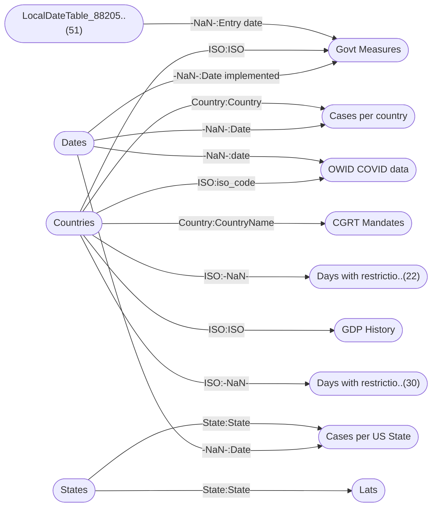

----

[Home](./index.md) > [COVID Bakeoff.pbix](COVID%20Bakeoff.pbix_dmv.md)

| [Information](#information) | [Model information](#model-information) | [Model relationships](#model-relationships) | [Business objects](#business-objects) | [Measures](#measures) | [Relationships](#relationships) | [Hierarchies](#hierarchies) | [Columns](#columns) |

----

# Information

Documentation for file **COVID Bakeoff.pbix**.

# Model information

| Param  | Value  |
|---|---|
| **Analyzed pbix file name** | `COVID Bakeoff.pbix` | 
| **Catalog name** | `0db9b13a-5816-4cee-bea0-0783d427df77` | 
| **Port** | `57771`|
| **Description** | `-NaN-` | 
| **Date modified** | `2024-01-04T23:03:45` | 
| **Compatibility level** | `1567` | 

[Up](#information)

# Model relationships

[Up](#information)

# Business objects

| ID | NAME | DESCRIPTION | 
|----|------|-------------|
| 9434 | Countries | n/a |
| 12586 | States | n/a |
| 13949 | Cases per US State | n/a |
| 14538 | Dates | n/a |
| 27375 | OWID COVID data | n/a |
| 46487 | Days with restrictions grouped | n/a |
| 48648 | GDP History | n/a |

[Up](#information)

# Measures

<table>
    <tr>
        <th> ID </th><th> TABLE </th><th> NAME </th><th> DESCRIPTION </th><th> EXPRESSION </th><th> IS_HIDDEN </th><th> STATE </th>
    </tr>
<tr>
        <td> 19 </td><td> DateTableTemplate_3f..(54) </td><td>  </td><td> n/a </td><td> <code> YEAR([Date]) </code></td><td> True </td><td>  1 </td> 
    </tr>
<tr>
        <td> 20 </td><td> DateTableTemplate_3f..(54) </td><td>  </td><td> n/a </td><td> <code> MONTH([Date]) </code></td><td> True </td><td>  1 </td> 
    </tr>
<tr>
        <td> 21 </td><td> DateTableTemplate_3f..(54) </td><td>  </td><td> n/a </td><td> <code> FORMAT([Date], "MMMM") </code></td><td> True </td><td>  1 </td> 
    </tr>
<tr>
        <td> 22 </td><td> DateTableTemplate_3f..(54) </td><td>  </td><td> n/a </td><td> <code> INT(([MonthNo] + 2) / 3) </code></td><td> True </td><td>  1 </td> 
    </tr>
<tr>
        <td> 23 </td><td> DateTableTemplate_3f..(54) </td><td>  </td><td> n/a </td><td> <code> "Qtr " & [QuarterNo] </code></td><td> True </td><td>  1 </td> 
    </tr>
<tr>
        <td> 24 </td><td> DateTableTemplate_3f..(54) </td><td>  </td><td> n/a </td><td> <code> DAY([Date]) </code></td><td> True </td><td>  1 </td> 
    </tr>
<tr>
        <td> 9694 </td><td> Govt Measures </td><td>  </td><td> n/a </td><td> <code> CALCULATE(MAX('OWID COVID data'[New vaccinations smoothed per million]), RELATEDTABLE('OWID COVID data')) </code></td><td> True </td><td>  1 </td> 
    </tr>
<tr>
        <td> 13270 </td><td> Govt Measures </td><td>  </td><td> n/a </td><td> <code> CALCULATE(AVERAGE('Cases per country'[IncrementalCases]), RELATEDTABLE('Cases per country')) </code></td><td> True </td><td>  1 </td> 
    </tr>
<tr>
        <td> 20747 </td><td> Govt Measures </td><td>  </td><td> n/a </td><td> <code> CALCULATE(AVERAGE('Cases per country'[IncrementalCases]), FILTER(Dates, Dates[Date] = 'Govt Measures'[Date implemented]+60)) - 'Govt Measures'[Daily Cases When Implemented] </code></td><td> True </td><td>  1 </td> 
    </tr>
<tr>
        <td> 21636 </td><td> Govt Measures </td><td>  </td><td> n/a </td><td> <code> SWITCH(
  TRUE,
  ISBLANK('Govt Measures'[NON_COMPLIANCE]),
  "(Blank)",
  'Govt Measures'[NON_COMPLIANCE] IN {"Arrest/Detention",
    "Up to detention"},
  "Arrest",
  'Govt Measures'[NON_COMPLIANCE] IN {"Deportation",
    "Refusal to enter the country"},
  "Deportation/entry refused",
  'Govt Measures'[NON_COMPLIANCE] IN {"Fines"},
  "Fines",
  'Govt Measures'[NON_COMPLIANCE] IN {"Legal",
    "Legal action"},
  "Legal",
  'Govt Measures'[NON_COMPLIANCE] IN {"Not applicable",
    "Not Available"},
  "Not applicable",
  'Govt Measures'[NON_COMPLIANCE]
) </code></td><td> True </td><td>  1 </td> 
    </tr>
<tr>
        <td> 2926 </td><td> LocalDateTable_88205..(51) </td><td>  </td><td> n/a </td><td> <code> YEAR([Date]) </code></td><td> True </td><td>  1 </td> 
    </tr>
<tr>
        <td> 2927 </td><td> LocalDateTable_88205..(51) </td><td>  </td><td> n/a </td><td> <code> MONTH([Date]) </code></td><td> True </td><td>  1 </td> 
    </tr>
<tr>
        <td> 2928 </td><td> LocalDateTable_88205..(51) </td><td>  </td><td> n/a </td><td> <code> FORMAT([Date], "MMMM") </code></td><td> True </td><td>  1 </td> 
    </tr>
<tr>
        <td> 2929 </td><td> LocalDateTable_88205..(51) </td><td>  </td><td> n/a </td><td> <code> INT(([MonthNo] + 2) / 3) </code></td><td> True </td><td>  1 </td> 
    </tr>
<tr>
        <td> 2930 </td><td> LocalDateTable_88205..(51) </td><td>  </td><td> n/a </td><td> <code> "Qtr " & [QuarterNo] </code></td><td> True </td><td>  1 </td> 
    </tr>
<tr>
        <td> 2931 </td><td> LocalDateTable_88205..(51) </td><td>  </td><td> n/a </td><td> <code> DAY([Date]) </code></td><td> True </td><td>  1 </td> 
    </tr>
<tr>
        <td> 22186 </td><td> States </td><td>  </td><td> n/a </td><td> <code> CALCULATE(MAX('Cases per US State'[CumulativeCases])) </code></td><td> True </td><td>  1 </td> 
    </tr>
<tr>
        <td> 22241 </td><td> States </td><td>  </td><td> n/a </td><td> <code> States[State] </code></td><td> True </td><td>  1 </td> 
    </tr>
<tr>
        <td> 37476 </td><td> States </td><td>  </td><td> n/a </td><td> <code> SWITCH(
  TRUE,
  ISBLANK('States'[State]),
  "(Blank)",
  'States'[State] IN {"American Samoa",
    "Guam",
    "Marshall Islands",
    "Puerto Rico",
    "Virgin Islands"},
  "Islands and Territories",
  'States'[State] IN {"Alabama",
    "Alaska",
    "Arizona",
    "Arkansas",
    "California",
    "Colorado",
    "Connecticut",
    "Delaware",
    "District of Columbia",
    "Florida",
    "Georgia",
    "Hawaii",
    "Idaho",
    "Illinois",
    "Indiana",
    "Iowa",
    "Kansas",
    "Kentucky",
    "Louisiana",
    "Maine",
    "Maryland",
    "Massachusetts",
    "Michigan",
    "Minnesota",
    "Mississippi",
    "Missouri",
    "Montana",
    "Nebraska",
    "Nevada",
    "New Hampshire",
    "New Jersey",
    "New Mexico",
    "New York",
    "North Carolina",
    "North Dakota",
    "Ohio",
    "Oklahoma",
    "Oregon",
    "Pennsylvania",
    "Rhode Island",
    "South Carolina",
    "South Dakota",
    "Tennessee",
    "Texas",
    "Utah",
    "Vermont",
    "Virginia",
    "Washington",
    "West Virginia",
    "Wisconsin",
    "Wyoming"},
  "Main states",
  'States'[State]
) </code></td><td> True </td><td>  1 </td> 
    </tr>
<tr>
        <td> 58092 </td><td> States </td><td>  </td><td> n/a </td><td> <code> SWITCH(States[State], "New Hampshire", 1, "New Mexico", 2, "Connecticut", 3, "Rhode Island", 4, "Massachusetts", 5, 7) </code></td><td> True </td><td>  1 </td> 
    </tr>
<tr>
        <td> 58247 </td><td> States </td><td>  </td><td> n/a </td><td> <code> SWITCH(
  TRUE,
  ISBLANK('States'[State]),
  "(Blank)",
  'States'[State] IN {"New Mexico",
    "Rhode Island",
    "South Dakota"},
  "Fully vaccinated",
  'States'[State] IN {"Connecticut",
    "Massachusetts",
    "New Hampshire"},
  "One dose",
  "Other"
) </code></td><td> True </td><td>  1 </td> 
    </tr>
<tr>
        <td> 60480 </td><td> States </td><td>  </td><td> n/a </td><td> <code> IF(States[Average Temperature ] < 67.7, "Below", "Above") </code></td><td> True </td><td>  1 </td> 
    </tr>
<tr>
        <td> 60577 </td><td> States </td><td>  </td><td> n/a </td><td> <code> SWITCH(
  TRUE,
  ISBLANK('States'[State]),
  "(Blank)",
  'States'[State] IN {"Alaska",
    "Colorado",
    "Connecticut",
    "Delaware",
    "District of Columbia",
    "Idaho",
    "Illinois",
    "Indiana",
    "Iowa",
    "Maine",
    "Marshall Islands",
    "Maryland",
    "Massachusetts",
    "Michigan",
    "Minnesota",
    "Missouri",
    "Montana",
    "Nebraska",
    "New Hampshire",
    "New Jersey",
    "New York",
    "North Dakota",
    "Ohio",
    "Oklahoma",
    "Oregon",
    "Pennsylvania",
    "Puerto Rico",
    "Rhode Island",
    "South Dakota",
    "Vermont",
    "Virgin Islands",
    "Virginia",
    "Washington",
    "West Virginia",
    "Wisconsin",
    "Wyoming"},
  "Cooler",
  'States'[State] IN {"Alabama",
    "American Samoa",
    "Arizona",
    "Arkansas",
    "California",
    "Florida",
    "Georgia",
    "Guam",
    "Hawaii",
    "Kansas",
    "Kentucky",
    "Louisiana",
    "Mississippi",
    "Nevada",
    "New Mexico",
    "North Carolina",
    "South Carolina",
    "Tennessee",
    "Texas",
    "Utah"},
  "Hotter",
  'States'[State]
) </code></td><td> False </td><td>  1 </td> 
    </tr>
<tr>
        <td> 58199 </td><td> Dates </td><td>  </td><td> n/a </td><td> <code> WEEKNUM(Dates[Date]) </code></td><td> False </td><td>  1 </td> 
    </tr>
<tr>
        <td> 58303 </td><td> Dates </td><td>  </td><td> n/a </td><td> <code> (Dates[Date] - WEEKDAY(Dates[Date]))+1 </code></td><td> True </td><td>  1 </td> 
    </tr>
</table>

[Up](#information)

# Relationships 

| ID | FROM_TABLE | TO_TABLE | FROM:TO CARDINALITY | NAME | IS_ACTIVE  |
|----|------------|----------|---------------------|------|------------|
| 2900 | Govt Measures[Entry date] | LocalDateTable_88205..(51)[-NaN-] | 2:1 | e1e86f08-cc1c-48f2-9aba-4fddf579fca6 | True |
| 9525 | Govt Measures[ISO] | Countries[ISO] | 2:1 | 21e6f44d-7bfc-44b6-90f5-c5b12555f93c | True |
| 13253 | Cases per country[Country] | Countries[Country] | 2:1 | 372580c9-5cdd-42e1-b7df-a310955cfc7f | True |
| 14521 | Cases per US State[State] | States[State] | 2:1 | c14fb59b-c328-4d1c-a16f-3a6785d951ee | True |
| 14943 | Cases per US State[Date] | Dates[-NaN-] | 2:1 | 11823667-7f2f-429a-b8ac-6dcac9e557f6 | True |
| 15000 | Cases per country[Date] | Dates[-NaN-] | 2:1 | 86a185cb-34f7-4885-84cf-00e80c51d513 | True |
| 16218 | Govt Measures[Date implemented] | Dates[-NaN-] | 2:1 | 7b9dc434-4b9a-44b4-a37e-9c1070c8f7aa | True |
| 30458 | OWID COVID data[date] | Dates[-NaN-] | 2:1 | 1957136d-e5f3-41f9-882f-43cf3fee2558 | True |
| 30492 | OWID COVID data[iso_code] | Countries[ISO] | 2:1 | 01f08640-cf1f-411c-a63c-59944b68ec84 | True |
| 43951 | CGRT Mandates[CountryName] | Countries[Country] | 2:1 | 9472a507-8991-430e-83d6-a8656c4d63f0 | True |
| 46831 | Days with restrictio..(22)[-NaN-] | Countries[ISO] | 2:1 | 522630e3-279d-4eb5-84b0-619f26212b0c | True |
| 48840 | GDP History[ISO] | Countries[ISO] | 2:1 | e784db96-1975-42e1-ba75-bd9bea95df5b | True |
| 49693 | Days with restrictio..(30)[-NaN-] | Countries[ISO] | 2:1 | c6a5f2eb-1ee1-418e-b460-a95554874641 | True |
| 60441 | Lats[State] | States[State] | 1:1 | 865d7d72-6b99-4118-8e48-dc22864cd6c5 | True |

[Up](#information)

# Hierarchies 

| ID | TABLE | NAME | DESCRIPTION  | IS_HIDDEN | 
|----|----------|------|--------------|-----------|
| 27 |DateTableTemplate_3f..(54) | Date Hierarchy | n/a | False | 
| 2937 |LocalDateTable_88205..(51) | Date Hierarchy | n/a | False | 

[Up](#information)

# Columns 

<table>
    <tr>
        <th> ID </th><th> TABLE </th><th> EXPLICIT_NAME </th><th> DESCRIPTION </th><th> IS_HIDDEN </th><th> EXPRESSION </th>
    </tr>
<tr>
        <td> 9437 </td><td> Countries </td><td> ISO </td><td> n/a </td><td> False </td><td><code> n/a </code></td>
    </tr>

<tr>
        <td> 9438 </td><td> Countries </td><td> Country </td><td> n/a </td><td> False </td><td><code> n/a </code></td>
    </tr>

<tr>
        <td> 26883 </td><td> Countries </td><td> Continent </td><td> n/a </td><td> False </td><td><code> n/a </code></td>
    </tr>

<tr>
        <td> 32798 </td><td> Countries </td><td> Population </td><td> n/a </td><td> False </td><td><code> n/a </code></td>
    </tr>

<tr>
        <td> 32807 </td><td> Countries </td><td> Growth Rate </td><td> n/a </td><td> False </td><td><code> n/a </code></td>
    </tr>

<tr>
        <td> 32818 </td><td> Countries </td><td> Flag </td><td> n/a </td><td> False </td><td><code> n/a </code></td>
    </tr>

<tr>
        <td> 32829 </td><td> Countries </td><td> Area (km2) </td><td> n/a </td><td> False </td><td><code> n/a </code></td>
    </tr>

<tr>
        <td> 32840 </td><td> Countries </td><td> Density </td><td> n/a </td><td> False </td><td><code> n/a </code></td>
    </tr>

<tr>
        <td> 12589 </td><td> States </td><td> State </td><td> n/a </td><td> False </td><td><code> n/a </code></td>
    </tr>

<tr>
        <td> 41766 </td><td> States </td><td> Flag </td><td> n/a </td><td> False </td><td><code> n/a </code></td>
    </tr>

<tr>
        <td> 60577 </td><td> States </td><td> March Temperatures </td><td> n/a </td><td> False </td><td><code> SWITCH(
  TRUE,
  ISBLANK('States'[State]),
  "(Blank)",
  'States'[State] IN {"Alaska",
    "Colorado",
    "Connecticut",
    "Delaware",
    "District of Columbia",
    "Idaho",
    "Illinois",
    "Indiana",
    "Iowa",
    "Maine",
    "Marshall Islands",
    "Maryland",
    "Massachusetts",
    "Michigan",
    "Minnesota",
    "Missouri",
    "Montana",
    "Nebraska",
    "New Hampshire",
    "New Jersey",
    "New York",
    "North Dakota",
    "Ohio",
    "Oklahoma",
    "Oregon",
    "Pennsylvania",
    "Puerto Rico",
    "Rhode Island",
    "South Dakota",
    "Vermont",
    "Virgin Islands",
    "Virginia",
    "Washington",
    "West Virginia",
    "Wisconsin",
    "Wyoming"},
  "Cooler",
  'States'[State] IN {"Alabama",
    "American Samoa",
    "Arizona",
    "Arkansas",
    "California",
    "Florida",
    "Georgia",
    "Guam",
    "Hawaii",
    "Kansas",
    "Kentucky",
    "Louisiana",
    "Mississippi",
    "Nevada",
    "New Mexico",
    "North Carolina",
    "South Carolina",
    "Tennessee",
    "Texas",
    "Utah"},
  "Hotter",
  'States'[State]
) </code></td>
    </tr>

<tr>
        <td> 12652 </td><td> Cases per country </td><td> Key </td><td> n/a </td><td> False </td><td><code> n/a </code></td>
    </tr>

<tr>
        <td> 12653 </td><td> Cases per country </td><td> GeoLevel </td><td> n/a </td><td> False </td><td><code> n/a </code></td>
    </tr>

<tr>
        <td> 12654 </td><td> Cases per country </td><td> Date </td><td> n/a </td><td> False </td><td><code> n/a </code></td>
    </tr>

<tr>
        <td> 12666 </td><td> Cases per country </td><td> Country </td><td> n/a </td><td> False </td><td><code> n/a </code></td>
    </tr>

<tr>
        <td> 13956 </td><td> Cases per US State </td><td> Key </td><td> n/a </td><td> False </td><td><code> n/a </code></td>
    </tr>

<tr>
        <td> 13957 </td><td> Cases per US State </td><td> Date </td><td> n/a </td><td> False </td><td><code> n/a </code></td>
    </tr>

<tr>
        <td> 13965 </td><td> Cases per US State </td><td> CumulativeCases </td><td> n/a </td><td> False </td><td><code> n/a </code></td>
    </tr>

<tr>
        <td> 13966 </td><td> Cases per US State </td><td> CumulativeDeaths </td><td> n/a </td><td> False </td><td><code> n/a </code></td>
    </tr>

<tr>
        <td> 13969 </td><td> Cases per US State </td><td> State </td><td> n/a </td><td> False </td><td><code> n/a </code></td>
    </tr>

<tr>
        <td> 36592 </td><td> Cases per US State </td><td> Incremental cases </td><td> n/a </td><td> False </td><td><code> n/a </code></td>
    </tr>

<tr>
        <td> 36601 </td><td> Cases per US State </td><td> IncrementalDeaths </td><td> n/a </td><td> False </td><td><code> n/a </code></td>
    </tr>

<tr>
        <td> 36612 </td><td> Cases per US State </td><td> total_vaccinations </td><td> n/a </td><td> False </td><td><code> n/a </code></td>
    </tr>

<tr>
        <td> 36623 </td><td> Cases per US State </td><td> total_distributed </td><td> n/a </td><td> False </td><td><code> n/a </code></td>
    </tr>

<tr>
        <td> 36634 </td><td> Cases per US State </td><td> people_vaccinated </td><td> n/a </td><td> False </td><td><code> n/a </code></td>
    </tr>

<tr>
        <td> 36656 </td><td> Cases per US State </td><td> total_vaccinations_p..(30) </td><td> n/a </td><td> False </td><td><code> n/a </code></td>
    </tr>

<tr>
        <td> 36667 </td><td> Cases per US State </td><td> people_fully_vaccina..(23) </td><td> n/a </td><td> False </td><td><code> n/a </code></td>
    </tr>

<tr>
        <td> 36678 </td><td> Cases per US State </td><td> people_vaccinated_pe..(29) </td><td> n/a </td><td> False </td><td><code> n/a </code></td>
    </tr>

<tr>
        <td> 36689 </td><td> Cases per US State </td><td> distributed_per_hund..(23) </td><td> n/a </td><td> False </td><td><code> n/a </code></td>
    </tr>

<tr>
        <td> 36700 </td><td> Cases per US State </td><td> daily_vaccinations_r..(22) </td><td> n/a </td><td> False </td><td><code> n/a </code></td>
    </tr>

<tr>
        <td> 36711 </td><td> Cases per US State </td><td> daily_vaccinations </td><td> n/a </td><td> False </td><td><code> n/a </code></td>
    </tr>

<tr>
        <td> 36722 </td><td> Cases per US State </td><td> daily_vaccinations_p..(30) </td><td> n/a </td><td> False </td><td><code> n/a </code></td>
    </tr>

<tr>
        <td> 36733 </td><td> Cases per US State </td><td> share_doses_used </td><td> n/a </td><td> False </td><td><code> n/a </code></td>
    </tr>

<tr>
        <td> 14589 </td><td> Dates </td><td> -NaN- </td><td> n/a </td><td> False </td><td><code> n/a </code></td>
    </tr>

<tr>
        <td> 58199 </td><td> Dates </td><td> Week Number </td><td> n/a </td><td> False </td><td><code> WEEKNUM(Dates[Date]) </code></td>
    </tr>

<tr>
        <td> 27382 </td><td> OWID COVID data </td><td> iso_code </td><td> n/a </td><td> False </td><td><code> n/a </code></td>
    </tr>

<tr>
        <td> 27384 </td><td> OWID COVID data </td><td> location </td><td> n/a </td><td> False </td><td><code> n/a </code></td>
    </tr>

<tr>
        <td> 27396 </td><td> OWID COVID data </td><td> Total deaths </td><td> n/a </td><td> False </td><td><code> n/a </code></td>
    </tr>

<tr>
        <td> 27397 </td><td> OWID COVID data </td><td> New deaths </td><td> n/a </td><td> False </td><td><code> n/a </code></td>
    </tr>

<tr>
        <td> 27398 </td><td> OWID COVID data </td><td> New deaths smoothed </td><td> n/a </td><td> False </td><td><code> n/a </code></td>
    </tr>

<tr>
        <td> 27402 </td><td> OWID COVID data </td><td> Total deaths per mil..(24) </td><td> n/a </td><td> False </td><td><code> n/a </code></td>
    </tr>

<tr>
        <td> 27403 </td><td> OWID COVID data </td><td> New deaths per milli..(22) </td><td> n/a </td><td> False </td><td><code> n/a </code></td>
    </tr>

<tr>
        <td> 27404 </td><td> OWID COVID data </td><td> New deaths smoothed ..(31) </td><td> n/a </td><td> False </td><td><code> n/a </code></td>
    </tr>

<tr>
        <td> 27405 </td><td> OWID COVID data </td><td> Reproduction rate </td><td> n/a </td><td> False </td><td><code> n/a </code></td>
    </tr>

<tr>
        <td> 27406 </td><td> OWID COVID data </td><td> ICU patients </td><td> n/a </td><td> False </td><td><code> n/a </code></td>
    </tr>

<tr>
        <td> 27407 </td><td> OWID COVID data </td><td> ICU patients per mil..(24) </td><td> n/a </td><td> False </td><td><code> n/a </code></td>
    </tr>

<tr>
        <td> 27408 </td><td> OWID COVID data </td><td> Hospital patients </td><td> n/a </td><td> False </td><td><code> n/a </code></td>
    </tr>

<tr>
        <td> 27409 </td><td> OWID COVID data </td><td> Hospital patients pe..(29) </td><td> n/a </td><td> False </td><td><code> n/a </code></td>
    </tr>

<tr>
        <td> 27410 </td><td> OWID COVID data </td><td> Weekly ICU admission..(21) </td><td> n/a </td><td> False </td><td><code> n/a </code></td>
    </tr>

<tr>
        <td> 27411 </td><td> OWID COVID data </td><td> Weekly ICU admissisi..(35) </td><td> n/a </td><td> False </td><td><code> n/a </code></td>
    </tr>

<tr>
        <td> 27412 </td><td> OWID COVID data </td><td> weekly_hosp_admissio..(22) </td><td> n/a </td><td> False </td><td><code> n/a </code></td>
    </tr>

<tr>
        <td> 27413 </td><td> OWID COVID data </td><td> Weekly hospital admi..(38) </td><td> n/a </td><td> False </td><td><code> n/a </code></td>
    </tr>

<tr>
        <td> 27414 </td><td> OWID COVID data </td><td> new_tests </td><td> n/a </td><td> False </td><td><code> n/a </code></td>
    </tr>

<tr>
        <td> 27415 </td><td> OWID COVID data </td><td> total_tests </td><td> n/a </td><td> False </td><td><code> n/a </code></td>
    </tr>

<tr>
        <td> 27416 </td><td> OWID COVID data </td><td> Total tests per thou..(24) </td><td> n/a </td><td> False </td><td><code> n/a </code></td>
    </tr>

<tr>
        <td> 27417 </td><td> OWID COVID data </td><td> New tests per thousa..(23) </td><td> n/a </td><td> False </td><td><code> n/a </code></td>
    </tr>

<tr>
        <td> 27418 </td><td> OWID COVID data </td><td> new_tests_smoothed </td><td> n/a </td><td> False </td><td><code> n/a </code></td>
    </tr>

<tr>
        <td> 27419 </td><td> OWID COVID data </td><td> new_tests_smoothed_p..(31) </td><td> n/a </td><td> False </td><td><code> n/a </code></td>
    </tr>

<tr>
        <td> 27420 </td><td> OWID COVID data </td><td> positive_rate </td><td> n/a </td><td> False </td><td><code> n/a </code></td>
    </tr>

<tr>
        <td> 27422 </td><td> OWID COVID data </td><td> tests_units </td><td> n/a </td><td> False </td><td><code> n/a </code></td>
    </tr>

<tr>
        <td> 27423 </td><td> OWID COVID data </td><td> total_vaccinations </td><td> n/a </td><td> False </td><td><code> n/a </code></td>
    </tr>

<tr>
        <td> 27424 </td><td> OWID COVID data </td><td> people_vaccinated </td><td> n/a </td><td> False </td><td><code> n/a </code></td>
    </tr>

<tr>
        <td> 27425 </td><td> OWID COVID data </td><td> people_fully_vaccina..(23) </td><td> n/a </td><td> False </td><td><code> n/a </code></td>
    </tr>

<tr>
        <td> 27426 </td><td> OWID COVID data </td><td> new_vaccinations </td><td> n/a </td><td> False </td><td><code> n/a </code></td>
    </tr>

<tr>
        <td> 27427 </td><td> OWID COVID data </td><td> new_vaccinations_smo..(25) </td><td> n/a </td><td> False </td><td><code> n/a </code></td>
    </tr>

<tr>
        <td> 27428 </td><td> OWID COVID data </td><td> Total vaccinations p..(30) </td><td> n/a </td><td> False </td><td><code> n/a </code></td>
    </tr>

<tr>
        <td> 27429 </td><td> OWID COVID data </td><td> People vaccinated pe..(29) </td><td> n/a </td><td> False </td><td><code> n/a </code></td>
    </tr>

<tr>
        <td> 27430 </td><td> OWID COVID data </td><td> People fully vaccina..(35) </td><td> n/a </td><td> False </td><td><code> n/a </code></td>
    </tr>

<tr>
        <td> 27431 </td><td> OWID COVID data </td><td> New vaccinations smo..(37) </td><td> n/a </td><td> False </td><td><code> n/a </code></td>
    </tr>

<tr>
        <td> 27432 </td><td> OWID COVID data </td><td> stringency_index </td><td> n/a </td><td> False </td><td><code> n/a </code></td>
    </tr>

<tr>
        <td> 27433 </td><td> OWID COVID data </td><td> Population </td><td> n/a </td><td> False </td><td><code> n/a </code></td>
    </tr>

<tr>
        <td> 27434 </td><td> OWID COVID data </td><td> Population density </td><td> n/a </td><td> False </td><td><code> n/a </code></td>
    </tr>

<tr>
        <td> 27435 </td><td> OWID COVID data </td><td> Median age </td><td> n/a </td><td> False </td><td><code> n/a </code></td>
    </tr>

<tr>
        <td> 27437 </td><td> OWID COVID data </td><td> Aged 70 and old </td><td> n/a </td><td> False </td><td><code> n/a </code></td>
    </tr>

<tr>
        <td> 27438 </td><td> OWID COVID data </td><td> GDP per capita </td><td> n/a </td><td> False </td><td><code> n/a </code></td>
    </tr>

<tr>
        <td> 27439 </td><td> OWID COVID data </td><td> Extreme poverty </td><td> n/a </td><td> False </td><td><code> n/a </code></td>
    </tr>

<tr>
        <td> 27440 </td><td> OWID COVID data </td><td> Cardiovascular death..(25) </td><td> n/a </td><td> False </td><td><code> n/a </code></td>
    </tr>

<tr>
        <td> 27441 </td><td> OWID COVID data </td><td> Diabetes prevalence </td><td> n/a </td><td> False </td><td><code> n/a </code></td>
    </tr>

<tr>
        <td> 27442 </td><td> OWID COVID data </td><td> Female smoking rate </td><td> n/a </td><td> False </td><td><code> n/a </code></td>
    </tr>

<tr>
        <td> 27443 </td><td> OWID COVID data </td><td> Male smoking rate </td><td> n/a </td><td> False </td><td><code> n/a </code></td>
    </tr>

<tr>
        <td> 27444 </td><td> OWID COVID data </td><td> Handwashing faciliti..(32) </td><td> n/a </td><td> False </td><td><code> n/a </code></td>
    </tr>

<tr>
        <td> 27445 </td><td> OWID COVID data </td><td> Hospital beds per th..(26) </td><td> n/a </td><td> False </td><td><code> n/a </code></td>
    </tr>

<tr>
        <td> 27446 </td><td> OWID COVID data </td><td> Life expectancy </td><td> n/a </td><td> False </td><td><code> n/a </code></td>
    </tr>

<tr>
        <td> 27447 </td><td> OWID COVID data </td><td> human_development_in..(23) </td><td> n/a </td><td> False </td><td><code> n/a </code></td>
    </tr>

<tr>
        <td> 47009 </td><td> Days with restrictio..(30) </td><td> -NaN- </td><td> n/a </td><td> False </td><td><code> n/a </code></td>
    </tr>

<tr>
        <td> 47750 </td><td> Days with restrictio..(30) </td><td> -NaN- </td><td> n/a </td><td> False </td><td><code> n/a </code></td>
    </tr>

<tr>
        <td> 47752 </td><td> Days with restrictio..(30) </td><td> -NaN- </td><td> n/a </td><td> False </td><td><code> n/a </code></td>
    </tr>

<tr>
        <td> 47754 </td><td> Days with restrictio..(30) </td><td> -NaN- </td><td> n/a </td><td> False </td><td><code> n/a </code></td>
    </tr>

<tr>
        <td> 47756 </td><td> Days with restrictio..(30) </td><td> -NaN- </td><td> n/a </td><td> False </td><td><code> n/a </code></td>
    </tr>

<tr>
        <td> 47758 </td><td> Days with restrictio..(30) </td><td> -NaN- </td><td> n/a </td><td> False </td><td><code> n/a </code></td>
    </tr>

<tr>
        <td> 47760 </td><td> Days with restrictio..(30) </td><td> -NaN- </td><td> n/a </td><td> False </td><td><code> n/a </code></td>
    </tr>

<tr>
        <td> 47764 </td><td> Days with restrictio..(30) </td><td> -NaN- </td><td> n/a </td><td> False </td><td><code> n/a </code></td>
    </tr>

<tr>
        <td> 47766 </td><td> Days with restrictio..(30) </td><td> -NaN- </td><td> n/a </td><td> False </td><td><code> n/a </code></td>
    </tr>

<tr>
        <td> 47768 </td><td> Days with restrictio..(30) </td><td> -NaN- </td><td> n/a </td><td> False </td><td><code> n/a </code></td>
    </tr>

<tr>
        <td> 49686 </td><td> Days with restrictio..(30) </td><td> -NaN- </td><td> n/a </td><td> False </td><td><code> n/a </code></td>
    </tr>

<tr>
        <td> 48651 </td><td> GDP History </td><td> ISO </td><td> n/a </td><td> False </td><td><code> n/a </code></td>
    </tr>

<tr>
        <td> 48652 </td><td> GDP History </td><td> Country </td><td> n/a </td><td> False </td><td><code> n/a </code></td>
    </tr>

<tr>
        <td> 48653 </td><td> GDP History </td><td> Year </td><td> n/a </td><td> False </td><td><code> n/a </code></td>
    </tr>

<tr>
        <td> 48654 </td><td> GDP History </td><td> GDP (bn) </td><td> n/a </td><td> False </td><td><code> n/a </code></td>
    </tr>

<tr>
        <td> 48655 </td><td> GDP History </td><td> % change </td><td> n/a </td><td> False </td><td><code> n/a </code></td>
    </tr>

<tr>
        <td> 60612 </td><td> Lats </td><td> Average Temperature  </td><td> n/a </td><td> False </td><td><code> n/a </code></td>
    </tr>

</table>

[Up](#information)

----

Generated at 05.01.2024 01:07:18 by <a href='https://github.com/dop12/pbix_doc'>PBIX DOC PROJECT</a> Git version: a7f95a4

