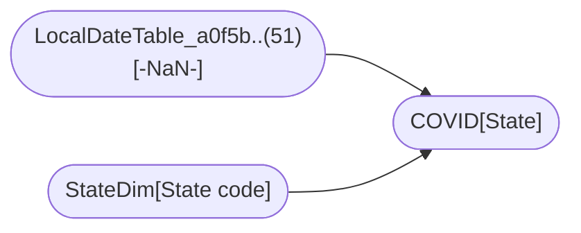

----

[Home](./index.md) > [COVID-19 US Tracking Sample.pbix](COVID-19%20US%20Tracking%20Sample.pbix.md)

| [Information](#information) | [Model information](#model-information) | [Model relationships](#model-relationships) | [Business objects](#business-objects) | [Measures](#measures) | [Relationships](#relationships) | [Hierarchies](#hierarchies) | [Columns](#columns) | [Report sections](#report-sections) |

----

# Information

Documentation for file **COVID-19 US Tracking Sample.pbix**.

# Model information

| Param  | Value  |
|---|---|
| **Analyzed pbix file name** | `COVID-19 US Tracking Sample.pbix` | 
| **Catalog name** | `3b159e94-a217-4152-9383-abe7c04f0a5c` | 
| **Port** | `60993`|
| **Description** | `-NaN-` | 
| **Date modified** | `2021-07-20T18:58:23` | 
| **Compatibility level** | `1550` | 

[Up](#)
# Model relationships

[Up](#)

# Business objects

| ID | NAME | DESCRIPTION | 
|----|------|-------------|
| 19 | COVID | n/a |
| 22 | StateDim | n/a |
| 25 | Table | n/a |
| 31 | COVID measures | n/a |

[Up](#)
# Measures

<table>
    <tr>
        <th> ID </th><th> TABLE </th><th> NAME </th><th> DESCRIPTION </th><th> EXPRESSION </th><th> IS_HIDDEN </th><th> STATE </th>
    </tr>
<tr>
        <td> 50 </td><td> DateTableTemplate_fe..(54) </td><td>  </td><td> n/a </td><td> <code> YEAR([Date]) </code></td><td> True </td><td>  1 </td> 
    </tr>
<tr>
        <td> 51 </td><td> DateTableTemplate_fe..(54) </td><td>  </td><td> n/a </td><td> <code> MONTH([Date]) </code></td><td> True </td><td>  1 </td> 
    </tr>
<tr>
        <td> 52 </td><td> DateTableTemplate_fe..(54) </td><td>  </td><td> n/a </td><td> <code> FORMAT([Date], "MMMM") </code></td><td> True </td><td>  1 </td> 
    </tr>
<tr>
        <td> 53 </td><td> DateTableTemplate_fe..(54) </td><td>  </td><td> n/a </td><td> <code> INT(([MonthNo] + 2) / 3) </code></td><td> True </td><td>  1 </td> 
    </tr>
<tr>
        <td> 54 </td><td> DateTableTemplate_fe..(54) </td><td>  </td><td> n/a </td><td> <code> "Qtr " & [QuarterNo] </code></td><td> True </td><td>  1 </td> 
    </tr>
<tr>
        <td> 55 </td><td> DateTableTemplate_fe..(54) </td><td>  </td><td> n/a </td><td> <code> DAY([Date]) </code></td><td> True </td><td>  1 </td> 
    </tr>
<tr>
        <td> 69 </td><td> COVID </td><td>  </td><td> n/a </td><td> <code> 'COVID'[County Name] & ", " & 'COVID'[State] </code></td><td> False </td><td>  1 </td> 
    </tr>
<tr>
        <td> 74 </td><td> COVID </td><td>  </td><td> n/a </td><td> <code> 
VAR __CountyName = 'COVID'[County Name]
VAR __State = 'COVID'[State]
VAR __Yesterday =  DATEADD(COVID[Date],-1,DAY)
VAR __TodaysCases = 'COVID'[Cases]

RETURN  __TodaysCases - CALCULATE(
    SUM('COVID'[Cases]) , 
    FILTER(
        COVID, 
        COVID[Date] = __Yesterday &&
        COVID[County Name] = __CountyName &&
        COVID[State] = __State
    )
) + 0 </code></td><td> False </td><td>  1 </td> 
    </tr>
<tr>
        <td> 75 </td><td> COVID </td><td>  </td><td> n/a </td><td> <code> 
VAR __CountyName = 'COVID'[County Name]
VAR __State = 'COVID'[State]
VAR __Yesterday =  DATEADD(COVID[Date],-1,DAY)
VAR __TodaysDeaths = 'COVID'[Deaths]

RETURN  __TodaysDeaths - CALCULATE(
    SUM('COVID'[Deaths]) , 
    FILTER(
        COVID, 
        COVID[Date] = __Yesterday &&
        COVID[County Name] = __CountyName &&
        COVID[State] = __State
    )
) + 0 </code></td><td> False </td><td>  1 </td> 
    </tr>
<tr>
        <td> 79 </td><td> StateDim </td><td>  </td><td> n/a </td><td> <code> "USA" </code></td><td> True </td><td>  1 </td> 
    </tr>
<tr>
        <td> 83 </td><td> LocalDateTable_a0f5b..(51) </td><td>  </td><td> n/a </td><td> <code> YEAR([Date]) </code></td><td> True </td><td>  1 </td> 
    </tr>
<tr>
        <td> 84 </td><td> LocalDateTable_a0f5b..(51) </td><td>  </td><td> n/a </td><td> <code> MONTH([Date]) </code></td><td> True </td><td>  1 </td> 
    </tr>
<tr>
        <td> 85 </td><td> LocalDateTable_a0f5b..(51) </td><td>  </td><td> n/a </td><td> <code> FORMAT([Date], "MMMM") </code></td><td> True </td><td>  1 </td> 
    </tr>
<tr>
        <td> 86 </td><td> LocalDateTable_a0f5b..(51) </td><td>  </td><td> n/a </td><td> <code> INT(([MonthNo] + 2) / 3) </code></td><td> True </td><td>  1 </td> 
    </tr>
<tr>
        <td> 87 </td><td> LocalDateTable_a0f5b..(51) </td><td>  </td><td> n/a </td><td> <code> "Qtr " & [QuarterNo] </code></td><td> True </td><td>  1 </td> 
    </tr>
<tr>
        <td> 88 </td><td> LocalDateTable_a0f5b..(51) </td><td>  </td><td> n/a </td><td> <code> DAY([Date]) </code></td><td> True </td><td>  1 </td> 
    </tr>
</table>

[Up](#)
# Relationships 

| ID | FROM_TABLE | TO_TABLE | FROM:TO CARDINALITY | NAME | IS_ACTIVE  |
|----|------------|----------|---------------------|------|------------|
| 34 | COVID[Date] | LocalDateTable_a0f5b..(51)[-NaN-] | 2:1 | 61d3981d-89bc-4f78-b2b7-ab908a42ac71 | True |
| 35 | COVID[State] | StateDim[State code] | 2:1 | 7cd80576-d9a4-4516-aad6-c8e06584bf7c | True |

[Up](#)
# Hierarchies 

| ID | TABLE | NAME | DESCRIPTION  | IS_HIDDEN | 
|----|----------|------|--------------|-----------|
| 119 |DateTableTemplate_fe..(54) | Date Hierarchy | n/a | False | 
| 120 |LocalDateTable_a0f5b..(51) | Date Hierarchy | n/a | False | 

[Up](#)
# Columns 

<table>
    <tr>
        <th> ID </th><th> TABLE </th><th> EXPLICIT_NAME </th><th> DESCRIPTION </th><th> IS_HIDDEN </th><th> EXPRESSION </th>
    </tr>
<tr>
        <td> 62 </td><td> COVID </td><td> County Name </td><td> n/a </td><td> False </td><td><code> n/a </code></td>
    </tr>

<tr>
        <td> 63 </td><td> COVID </td><td> State </td><td> n/a </td><td> False </td><td><code> n/a </code></td>
    </tr>

<tr>
        <td> 65 </td><td> COVID </td><td> Date </td><td> n/a </td><td> False </td><td><code> n/a </code></td>
    </tr>

<tr>
        <td> 66 </td><td> COVID </td><td> Cases </td><td> n/a </td><td> False </td><td><code> n/a </code></td>
    </tr>

<tr>
        <td> 67 </td><td> COVID </td><td> FIPS </td><td> n/a </td><td> False </td><td><code> n/a </code></td>
    </tr>

<tr>
        <td> 68 </td><td> COVID </td><td> Deaths </td><td> n/a </td><td> False </td><td><code> n/a </code></td>
    </tr>

<tr>
        <td> 69 </td><td> COVID </td><td> County </td><td> n/a </td><td> False </td><td><code> 'COVID'[County Name] & ", " & 'COVID'[State] </code></td>
    </tr>

<tr>
        <td> 74 </td><td> COVID </td><td> Daily cases </td><td> n/a </td><td> False </td><td><code> 
VAR __CountyName = 'COVID'[County Name]
VAR __State = 'COVID'[State]
VAR __Yesterday =  DATEADD(COVID[Date],-1,DAY)
VAR __TodaysCases = 'COVID'[Cases]

RETURN  __TodaysCases - CALCULATE(
    SUM('COVID'[Cases]) , 
    FILTER(
        COVID, 
        COVID[Date] = __Yesterday &&
        COVID[County Name] = __CountyName &&
        COVID[State] = __State
    )
) + 0 </code></td>
    </tr>

<tr>
        <td> 75 </td><td> COVID </td><td> Daily deaths </td><td> n/a </td><td> False </td><td><code> 
VAR __CountyName = 'COVID'[County Name]
VAR __State = 'COVID'[State]
VAR __Yesterday =  DATEADD(COVID[Date],-1,DAY)
VAR __TodaysDeaths = 'COVID'[Deaths]

RETURN  __TodaysDeaths - CALCULATE(
    SUM('COVID'[Deaths]) , 
    FILTER(
        COVID, 
        COVID[Date] = __Yesterday &&
        COVID[County Name] = __CountyName &&
        COVID[State] = __State
    )
) + 0 </code></td>
    </tr>

<tr>
        <td> 420484 </td><td> COVID </td><td> StateFIPS </td><td> n/a </td><td> False </td><td><code> n/a </code></td>
    </tr>

<tr>
        <td> 76 </td><td> StateDim </td><td> State </td><td> n/a </td><td> False </td><td><code> n/a </code></td>
    </tr>

<tr>
        <td> 77 </td><td> StateDim </td><td> State code </td><td> n/a </td><td> False </td><td><code> n/a </code></td>
    </tr>

<tr>
        <td> 78 </td><td> StateDim </td><td> US territories </td><td> n/a </td><td> False </td><td><code> n/a </code></td>
    </tr>

<tr>
        <td> 80 </td><td> Table </td><td> Metric </td><td> n/a </td><td> False </td><td><code> n/a </code></td>
    </tr>

<tr>
        <td> 81 </td><td> Table </td><td> Order </td><td> n/a </td><td> False </td><td><code> n/a </code></td>
    </tr>

</table>

# Report sections

## Main

| Param  | Value  |
|---|---|
| **ID** | `1862121` |
| **Name** | `ReportSection0e72bac688f60e7252ea` |
| **Display Name** | `Main` |
| **Filters** | `[]` |
| **Ordinal** | `0` |
| **Visual containers number** | `33` |

[Up](#)

### Container 1db4337d730b5edbef99 

| Param  | Value  |
|---|---|
| **Name:** | `1db4337d730b5edbef99` |
| **Type:** | `['n/a']` |
| **Business objects:**  | `n/a` | 
| **Attributes:**  | n/a | 

[Up](#)

### Container a03d3fe608a1513034fc 

| Param  | Value  |
|---|---|
| **Name:** | `a03d3fe608a1513034fc` |
| **Type:** | `['n/a']` |
| **Business objects:**  | `n/a` | 
| **Attributes:**  | n/a | 

[Up](#)

### Container 925c57e40448405cae83 

| Param  | Value  |
|---|---|
| **Name:** | `925c57e40448405cae83` |
| **Type:** | `clusteredColumnChart` |
| **Business objects:**  | `COVID` | 
| **Attributes:**  | Column: COVID.Date  Aggregation: Sum(COVID.Daily deaths) | 

[Up](#)

### Container f128ef19b8f7c9930025 

| Param  | Value  |
|---|---|
| **Name:** | `f128ef19b8f7c9930025` |
| **Type:** | `['n/a']` |
| **Business objects:**  | `n/a` | 
| **Attributes:**  | n/a | 

[Up](#)

### Container d610e3df7e7aaa9aecf7 

| Param  | Value  |
|---|---|
| **Name:** | `d610e3df7e7aaa9aecf7` |
| **Type:** | `clusteredColumnChart` |
| **Business objects:**  | `COVID` | 
| **Attributes:**  | Column: COVID.Date  Aggregation: Sum(COVID.Daily cases) | 

[Up](#)

### Container b5cd42b677a37417dff5 

| Param  | Value  |
|---|---|
| **Name:** | `b5cd42b677a37417dff5` |
| **Type:** | `['n/a']` |
| **Business objects:**  | `n/a` | 
| **Attributes:**  | n/a | 

[Up](#)

### Container 2733d13e23bb26ccf586 

| Param  | Value  |
|---|---|
| **Name:** | `2733d13e23bb26ccf586` |
| **Type:** | `pivotTable` |
| **Business objects:**  | `COVID measures, StateDim` | 
| **Attributes:**  | Column: StateDim.State  Measure: COVID measures.Total deaths  Measure: COVID measures.Case fatality rate  Column: StateDim.Country  Measure: COVID measures.Total confirmed cases | 

[Up](#)

### Container 6e7309534528324c92a5 

| Param  | Value  |
|---|---|
| **Name:** | `6e7309534528324c92a5` |
| **Type:** | `['n/a']` |
| **Business objects:**  | `n/a` | 
| **Attributes:**  | n/a | 

[Up](#)

### Container 765fab34f553a39f40b2 

| Param  | Value  |
|---|---|
| **Name:** | `765fab34f553a39f40b2` |
| **Type:** | `['n/a']` |
| **Business objects:**  | `n/a` | 
| **Attributes:**  | n/a | 

[Up](#)

### Container 97869c2ae02865855b99 

| Param  | Value  |
|---|---|
| **Name:** | `97869c2ae02865855b99` |
| **Type:** | `['n/a']` |
| **Business objects:**  | `n/a` | 
| **Attributes:**  | n/a | 

[Up](#)

### Container f8fe716025ccbfc5557e 

| Param  | Value  |
|---|---|
| **Name:** | `f8fe716025ccbfc5557e` |
| **Type:** | `shapeMap` |
| **Business objects:**  | `StateDim, COVID measures` | 
| **Attributes:**  | Column: StateDim.State  Measure: COVID measures.Case fatality rate  Measure: COVID measures.Total deaths  Measure: COVID measures.Total confirmed cases | 

[Up](#)

### Container 3638ab3b3629634c6bb0 

| Param  | Value  |
|---|---|
| **Name:** | `3638ab3b3629634c6bb0` |
| **Type:** | `['n/a']` |
| **Business objects:**  | `n/a` | 
| **Attributes:**  | n/a | 

[Up](#)

### Container b3d79ea376363224cb14 

| Param  | Value  |
|---|---|
| **Name:** | `b3d79ea376363224cb14` |
| **Type:** | `['n/a']` |
| **Business objects:**  | `n/a` | 
| **Attributes:**  | n/a | 

[Up](#)

### Container 46e0729e3686fc3939f4 

| Param  | Value  |
|---|---|
| **Name:** | `46e0729e3686fc3939f4` |
| **Type:** | `['n/a']` |
| **Business objects:**  | `n/a` | 
| **Attributes:**  | n/a | 

[Up](#)

### Container 6194f6eac715ea6976f9 

| Param  | Value  |
|---|---|
| **Name:** | `6194f6eac715ea6976f9` |
| **Type:** | `['n/a']` |
| **Business objects:**  | `n/a` | 
| **Attributes:**  | n/a | 

[Up](#)

### Container 1486da12974cb74bee22 

| Param  | Value  |
|---|---|
| **Name:** | `1486da12974cb74bee22` |
| **Type:** | `shapeMap` |
| **Business objects:**  | `StateDim, COVID measures` | 
| **Attributes:**  | Column: StateDim.State  Measure: Latest COVID measures.Total confirmed cases  Measure: COVID measures.Total deaths  Measure: COVID measures.Case fatality rate | 

[Up](#)

### Container 943e86fb14c21ac4b661 

| Param  | Value  |
|---|---|
| **Name:** | `943e86fb14c21ac4b661` |
| **Type:** | `['n/a']` |
| **Business objects:**  | `n/a` | 
| **Attributes:**  | n/a | 

[Up](#)

### Container 99bb9ddabd39c12f86bb 

| Param  | Value  |
|---|---|
| **Name:** | `99bb9ddabd39c12f86bb` |
| **Type:** | `slicer` |
| **Business objects:**  | `COVID` | 
| **Attributes:**  | Column: COVID.Date | 

[Up](#)

### Container db5ca6e464e7a5074dfd 

| Param  | Value  |
|---|---|
| **Name:** | `db5ca6e464e7a5074dfd` |
| **Type:** | `['n/a']` |
| **Business objects:**  | `n/a` | 
| **Attributes:**  | n/a | 

[Up](#)

### Container 0e8efcf993f5bdff2caf 

| Param  | Value  |
|---|---|
| **Name:** | `0e8efcf993f5bdff2caf` |
| **Type:** | `['n/a']` |
| **Business objects:**  | `n/a` | 
| **Attributes:**  | n/a | 

[Up](#)

### Container 75283747d885f2cee033 

| Param  | Value  |
|---|---|
| **Name:** | `75283747d885f2cee033` |
| **Type:** | `['n/a']` |
| **Business objects:**  | `n/a` | 
| **Attributes:**  | n/a | 

[Up](#)

### Container bb6cb5734968896b2377 

| Param  | Value  |
|---|---|
| **Name:** | `bb6cb5734968896b2377` |
| **Type:** | `['n/a']` |
| **Business objects:**  | `n/a` | 
| **Attributes:**  | n/a | 

[Up](#)

### Container 47a3a67684ca52aab4af 

| Param  | Value  |
|---|---|
| **Name:** | `47a3a67684ca52aab4af` |
| **Type:** | `clusteredColumnChart` |
| **Business objects:**  | `COVID, COVID measures` | 
| **Attributes:**  | Column: COVID.Date  Measure: COVID measures.Confirmed cases | 

[Up](#)

### Container 6b27b7c87f18083f2387 

| Param  | Value  |
|---|---|
| **Name:** | `6b27b7c87f18083f2387` |
| **Type:** | `clusteredColumnChart` |
| **Business objects:**  | `COVID, COVID measures` | 
| **Attributes:**  | Column: COVID.Date  Measure: COVID measures.Deaths | 

[Up](#)

### Container f99fc22f6074d5af9198 

| Param  | Value  |
|---|---|
| **Name:** | `f99fc22f6074d5af9198` |
| **Type:** | `['n/a']` |
| **Business objects:**  | `n/a` | 
| **Attributes:**  | n/a | 

[Up](#)

### Container 96d138c560c5e2a80644 

| Param  | Value  |
|---|---|
| **Name:** | `96d138c560c5e2a80644` |
| **Type:** | `['n/a']` |
| **Business objects:**  | `n/a` | 
| **Attributes:**  | n/a | 

[Up](#)

### Container 6c1d20725d9dd16921c7 

| Param  | Value  |
|---|---|
| **Name:** | `6c1d20725d9dd16921c7` |
| **Type:** | `['n/a']` |
| **Business objects:**  | `n/a` | 
| **Attributes:**  | n/a | 

[Up](#)

### Container 39d83626ac40e93d6195 

| Param  | Value  |
|---|---|
| **Name:** | `39d83626ac40e93d6195` |
| **Type:** | `['n/a']` |
| **Business objects:**  | `n/a` | 
| **Attributes:**  | n/a | 

[Up](#)

### Container a6ca1fc92c26762ad70e 

| Param  | Value  |
|---|---|
| **Name:** | `a6ca1fc92c26762ad70e` |
| **Type:** | `['n/a']` |
| **Business objects:**  | `n/a` | 
| **Attributes:**  | n/a | 

[Up](#)

### Container bb03e4fa2dc253ef1ca4 

| Param  | Value  |
|---|---|
| **Name:** | `bb03e4fa2dc253ef1ca4` |
| **Type:** | `['n/a']` |
| **Business objects:**  | `n/a` | 
| **Attributes:**  | n/a | 

[Up](#)

### Container 1beb734840f54fb8013e 

| Param  | Value  |
|---|---|
| **Name:** | `1beb734840f54fb8013e` |
| **Type:** | `['n/a']` |
| **Business objects:**  | `n/a` | 
| **Attributes:**  | n/a | 

[Up](#)

### Container c2d991797c88fb74b26f 

| Param  | Value  |
|---|---|
| **Name:** | `c2d991797c88fb74b26f` |
| **Type:** | `['n/a']` |
| **Business objects:**  | `n/a` | 
| **Attributes:**  | n/a | 

[Up](#)

### Container b230e376b521ad3a99fb 

| Param  | Value  |
|---|---|
| **Name:** | `b230e376b521ad3a99fb` |
| **Type:** | `['n/a']` |
| **Business objects:**  | `n/a` | 
| **Attributes:**  | n/a | 

[Up](#)

## County view

| Param  | Value  |
|---|---|
| **ID** | `1862122` |
| **Name** | `ReportSectiond674ab9f427ee88965ee` |
| **Display Name** | `County view` |
| **Filters** | `[{"name":"Filter","expression":{"Column":{"Expression":{"SourceRef":{"Entity":"StateDim"}},"Property":"State"}},"filter":{"Version":2,"From":[{"Name":"s","Entity":"StateDim","Type":0}],"Where":[{"Condition":{"In":{"Expressions":[{"Column":{"Expression":{"SourceRef":{"Source":"s"}},"Property":"State"}}],"Values":[[{"Literal":{"Value":"'New York'"}}]]}}}]},"type":"Categorical","howCreated":5}]` |
| **Ordinal** | `1` |
| **Visual containers number** | `35` |

[Up](#)

### Container 1db4337d730b5edbef99 

| Param  | Value  |
|---|---|
| **Name:** | `1db4337d730b5edbef99` |
| **Type:** | `['n/a']` |
| **Business objects:**  | `n/a` | 
| **Attributes:**  | n/a | 

[Up](#)

### Container a03d3fe608a1513034fc 

| Param  | Value  |
|---|---|
| **Name:** | `a03d3fe608a1513034fc` |
| **Type:** | `['n/a']` |
| **Business objects:**  | `n/a` | 
| **Attributes:**  | n/a | 

[Up](#)

### Container 925c57e40448405cae83 

| Param  | Value  |
|---|---|
| **Name:** | `925c57e40448405cae83` |
| **Type:** | `clusteredColumnChart` |
| **Business objects:**  | `COVID` | 
| **Attributes:**  | Column: COVID.Date  Aggregation: Sum(COVID.Daily deaths) | 

[Up](#)

### Container f128ef19b8f7c9930025 

| Param  | Value  |
|---|---|
| **Name:** | `f128ef19b8f7c9930025` |
| **Type:** | `['n/a']` |
| **Business objects:**  | `n/a` | 
| **Attributes:**  | n/a | 

[Up](#)

### Container d610e3df7e7aaa9aecf7 

| Param  | Value  |
|---|---|
| **Name:** | `d610e3df7e7aaa9aecf7` |
| **Type:** | `clusteredColumnChart` |
| **Business objects:**  | `COVID` | 
| **Attributes:**  | Column: COVID.Date  Aggregation: Sum(COVID.Daily cases) | 

[Up](#)

### Container f9bd18cf25ceb0cbc764 

| Param  | Value  |
|---|---|
| **Name:** | `f9bd18cf25ceb0cbc764` |
| **Type:** | `['n/a']` |
| **Business objects:**  | `n/a` | 
| **Attributes:**  | n/a | 

[Up](#)

### Container b5cd42b677a37417dff5 

| Param  | Value  |
|---|---|
| **Name:** | `b5cd42b677a37417dff5` |
| **Type:** | `['n/a']` |
| **Business objects:**  | `n/a` | 
| **Attributes:**  | n/a | 

[Up](#)

### Container 2733d13e23bb26ccf586 

| Param  | Value  |
|---|---|
| **Name:** | `2733d13e23bb26ccf586` |
| **Type:** | `pivotTable` |
| **Business objects:**  | `COVID measures, StateDim, COVID` | 
| **Attributes:**  | Measure: COVID measures.Total confirmed cases  Measure: COVID measures.Total deaths  Measure: COVID measures.Case fatality rate  Column: StateDim.State  Column: COVID.County Name | 

[Up](#)

### Container 6e7309534528324c92a5 

| Param  | Value  |
|---|---|
| **Name:** | `6e7309534528324c92a5` |
| **Type:** | `['n/a']` |
| **Business objects:**  | `n/a` | 
| **Attributes:**  | n/a | 

[Up](#)

### Container 765fab34f553a39f40b2 

| Param  | Value  |
|---|---|
| **Name:** | `765fab34f553a39f40b2` |
| **Type:** | `['n/a']` |
| **Business objects:**  | `n/a` | 
| **Attributes:**  | n/a | 

[Up](#)

### Container 97869c2ae02865855b99 

| Param  | Value  |
|---|---|
| **Name:** | `97869c2ae02865855b99` |
| **Type:** | `['n/a']` |
| **Business objects:**  | `n/a` | 
| **Attributes:**  | n/a | 

[Up](#)

### Container f8fe716025ccbfc5557e 

| Param  | Value  |
|---|---|
| **Name:** | `f8fe716025ccbfc5557e` |
| **Type:** | `filledMap` |
| **Business objects:**  | `COVID measures, COVID` | 
| **Attributes:**  | Measure: COVID measures.Total confirmed cases  Measure: COVID measures.Case fatality rate  Measure: COVID measures.Total deaths  Column: COVID.County | 

[Up](#)

### Container 3638ab3b3629634c6bb0 

| Param  | Value  |
|---|---|
| **Name:** | `3638ab3b3629634c6bb0` |
| **Type:** | `['n/a']` |
| **Business objects:**  | `n/a` | 
| **Attributes:**  | n/a | 

[Up](#)

### Container b3d79ea376363224cb14 

| Param  | Value  |
|---|---|
| **Name:** | `b3d79ea376363224cb14` |
| **Type:** | `['n/a']` |
| **Business objects:**  | `n/a` | 
| **Attributes:**  | n/a | 

[Up](#)

### Container 46e0729e3686fc3939f4 

| Param  | Value  |
|---|---|
| **Name:** | `46e0729e3686fc3939f4` |
| **Type:** | `['n/a']` |
| **Business objects:**  | `n/a` | 
| **Attributes:**  | n/a | 

[Up](#)

### Container 6194f6eac715ea6976f9 

| Param  | Value  |
|---|---|
| **Name:** | `6194f6eac715ea6976f9` |
| **Type:** | `['n/a']` |
| **Business objects:**  | `n/a` | 
| **Attributes:**  | n/a | 

[Up](#)

### Container 1486da12974cb74bee22 

| Param  | Value  |
|---|---|
| **Name:** | `1486da12974cb74bee22` |
| **Type:** | `filledMap` |
| **Business objects:**  | `COVID measures, COVID` | 
| **Attributes:**  | Measure: COVID measures.Total confirmed cases  Measure: COVID measures.Total deaths  Measure: COVID measures.Case fatality rate  Column: COVID.County | 

[Up](#)

### Container 943e86fb14c21ac4b661 

| Param  | Value  |
|---|---|
| **Name:** | `943e86fb14c21ac4b661` |
| **Type:** | `['n/a']` |
| **Business objects:**  | `n/a` | 
| **Attributes:**  | n/a | 

[Up](#)

### Container 99bb9ddabd39c12f86bb 

| Param  | Value  |
|---|---|
| **Name:** | `99bb9ddabd39c12f86bb` |
| **Type:** | `slicer` |
| **Business objects:**  | `COVID` | 
| **Attributes:**  | Column: COVID.Date | 

[Up](#)

### Container db5ca6e464e7a5074dfd 

| Param  | Value  |
|---|---|
| **Name:** | `db5ca6e464e7a5074dfd` |
| **Type:** | `['n/a']` |
| **Business objects:**  | `n/a` | 
| **Attributes:**  | n/a | 

[Up](#)

### Container 0e8efcf993f5bdff2caf 

| Param  | Value  |
|---|---|
| **Name:** | `0e8efcf993f5bdff2caf` |
| **Type:** | `['n/a']` |
| **Business objects:**  | `n/a` | 
| **Attributes:**  | n/a | 

[Up](#)

### Container 75283747d885f2cee033 

| Param  | Value  |
|---|---|
| **Name:** | `75283747d885f2cee033` |
| **Type:** | `['n/a']` |
| **Business objects:**  | `n/a` | 
| **Attributes:**  | n/a | 

[Up](#)

### Container bb6cb5734968896b2377 

| Param  | Value  |
|---|---|
| **Name:** | `bb6cb5734968896b2377` |
| **Type:** | `['n/a']` |
| **Business objects:**  | `n/a` | 
| **Attributes:**  | n/a | 

[Up](#)

### Container 47a3a67684ca52aab4af 

| Param  | Value  |
|---|---|
| **Name:** | `47a3a67684ca52aab4af` |
| **Type:** | `clusteredColumnChart` |
| **Business objects:**  | `COVID, COVID measures` | 
| **Attributes:**  | Column: COVID.Date  Measure: COVID measures.Confirmed cases | 

[Up](#)

### Container 6b27b7c87f18083f2387 

| Param  | Value  |
|---|---|
| **Name:** | `6b27b7c87f18083f2387` |
| **Type:** | `clusteredColumnChart` |
| **Business objects:**  | `COVID, COVID measures` | 
| **Attributes:**  | Column: COVID.Date  Measure: COVID measures.Deaths | 

[Up](#)

### Container f99fc22f6074d5af9198 

| Param  | Value  |
|---|---|
| **Name:** | `f99fc22f6074d5af9198` |
| **Type:** | `['n/a']` |
| **Business objects:**  | `n/a` | 
| **Attributes:**  | n/a | 

[Up](#)

### Container 96d138c560c5e2a80644 

| Param  | Value  |
|---|---|
| **Name:** | `96d138c560c5e2a80644` |
| **Type:** | `['n/a']` |
| **Business objects:**  | `n/a` | 
| **Attributes:**  | n/a | 

[Up](#)

### Container 56354297bab255f06537 

| Param  | Value  |
|---|---|
| **Name:** | `56354297bab255f06537` |
| **Type:** | `['n/a']` |
| **Business objects:**  | `n/a` | 
| **Attributes:**  | n/a | 

[Up](#)

### Container 3bf698eec8ffb659dda5 

| Param  | Value  |
|---|---|
| **Name:** | `3bf698eec8ffb659dda5` |
| **Type:** | `['n/a']` |
| **Business objects:**  | `n/a` | 
| **Attributes:**  | n/a | 

[Up](#)

### Container 17d6e6546a3707aa88b6 

| Param  | Value  |
|---|---|
| **Name:** | `17d6e6546a3707aa88b6` |
| **Type:** | `['n/a']` |
| **Business objects:**  | `n/a` | 
| **Attributes:**  | n/a | 

[Up](#)

### Container c1e3a6f59a2d46aaa2b4 

| Param  | Value  |
|---|---|
| **Name:** | `c1e3a6f59a2d46aaa2b4` |
| **Type:** | `['n/a']` |
| **Business objects:**  | `n/a` | 
| **Attributes:**  | n/a | 

[Up](#)

### Container da6c49fa84db759b0f4f 

| Param  | Value  |
|---|---|
| **Name:** | `da6c49fa84db759b0f4f` |
| **Type:** | `['n/a']` |
| **Business objects:**  | `n/a` | 
| **Attributes:**  | n/a | 

[Up](#)

### Container b99ef9ce1a3d99adcf1a 

| Param  | Value  |
|---|---|
| **Name:** | `b99ef9ce1a3d99adcf1a` |
| **Type:** | `['n/a']` |
| **Business objects:**  | `n/a` | 
| **Attributes:**  | n/a | 

[Up](#)

### Container 71426460e552007df9a0 

| Param  | Value  |
|---|---|
| **Name:** | `71426460e552007df9a0` |
| **Type:** | `['n/a']` |
| **Business objects:**  | `n/a` | 
| **Attributes:**  | n/a | 

[Up](#)

### Container 65a5926d32f40dbec65d 

| Param  | Value  |
|---|---|
| **Name:** | `65a5926d32f40dbec65d` |
| **Type:** | `['n/a']` |
| **Business objects:**  | `n/a` | 
| **Attributes:**  | n/a | 

[Up](#)

----

Generated at 16.12.2023 21:38:22 by <a href='https://github.com/dop12/pbix_doc'>PBIX DOC PROJECT</a> Git version: 02a288a

