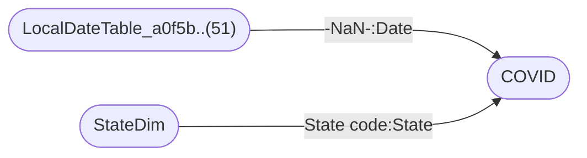

----

[Home](./index.md) > [COVID-19 US Tracking Sample.pbix](COVID-19%20US%20Tracking%20Sample.pbix_dmv.md)

| [Information](#information) | [Model information](#model-information) | [Model relationships](#model-relationships) | [Business objects](#business-objects) | [Measures](#measures) | [Relationships](#relationships) | [Hierarchies](#hierarchies) | [Columns](#columns) |

----

# Information

Documentation for file **COVID-19 US Tracking Sample.pbix**.

# Model information

| Param  | Value  |
|---|---|
| **Analyzed pbix file name** | `COVID-19 US Tracking Sample.pbix` | 
| **Catalog name** | `867a1662-b3b2-4412-a564-a7fd5b167e57` | 
| **Port** | `57769`|
| **Description** | `-NaN-` | 
| **Date modified** | `2021-07-20T18:58:23` | 
| **Compatibility level** | `1550` | 

[Up](#information)

# Model relationships

[Up](#information)

# Business objects

| ID | NAME | DESCRIPTION | 
|----|------|-------------|
| 19 | COVID | n/a |
| 22 | StateDim | n/a |
| 25 | Table | n/a |
| 31 | COVID measures | n/a |

[Up](#information)

# Measures

<table>
    <tr>
        <th> ID </th><th> TABLE </th><th> NAME </th><th> DESCRIPTION </th><th> EXPRESSION </th><th> IS_HIDDEN </th><th> STATE </th>
    </tr>
<tr>
        <td> 50 </td><td> DateTableTemplate_fe..(54) </td><td>  </td><td> n/a </td><td> <code> YEAR([Date]) </code></td><td> True </td><td>  1 </td> 
    </tr>
<tr>
        <td> 51 </td><td> DateTableTemplate_fe..(54) </td><td>  </td><td> n/a </td><td> <code> MONTH([Date]) </code></td><td> True </td><td>  1 </td> 
    </tr>
<tr>
        <td> 52 </td><td> DateTableTemplate_fe..(54) </td><td>  </td><td> n/a </td><td> <code> FORMAT([Date], "MMMM") </code></td><td> True </td><td>  1 </td> 
    </tr>
<tr>
        <td> 53 </td><td> DateTableTemplate_fe..(54) </td><td>  </td><td> n/a </td><td> <code> INT(([MonthNo] + 2) / 3) </code></td><td> True </td><td>  1 </td> 
    </tr>
<tr>
        <td> 54 </td><td> DateTableTemplate_fe..(54) </td><td>  </td><td> n/a </td><td> <code> "Qtr " & [QuarterNo] </code></td><td> True </td><td>  1 </td> 
    </tr>
<tr>
        <td> 55 </td><td> DateTableTemplate_fe..(54) </td><td>  </td><td> n/a </td><td> <code> DAY([Date]) </code></td><td> True </td><td>  1 </td> 
    </tr>
<tr>
        <td> 69 </td><td> COVID </td><td>  </td><td> n/a </td><td> <code> 'COVID'[County Name] & ", " & 'COVID'[State] </code></td><td> False </td><td>  1 </td> 
    </tr>
<tr>
        <td> 74 </td><td> COVID </td><td>  </td><td> n/a </td><td> <code> 
VAR __CountyName = 'COVID'[County Name]
VAR __State = 'COVID'[State]
VAR __Yesterday =  DATEADD(COVID[Date],-1,DAY)
VAR __TodaysCases = 'COVID'[Cases]

RETURN  __TodaysCases - CALCULATE(
    SUM('COVID'[Cases]) , 
    FILTER(
        COVID, 
        COVID[Date] = __Yesterday &&
        COVID[County Name] = __CountyName &&
        COVID[State] = __State
    )
) + 0 </code></td><td> False </td><td>  1 </td> 
    </tr>
<tr>
        <td> 75 </td><td> COVID </td><td>  </td><td> n/a </td><td> <code> 
VAR __CountyName = 'COVID'[County Name]
VAR __State = 'COVID'[State]
VAR __Yesterday =  DATEADD(COVID[Date],-1,DAY)
VAR __TodaysDeaths = 'COVID'[Deaths]

RETURN  __TodaysDeaths - CALCULATE(
    SUM('COVID'[Deaths]) , 
    FILTER(
        COVID, 
        COVID[Date] = __Yesterday &&
        COVID[County Name] = __CountyName &&
        COVID[State] = __State
    )
) + 0 </code></td><td> False </td><td>  1 </td> 
    </tr>
<tr>
        <td> 79 </td><td> StateDim </td><td>  </td><td> n/a </td><td> <code> "USA" </code></td><td> True </td><td>  1 </td> 
    </tr>
<tr>
        <td> 83 </td><td> LocalDateTable_a0f5b..(51) </td><td>  </td><td> n/a </td><td> <code> YEAR([Date]) </code></td><td> True </td><td>  1 </td> 
    </tr>
<tr>
        <td> 84 </td><td> LocalDateTable_a0f5b..(51) </td><td>  </td><td> n/a </td><td> <code> MONTH([Date]) </code></td><td> True </td><td>  1 </td> 
    </tr>
<tr>
        <td> 85 </td><td> LocalDateTable_a0f5b..(51) </td><td>  </td><td> n/a </td><td> <code> FORMAT([Date], "MMMM") </code></td><td> True </td><td>  1 </td> 
    </tr>
<tr>
        <td> 86 </td><td> LocalDateTable_a0f5b..(51) </td><td>  </td><td> n/a </td><td> <code> INT(([MonthNo] + 2) / 3) </code></td><td> True </td><td>  1 </td> 
    </tr>
<tr>
        <td> 87 </td><td> LocalDateTable_a0f5b..(51) </td><td>  </td><td> n/a </td><td> <code> "Qtr " & [QuarterNo] </code></td><td> True </td><td>  1 </td> 
    </tr>
<tr>
        <td> 88 </td><td> LocalDateTable_a0f5b..(51) </td><td>  </td><td> n/a </td><td> <code> DAY([Date]) </code></td><td> True </td><td>  1 </td> 
    </tr>
</table>

[Up](#information)

# Relationships 

| ID | FROM_TABLE | TO_TABLE | FROM:TO CARDINALITY | NAME | IS_ACTIVE  |
|----|------------|----------|---------------------|------|------------|
| 34 | COVID[Date] | LocalDateTable_a0f5b..(51)[-NaN-] | 2:1 | 61d3981d-89bc-4f78-b2b7-ab908a42ac71 | True |
| 35 | COVID[State] | StateDim[State code] | 2:1 | 7cd80576-d9a4-4516-aad6-c8e06584bf7c | True |

[Up](#information)

# Hierarchies 

| ID | TABLE | NAME | DESCRIPTION  | IS_HIDDEN | 
|----|----------|------|--------------|-----------|
| 119 |DateTableTemplate_fe..(54) | Date Hierarchy | n/a | False | 
| 120 |LocalDateTable_a0f5b..(51) | Date Hierarchy | n/a | False | 

[Up](#information)

# Columns 

<table>
    <tr>
        <th> ID </th><th> TABLE </th><th> EXPLICIT_NAME </th><th> DESCRIPTION </th><th> IS_HIDDEN </th><th> EXPRESSION </th>
    </tr>
<tr>
        <td> 62 </td><td> COVID </td><td> County Name </td><td> n/a </td><td> False </td><td><code> n/a </code></td>
    </tr>

<tr>
        <td> 63 </td><td> COVID </td><td> State </td><td> n/a </td><td> False </td><td><code> n/a </code></td>
    </tr>

<tr>
        <td> 65 </td><td> COVID </td><td> Date </td><td> n/a </td><td> False </td><td><code> n/a </code></td>
    </tr>

<tr>
        <td> 66 </td><td> COVID </td><td> Cases </td><td> n/a </td><td> False </td><td><code> n/a </code></td>
    </tr>

<tr>
        <td> 67 </td><td> COVID </td><td> FIPS </td><td> n/a </td><td> False </td><td><code> n/a </code></td>
    </tr>

<tr>
        <td> 68 </td><td> COVID </td><td> Deaths </td><td> n/a </td><td> False </td><td><code> n/a </code></td>
    </tr>

<tr>
        <td> 69 </td><td> COVID </td><td> County </td><td> n/a </td><td> False </td><td><code> 'COVID'[County Name] & ", " & 'COVID'[State] </code></td>
    </tr>

<tr>
        <td> 74 </td><td> COVID </td><td> Daily cases </td><td> n/a </td><td> False </td><td><code> 
VAR __CountyName = 'COVID'[County Name]
VAR __State = 'COVID'[State]
VAR __Yesterday =  DATEADD(COVID[Date],-1,DAY)
VAR __TodaysCases = 'COVID'[Cases]

RETURN  __TodaysCases - CALCULATE(
    SUM('COVID'[Cases]) , 
    FILTER(
        COVID, 
        COVID[Date] = __Yesterday &&
        COVID[County Name] = __CountyName &&
        COVID[State] = __State
    )
) + 0 </code></td>
    </tr>

<tr>
        <td> 75 </td><td> COVID </td><td> Daily deaths </td><td> n/a </td><td> False </td><td><code> 
VAR __CountyName = 'COVID'[County Name]
VAR __State = 'COVID'[State]
VAR __Yesterday =  DATEADD(COVID[Date],-1,DAY)
VAR __TodaysDeaths = 'COVID'[Deaths]

RETURN  __TodaysDeaths - CALCULATE(
    SUM('COVID'[Deaths]) , 
    FILTER(
        COVID, 
        COVID[Date] = __Yesterday &&
        COVID[County Name] = __CountyName &&
        COVID[State] = __State
    )
) + 0 </code></td>
    </tr>

<tr>
        <td> 420484 </td><td> COVID </td><td> StateFIPS </td><td> n/a </td><td> False </td><td><code> n/a </code></td>
    </tr>

<tr>
        <td> 76 </td><td> StateDim </td><td> State </td><td> n/a </td><td> False </td><td><code> n/a </code></td>
    </tr>

<tr>
        <td> 77 </td><td> StateDim </td><td> State code </td><td> n/a </td><td> False </td><td><code> n/a </code></td>
    </tr>

<tr>
        <td> 78 </td><td> StateDim </td><td> US territories </td><td> n/a </td><td> False </td><td><code> n/a </code></td>
    </tr>

<tr>
        <td> 80 </td><td> Table </td><td> Metric </td><td> n/a </td><td> False </td><td><code> n/a </code></td>
    </tr>

<tr>
        <td> 81 </td><td> Table </td><td> Order </td><td> n/a </td><td> False </td><td><code> n/a </code></td>
    </tr>

</table>

[Up](#information)

----

Generated at 10.01.2024 23:38:07 by <a href='https://github.com/dop12/pbix_doc'>PBIX DOC PROJECT</a> Git version: 0416f84

