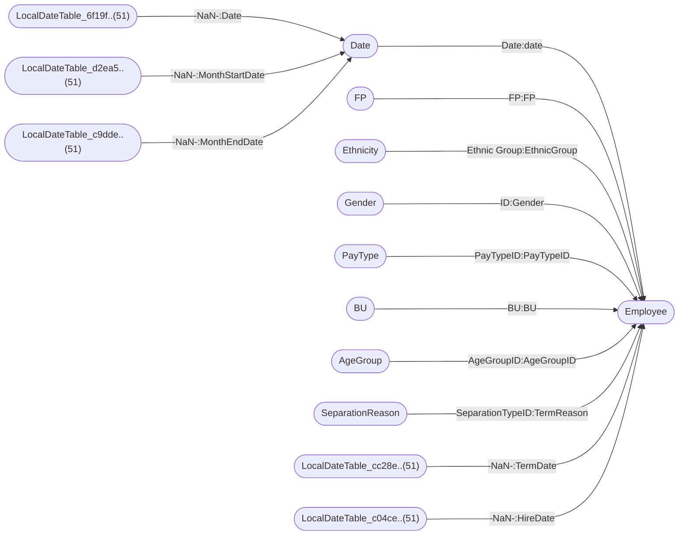

----

[Home](./index.md) > [Human Resources Sample PBIX.pbix](Human%20Resources%20Sample%20PBIX.pbix_dmv.md)

| [Information](#information) | [Model information](#model-information) | [Model relationships](#model-relationships) | [Business objects](#business-objects) | [Measures](#measures) | [Relationships](#relationships) | [Hierarchies](#hierarchies) | [Columns](#columns) |

----

# Information

Documentation for file **Human Resources Sample PBIX.pbix**.

# Model information

| Param  | Value  |
|---|---|
| **Analyzed pbix file name** | `Human Resources Sample PBIX.pbix` | 
| **Catalog name** | `97f11a5e-60ee-45d5-ac60-cdd5c79f3260` | 
| **Port** | `60605`|
| **Description** | `-NaN-` | 
| **Date modified** | `2022-09-22T23:04:12` | 
| **Compatibility level** | `1550` | 

[Up](#information)

# Model relationships

[Up](#information)

# Business objects

| ID | NAME | DESCRIPTION | 
|----|------|-------------|
| 10 | BU | n/a |
| 13 | FP | n/a |
| 16 | PayType | n/a |
| 19 | SeparationReason | n/a |
| 22 | Date | n/a |
| 28 | Ethnicity | n/a |
| 31 | Gender | n/a |
| 34 | AgeGroup | n/a |

[Up](#information)

# Measures

<table>
    <tr>
        <th> ID </th><th> TABLE </th><th> NAME </th><th> DESCRIPTION </th><th> EXPRESSION </th><th> IS_HIDDEN </th><th> STATE </th>
    </tr>
<tr>
        <td> 49 </td><td> BU </td><td>  </td><td> n/a </td><td> <code> mid([RegionSeq], 3,15) </code></td><td> False </td><td>  1 </td> 
    </tr>
<tr>
        <td> 67 </td><td> Date </td><td>  </td><td> n/a </td><td> <code> ([Year]-MIN([Year]))*12 +[MonthNumber] </code></td><td> True </td><td>  1 </td> 
    </tr>
<tr>
        <td> 75 </td><td> Employee </td><td>  </td><td> n/a </td><td> <code> IF(YEAR([date]) = YEAR([HireDate]) && MONTH([date])=MONTH([HireDate]), 1) </code></td><td> True </td><td>  1 </td> 
    </tr>
<tr>
        <td> 80 </td><td> Employee </td><td>  </td><td> n/a </td><td> <code> IF([Age]<30, 1, IF([Age]<50, 2, 3)) </code></td><td> True </td><td>  1 </td> 
    </tr>
<tr>
        <td> 81 </td><td> Employee </td><td>  </td><td> n/a </td><td> <code> IF([date]-[HireDate]<0,[HireDate]-[date],[date]-[HireDate]) </code></td><td> True </td><td>  1 </td> 
    </tr>
<tr>
        <td> 82 </td><td> Employee </td><td>  </td><td> n/a </td><td> <code> CEILING([TenureDays]/30, 1) -1 </code></td><td> True </td><td>  1 </td> 
    </tr>
<tr>
        <td> 83 </td><td> Employee </td><td>  </td><td> n/a </td><td> <code> IF(OR((([HireDate]-[TermDate])*-1)>=61,ISBLANK([TermDate])),0,1) </code></td><td> False </td><td>  1 </td> 
    </tr>
<tr>
        <td> 1959 </td><td> DateTableTemplate_92..(54) </td><td>  </td><td> n/a </td><td> <code> YEAR([Date]) </code></td><td> True </td><td>  1 </td> 
    </tr>
<tr>
        <td> 1960 </td><td> DateTableTemplate_92..(54) </td><td>  </td><td> n/a </td><td> <code> MONTH([Date]) </code></td><td> True </td><td>  1 </td> 
    </tr>
<tr>
        <td> 1961 </td><td> DateTableTemplate_92..(54) </td><td>  </td><td> n/a </td><td> <code> FORMAT([Date], "MMMM") </code></td><td> True </td><td>  1 </td> 
    </tr>
<tr>
        <td> 1962 </td><td> DateTableTemplate_92..(54) </td><td>  </td><td> n/a </td><td> <code> INT(([MonthNo] + 2) / 3) </code></td><td> True </td><td>  1 </td> 
    </tr>
<tr>
        <td> 1963 </td><td> DateTableTemplate_92..(54) </td><td>  </td><td> n/a </td><td> <code> "Qtr " & [QuarterNo] </code></td><td> True </td><td>  1 </td> 
    </tr>
<tr>
        <td> 1964 </td><td> DateTableTemplate_92..(54) </td><td>  </td><td> n/a </td><td> <code> DAY([Date]) </code></td><td> True </td><td>  1 </td> 
    </tr>
<tr>
        <td> 2062 </td><td> LocalDateTable_6f19f..(51) </td><td>  </td><td> n/a </td><td> <code> YEAR([Date]) </code></td><td> True </td><td>  1 </td> 
    </tr>
<tr>
        <td> 2063 </td><td> LocalDateTable_6f19f..(51) </td><td>  </td><td> n/a </td><td> <code> MONTH([Date]) </code></td><td> True </td><td>  1 </td> 
    </tr>
<tr>
        <td> 2064 </td><td> LocalDateTable_6f19f..(51) </td><td>  </td><td> n/a </td><td> <code> FORMAT([Date], "MMMM") </code></td><td> True </td><td>  1 </td> 
    </tr>
<tr>
        <td> 2065 </td><td> LocalDateTable_6f19f..(51) </td><td>  </td><td> n/a </td><td> <code> INT(([MonthNo] + 2) / 3) </code></td><td> True </td><td>  1 </td> 
    </tr>
<tr>
        <td> 2066 </td><td> LocalDateTable_6f19f..(51) </td><td>  </td><td> n/a </td><td> <code> "Qtr " & [QuarterNo] </code></td><td> True </td><td>  1 </td> 
    </tr>
<tr>
        <td> 2067 </td><td> LocalDateTable_6f19f..(51) </td><td>  </td><td> n/a </td><td> <code> DAY([Date]) </code></td><td> True </td><td>  1 </td> 
    </tr>
<tr>
        <td> 2069 </td><td> LocalDateTable_d2ea5..(51) </td><td>  </td><td> n/a </td><td> <code> YEAR([Date]) </code></td><td> True </td><td>  1 </td> 
    </tr>
<tr>
        <td> 2070 </td><td> LocalDateTable_d2ea5..(51) </td><td>  </td><td> n/a </td><td> <code> MONTH([Date]) </code></td><td> True </td><td>  1 </td> 
    </tr>
<tr>
        <td> 2071 </td><td> LocalDateTable_d2ea5..(51) </td><td>  </td><td> n/a </td><td> <code> FORMAT([Date], "MMMM") </code></td><td> True </td><td>  1 </td> 
    </tr>
<tr>
        <td> 2072 </td><td> LocalDateTable_d2ea5..(51) </td><td>  </td><td> n/a </td><td> <code> INT(([MonthNo] + 2) / 3) </code></td><td> True </td><td>  1 </td> 
    </tr>
<tr>
        <td> 2073 </td><td> LocalDateTable_d2ea5..(51) </td><td>  </td><td> n/a </td><td> <code> "Qtr " & [QuarterNo] </code></td><td> True </td><td>  1 </td> 
    </tr>
<tr>
        <td> 2074 </td><td> LocalDateTable_d2ea5..(51) </td><td>  </td><td> n/a </td><td> <code> DAY([Date]) </code></td><td> True </td><td>  1 </td> 
    </tr>
<tr>
        <td> 2076 </td><td> LocalDateTable_c9dde..(51) </td><td>  </td><td> n/a </td><td> <code> YEAR([Date]) </code></td><td> True </td><td>  1 </td> 
    </tr>
<tr>
        <td> 2077 </td><td> LocalDateTable_c9dde..(51) </td><td>  </td><td> n/a </td><td> <code> MONTH([Date]) </code></td><td> True </td><td>  1 </td> 
    </tr>
<tr>
        <td> 2078 </td><td> LocalDateTable_c9dde..(51) </td><td>  </td><td> n/a </td><td> <code> FORMAT([Date], "MMMM") </code></td><td> True </td><td>  1 </td> 
    </tr>
<tr>
        <td> 2079 </td><td> LocalDateTable_c9dde..(51) </td><td>  </td><td> n/a </td><td> <code> INT(([MonthNo] + 2) / 3) </code></td><td> True </td><td>  1 </td> 
    </tr>
<tr>
        <td> 2080 </td><td> LocalDateTable_c9dde..(51) </td><td>  </td><td> n/a </td><td> <code> "Qtr " & [QuarterNo] </code></td><td> True </td><td>  1 </td> 
    </tr>
<tr>
        <td> 2081 </td><td> LocalDateTable_c9dde..(51) </td><td>  </td><td> n/a </td><td> <code> DAY([Date]) </code></td><td> True </td><td>  1 </td> 
    </tr>
<tr>
        <td> 2083 </td><td> LocalDateTable_cc28e..(51) </td><td>  </td><td> n/a </td><td> <code> YEAR([Date]) </code></td><td> True </td><td>  1 </td> 
    </tr>
<tr>
        <td> 2084 </td><td> LocalDateTable_cc28e..(51) </td><td>  </td><td> n/a </td><td> <code> MONTH([Date]) </code></td><td> True </td><td>  1 </td> 
    </tr>
<tr>
        <td> 2085 </td><td> LocalDateTable_cc28e..(51) </td><td>  </td><td> n/a </td><td> <code> FORMAT([Date], "MMMM") </code></td><td> True </td><td>  1 </td> 
    </tr>
<tr>
        <td> 2086 </td><td> LocalDateTable_cc28e..(51) </td><td>  </td><td> n/a </td><td> <code> INT(([MonthNo] + 2) / 3) </code></td><td> True </td><td>  1 </td> 
    </tr>
<tr>
        <td> 2087 </td><td> LocalDateTable_cc28e..(51) </td><td>  </td><td> n/a </td><td> <code> "Qtr " & [QuarterNo] </code></td><td> True </td><td>  1 </td> 
    </tr>
<tr>
        <td> 2088 </td><td> LocalDateTable_cc28e..(51) </td><td>  </td><td> n/a </td><td> <code> DAY([Date]) </code></td><td> True </td><td>  1 </td> 
    </tr>
<tr>
        <td> 2090 </td><td> LocalDateTable_c04ce..(51) </td><td>  </td><td> n/a </td><td> <code> YEAR([Date]) </code></td><td> True </td><td>  1 </td> 
    </tr>
<tr>
        <td> 2091 </td><td> LocalDateTable_c04ce..(51) </td><td>  </td><td> n/a </td><td> <code> MONTH([Date]) </code></td><td> True </td><td>  1 </td> 
    </tr>
<tr>
        <td> 2092 </td><td> LocalDateTable_c04ce..(51) </td><td>  </td><td> n/a </td><td> <code> FORMAT([Date], "MMMM") </code></td><td> True </td><td>  1 </td> 
    </tr>
<tr>
        <td> 2093 </td><td> LocalDateTable_c04ce..(51) </td><td>  </td><td> n/a </td><td> <code> INT(([MonthNo] + 2) / 3) </code></td><td> True </td><td>  1 </td> 
    </tr>
<tr>
        <td> 2094 </td><td> LocalDateTable_c04ce..(51) </td><td>  </td><td> n/a </td><td> <code> "Qtr " & [QuarterNo] </code></td><td> True </td><td>  1 </td> 
    </tr>
<tr>
        <td> 2095 </td><td> LocalDateTable_c04ce..(51) </td><td>  </td><td> n/a </td><td> <code> DAY([Date]) </code></td><td> True </td><td>  1 </td> 
    </tr>
</table>

[Up](#information)

# Relationships 

| ID | FROM_TABLE | TO_TABLE | FROM:TO CARDINALITY | NAME | IS_ACTIVE  |
|----|------------|----------|---------------------|------|------------|
| 37 | Employee[date] | Date[Date] | 2:1 | 7ddd41c5-a1f5-477b-9712-84fdc7313c7d | True |
| 38 | Employee[FP] | FP[FP] | 2:1 | 497871a2-f5e1-40ff-90d7-6f980ca1119a | True |
| 39 | Employee[EthnicGroup] | Ethnicity[Ethnic Group] | 2:1 | 20c07ef2-2c50-4fd4-ad56-8b0e0e36ddc4 | True |
| 40 | Employee[Gender] | Gender[ID] | 2:1 | 539493ca-f3e3-4c1f-b14e-54cba661f036 | True |
| 41 | Employee[PayTypeID] | PayType[PayTypeID] | 2:1 | 7c262a8a-d56f-4c97-95db-c0f56177e4cd | True |
| 42 | Employee[BU] | BU[BU] | 2:1 | edfe54b9-43d8-4c14-a29d-f17ddb0dd421 | True |
| 43 | Employee[AgeGroupID] | AgeGroup[AgeGroupID] | 2:1 | 35cbfa94-d30d-4da9-8fb6-e7d469edb9bb | True |
| 44 | Employee[TermReason] | SeparationReason[SeparationTypeID] | 2:1 | 1c53ee81-f20a-40a6-a5bd-97e57652fc88 | True |
| 2056 | Date[Date] | LocalDateTable_6f19f..(51)[-NaN-] | 2:1 | 0f809af4-d31b-4977-a214-8f13fa42f41d | True |
| 2057 | Date[MonthStartDate] | LocalDateTable_d2ea5..(51)[-NaN-] | 2:1 | f496f9ad-5665-4785-a30e-b1bbcf7be215 | True |
| 2058 | Date[MonthEndDate] | LocalDateTable_c9dde..(51)[-NaN-] | 2:1 | b2a9d346-0212-432d-a1a9-57680b4a73ea | True |
| 2059 | Employee[TermDate] | LocalDateTable_cc28e..(51)[-NaN-] | 2:1 | e020e64e-e74a-4b8f-bed8-e879143ea6d8 | True |
| 2060 | Employee[HireDate] | LocalDateTable_c04ce..(51)[-NaN-] | 2:1 | 3e454a13-2d74-4769-b44d-91ce492acf1a | True |

[Up](#information)

# Hierarchies 

| ID | TABLE | NAME | DESCRIPTION  | IS_HIDDEN | 
|----|----------|------|--------------|-----------|
| 130 |Date | YQM | n/a | False | 
| 1966 |DateTableTemplate_92..(54) | Date Hierarchy | n/a | False | 
| 2101 |LocalDateTable_6f19f..(51) | Date Hierarchy | n/a | False | 
| 2102 |LocalDateTable_d2ea5..(51) | Date Hierarchy | n/a | False | 
| 2103 |LocalDateTable_c9dde..(51) | Date Hierarchy | n/a | False | 
| 2104 |LocalDateTable_cc28e..(51) | Date Hierarchy | n/a | False | 
| 2105 |LocalDateTable_c04ce..(51) | Date Hierarchy | n/a | False | 

[Up](#information)

# Columns 

<table>
    <tr>
        <th> ID </th><th> TABLE </th><th> EXPLICIT_NAME </th><th> DESCRIPTION </th><th> IS_HIDDEN </th><th> EXPRESSION </th>
    </tr>
<tr>
        <td> 46 </td><td> BU </td><td> BU </td><td> n/a </td><td> False </td><td><code> n/a </code></td>
    </tr>

<tr>
        <td> 47 </td><td> BU </td><td> RegionSeq </td><td> n/a </td><td> False </td><td><code> n/a </code></td>
    </tr>

<tr>
        <td> 48 </td><td> BU </td><td> VP </td><td> n/a </td><td> False </td><td><code> n/a </code></td>
    </tr>

<tr>
        <td> 49 </td><td> BU </td><td> Region </td><td> n/a </td><td> False </td><td><code> mid([RegionSeq], 3,15) </code></td>
    </tr>

<tr>
        <td> 50 </td><td> FP </td><td> FP </td><td> n/a </td><td> False </td><td><code> n/a </code></td>
    </tr>

<tr>
        <td> 51 </td><td> FP </td><td> FPDesc </td><td> n/a </td><td> False </td><td><code> n/a </code></td>
    </tr>

<tr>
        <td> 53 </td><td> PayType </td><td> PayType </td><td> n/a </td><td> False </td><td><code> n/a </code></td>
    </tr>

<tr>
        <td> 55 </td><td> SeparationReason </td><td> SeparationReason </td><td> n/a </td><td> False </td><td><code> n/a </code></td>
    </tr>

<tr>
        <td> 56 </td><td> Date </td><td> Date </td><td> n/a </td><td> False </td><td><code> n/a </code></td>
    </tr>

<tr>
        <td> 57 </td><td> Date </td><td> Month </td><td> n/a </td><td> False </td><td><code> n/a </code></td>
    </tr>

<tr>
        <td> 58 </td><td> Date </td><td> MonthNumber </td><td> n/a </td><td> False </td><td><code> n/a </code></td>
    </tr>

<tr>
        <td> 59 </td><td> Date </td><td> Period </td><td> n/a </td><td> False </td><td><code> n/a </code></td>
    </tr>

<tr>
        <td> 60 </td><td> Date </td><td> PeriodNumber </td><td> n/a </td><td> False </td><td><code> n/a </code></td>
    </tr>

<tr>
        <td> 61 </td><td> Date </td><td> Qtr </td><td> n/a </td><td> False </td><td><code> n/a </code></td>
    </tr>

<tr>
        <td> 62 </td><td> Date </td><td> QtrNumber </td><td> n/a </td><td> False </td><td><code> n/a </code></td>
    </tr>

<tr>
        <td> 63 </td><td> Date </td><td> Year </td><td> n/a </td><td> False </td><td><code> n/a </code></td>
    </tr>

<tr>
        <td> 64 </td><td> Date </td><td> Day </td><td> n/a </td><td> False </td><td><code> n/a </code></td>
    </tr>

<tr>
        <td> 65 </td><td> Date </td><td> MonthStartDate </td><td> n/a </td><td> False </td><td><code> n/a </code></td>
    </tr>

<tr>
        <td> 66 </td><td> Date </td><td> MonthEndDate </td><td> n/a </td><td> False </td><td><code> n/a </code></td>
    </tr>

<tr>
        <td> 83 </td><td> Employee </td><td> BadHires </td><td> n/a </td><td> False </td><td><code> IF(OR((([HireDate]-[TermDate])*-1)>=61,ISBLANK([TermDate])),0,1) </code></td>
    </tr>

<tr>
        <td> 85 </td><td> Ethnicity </td><td> Ethnicity </td><td> n/a </td><td> False </td><td><code> n/a </code></td>
    </tr>

<tr>
        <td> 87 </td><td> Gender </td><td> Gender </td><td> n/a </td><td> False </td><td><code> n/a </code></td>
    </tr>

<tr>
        <td> 90 </td><td> AgeGroup </td><td> AgeGroup </td><td> n/a </td><td> False </td><td><code> n/a </code></td>
    </tr>

</table>

[Up](#information)

----

Generated at 10.01.2024 22:54:35 by <a href='https://github.com/dop12/pbix_doc'>PBIX DOC PROJECT</a> Git version: f640601

