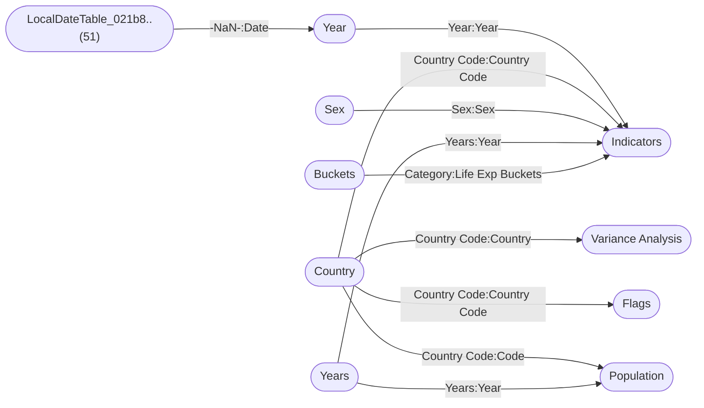

----

[Home](./index.md) > [Life expectancy v202009.pbix](Life%20expectancy%20v202009.pbix.md)

| [Information](#information) | [Model information](#model-information) | [Model relationships](#model-relationships) | [Business objects](#business-objects) | [Measures](#measures) | [Relationships](#relationships) | [Hierarchies](#hierarchies) | [Columns](#columns) | [Report sections](#report-sections) |

----

# Information

Documentation for file **Life expectancy v202009.pbix**.

# Model information

| Param  | Value  |
|---|---|
| **Analyzed pbix file name** | `Life expectancy v202009.pbix` | 
| **Catalog name** | `51306748-d2a4-4813-904f-3322b45f73ec` | 
| **Port** | `56596`|
| **Description** | `-NaN-` | 
| **Date modified** | `2024-01-02T21:37:54` | 
| **Compatibility level** | `1567` | 

[Up](#)
# Model relationships

[Up](#)

# Business objects

| ID | NAME | DESCRIPTION | 
|----|------|-------------|
| 12 | Indicators | n/a |
| 9809 | Year | n/a |
| 9833 | Country | n/a |
| 26658 | Metrics | n/a |
| 39452 | Variance Analysis | n/a |
| 40740 | Flags | n/a |
| 53251 | Years | n/a |
| 53327 | Legend | n/a |
| 53529 | Population | n/a |
| 53830 | Buckets | n/a |
| 54512 | Extra Year | n/a |

[Up](#)
# Measures

<table>
    <tr>
        <th> ID </th><th> TABLE </th><th> NAME </th><th> DESCRIPTION </th><th> EXPRESSION </th><th> IS_HIDDEN </th><th> STATE </th>
    </tr>
<tr>
        <td> 26197 </td><td> Indicators </td><td>  </td><td> n/a </td><td> <code> VAR __Count = 6

VAR __Min = MIN('Indicators'[Income share held by lowest 20%])

VAR __Max = MAX('Indicators'[Income share held by lowest 20%])

VAR __Difference = (__Max - __Min)

VAR __Size = IF(__Difference > 0, __Difference / __Count, 1)

VAR __BinNumber = 
  IF(
    ISBLANK('Indicators'[Income share held by lowest 20%]),
    BLANK(),
    ROUNDDOWN(('Indicators'[Income share held by lowest 20%] - __Min) / __Size, 0)
  )

RETURN
  IF(
    ISBLANK('Indicators'[Income share held by lowest 20%]),
    BLANK(),
    __Min + (MIN(__BinNumber, __Count - 1) * __Size)
  ) </code></td><td> False </td><td>  1 </td> 
    </tr>
<tr>
        <td> 34792 </td><td> Indicators </td><td>  </td><td> n/a </td><td> <code> VAR __Count = 8

VAR __Min = 
  MIN(
    'Indicators'[General government expenditure on health as a percentage of total expenditure on health]
  )

VAR __Max = 
  MAX(
    'Indicators'[General government expenditure on health as a percentage of total expenditure on health]
  )

VAR __Difference = (__Max - __Min)

VAR __Size = IF(__Difference > 0, __Difference / __Count, 1)

VAR __BinNumber = 
  INT(
    ('Indicators'[General government expenditure on health as a percentage of total expenditure on health] - __Min) / __Size
  )

RETURN
  IF(
    ISBLANK(
      'Indicators'[General government expenditure on health as a percentage of total expenditure on health]
    ),
    BLANK(),
    __Min + (MIN(__BinNumber, __Count - 1) * __Size)
  ) </code></td><td> False </td><td>  1 </td> 
    </tr>
<tr>
        <td> 38852 </td><td> Indicators </td><td>  </td><td> n/a </td><td> <code> If([Life expectancy (yrs)] < 55, "Low", If([Life expectancy (yrs)] >= 55 && [Life expectancy (yrs)] < 70, "Medium", "High")) </code></td><td> False </td><td>  1 </td> 
    </tr>
<tr>
        <td> 38907 </td><td> Indicators </td><td>  </td><td> n/a </td><td> <code> VAR __Count = 10

VAR __Min = MIN('Indicators'[GDP per capita (US $)])

VAR __Max = MAX('Indicators'[GDP per capita (US $)])

VAR __Difference = (__Max - __Min)

VAR __Size = IF(__Difference > 0, __Difference / __Count, 1)

VAR __BinNumber = 
  IF(
    ISBLANK('Indicators'[GDP per capita (US $)]),
    BLANK(),
    ROUNDDOWN(('Indicators'[GDP per capita (US $)] - __Min) / __Size, 0)
  )

RETURN
  IF(
    ISBLANK('Indicators'[GDP per capita (US $)]),
    BLANK(),
    __Min + (MIN(__BinNumber, __Count - 1) * __Size)
  ) </code></td><td> False </td><td>  1 </td> 
    </tr>
<tr>
        <td> 52558 </td><td> Indicators </td><td>  </td><td> n/a </td><td> <code> if(isblank(Indicators[Income share held by lowest 20%]), "null", if( Indicators[Income share held by lowest 20%] < 2, "less than 2%", if( Indicators[Income share held by lowest 20%] >= 2 && Indicators[Income share held by lowest 20%] < 4, "2% - 4%", if( Indicators[Income share held by lowest 20%] >= 4 && Indicators[Income share held by lowest 20%] < 6, "4% - 6%", if( Indicators[Income share held by lowest 20%] >= 6 && Indicators[Income share held by lowest 20%] < 8, "6% - 8%", "more than 8%"))))) </code></td><td> False </td><td>  1 </td> 
    </tr>
<tr>
        <td> 52613 </td><td> Indicators </td><td>  </td><td> n/a </td><td> <code> if( Indicators[People using at least basic drinking water services (% of population)]< 50, "Less than 50%", if( Indicators[People using at least basic drinking water services (% of population)] >= 50 && Indicators[People using at least basic drinking water services (% of population)] < 70, "50% - 70%", if( Indicators[People using at least basic drinking water services (% of population)] >= 70 && Indicators[People using at least basic drinking water services (% of population)] < 90, "70% - 90%", "More than 90%"))) </code></td><td> False </td><td>  1 </td> 
    </tr>
<tr>
        <td> 52710 </td><td> Indicators </td><td>  </td><td> n/a </td><td> <code> if(ISBLANK(Indicators[People using safely managed drinking water services (% of population)]), "null", if( Indicators[People using safely managed drinking water services (% of population)]< 25, "less than 25%", if( Indicators[People using safely managed drinking water services (% of population)]>= 25 && Indicators[People using safely managed drinking water services (% of population)] < 45, "25% - 45%", if( Indicators[People using safely managed drinking water services (% of population)] >= 45 && Indicators[People using safely managed drinking water services (% of population)] < 65, "45% - 65%", if( Indicators[People using safely managed drinking water services (% of population)] >= 65 && Indicators[People using safely managed drinking water services (% of population)] < 85, "65% - 85%" ,"more than 85%"))))) </code></td><td> False </td><td>  1 </td> 
    </tr>
<tr>
        <td> 52936 </td><td> Indicators </td><td>  </td><td> n/a </td><td> <code> if( Indicators[Hospital beds (per 10 000 population)] < 15 , "less than 15", if( Indicators[Hospital beds (per 10 000 population)] >= 15 && Indicators[Hospital beds (per 10 000 population)]< 30, "15 - 30", if(Indicators[Hospital beds (per 10 000 population)] >=30 && Indicators[Hospital beds (per 10 000 population)] < 45, "30 - 45", if( Indicators[Hospital beds (per 10 000 population)] >= 45 && Indicators[Hospital beds (per 10 000 population)] < 60, "45 - 60" ,"more than 60")))) </code></td><td> False </td><td>  1 </td> 
    </tr>
<tr>
        <td> 53182 </td><td> Indicators </td><td>  </td><td> n/a </td><td> <code> if( Indicators[Hib (Hib3) immunization coverage among 1-year-olds (%)] < 40, "less than 40%", if( Indicators[Hib (Hib3) immunization coverage among 1-year-olds (%)] >= 40 && Indicators[Hib (Hib3) immunization coverage among 1-year-olds (%)]  < 60, "40% - 60%", if( Indicators[Hib (Hib3) immunization coverage among 1-year-olds (%)]  >= 60 && Indicators[Hib (Hib3) immunization coverage among 1-year-olds (%)] < 80, "60% - 80", if( Indicators[Hib (Hib3) immunization coverage among 1-year-olds (%)] >= 80 &&Indicators[Hib (Hib3) immunization coverage among 1-year-olds (%)]  < 90, "80% - 90%" ,"more than 90%")))) </code></td><td> False </td><td>  1 </td> 
    </tr>
<tr>
        <td> 53737 </td><td> Indicators </td><td>  </td><td> n/a </td><td> <code> 
IF(Indicators[Life expectancy (yrs)]<30,20,
IF(Indicators[Life expectancy (yrs)]<45,30,
IF(Indicators[Life expectancy (yrs)]<60,45,
IF(Indicators[Life expectancy (yrs)]<70,60,
IF(Indicators[Life expectancy (yrs)]<80,70,
80))))
) </code></td><td> False </td><td>  1 </td> 
    </tr>
<tr>
        <td> 54399 </td><td> Indicators </td><td>  </td><td> n/a </td><td> <code> "All" </code></td><td> False </td><td>  1 </td> 
    </tr>
<tr>
        <td> 20 </td><td> DateTableTemplate_ee..(54) </td><td>  </td><td> n/a </td><td> <code> YEAR([Date]) </code></td><td> True </td><td>  1 </td> 
    </tr>
<tr>
        <td> 21 </td><td> DateTableTemplate_ee..(54) </td><td>  </td><td> n/a </td><td> <code> MONTH([Date]) </code></td><td> True </td><td>  1 </td> 
    </tr>
<tr>
        <td> 22 </td><td> DateTableTemplate_ee..(54) </td><td>  </td><td> n/a </td><td> <code> FORMAT([Date], "MMMM") </code></td><td> True </td><td>  1 </td> 
    </tr>
<tr>
        <td> 23 </td><td> DateTableTemplate_ee..(54) </td><td>  </td><td> n/a </td><td> <code> INT(([MonthNo] + 2) / 3) </code></td><td> True </td><td>  1 </td> 
    </tr>
<tr>
        <td> 24 </td><td> DateTableTemplate_ee..(54) </td><td>  </td><td> n/a </td><td> <code> "Qtr " & [QuarterNo] </code></td><td> True </td><td>  1 </td> 
    </tr>
<tr>
        <td> 25 </td><td> DateTableTemplate_ee..(54) </td><td>  </td><td> n/a </td><td> <code> DAY([Date]) </code></td><td> True </td><td>  1 </td> 
    </tr>
<tr>
        <td> 54344 </td><td> Country </td><td>  </td><td> n/a </td><td> <code> "Earth" </code></td><td> False </td><td>  1 </td> 
    </tr>
<tr>
        <td> 38993 </td><td> LocalDateTable_021b8..(51) </td><td>  </td><td> n/a </td><td> <code> YEAR([Date]) </code></td><td> True </td><td>  1 </td> 
    </tr>
<tr>
        <td> 38994 </td><td> LocalDateTable_021b8..(51) </td><td>  </td><td> n/a </td><td> <code> MONTH([Date]) </code></td><td> True </td><td>  1 </td> 
    </tr>
<tr>
        <td> 38995 </td><td> LocalDateTable_021b8..(51) </td><td>  </td><td> n/a </td><td> <code> FORMAT([Date], "MMMM") </code></td><td> True </td><td>  1 </td> 
    </tr>
<tr>
        <td> 38996 </td><td> LocalDateTable_021b8..(51) </td><td>  </td><td> n/a </td><td> <code> INT(([MonthNo] + 2) / 3) </code></td><td> True </td><td>  1 </td> 
    </tr>
<tr>
        <td> 38997 </td><td> LocalDateTable_021b8..(51) </td><td>  </td><td> n/a </td><td> <code> "Qtr " & [QuarterNo] </code></td><td> True </td><td>  1 </td> 
    </tr>
<tr>
        <td> 38998 </td><td> LocalDateTable_021b8..(51) </td><td>  </td><td> n/a </td><td> <code> DAY([Date]) </code></td><td> True </td><td>  1 </td> 
    </tr>
<tr>
        <td> 54454 </td><td> Years </td><td>  </td><td> n/a </td><td> <code> "all" </code></td><td> False </td><td>  1 </td> 
    </tr>
</table>

[Up](#)
# Relationships 

| ID | FROM_TABLE | TO_TABLE | FROM:TO CARDINALITY | NAME | IS_ACTIVE  |
|----|------------|----------|---------------------|------|------------|
| 13648 | Indicators[Year] | Year[Year] | 2:1 | 17e495ba-28c8-41ea-925e-d8dea592d611 | True |
| 13651 | Indicators[Country Code] | Country[Country Code] | 2:1 | 6ea420da-e7ae-4b8f-9c91-df122a9a7203 | True |
| 14012 | Indicators[Sex] | Sex[Sex] | 2:1 | 6add05ba-fcb0-4cc2-9a55-f013416baa1f | True |
| 38989 | Year[Date] | LocalDateTable_021b8..(51)[-NaN-] | 2:1 | af7cdcad-c7ce-42fc-88e8-db4ff74e4221 | True |
| 39906 | Variance Analysis[Country] | Country[Country Code] | 1:1 | 9b732245-607f-44ff-92eb-003f16d1239b | True |
| 40922 | Flags[Country Code] | Country[Country Code] | 2:1 | 2c602a9b-38ca-4726-805d-4bbc3e6e845d | True |
| 53310 | Indicators[Year] | Years[Years] | 2:1 | 54728093-5212-47d4-8be1-08fb5b094257 | True |
| 53703 | Population[Code] | Country[Country Code] | 2:1 | 2c833854-30da-49ab-bdaf-b26f77a6f7ec | True |
| 53792 | Population[Year] | Years[Years] | 2:1 | 5f31afcd-18a2-438a-9d89-8397eafbaf81 | True |
| 53982 | Indicators[Life Exp Buckets] | Buckets[Category] | 2:1 | 32f3749b-0b94-451d-8b0d-8f698bf43117 | True |

[Up](#)
# Hierarchies 

| ID | TABLE | NAME | DESCRIPTION  | IS_HIDDEN | 
|----|----------|------|--------------|-----------|
| 28 |DateTableTemplate_ee..(54) | Date Hierarchy | n/a | False | 
| 39000 |LocalDateTable_021b8..(51) | Date Hierarchy | n/a | False | 

[Up](#)
# Columns 

<table>
    <tr>
        <th> ID </th><th> TABLE </th><th> EXPLICIT_NAME </th><th> DESCRIPTION </th><th> IS_HIDDEN </th><th> EXPRESSION </th>
    </tr>
<tr>
        <td> 113 </td><td> Indicators </td><td> Year </td><td> n/a </td><td> False </td><td><code> n/a </code></td>
    </tr>

<tr>
        <td> 114 </td><td> Indicators </td><td> Region </td><td> n/a </td><td> False </td><td><code> n/a </code></td>
    </tr>

<tr>
        <td> 115 </td><td> Indicators </td><td> Country Code </td><td> n/a </td><td> False </td><td><code> n/a </code></td>
    </tr>

<tr>
        <td> 116 </td><td> Indicators </td><td> Country </td><td> n/a </td><td> False </td><td><code> n/a </code></td>
    </tr>

<tr>
        <td> 117 </td><td> Indicators </td><td> Sex </td><td> n/a </td><td> False </td><td><code> n/a </code></td>
    </tr>

<tr>
        <td> 123 </td><td> Indicators </td><td> Cholera case fatalit..(26) </td><td> n/a </td><td> False </td><td><code> n/a </code></td>
    </tr>

<tr>
        <td> 126 </td><td> Indicators </td><td> Number of neonatal d..(37) </td><td> n/a </td><td> False </td><td><code> n/a </code></td>
    </tr>

<tr>
        <td> 130 </td><td> Indicators </td><td> Malaria - number of ..(35) </td><td> n/a </td><td> False </td><td><code> n/a </code></td>
    </tr>

<tr>
        <td> 131 </td><td> Indicators </td><td> Estimated number of ..(34) </td><td> n/a </td><td> False </td><td><code> n/a </code></td>
    </tr>

<tr>
        <td> 136 </td><td> Indicators </td><td> Under-five mortality..(78) </td><td> n/a </td><td> False </td><td><code> n/a </code></td>
    </tr>

<tr>
        <td> 137 </td><td> Indicators </td><td> Children aged <5 yea..(66) </td><td> n/a </td><td> False </td><td><code> n/a </code></td>
    </tr>

<tr>
        <td> 138 </td><td> Indicators </td><td> Incidence of tubercu..(59) </td><td> n/a </td><td> False </td><td><code> n/a </code></td>
    </tr>

<tr>
        <td> 139 </td><td> Indicators </td><td> Prevalence of tuberc..(51) </td><td> n/a </td><td> False </td><td><code> n/a </code></td>
    </tr>

<tr>
        <td> 140 </td><td> Indicators </td><td> Births attended by s..(71) </td><td> n/a </td><td> False </td><td><code> n/a </code></td>
    </tr>

<tr>
        <td> 141 </td><td> Indicators </td><td> Maternal mortality r..(50) </td><td> n/a </td><td> False </td><td><code> n/a </code></td>
    </tr>

<tr>
        <td> 151 </td><td> Indicators </td><td> Life expectancy at b..(32) </td><td> n/a </td><td> False </td><td><code> n/a </code></td>
    </tr>

<tr>
        <td> 152 </td><td> Indicators </td><td> Neonatal mortality r..(46) </td><td> n/a </td><td> False </td><td><code> n/a </code></td>
    </tr>

<tr>
        <td> 153 </td><td> Indicators </td><td> Life expectancy at a..(33) </td><td> n/a </td><td> False </td><td><code> n/a </code></td>
    </tr>

<tr>
        <td> 180 </td><td> Indicators </td><td> Hepatitis B (HepB3) ..(63) </td><td> n/a </td><td> False </td><td><code> n/a </code></td>
    </tr>

<tr>
        <td> 182 </td><td> Indicators </td><td> Hib (Hib3) immunizat..(54) </td><td> n/a </td><td> False </td><td><code> n/a </code></td>
    </tr>

<tr>
        <td> 183 </td><td> Indicators </td><td> Hospital beds (per 1..(37) </td><td> n/a </td><td> False </td><td><code> n/a </code></td>
    </tr>

<tr>
        <td> 189 </td><td> Indicators </td><td> General government e..(88) </td><td> n/a </td><td> False </td><td><code> n/a </code></td>
    </tr>

<tr>
        <td> 195 </td><td> Indicators </td><td> General government e..(87) </td><td> n/a </td><td> False </td><td><code> n/a </code></td>
    </tr>

<tr>
        <td> 197 </td><td> Indicators </td><td> Measles-containing-v..(88) </td><td> n/a </td><td> False </td><td><code> n/a </code></td>
    </tr>

<tr>
        <td> 201 </td><td> Indicators </td><td> Gross national incom..(45) </td><td> n/a </td><td> False </td><td><code> n/a </code></td>
    </tr>

<tr>
        <td> 216 </td><td> Indicators </td><td> Number of community ..(34) </td><td> n/a </td><td> False </td><td><code> n/a </code></td>
    </tr>

<tr>
        <td> 217 </td><td> Indicators </td><td> Community health wor..(56) </td><td> n/a </td><td> False </td><td><code> n/a </code></td>
    </tr>

<tr>
        <td> 220 </td><td> Indicators </td><td> Children aged <5 yea..(74) </td><td> n/a </td><td> False </td><td><code> n/a </code></td>
    </tr>

<tr>
        <td> 4827 </td><td> Indicators </td><td> Income share held by..(31) </td><td> n/a </td><td> False </td><td><code> n/a </code></td>
    </tr>

<tr>
        <td> 4838 </td><td> Indicators </td><td> % of population livi..(49) </td><td> n/a </td><td> False </td><td><code> n/a </code></td>
    </tr>

<tr>
        <td> 4970 </td><td> Indicators </td><td> Net national income ..(30) </td><td> n/a </td><td> False </td><td><code> n/a </code></td>
    </tr>

<tr>
        <td> 4992 </td><td> Indicators </td><td> GDP per capita (curr..(28) </td><td> n/a </td><td> False </td><td><code> n/a </code></td>
    </tr>

<tr>
        <td> 5124 </td><td> Indicators </td><td> Percentage of female..(49) </td><td> n/a </td><td> False </td><td><code> n/a </code></td>
    </tr>

<tr>
        <td> 5190 </td><td> Indicators </td><td> Female pupils below ..(69) </td><td> n/a </td><td> False </td><td><code> n/a </code></td>
    </tr>

<tr>
        <td> 14315 </td><td> Indicators </td><td> Life expectancy (yrs..(21) </td><td> n/a </td><td> False </td><td><code> n/a </code></td>
    </tr>

<tr>
        <td> 18579 </td><td> Indicators </td><td> GDP per capita (US $..(21) </td><td> n/a </td><td> False </td><td><code> n/a </code></td>
    </tr>

<tr>
        <td> 26197 </td><td> Indicators </td><td> Income share held by..(38) </td><td> n/a </td><td> False </td><td><code> VAR __Count = 6

VAR __Min = MIN('Indicators'[Income share held by lowest 20%])

VAR __Max = MAX('Indicators'[Income share held by lowest 20%])

VAR __Difference = (__Max - __Min)

VAR __Size = IF(__Difference > 0, __Difference / __Count, 1)

VAR __BinNumber = 
  IF(
    ISBLANK('Indicators'[Income share held by lowest 20%]),
    BLANK(),
    ROUNDDOWN(('Indicators'[Income share held by lowest 20%] - __Min) / __Size, 0)
  )

RETURN
  IF(
    ISBLANK('Indicators'[Income share held by lowest 20%]),
    BLANK(),
    __Min + (MIN(__BinNumber, __Count - 1) * __Size)
  ) </code></td>
    </tr>

<tr>
        <td> 34792 </td><td> Indicators </td><td> General government e..(94) </td><td> n/a </td><td> False </td><td><code> VAR __Count = 8

VAR __Min = 
  MIN(
    'Indicators'[General government expenditure on health as a percentage of total expenditure on health]
  )

VAR __Max = 
  MAX(
    'Indicators'[General government expenditure on health as a percentage of total expenditure on health]
  )

VAR __Difference = (__Max - __Min)

VAR __Size = IF(__Difference > 0, __Difference / __Count, 1)

VAR __BinNumber = 
  INT(
    ('Indicators'[General government expenditure on health as a percentage of total expenditure on health] - __Min) / __Size
  )

RETURN
  IF(
    ISBLANK(
      'Indicators'[General government expenditure on health as a percentage of total expenditure on health]
    ),
    BLANK(),
    __Min + (MIN(__BinNumber, __Count - 1) * __Size)
  ) </code></td>
    </tr>

<tr>
        <td> 38852 </td><td> Indicators </td><td> High/Low </td><td> n/a </td><td> False </td><td><code> If([Life expectancy (yrs)] < 55, "Low", If([Life expectancy (yrs)] >= 55 && [Life expectancy (yrs)] < 70, "Medium", "High")) </code></td>
    </tr>

<tr>
        <td> 38907 </td><td> Indicators </td><td> GDP per capita (curr..(36) </td><td> n/a </td><td> False </td><td><code> VAR __Count = 10

VAR __Min = MIN('Indicators'[GDP per capita (US $)])

VAR __Max = MAX('Indicators'[GDP per capita (US $)])

VAR __Difference = (__Max - __Min)

VAR __Size = IF(__Difference > 0, __Difference / __Count, 1)

VAR __BinNumber = 
  IF(
    ISBLANK('Indicators'[GDP per capita (US $)]),
    BLANK(),
    ROUNDDOWN(('Indicators'[GDP per capita (US $)] - __Min) / __Size, 0)
  )

RETURN
  IF(
    ISBLANK('Indicators'[GDP per capita (US $)]),
    BLANK(),
    __Min + (MIN(__BinNumber, __Count - 1) * __Size)
  ) </code></td>
    </tr>

<tr>
        <td> 48423 </td><td> Indicators </td><td> People using at leas..(69) </td><td> n/a </td><td> False </td><td><code> n/a </code></td>
    </tr>

<tr>
        <td> 48432 </td><td> Indicators </td><td> People using safely ..(69) </td><td> n/a </td><td> False </td><td><code> n/a </code></td>
    </tr>

<tr>
        <td> 52558 </td><td> Indicators </td><td> % of income held by ..(31) </td><td> n/a </td><td> False </td><td><code> if(isblank(Indicators[Income share held by lowest 20%]), "null", if( Indicators[Income share held by lowest 20%] < 2, "less than 2%", if( Indicators[Income share held by lowest 20%] >= 2 && Indicators[Income share held by lowest 20%] < 4, "2% - 4%", if( Indicators[Income share held by lowest 20%] >= 4 && Indicators[Income share held by lowest 20%] < 6, "4% - 6%", if( Indicators[Income share held by lowest 20%] >= 6 && Indicators[Income share held by lowest 20%] < 8, "6% - 8%", "more than 8%"))))) </code></td>
    </tr>

<tr>
        <td> 52613 </td><td> Indicators </td><td> Basic drinking water..(47) </td><td> n/a </td><td> False </td><td><code> if( Indicators[People using at least basic drinking water services (% of population)]< 50, "Less than 50%", if( Indicators[People using at least basic drinking water services (% of population)] >= 50 && Indicators[People using at least basic drinking water services (% of population)] < 70, "50% - 70%", if( Indicators[People using at least basic drinking water services (% of population)] >= 70 && Indicators[People using at least basic drinking water services (% of population)] < 90, "70% - 90%", "More than 90%"))) </code></td>
    </tr>

<tr>
        <td> 52710 </td><td> Indicators </td><td> Safe drinking water ..(46) </td><td> n/a </td><td> False </td><td><code> if(ISBLANK(Indicators[People using safely managed drinking water services (% of population)]), "null", if( Indicators[People using safely managed drinking water services (% of population)]< 25, "less than 25%", if( Indicators[People using safely managed drinking water services (% of population)]>= 25 && Indicators[People using safely managed drinking water services (% of population)] < 45, "25% - 45%", if( Indicators[People using safely managed drinking water services (% of population)] >= 45 && Indicators[People using safely managed drinking water services (% of population)] < 65, "45% - 65%", if( Indicators[People using safely managed drinking water services (% of population)] >= 65 && Indicators[People using safely managed drinking water services (% of population)] < 85, "65% - 85%" ,"more than 85%"))))) </code></td>
    </tr>

<tr>
        <td> 52936 </td><td> Indicators </td><td> Hospital beds per 10..(31) </td><td> n/a </td><td> False </td><td><code> if( Indicators[Hospital beds (per 10 000 population)] < 15 , "less than 15", if( Indicators[Hospital beds (per 10 000 population)] >= 15 && Indicators[Hospital beds (per 10 000 population)]< 30, "15 - 30", if(Indicators[Hospital beds (per 10 000 population)] >=30 && Indicators[Hospital beds (per 10 000 population)] < 45, "30 - 45", if( Indicators[Hospital beds (per 10 000 population)] >= 45 && Indicators[Hospital beds (per 10 000 population)] < 60, "45 - 60" ,"more than 60")))) </code></td>
    </tr>

<tr>
        <td> 53182 </td><td> Indicators </td><td> Hib3 immunization co..(48) </td><td> n/a </td><td> False </td><td><code> if( Indicators[Hib (Hib3) immunization coverage among 1-year-olds (%)] < 40, "less than 40%", if( Indicators[Hib (Hib3) immunization coverage among 1-year-olds (%)] >= 40 && Indicators[Hib (Hib3) immunization coverage among 1-year-olds (%)]  < 60, "40% - 60%", if( Indicators[Hib (Hib3) immunization coverage among 1-year-olds (%)]  >= 60 && Indicators[Hib (Hib3) immunization coverage among 1-year-olds (%)] < 80, "60% - 80", if( Indicators[Hib (Hib3) immunization coverage among 1-year-olds (%)] >= 80 &&Indicators[Hib (Hib3) immunization coverage among 1-year-olds (%)]  < 90, "80% - 90%" ,"more than 90%")))) </code></td>
    </tr>

<tr>
        <td> 53737 </td><td> Indicators </td><td> Life Exp Buckets </td><td> n/a </td><td> False </td><td><code> 
IF(Indicators[Life expectancy (yrs)]<30,20,
IF(Indicators[Life expectancy (yrs)]<45,30,
IF(Indicators[Life expectancy (yrs)]<60,45,
IF(Indicators[Life expectancy (yrs)]<70,60,
IF(Indicators[Life expectancy (yrs)]<80,70,
80))))
) </code></td>
    </tr>

<tr>
        <td> 54399 </td><td> Indicators </td><td> All Cells </td><td> n/a </td><td> False </td><td><code> "All" </code></td>
    </tr>

<tr>
        <td> 55451 </td><td> Indicators </td><td> Measles - number of ..(34) </td><td> n/a </td><td> False </td><td><code> n/a </code></td>
    </tr>

<tr>
        <td> 55460 </td><td> Indicators </td><td> Diphtheria tetanus t..(90) </td><td> n/a </td><td> False </td><td><code> n/a </code></td>
    </tr>

<tr>
        <td> 9813 </td><td> Year </td><td> Year </td><td> n/a </td><td> False </td><td><code> n/a </code></td>
    </tr>

<tr>
        <td> 38991 </td><td> Year </td><td> Date </td><td> n/a </td><td> False </td><td><code> n/a </code></td>
    </tr>

<tr>
        <td> 9837 </td><td> Country </td><td> Country </td><td> n/a </td><td> False </td><td><code> n/a </code></td>
    </tr>

<tr>
        <td> 9838 </td><td> Country </td><td> Country Code </td><td> n/a </td><td> False </td><td><code> n/a </code></td>
    </tr>

<tr>
        <td> 26234 </td><td> Country </td><td> Region </td><td> n/a </td><td> False </td><td><code> n/a </code></td>
    </tr>

<tr>
        <td> 26364 </td><td> Country </td><td> Continent </td><td> n/a </td><td> False </td><td><code> n/a </code></td>
    </tr>

<tr>
        <td> 54344 </td><td> Country </td><td> World </td><td> n/a </td><td> False </td><td><code> "Earth" </code></td>
    </tr>

<tr>
        <td> 39456 </td><td> Variance Analysis </td><td> Maternal Mortality C..(25) </td><td> n/a </td><td> False </td><td><code> n/a </code></td>
    </tr>

<tr>
        <td> 39457 </td><td> Variance Analysis </td><td> Maternal Mortality </td><td> n/a </td><td> False </td><td><code> n/a </code></td>
    </tr>

<tr>
        <td> 39458 </td><td> Variance Analysis </td><td> Malaria Cases Change </td><td> n/a </td><td> False </td><td><code> n/a </code></td>
    </tr>

<tr>
        <td> 39459 </td><td> Variance Analysis </td><td> Malaria Cases </td><td> n/a </td><td> False </td><td><code> n/a </code></td>
    </tr>

<tr>
        <td> 39460 </td><td> Variance Analysis </td><td> Neonatal Mortality C..(25) </td><td> n/a </td><td> False </td><td><code> n/a </code></td>
    </tr>

<tr>
        <td> 39461 </td><td> Variance Analysis </td><td> Neonatal Mortality </td><td> n/a </td><td> False </td><td><code> n/a </code></td>
    </tr>

<tr>
        <td> 39462 </td><td> Variance Analysis </td><td> GDP Change </td><td> n/a </td><td> False </td><td><code> n/a </code></td>
    </tr>

<tr>
        <td> 39463 </td><td> Variance Analysis </td><td> GDP per capita </td><td> n/a </td><td> False </td><td><code> n/a </code></td>
    </tr>

<tr>
        <td> 39464 </td><td> Variance Analysis </td><td> Pupil Teacher Ratio </td><td> n/a </td><td> False </td><td><code> n/a </code></td>
    </tr>

<tr>
        <td> 39465 </td><td> Variance Analysis </td><td> Pupil Teacher Ratio ..(26) </td><td> n/a </td><td> False </td><td><code> n/a </code></td>
    </tr>

<tr>
        <td> 39466 </td><td> Variance Analysis </td><td> Tuberculosis Inciden..(29) </td><td> n/a </td><td> False </td><td><code> n/a </code></td>
    </tr>

<tr>
        <td> 39467 </td><td> Variance Analysis </td><td> Tuberculosis Inciden..(22) </td><td> n/a </td><td> False </td><td><code> n/a </code></td>
    </tr>

<tr>
        <td> 39468 </td><td> Variance Analysis </td><td> Country </td><td> n/a </td><td> False </td><td><code> n/a </code></td>
    </tr>

<tr>
        <td> 54967 </td><td> Variance Analysis </td><td> Measles Vaccine </td><td> n/a </td><td> False </td><td><code> n/a </code></td>
    </tr>

<tr>
        <td> 54976 </td><td> Variance Analysis </td><td> Measles Vaccines </td><td> n/a </td><td> False </td><td><code> n/a </code></td>
    </tr>

<tr>
        <td> 54987 </td><td> Variance Analysis </td><td> Hib3 Immunizations % </td><td> n/a </td><td> False </td><td><code> n/a </code></td>
    </tr>

<tr>
        <td> 54998 </td><td> Variance Analysis </td><td> Hib3 Immunizations </td><td> n/a </td><td> False </td><td><code> n/a </code></td>
    </tr>

<tr>
        <td> 55009 </td><td> Variance Analysis </td><td> Water Services </td><td> n/a </td><td> False </td><td><code> n/a </code></td>
    </tr>

<tr>
        <td> 55020 </td><td> Variance Analysis </td><td> Water Services Acces..(21) </td><td> n/a </td><td> False </td><td><code> n/a </code></td>
    </tr>

<tr>
        <td> 40744 </td><td> Flags </td><td> Country Code </td><td> n/a </td><td> False </td><td><code> n/a </code></td>
    </tr>

<tr>
        <td> 40745 </td><td> Flags </td><td> Country </td><td> n/a </td><td> False </td><td><code> n/a </code></td>
    </tr>

<tr>
        <td> 40746 </td><td> Flags </td><td> Images File Name </td><td> n/a </td><td> False </td><td><code> n/a </code></td>
    </tr>

<tr>
        <td> 40747 </td><td> Flags </td><td> ImageURL </td><td> n/a </td><td> False </td><td><code> n/a </code></td>
    </tr>

<tr>
        <td> 53255 </td><td> Years </td><td> Years </td><td> n/a </td><td> False </td><td><code> n/a </code></td>
    </tr>

<tr>
        <td> 54454 </td><td> Years </td><td> All </td><td> n/a </td><td> False </td><td><code> "all" </code></td>
    </tr>

<tr>
        <td> 53331 </td><td> Legend </td><td> Metric </td><td> n/a </td><td> False </td><td><code> n/a </code></td>
    </tr>

<tr>
        <td> 53332 </td><td> Legend </td><td> Bubble01 </td><td> n/a </td><td> False </td><td><code> n/a </code></td>
    </tr>

<tr>
        <td> 53333 </td><td> Legend </td><td> Bubble02 </td><td> n/a </td><td> False </td><td><code> n/a </code></td>
    </tr>

<tr>
        <td> 53334 </td><td> Legend </td><td> Bubble03 </td><td> n/a </td><td> False </td><td><code> n/a </code></td>
    </tr>

<tr>
        <td> 53335 </td><td> Legend </td><td> Bubble04 </td><td> n/a </td><td> False </td><td><code> n/a </code></td>
    </tr>

<tr>
        <td> 53336 </td><td> Legend </td><td> Bubble05 </td><td> n/a </td><td> False </td><td><code> n/a </code></td>
    </tr>

<tr>
        <td> 53533 </td><td> Population </td><td> Entity </td><td> n/a </td><td> False </td><td><code> n/a </code></td>
    </tr>

<tr>
        <td> 53534 </td><td> Population </td><td> Code </td><td> n/a </td><td> False </td><td><code> n/a </code></td>
    </tr>

<tr>
        <td> 53535 </td><td> Population </td><td> Year </td><td> n/a </td><td> False </td><td><code> n/a </code></td>
    </tr>

<tr>
        <td> 53536 </td><td> Population </td><td> Population </td><td> n/a </td><td> False </td><td><code> n/a </code></td>
    </tr>

<tr>
        <td> 53834 </td><td> Buckets </td><td> Bucket </td><td> n/a </td><td> False </td><td><code> n/a </code></td>
    </tr>

<tr>
        <td> 53835 </td><td> Buckets </td><td> Category </td><td> n/a </td><td> False </td><td><code> n/a </code></td>
    </tr>

<tr>
        <td> 53836 </td><td> Buckets </td><td> Bucket Sort </td><td> n/a </td><td> False </td><td><code> n/a </code></td>
    </tr>

<tr>
        <td> 53837 </td><td> Buckets </td><td> Bucket_2 </td><td> n/a </td><td> False </td><td><code> n/a </code></td>
    </tr>

<tr>
        <td> 54516 </td><td> Extra Year </td><td> Extra year </td><td> n/a </td><td> False </td><td><code> n/a </code></td>
    </tr>

</table>

# Report sections

## Life Expectancy

| Param  | Value  |
|---|---|
| **ID** | `` |
| **Name** | `ReportSectionee1399c251cf213d7417` |
| **Display Name** | `Life Expectancy` |
| **Filters** | `[]` |
| **Ordinal** | `0` |
| **Visual containers number** | `14` |

[Up](#)

### Container df8451c4c46f34b97dcf 

| Param  | Value  |
|---|---|
| **Name:** | `df8451c4c46f34b97dcf` |
| **Type:** | `shapeMap` |
| **Business objects:**  | `life_expectancy_years, Country, Metrics` | 
| **Attributes:**  | Column: Country.Country Code  Aggregation: Min(Country.Country)  Measure: Metrics.Life Expectancy | 

[Up](#)

### Container 60ad1a6cbc2a1aab0cd4 

| Param  | Value  |
|---|---|
| **Name:** | `60ad1a6cbc2a1aab0cd4` |
| **Type:** | `slicer` |
| **Business objects:**  | `Years` | 
| **Attributes:**  | Column: Years.Years | 

[Up](#)

### Container 95dab029e45250390896 

| Param  | Value  |
|---|---|
| **Name:** | `95dab029e45250390896` |
| **Type:** | `columnChart` |
| **Business objects:**  | `Metrics, Extra Year` | 
| **Attributes:**  | Column: Extra Year.Extra year  Measure: Metrics.Life Expectancy For Chart | 

[Up](#)

### Container 64e8a0b80ae9323e10fe 

| Param  | Value  |
|---|---|
| **Name:** | `64e8a0b80ae9323e10fe` |
| **Type:** | `pivotTable` |
| **Business objects:**  | `Legend` | 
| **Attributes:**  | Aggregation: Sum(Legend.Bubble01)  Aggregation: Sum(Legend.Bubble02)  Aggregation: Sum(Legend.Bubble03)  Aggregation: Sum(Legend.Bubble04)  Aggregation: Sum(Legend.Bubble05)  Column: Legend.Metric | 

[Up](#)

### Container d4d069eaeabe387e1830 

| Param  | Value  |
|---|---|
| **Name:** | `d4d069eaeabe387e1830` |
| **Type:** | `treemap` |
| **Business objects:**  | `Population, Country, Buckets, Metrics` | 
| **Attributes:**  | Aggregation: Sum(Population.Population)  Column: Country.Country Code  Measure: Metrics.Life Expectancy  Column: Buckets.Bucket  Aggregation: Min(Country.Country) | 

[Up](#)

### Container 6ca4a836ba33a9971a5d 

| Param  | Value  |
|---|---|
| **Name:** | `6ca4a836ba33a9971a5d` |
| **Type:** | `barChart` |
| **Business objects:**  | `Buckets, Indicators` | 
| **Attributes:**  | Column: Buckets.Bucket  Aggregation: CountNonNull(healthappended.Country) | 

[Up](#)

### Container 105e65704650a1cb6ef7 

| Param  | Value  |
|---|---|
| **Name:** | `105e65704650a1cb6ef7` |
| **Type:** | `['n/a']` |
| **Business objects:**  | `n/a` | 
| **Attributes:**  | n/a | 

[Up](#)

### Container 21d97658b8cb28599421 

| Param  | Value  |
|---|---|
| **Name:** | `21d97658b8cb28599421` |
| **Type:** | `['n/a']` |
| **Business objects:**  | `n/a` | 
| **Attributes:**  | n/a | 

[Up](#)

### Container aeb3540e90de0d70f628 

| Param  | Value  |
|---|---|
| **Name:** | `aeb3540e90de0d70f628` |
| **Type:** | `['n/a']` |
| **Business objects:**  | `n/a` | 
| **Attributes:**  | n/a | 

[Up](#)

### Container 19d594667503eb8b1946 

| Param  | Value  |
|---|---|
| **Name:** | `19d594667503eb8b1946` |
| **Type:** | `['n/a']` |
| **Business objects:**  | `n/a` | 
| **Attributes:**  | n/a | 

[Up](#)

### Container 9756133212a7c7087e48 

| Param  | Value  |
|---|---|
| **Name:** | `9756133212a7c7087e48` |
| **Type:** | `['n/a']` |
| **Business objects:**  | `n/a` | 
| **Attributes:**  | n/a | 

[Up](#)

### Container 7715b7e288d84dc8f902 

| Param  | Value  |
|---|---|
| **Name:** | `7715b7e288d84dc8f902` |
| **Type:** | `['n/a']` |
| **Business objects:**  | `n/a` | 
| **Attributes:**  | n/a | 

[Up](#)

### Container df52ad9be48697dc54e0 

| Param  | Value  |
|---|---|
| **Name:** | `df52ad9be48697dc54e0` |
| **Type:** | `card` |
| **Business objects:**  | `Metrics` | 
| **Attributes:**  | Measure: Metrics.Life Expectancy | 

[Up](#)

### Container 7bb8f6272cd55ccedd12 

| Param  | Value  |
|---|---|
| **Name:** | `7bb8f6272cd55ccedd12` |
| **Type:** | `['n/a']` |
| **Business objects:**  | `n/a` | 
| **Attributes:**  | n/a | 

[Up](#)

## Child Mortality

| Param  | Value  |
|---|---|
| **ID** | `` |
| **Name** | `ReportSection0818163179037b4c900f` |
| **Display Name** | `Child Mortality` |
| **Filters** | `[{"name":"Filter2","expression":{"Column":{"Expression":{"SourceRef":{"Entity":"Country"}},"Property":"Country Code"}},"filter":{"Version":2,"From":[{"Name":"c","Entity":"Country","Type":0}],"Where":[{"Condition":{"Not":{"Expression":{"In":{"Expressions":[{"Column":{"Expression":{"SourceRef":{"Source":"c"}},"Property":"Country Code"}}],"Values":[[{"Literal":{"Value":"null"}}]]}}}}}]},"type":"Categorical","howCreated":1,"isHiddenInViewMode":true,"isLockedInViewMode":true,"ordinal":0},{"name":"Filter","expression":{"Column":{"Expression":{"SourceRef":{"Entity":"Sex"}},"Property":"Sex"}},"filter":{"Version":2,"From":[{"Name":"s","Entity":"Sex","Type":0}],"Where":[{"Condition":{"In":{"Expressions":[{"Column":{"Expression":{"SourceRef":{"Source":"s"}},"Property":"Sex"}}],"Values":[[{"Literal":{"Value":"'Both sexes'"}}]]}}}]},"type":"Categorical","howCreated":1,"isHiddenInViewMode":true,"isLockedInViewMode":true,"ordinal":1},{"name":"Filter1","expression":{"Column":{"Expression":{"SourceRef":{"Entity":"Years"}},"Property":"Years"}},"filter":{"Version":2,"From":[{"Name":"y","Entity":"Years","Type":0}],"Where":[{"Condition":{"And":{"Left":{"Comparison":{"ComparisonKind":1,"Left":{"Column":{"Expression":{"SourceRef":{"Source":"y"}},"Property":"Years"}},"Right":{"Literal":{"Value":"1990D"}}}},"Right":{"Comparison":{"ComparisonKind":3,"Left":{"Column":{"Expression":{"SourceRef":{"Source":"y"}},"Property":"Years"}},"Right":{"Literal":{"Value":"2017D"}}}}}}}]},"type":"Advanced","howCreated":1,"isHiddenInViewMode":true,"isLockedInViewMode":true,"ordinal":2}]` |
| **Ordinal** | `1` |
| **Visual containers number** | `18` |

[Up](#)

### Container 105e65704650a1cb6ef7 

| Param  | Value  |
|---|---|
| **Name:** | `105e65704650a1cb6ef7` |
| **Type:** | `['n/a']` |
| **Business objects:**  | `n/a` | 
| **Attributes:**  | n/a | 

[Up](#)

### Container 21d97658b8cb28599421 

| Param  | Value  |
|---|---|
| **Name:** | `21d97658b8cb28599421` |
| **Type:** | `['n/a']` |
| **Business objects:**  | `n/a` | 
| **Attributes:**  | n/a | 

[Up](#)

### Container aeb3540e90de0d70f628 

| Param  | Value  |
|---|---|
| **Name:** | `aeb3540e90de0d70f628` |
| **Type:** | `['n/a']` |
| **Business objects:**  | `n/a` | 
| **Attributes:**  | n/a | 

[Up](#)

### Container 19d594667503eb8b1946 

| Param  | Value  |
|---|---|
| **Name:** | `19d594667503eb8b1946` |
| **Type:** | `['n/a']` |
| **Business objects:**  | `n/a` | 
| **Attributes:**  | n/a | 

[Up](#)

### Container 9756133212a7c7087e48 

| Param  | Value  |
|---|---|
| **Name:** | `9756133212a7c7087e48` |
| **Type:** | `['n/a']` |
| **Business objects:**  | `n/a` | 
| **Attributes:**  | n/a | 

[Up](#)

### Container 7715b7e288d84dc8f902 

| Param  | Value  |
|---|---|
| **Name:** | `7715b7e288d84dc8f902` |
| **Type:** | `['n/a']` |
| **Business objects:**  | `n/a` | 
| **Attributes:**  | n/a | 

[Up](#)

### Container 06b0d57417f0ab72c8fc 

| Param  | Value  |
|---|---|
| **Name:** | `06b0d57417f0ab72c8fc` |
| **Type:** | `scatterChart` |
| **Business objects:**  | `Country, Population, Metrics, Year` | 
| **Attributes:**  | Column: Country.Country  Aggregation: Sum(Population.Population)  Measure: Metrics.Life Expectancy  Measure: Metrics.Child Mortality Rate  Column: Country.Country Code  Column: Year.Year  Aggregation: Min(Country.Country) | 

[Up](#)

### Container f300565a41c419ab7749 

| Param  | Value  |
|---|---|
| **Name:** | `f300565a41c419ab7749` |
| **Type:** | `kpi` |
| **Business objects:**  | `Metrics, Years` | 
| **Attributes:**  | Column: Years.Years  Measure: Metrics.GDP Per Capita (USD)  Measure: Metrics.GDP Red | 

[Up](#)

### Container 8c2291cf00f8e997ef23 

| Param  | Value  |
|---|---|
| **Name:** | `8c2291cf00f8e997ef23` |
| **Type:** | `kpi` |
| **Business objects:**  | `Metrics, Years` | 
| **Attributes:**  | Column: Years.Years  Measure: Metrics.GEH Goal  Measure: Metrics.Goverment Expenditure on Health (%) | 

[Up](#)

### Container 39767e40110edf6d6b66 

| Param  | Value  |
|---|---|
| **Name:** | `39767e40110edf6d6b66` |
| **Type:** | `kpi` |
| **Business objects:**  | `Metrics, Years` | 
| **Attributes:**  | Column: Years.Years  Measure: Metrics.Immunizations  Measure: Metrics.IMM Red | 

[Up](#)

### Container 8ce76a6c7491357aa440 

| Param  | Value  |
|---|---|
| **Name:** | `8ce76a6c7491357aa440` |
| **Type:** | `kpi` |
| **Business objects:**  | `Metrics, Years` | 
| **Attributes:**  | Column: Years.Years  Measure: Metrics.CFR Red  Measure: Metrics.Cholera Fatality Rate (%) | 

[Up](#)

### Container 32200cdbe47612c0dcd2 

| Param  | Value  |
|---|---|
| **Name:** | `32200cdbe47612c0dcd2` |
| **Type:** | `tableEx` |
| **Business objects:**  | `Country` | 
| **Attributes:**  | Column: Country.Country | 

[Up](#)

### Container 8351276cd98d8d3b0f92 

| Param  | Value  |
|---|---|
| **Name:** | `8351276cd98d8d3b0f92` |
| **Type:** | `['n/a']` |
| **Business objects:**  | `n/a` | 
| **Attributes:**  | n/a | 

[Up](#)

### Container c602df1209ee0829f9ce 

| Param  | Value  |
|---|---|
| **Name:** | `c602df1209ee0829f9ce` |
| **Type:** | `barChart` |
| **Business objects:**  | `Buckets, Metrics` | 
| **Attributes:**  | Column: Buckets.Bucket  Measure: Metrics.CLE | 

[Up](#)

### Container 3f7255adfc50379f827c 

| Param  | Value  |
|---|---|
| **Name:** | `3f7255adfc50379f827c` |
| **Type:** | `['n/a']` |
| **Business objects:**  | `n/a` | 
| **Attributes:**  | n/a | 

[Up](#)

### Container bced312d882d2655986d 

| Param  | Value  |
|---|---|
| **Name:** | `bced312d882d2655986d` |
| **Type:** | `['n/a']` |
| **Business objects:**  | `n/a` | 
| **Attributes:**  | n/a | 

[Up](#)

### Container b499354d0abba1d0dba3 

| Param  | Value  |
|---|---|
| **Name:** | `b499354d0abba1d0dba3` |
| **Type:** | `['n/a']` |
| **Business objects:**  | `n/a` | 
| **Attributes:**  | n/a | 

[Up](#)

### Container 44d2a56c9f4b03e69d25 

| Param  | Value  |
|---|---|
| **Name:** | `44d2a56c9f4b03e69d25` |
| **Type:** | `textFilter25A4896A83E0487089E2B90C9AE57C8A` |
| **Business objects:**  | `Country` | 
| **Attributes:**  | Column: Country.Country | 

[Up](#)

## Key Drivers

| Param  | Value  |
|---|---|
| **ID** | `` |
| **Name** | `ReportSection2ca59a708fedf6ab4fa4` |
| **Display Name** | `Key Drivers` |
| **Filters** | `[{"name":"Filter1","expression":{"Column":{"Expression":{"SourceRef":{"Entity":"Indicators"}},"Property":"Safe drinking water services (% of population)"}},"type":"Categorical","howCreated":1},{"name":"Filter","expression":{"HierarchyLevel":{"Expression":{"Hierarchy":{"Expression":{"PropertyVariationSource":{"Expression":{"SourceRef":{"Entity":"Year"}},"Name":"Variation","Property":"Date"}},"Hierarchy":"Date Hierarchy"}},"Level":"Year"}},"type":"Advanced","howCreated":1}]` |
| **Ordinal** | `2` |
| **Visual containers number** | `18` |

[Up](#)

### Container d45dd42752ef7cfcc64b 

| Param  | Value  |
|---|---|
| **Name:** | `d45dd42752ef7cfcc64b` |
| **Type:** | `['n/a']` |
| **Business objects:**  | `n/a` | 
| **Attributes:**  | n/a | 

[Up](#)

### Container 36faabfe55345e2144cd 

| Param  | Value  |
|---|---|
| **Name:** | `36faabfe55345e2144cd` |
| **Type:** | `['n/a']` |
| **Business objects:**  | `n/a` | 
| **Attributes:**  | n/a | 

[Up](#)

### Container 2faaece5bc034736545d 

| Param  | Value  |
|---|---|
| **Name:** | `2faaece5bc034736545d` |
| **Type:** | `['n/a']` |
| **Business objects:**  | `n/a` | 
| **Attributes:**  | n/a | 

[Up](#)

### Container fc31d18c401bde438831 

| Param  | Value  |
|---|---|
| **Name:** | `fc31d18c401bde438831` |
| **Type:** | `['n/a']` |
| **Business objects:**  | `n/a` | 
| **Attributes:**  | n/a | 

[Up](#)

### Container 8607dac80516e0367e67 

| Param  | Value  |
|---|---|
| **Name:** | `8607dac80516e0367e67` |
| **Type:** | `['n/a']` |
| **Business objects:**  | `n/a` | 
| **Attributes:**  | n/a | 

[Up](#)

### Container 575ed909acc5ddd2a879 

| Param  | Value  |
|---|---|
| **Name:** | `575ed909acc5ddd2a879` |
| **Type:** | `['n/a']` |
| **Business objects:**  | `n/a` | 
| **Attributes:**  | n/a | 

[Up](#)

### Container 2b21fbf0f63ecc1ff4f9 

| Param  | Value  |
|---|---|
| **Name:** | `2b21fbf0f63ecc1ff4f9` |
| **Type:** | `['n/a']` |
| **Business objects:**  | `n/a` | 
| **Attributes:**  | n/a | 

[Up](#)

### Container e8079ea363e79fbb7507 

| Param  | Value  |
|---|---|
| **Name:** | `e8079ea363e79fbb7507` |
| **Type:** | `['n/a']` |
| **Business objects:**  | `n/a` | 
| **Attributes:**  | n/a | 

[Up](#)

### Container 8bb6316ac729e68144f7 

| Param  | Value  |
|---|---|
| **Name:** | `8bb6316ac729e68144f7` |
| **Type:** | `['n/a']` |
| **Business objects:**  | `n/a` | 
| **Attributes:**  | n/a | 

[Up](#)

### Container ccdb647d7565ac99ffa5 

| Param  | Value  |
|---|---|
| **Name:** | `ccdb647d7565ac99ffa5` |
| **Type:** | `['n/a']` |
| **Business objects:**  | `n/a` | 
| **Attributes:**  | n/a | 

[Up](#)

### Container 1906c395fcecddedf7b3 

| Param  | Value  |
|---|---|
| **Name:** | `1906c395fcecddedf7b3` |
| **Type:** | `['n/a']` |
| **Business objects:**  | `n/a` | 
| **Attributes:**  | n/a | 

[Up](#)

### Container f0900968d29fac31abf6 

| Param  | Value  |
|---|---|
| **Name:** | `f0900968d29fac31abf6` |
| **Type:** | `['n/a']` |
| **Business objects:**  | `n/a` | 
| **Attributes:**  | n/a | 

[Up](#)

### Container 4bbd54482e4bdaa114d3 

| Param  | Value  |
|---|---|
| **Name:** | `4bbd54482e4bdaa114d3` |
| **Type:** | `['n/a']` |
| **Business objects:**  | `n/a` | 
| **Attributes:**  | n/a | 

[Up](#)

### Container e927cc565ae3ced57fd5 

| Param  | Value  |
|---|---|
| **Name:** | `e927cc565ae3ced57fd5` |
| **Type:** | `['n/a']` |
| **Business objects:**  | `n/a` | 
| **Attributes:**  | n/a | 

[Up](#)

### Container 855201fbc25b1da8d08e 

| Param  | Value  |
|---|---|
| **Name:** | `855201fbc25b1da8d08e` |
| **Type:** | `textFilter25A4896A83E0487089E2B90C9AE57C8A` |
| **Business objects:**  | `Country` | 
| **Attributes:**  | Column: Country.Country | 

[Up](#)

### Container 8f92a8b0035b98603e84 

| Param  | Value  |
|---|---|
| **Name:** | `8f92a8b0035b98603e84` |
| **Type:** | `lineChart` |
| **Business objects:**  | `Year, Metrics` | 
| **Attributes:**  | Column: Year.Year  Measure: Metrics.Life Expectancy 2 | 

[Up](#)

### Container 483d3d92bb067605e03d 

| Param  | Value  |
|---|---|
| **Name:** | `483d3d92bb067605e03d` |
| **Type:** | `barChart` |
| **Business objects:**  | `Sex, Metrics` | 
| **Attributes:**  | Column: Sex.Sex  Measure: Metrics.LE-100  Measure: Metrics.Life Expectancy 2 | 

[Up](#)

### Container 1c0a2af96d0960019b6a 

| Param  | Value  |
|---|---|
| **Name:** | `1c0a2af96d0960019b6a` |
| **Type:** | `keyDriversVisual` |
| **Business objects:**  | `Indicators` | 
| **Attributes:**  | Measure: Indicators.Life expectancy  Column: Indicators.Female pupils below minimum reading proficiency at end of primary (%)  Column: Indicators.GDP per capita (US $)  Column: Indicators.Net national income per capita  Column: Indicators.People using safely managed drinking water services (% of population)  Column: Indicators.Percentage of female population with no education  Column: Indicators.Safe drinking water services (% of population)  Column: Indicators.Year | 

[Up](#)

## Root Causes

| Param  | Value  |
|---|---|
| **ID** | `` |
| **Name** | `ReportSection7f65473376d6aed1a9d8` |
| **Display Name** | `Root Causes` |
| **Filters** | `[]` |
| **Ordinal** | `3` |
| **Visual containers number** | `10` |

[Up](#)

### Container e1b47e6c5f5a6d3d9ed1 

| Param  | Value  |
|---|---|
| **Name:** | `e1b47e6c5f5a6d3d9ed1` |
| **Type:** | `decompositionTreeVisual` |
| **Business objects:**  | `Metrics, Variance Analysis, Country` | 
| **Attributes:**  | Measure: Metrics.Life Expectancy YoY% 2  Column: Variance Analysis.GDP per capita  Column: Variance Analysis.Maternal Mortality  Column: Variance Analysis.Tuberculosis Incidents  Column: Variance Analysis.Neonatal Mortality  Column: Variance Analysis.Malaria Cases  Column: Country.Continent | 

[Up](#)

### Container b4d8552348b0a83a9b80 

| Param  | Value  |
|---|---|
| **Name:** | `b4d8552348b0a83a9b80` |
| **Type:** | `CardBrowser8D7CFFDA2E7E400C9474F41B9EDBBA58` |
| **Business objects:**  | `Flags, Country` | 
| **Attributes:**  | Column: Flags.Country  Column: Flags.ImageURL  Aggregation: Min(Country.Region) | 

[Up](#)

### Container bcb04372e8d8f1b321ab 

| Param  | Value  |
|---|---|
| **Name:** | `bcb04372e8d8f1b321ab` |
| **Type:** | `['n/a']` |
| **Business objects:**  | `n/a` | 
| **Attributes:**  | n/a | 

[Up](#)

### Container 364b88354cdfe21d9389 

| Param  | Value  |
|---|---|
| **Name:** | `364b88354cdfe21d9389` |
| **Type:** | `['n/a']` |
| **Business objects:**  | `n/a` | 
| **Attributes:**  | n/a | 

[Up](#)

### Container faf7cb7cdf4e90e11b98 

| Param  | Value  |
|---|---|
| **Name:** | `faf7cb7cdf4e90e11b98` |
| **Type:** | `['n/a']` |
| **Business objects:**  | `n/a` | 
| **Attributes:**  | n/a | 

[Up](#)

### Container 90a9b4bc75e659463e36 

| Param  | Value  |
|---|---|
| **Name:** | `90a9b4bc75e659463e36` |
| **Type:** | `['n/a']` |
| **Business objects:**  | `n/a` | 
| **Attributes:**  | n/a | 

[Up](#)

### Container b2fe2cd45ab37255e152 

| Param  | Value  |
|---|---|
| **Name:** | `b2fe2cd45ab37255e152` |
| **Type:** | `['n/a']` |
| **Business objects:**  | `n/a` | 
| **Attributes:**  | n/a | 

[Up](#)

### Container 40b8a513b4f818d47964 

| Param  | Value  |
|---|---|
| **Name:** | `40b8a513b4f818d47964` |
| **Type:** | `['n/a']` |
| **Business objects:**  | `n/a` | 
| **Attributes:**  | n/a | 

[Up](#)

### Container 8d93005c6db248cd9781 

| Param  | Value  |
|---|---|
| **Name:** | `8d93005c6db248cd9781` |
| **Type:** | `['n/a']` |
| **Business objects:**  | `n/a` | 
| **Attributes:**  | n/a | 

[Up](#)

### Container b6a5d3712063990ba4a3 

| Param  | Value  |
|---|---|
| **Name:** | `b6a5d3712063990ba4a3` |
| **Type:** | `['n/a']` |
| **Business objects:**  | `n/a` | 
| **Attributes:**  | n/a | 

[Up](#)

## GDP Analysis

| Param  | Value  |
|---|---|
| **ID** | `` |
| **Name** | `ReportSectiona99246b922db09a477b7` |
| **Display Name** | `GDP Analysis` |
| **Filters** | `[]` |
| **Ordinal** | `4` |
| **Visual containers number** | `12` |

[Up](#)

### Container bcb04372e8d8f1b321ab 

| Param  | Value  |
|---|---|
| **Name:** | `bcb04372e8d8f1b321ab` |
| **Type:** | `['n/a']` |
| **Business objects:**  | `n/a` | 
| **Attributes:**  | n/a | 

[Up](#)

### Container 364b88354cdfe21d9389 

| Param  | Value  |
|---|---|
| **Name:** | `364b88354cdfe21d9389` |
| **Type:** | `['n/a']` |
| **Business objects:**  | `n/a` | 
| **Attributes:**  | n/a | 

[Up](#)

### Container faf7cb7cdf4e90e11b98 

| Param  | Value  |
|---|---|
| **Name:** | `faf7cb7cdf4e90e11b98` |
| **Type:** | `['n/a']` |
| **Business objects:**  | `n/a` | 
| **Attributes:**  | n/a | 

[Up](#)

### Container 90a9b4bc75e659463e36 

| Param  | Value  |
|---|---|
| **Name:** | `90a9b4bc75e659463e36` |
| **Type:** | `['n/a']` |
| **Business objects:**  | `n/a` | 
| **Attributes:**  | n/a | 

[Up](#)

### Container b2fe2cd45ab37255e152 

| Param  | Value  |
|---|---|
| **Name:** | `b2fe2cd45ab37255e152` |
| **Type:** | `['n/a']` |
| **Business objects:**  | `n/a` | 
| **Attributes:**  | n/a | 

[Up](#)

### Container 40b8a513b4f818d47964 

| Param  | Value  |
|---|---|
| **Name:** | `40b8a513b4f818d47964` |
| **Type:** | `['n/a']` |
| **Business objects:**  | `n/a` | 
| **Attributes:**  | n/a | 

[Up](#)

### Container 9737d6b53d07bec8a030 

| Param  | Value  |
|---|---|
| **Name:** | `9737d6b53d07bec8a030` |
| **Type:** | `['n/a']` |
| **Business objects:**  | `n/a` | 
| **Attributes:**  | n/a | 

[Up](#)

### Container c103b08eacb73e7338a7 

| Param  | Value  |
|---|---|
| **Name:** | `c103b08eacb73e7338a7` |
| **Type:** | `scatterChart` |
| **Business objects:**  | `Metrics, Country, Population` | 
| **Attributes:**  | Measure: Metrics.GDP Per Capita (USD)  Measure: Metrics.Life Expectancy 2  Column: Country.Country  Column: Country.Region  Aggregation: Sum(Population.Population) | 

[Up](#)

### Container d9226e2da6780008095a 

| Param  | Value  |
|---|---|
| **Name:** | `d9226e2da6780008095a` |
| **Type:** | `areaChart` |
| **Business objects:**  | `Year, Metrics, Country` | 
| **Attributes:**  | HierarchyLevel: Year.Date.Variation.Date Hierarchy.Year  HierarchyLevel: Year.Date.Variation.Date Hierarchy.Quarter  HierarchyLevel: Year.Date.Variation.Date Hierarchy.Month  HierarchyLevel: Year.Date.Variation.Date Hierarchy.Day  Measure: Metrics.GDP Per Capita (USD)  Column: Country.Continent | 

[Up](#)

### Container 6eedbc64bc4400d0309a 

| Param  | Value  |
|---|---|
| **Name:** | `6eedbc64bc4400d0309a` |
| **Type:** | `clusteredBarChart` |
| **Business objects:**  | `Metrics, Country` | 
| **Attributes:**  | Measure: Metrics.GDP Per Capita (USD)  Column: Country.Country  Column: Country.Continent | 

[Up](#)

### Container 242d6ec09d756570d709 

| Param  | Value  |
|---|---|
| **Name:** | `242d6ec09d756570d709` |
| **Type:** | `['n/a']` |
| **Business objects:**  | `n/a` | 
| **Attributes:**  | n/a | 

[Up](#)

### Container 3b07577e6ea620ae543d 

| Param  | Value  |
|---|---|
| **Name:** | `3b07577e6ea620ae543d` |
| **Type:** | `['n/a']` |
| **Business objects:**  | `n/a` | 
| **Attributes:**  | n/a | 

[Up](#)

## Dashboard

| Param  | Value  |
|---|---|
| **ID** | `` |
| **Name** | `ReportSection41c4e6d5920e25ef64d4` |
| **Display Name** | `Dashboard` |
| **Filters** | `[]` |
| **Ordinal** | `5` |
| **Visual containers number** | `35` |

[Up](#)

### Container 30c22cde244e8c5d29a9 

| Param  | Value  |
|---|---|
| **Name:** | `30c22cde244e8c5d29a9` |
| **Type:** | `kpi` |
| **Business objects:**  | `Metrics, Years` | 
| **Attributes:**  | Column: Years.Years  Measure: Metrics.Life Expectancy  Measure: Metrics.LE-Goal | 

[Up](#)

### Container 71694abd09640a8dc50f 

| Param  | Value  |
|---|---|
| **Name:** | `71694abd09640a8dc50f` |
| **Type:** | `kpi` |
| **Business objects:**  | `Metrics, Years` | 
| **Attributes:**  | Column: Years.Years  Measure: Metrics.GEH Goal  Measure: Metrics.Goverment Expenditure on Health (%) | 

[Up](#)

### Container 2c56081e1b496591b6bd 

| Param  | Value  |
|---|---|
| **Name:** | `2c56081e1b496591b6bd` |
| **Type:** | `kpi` |
| **Business objects:**  | `Metrics, Years` | 
| **Attributes:**  | Column: Years.Years  Measure: Metrics.Immunizations  Measure: Metrics.IMM Red | 

[Up](#)

### Container 8742b121c06f42395718 

| Param  | Value  |
|---|---|
| **Name:** | `8742b121c06f42395718` |
| **Type:** | `kpi` |
| **Business objects:**  | `Metrics, Years` | 
| **Attributes:**  | Column: Years.Years  Measure: Metrics.CFR Red  Measure: Metrics.Child Mortality Rate | 

[Up](#)

### Container e0506c325848dc316dec 

| Param  | Value  |
|---|---|
| **Name:** | `e0506c325848dc316dec` |
| **Type:** | `kpi` |
| **Business objects:**  | `Metrics, Years` | 
| **Attributes:**  | Column: Years.Years  Measure: Metrics.GDP Per Capita (USD)  Measure: Metrics.GDP Red | 

[Up](#)

### Container 3822012e5329eecd6c16 

| Param  | Value  |
|---|---|
| **Name:** | `3822012e5329eecd6c16` |
| **Type:** | `kpi` |
| **Business objects:**  | `Metrics, Years` | 
| **Attributes:**  | Column: Years.Years  Measure: Metrics.Life Expectancy  Measure: Metrics.LE-Goal | 

[Up](#)

### Container 9bfcce77ead1838036e3 

| Param  | Value  |
|---|---|
| **Name:** | `9bfcce77ead1838036e3` |
| **Type:** | `kpi` |
| **Business objects:**  | `Metrics, Years` | 
| **Attributes:**  | Column: Years.Years  Measure: Metrics.GDP Per Capita (USD)  Measure: Metrics.GDP Red | 

[Up](#)

### Container ac40c208d7c7402f30e2 

| Param  | Value  |
|---|---|
| **Name:** | `ac40c208d7c7402f30e2` |
| **Type:** | `kpi` |
| **Business objects:**  | `Metrics, Years` | 
| **Attributes:**  | Column: Years.Years  Measure: Metrics.GEH Goal  Measure: Metrics.Goverment Expenditure on Health (%) | 

[Up](#)

### Container 094553561fed06ee3415 

| Param  | Value  |
|---|---|
| **Name:** | `094553561fed06ee3415` |
| **Type:** | `kpi` |
| **Business objects:**  | `Metrics, Years` | 
| **Attributes:**  | Column: Years.Years  Measure: Metrics.Immunizations  Measure: Metrics.IMM Red | 

[Up](#)

### Container 5c78314bee97d0a0bdb7 

| Param  | Value  |
|---|---|
| **Name:** | `5c78314bee97d0a0bdb7` |
| **Type:** | `kpi` |
| **Business objects:**  | `Metrics, Years` | 
| **Attributes:**  | Column: Years.Years  Measure: Metrics.CFR Red  Measure: Metrics.Child Mortality Rate | 

[Up](#)

### Container 5befa2c3be43ac844468 

| Param  | Value  |
|---|---|
| **Name:** | `5befa2c3be43ac844468` |
| **Type:** | `kpi` |
| **Business objects:**  | `Metrics, Years` | 
| **Attributes:**  | Column: Years.Years  Measure: Metrics.Life Expectancy  Measure: Metrics.LE-Goal | 

[Up](#)

### Container 2a4d02ece2aa6626e6d9 

| Param  | Value  |
|---|---|
| **Name:** | `2a4d02ece2aa6626e6d9` |
| **Type:** | `kpi` |
| **Business objects:**  | `Metrics, Years` | 
| **Attributes:**  | Column: Years.Years  Measure: Metrics.GDP Per Capita (USD)  Measure: Metrics.GDP Red | 

[Up](#)

### Container c8295edcfb9fe353ed42 

| Param  | Value  |
|---|---|
| **Name:** | `c8295edcfb9fe353ed42` |
| **Type:** | `kpi` |
| **Business objects:**  | `Metrics, Years` | 
| **Attributes:**  | Column: Years.Years  Measure: Metrics.GEH Goal  Measure: Metrics.Goverment Expenditure on Health (%) | 

[Up](#)

### Container 55aace4b670eda42ab6f 

| Param  | Value  |
|---|---|
| **Name:** | `55aace4b670eda42ab6f` |
| **Type:** | `kpi` |
| **Business objects:**  | `Metrics, Years` | 
| **Attributes:**  | Column: Years.Years  Measure: Metrics.Immunizations  Measure: Metrics.IMM Red | 

[Up](#)

### Container c2f1b126f4511a330ba3 

| Param  | Value  |
|---|---|
| **Name:** | `c2f1b126f4511a330ba3` |
| **Type:** | `kpi` |
| **Business objects:**  | `Metrics, Years` | 
| **Attributes:**  | Column: Years.Years  Measure: Metrics.CFR Red  Measure: Metrics.Child Mortality Rate | 

[Up](#)

### Container 649bb133dc2ca6d8d858 

| Param  | Value  |
|---|---|
| **Name:** | `649bb133dc2ca6d8d858` |
| **Type:** | `kpi` |
| **Business objects:**  | `Metrics, Years` | 
| **Attributes:**  | Column: Years.Years  Measure: Metrics.Life Expectancy  Measure: Metrics.LE-Goal | 

[Up](#)

### Container 062da38267256450df5e 

| Param  | Value  |
|---|---|
| **Name:** | `062da38267256450df5e` |
| **Type:** | `kpi` |
| **Business objects:**  | `Metrics, Years` | 
| **Attributes:**  | Column: Years.Years  Measure: Metrics.GDP Per Capita (USD)  Measure: Metrics.GDP Red | 

[Up](#)

### Container 62dd84a6a714f4eafe26 

| Param  | Value  |
|---|---|
| **Name:** | `62dd84a6a714f4eafe26` |
| **Type:** | `kpi` |
| **Business objects:**  | `Metrics, Years` | 
| **Attributes:**  | Column: Years.Years  Measure: Metrics.GEH Goal  Measure: Metrics.Goverment Expenditure on Health (%) | 

[Up](#)

### Container a27d889f8e7df0331d6b 

| Param  | Value  |
|---|---|
| **Name:** | `a27d889f8e7df0331d6b` |
| **Type:** | `kpi` |
| **Business objects:**  | `Metrics, Years` | 
| **Attributes:**  | Column: Years.Years  Measure: Metrics.Immunizations  Measure: Metrics.IMM Red | 

[Up](#)

### Container a313db85cde7579f35b0 

| Param  | Value  |
|---|---|
| **Name:** | `a313db85cde7579f35b0` |
| **Type:** | `kpi` |
| **Business objects:**  | `Metrics, Years` | 
| **Attributes:**  | Column: Years.Years  Measure: Metrics.CFR Red  Measure: Metrics.Child Mortality Rate | 

[Up](#)

### Container 16d7182a26b66268fe91 

| Param  | Value  |
|---|---|
| **Name:** | `16d7182a26b66268fe91` |
| **Type:** | `kpi` |
| **Business objects:**  | `Metrics, Years` | 
| **Attributes:**  | Column: Years.Years  Measure: Metrics.Life Expectancy  Measure: Metrics.LE-Goal | 

[Up](#)

### Container 5a467da711991f636fef 

| Param  | Value  |
|---|---|
| **Name:** | `5a467da711991f636fef` |
| **Type:** | `kpi` |
| **Business objects:**  | `Metrics, Years` | 
| **Attributes:**  | Column: Years.Years  Measure: Metrics.GDP Per Capita (USD)  Measure: Metrics.GDP Red | 

[Up](#)

### Container b92502163d522f9c342a 

| Param  | Value  |
|---|---|
| **Name:** | `b92502163d522f9c342a` |
| **Type:** | `kpi` |
| **Business objects:**  | `Metrics, Years` | 
| **Attributes:**  | Column: Years.Years  Measure: Metrics.GEH Goal  Measure: Metrics.Goverment Expenditure on Health (%) | 

[Up](#)

### Container 51073d4eec9e1d365d0f 

| Param  | Value  |
|---|---|
| **Name:** | `51073d4eec9e1d365d0f` |
| **Type:** | `kpi` |
| **Business objects:**  | `Metrics, Years` | 
| **Attributes:**  | Column: Years.Years  Measure: Metrics.Immunizations  Measure: Metrics.IMM Red | 

[Up](#)

### Container 6ae83d1eea71adb2761f 

| Param  | Value  |
|---|---|
| **Name:** | `6ae83d1eea71adb2761f` |
| **Type:** | `kpi` |
| **Business objects:**  | `Metrics, Years` | 
| **Attributes:**  | Column: Years.Years  Measure: Metrics.CFR Red  Measure: Metrics.Child Mortality Rate | 

[Up](#)

### Container 670b0d3b9a7086935e0a 

| Param  | Value  |
|---|---|
| **Name:** | `670b0d3b9a7086935e0a` |
| **Type:** | `['n/a']` |
| **Business objects:**  | `n/a` | 
| **Attributes:**  | n/a | 

[Up](#)

### Container 882b5cb309328b5820e2 

| Param  | Value  |
|---|---|
| **Name:** | `882b5cb309328b5820e2` |
| **Type:** | `['n/a']` |
| **Business objects:**  | `n/a` | 
| **Attributes:**  | n/a | 

[Up](#)

### Container b71f7e9945cbbdd9660c 

| Param  | Value  |
|---|---|
| **Name:** | `b71f7e9945cbbdd9660c` |
| **Type:** | `['n/a']` |
| **Business objects:**  | `n/a` | 
| **Attributes:**  | n/a | 

[Up](#)

### Container 3fe79b0a7d0c9167241c 

| Param  | Value  |
|---|---|
| **Name:** | `3fe79b0a7d0c9167241c` |
| **Type:** | `['n/a']` |
| **Business objects:**  | `n/a` | 
| **Attributes:**  | n/a | 

[Up](#)

### Container 9e7c5fc4ea44664aa63d 

| Param  | Value  |
|---|---|
| **Name:** | `9e7c5fc4ea44664aa63d` |
| **Type:** | `['n/a']` |
| **Business objects:**  | `n/a` | 
| **Attributes:**  | n/a | 

[Up](#)

### Container 01171b4fd53814552049 

| Param  | Value  |
|---|---|
| **Name:** | `01171b4fd53814552049` |
| **Type:** | `['n/a']` |
| **Business objects:**  | `n/a` | 
| **Attributes:**  | n/a | 

[Up](#)

### Container af207fc723904db071ae 

| Param  | Value  |
|---|---|
| **Name:** | `af207fc723904db071ae` |
| **Type:** | `['n/a']` |
| **Business objects:**  | `n/a` | 
| **Attributes:**  | n/a | 

[Up](#)

### Container 16a1ff6247617e470ad8 

| Param  | Value  |
|---|---|
| **Name:** | `16a1ff6247617e470ad8` |
| **Type:** | `['n/a']` |
| **Business objects:**  | `n/a` | 
| **Attributes:**  | n/a | 

[Up](#)

### Container 32a1af77bcd4d93d349e 

| Param  | Value  |
|---|---|
| **Name:** | `32a1af77bcd4d93d349e` |
| **Type:** | `['n/a']` |
| **Business objects:**  | `n/a` | 
| **Attributes:**  | n/a | 

[Up](#)

### Container 8cea3b11c21c1c977910 

| Param  | Value  |
|---|---|
| **Name:** | `8cea3b11c21c1c977910` |
| **Type:** | `['n/a']` |
| **Business objects:**  | `n/a` | 
| **Attributes:**  | n/a | 

[Up](#)

## Tooltip

| Param  | Value  |
|---|---|
| **ID** | `` |
| **Name** | `ReportSection7c2fc1fb381618b20e95` |
| **Display Name** | `Tooltip` |
| **Filters** | `[]` |
| **Ordinal** | `6` |
| **Visual containers number** | `11` |

[Up](#)

### Container 9d9a56640e625aa0e399 

| Param  | Value  |
|---|---|
| **Name:** | `9d9a56640e625aa0e399` |
| **Type:** | `gauge` |
| **Business objects:**  | `Metrics` | 
| **Attributes:**  | Measure: Metrics.Life Expectancy | 

[Up](#)

### Container cca09ee5472200d59109 

| Param  | Value  |
|---|---|
| **Name:** | `cca09ee5472200d59109` |
| **Type:** | `['n/a']` |
| **Business objects:**  | `n/a` | 
| **Attributes:**  | n/a | 

[Up](#)

### Container 4f0e2a2dad7a1d17787e 

| Param  | Value  |
|---|---|
| **Name:** | `4f0e2a2dad7a1d17787e` |
| **Type:** | `pivotTable` |
| **Business objects:**  | `Country` | 
| **Attributes:**  | Column: Country.World  Aggregation: Min(Country.Country) | 

[Up](#)

### Container aa8292e0b0a8e5283eeb 

| Param  | Value  |
|---|---|
| **Name:** | `aa8292e0b0a8e5283eeb` |
| **Type:** | `['n/a']` |
| **Business objects:**  | `n/a` | 
| **Attributes:**  | n/a | 

[Up](#)

### Container ab16191c39a3a6d7a4ca 

| Param  | Value  |
|---|---|
| **Name:** | `ab16191c39a3a6d7a4ca` |
| **Type:** | `['n/a']` |
| **Business objects:**  | `n/a` | 
| **Attributes:**  | n/a | 

[Up](#)

### Container b15e82820991ce6e44c3 

| Param  | Value  |
|---|---|
| **Name:** | `b15e82820991ce6e44c3` |
| **Type:** | `['n/a']` |
| **Business objects:**  | `n/a` | 
| **Attributes:**  | n/a | 

[Up](#)

### Container 3b915f38dde73360b050 

| Param  | Value  |
|---|---|
| **Name:** | `3b915f38dde73360b050` |
| **Type:** | `gauge` |
| **Business objects:**  | `Metrics` | 
| **Attributes:**  | Measure: Metrics.Life Expectancy | 

[Up](#)

### Container 88a38374c70ee606b076 

| Param  | Value  |
|---|---|
| **Name:** | `88a38374c70ee606b076` |
| **Type:** | `card` |
| **Business objects:**  | `Metrics` | 
| **Attributes:**  | Measure: Metrics.Life Expectancy | 

[Up](#)

### Container 58bb16bd0002003eb00d 

| Param  | Value  |
|---|---|
| **Name:** | `58bb16bd0002003eb00d` |
| **Type:** | `card` |
| **Business objects:**  | `Metrics` | 
| **Attributes:**  | Measure: Metrics.Life Expectancy | 

[Up](#)

### Container f6cf7c54d07eabeab414 

| Param  | Value  |
|---|---|
| **Name:** | `f6cf7c54d07eabeab414` |
| **Type:** | `['n/a']` |
| **Business objects:**  | `n/a` | 
| **Attributes:**  | n/a | 

[Up](#)

### Container 1103beada495091a252d 

| Param  | Value  |
|---|---|
| **Name:** | `1103beada495091a252d` |
| **Type:** | `['n/a']` |
| **Business objects:**  | `n/a` | 
| **Attributes:**  | n/a | 

[Up](#)

## Resources

| Param  | Value  |
|---|---|
| **ID** | `` |
| **Name** | `ReportSection429176b3a10e44511357` |
| **Display Name** | `Resources` |
| **Filters** | `[]` |
| **Ordinal** | `7` |
| **Visual containers number** | `10` |

[Up](#)

### Container bcb04372e8d8f1b321ab 

| Param  | Value  |
|---|---|
| **Name:** | `bcb04372e8d8f1b321ab` |
| **Type:** | `['n/a']` |
| **Business objects:**  | `n/a` | 
| **Attributes:**  | n/a | 

[Up](#)

### Container 364b88354cdfe21d9389 

| Param  | Value  |
|---|---|
| **Name:** | `364b88354cdfe21d9389` |
| **Type:** | `['n/a']` |
| **Business objects:**  | `n/a` | 
| **Attributes:**  | n/a | 

[Up](#)

### Container faf7cb7cdf4e90e11b98 

| Param  | Value  |
|---|---|
| **Name:** | `faf7cb7cdf4e90e11b98` |
| **Type:** | `['n/a']` |
| **Business objects:**  | `n/a` | 
| **Attributes:**  | n/a | 

[Up](#)

### Container 90a9b4bc75e659463e36 

| Param  | Value  |
|---|---|
| **Name:** | `90a9b4bc75e659463e36` |
| **Type:** | `['n/a']` |
| **Business objects:**  | `n/a` | 
| **Attributes:**  | n/a | 

[Up](#)

### Container b2fe2cd45ab37255e152 

| Param  | Value  |
|---|---|
| **Name:** | `b2fe2cd45ab37255e152` |
| **Type:** | `['n/a']` |
| **Business objects:**  | `n/a` | 
| **Attributes:**  | n/a | 

[Up](#)

### Container 40b8a513b4f818d47964 

| Param  | Value  |
|---|---|
| **Name:** | `40b8a513b4f818d47964` |
| **Type:** | `['n/a']` |
| **Business objects:**  | `n/a` | 
| **Attributes:**  | n/a | 

[Up](#)

### Container 9737d6b53d07bec8a030 

| Param  | Value  |
|---|---|
| **Name:** | `9737d6b53d07bec8a030` |
| **Type:** | `['n/a']` |
| **Business objects:**  | `n/a` | 
| **Attributes:**  | n/a | 

[Up](#)

### Container 242d6ec09d756570d709 

| Param  | Value  |
|---|---|
| **Name:** | `242d6ec09d756570d709` |
| **Type:** | `['n/a']` |
| **Business objects:**  | `n/a` | 
| **Attributes:**  | n/a | 

[Up](#)

### Container 3b07577e6ea620ae543d 

| Param  | Value  |
|---|---|
| **Name:** | `3b07577e6ea620ae543d` |
| **Type:** | `['n/a']` |
| **Business objects:**  | `n/a` | 
| **Attributes:**  | n/a | 

[Up](#)

### Container 67464206ce06d30c3726 

| Param  | Value  |
|---|---|
| **Name:** | `67464206ce06d30c3726` |
| **Type:** | `['n/a']` |
| **Business objects:**  | `n/a` | 
| **Attributes:**  | n/a | 

[Up](#)

----

Generated at 02.01.2024 23:01:34 by <a href='https://github.com/dop12/pbix_doc'>PBIX DOC PROJECT</a> Git version: b5cf51b

