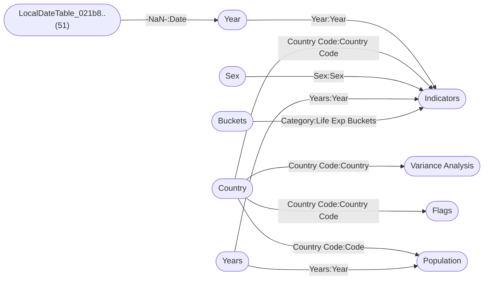

----

[Home](./index.md) > [Life expectancy v202009.pbix](Life%20expectancy%20v202009.pbix_dmv.md)

| [Information](#information) | [Model information](#model-information) | [Model relationships](#model-relationships) | [Business objects](#business-objects) | [Measures](#measures) | [Relationships](#relationships) | [Hierarchies](#hierarchies) | [Columns](#columns) |

----

# Information

Documentation for file **Life expectancy v202009.pbix**.

# Model information

| Param  | Value  |
|---|---|
| **Analyzed pbix file name** | `Life expectancy v202009.pbix` | 
| **Catalog name** | `9b5e89c8-4359-415d-bac6-0e3e30e353d8` | 
| **Port** | `59406`|
| **Description** | `-NaN-` | 
| **Date modified** | `2024-03-27T08:12:02` | 
| **Compatibility level** | `1567` | 

[Up](#information)

# Model relationships

[Up](#information)

# Business objects

| ID | NAME | DESCRIPTION | 
|----|------|-------------|
| 12 | Indicators | n/a |
| 9809 | Year | n/a |
| 9833 | Country | n/a |
| 26658 | Metrics | n/a |
| 39452 | Variance Analysis | n/a |
| 40740 | Flags | n/a |
| 53251 | Years | n/a |
| 53327 | Legend | n/a |
| 53529 | Population | n/a |
| 53830 | Buckets | n/a |
| 54512 | Extra Year | n/a |

[Up](#information)

# Measures

<table>
    <tr>
        <th> ID </th><th> TABLE </th><th> NAME </th><th> DESCRIPTION </th><th> EXPRESSION </th><th> IS_HIDDEN </th><th> STATE </th>
    </tr>
<tr>
        <td> 26197 </td><td> Indicators </td><td>  </td><td> n/a </td><td> <code> VAR __Count = 6

VAR __Min = MIN('Indicators'[Income share held by lowest 20%])

VAR __Max = MAX('Indicators'[Income share held by lowest 20%])

VAR __Difference = (__Max - __Min)

VAR __Size = IF(__Difference > 0, __Difference / __Count, 1)

VAR __BinNumber = 
  IF(
    ISBLANK('Indicators'[Income share held by lowest 20%]),
    BLANK(),
    ROUNDDOWN(('Indicators'[Income share held by lowest 20%] - __Min) / __Size, 0)
  )

RETURN
  IF(
    ISBLANK('Indicators'[Income share held by lowest 20%]),
    BLANK(),
    __Min + (MIN(__BinNumber, __Count - 1) * __Size)
  ) </code></td><td> False </td><td>  1 </td> 
    </tr>
<tr>
        <td> 34792 </td><td> Indicators </td><td>  </td><td> n/a </td><td> <code> VAR __Count = 8

VAR __Min = 
  MIN(
    'Indicators'[General government expenditure on health as a percentage of total expenditure on health]
  )

VAR __Max = 
  MAX(
    'Indicators'[General government expenditure on health as a percentage of total expenditure on health]
  )

VAR __Difference = (__Max - __Min)

VAR __Size = IF(__Difference > 0, __Difference / __Count, 1)

VAR __BinNumber = 
  INT(
    ('Indicators'[General government expenditure on health as a percentage of total expenditure on health] - __Min) / __Size
  )

RETURN
  IF(
    ISBLANK(
      'Indicators'[General government expenditure on health as a percentage of total expenditure on health]
    ),
    BLANK(),
    __Min + (MIN(__BinNumber, __Count - 1) * __Size)
  ) </code></td><td> False </td><td>  1 </td> 
    </tr>
<tr>
        <td> 38852 </td><td> Indicators </td><td>  </td><td> n/a </td><td> <code> If([Life expectancy (yrs)] < 55, "Low", If([Life expectancy (yrs)] >= 55 && [Life expectancy (yrs)] < 70, "Medium", "High")) </code></td><td> False </td><td>  1 </td> 
    </tr>
<tr>
        <td> 38907 </td><td> Indicators </td><td>  </td><td> n/a </td><td> <code> VAR __Count = 10

VAR __Min = MIN('Indicators'[GDP per capita (US $)])

VAR __Max = MAX('Indicators'[GDP per capita (US $)])

VAR __Difference = (__Max - __Min)

VAR __Size = IF(__Difference > 0, __Difference / __Count, 1)

VAR __BinNumber = 
  IF(
    ISBLANK('Indicators'[GDP per capita (US $)]),
    BLANK(),
    ROUNDDOWN(('Indicators'[GDP per capita (US $)] - __Min) / __Size, 0)
  )

RETURN
  IF(
    ISBLANK('Indicators'[GDP per capita (US $)]),
    BLANK(),
    __Min + (MIN(__BinNumber, __Count - 1) * __Size)
  ) </code></td><td> False </td><td>  1 </td> 
    </tr>
<tr>
        <td> 52558 </td><td> Indicators </td><td>  </td><td> n/a </td><td> <code> if(isblank(Indicators[Income share held by lowest 20%]), "null", if( Indicators[Income share held by lowest 20%] < 2, "less than 2%", if( Indicators[Income share held by lowest 20%] >= 2 && Indicators[Income share held by lowest 20%] < 4, "2% - 4%", if( Indicators[Income share held by lowest 20%] >= 4 && Indicators[Income share held by lowest 20%] < 6, "4% - 6%", if( Indicators[Income share held by lowest 20%] >= 6 && Indicators[Income share held by lowest 20%] < 8, "6% - 8%", "more than 8%"))))) </code></td><td> False </td><td>  1 </td> 
    </tr>
<tr>
        <td> 52613 </td><td> Indicators </td><td>  </td><td> n/a </td><td> <code> if( Indicators[People using at least basic drinking water services (% of population)]< 50, "Less than 50%", if( Indicators[People using at least basic drinking water services (% of population)] >= 50 && Indicators[People using at least basic drinking water services (% of population)] < 70, "50% - 70%", if( Indicators[People using at least basic drinking water services (% of population)] >= 70 && Indicators[People using at least basic drinking water services (% of population)] < 90, "70% - 90%", "More than 90%"))) </code></td><td> False </td><td>  1 </td> 
    </tr>
<tr>
        <td> 52710 </td><td> Indicators </td><td>  </td><td> n/a </td><td> <code> if(ISBLANK(Indicators[People using safely managed drinking water services (% of population)]), "null", if( Indicators[People using safely managed drinking water services (% of population)]< 25, "less than 25%", if( Indicators[People using safely managed drinking water services (% of population)]>= 25 && Indicators[People using safely managed drinking water services (% of population)] < 45, "25% - 45%", if( Indicators[People using safely managed drinking water services (% of population)] >= 45 && Indicators[People using safely managed drinking water services (% of population)] < 65, "45% - 65%", if( Indicators[People using safely managed drinking water services (% of population)] >= 65 && Indicators[People using safely managed drinking water services (% of population)] < 85, "65% - 85%" ,"more than 85%"))))) </code></td><td> False </td><td>  1 </td> 
    </tr>
<tr>
        <td> 52936 </td><td> Indicators </td><td>  </td><td> n/a </td><td> <code> if( Indicators[Hospital beds (per 10 000 population)] < 15 , "less than 15", if( Indicators[Hospital beds (per 10 000 population)] >= 15 && Indicators[Hospital beds (per 10 000 population)]< 30, "15 - 30", if(Indicators[Hospital beds (per 10 000 population)] >=30 && Indicators[Hospital beds (per 10 000 population)] < 45, "30 - 45", if( Indicators[Hospital beds (per 10 000 population)] >= 45 && Indicators[Hospital beds (per 10 000 population)] < 60, "45 - 60" ,"more than 60")))) </code></td><td> False </td><td>  1 </td> 
    </tr>
<tr>
        <td> 53182 </td><td> Indicators </td><td>  </td><td> n/a </td><td> <code> if( Indicators[Hib (Hib3) immunization coverage among 1-year-olds (%)] < 40, "less than 40%", if( Indicators[Hib (Hib3) immunization coverage among 1-year-olds (%)] >= 40 && Indicators[Hib (Hib3) immunization coverage among 1-year-olds (%)]  < 60, "40% - 60%", if( Indicators[Hib (Hib3) immunization coverage among 1-year-olds (%)]  >= 60 && Indicators[Hib (Hib3) immunization coverage among 1-year-olds (%)] < 80, "60% - 80", if( Indicators[Hib (Hib3) immunization coverage among 1-year-olds (%)] >= 80 &&Indicators[Hib (Hib3) immunization coverage among 1-year-olds (%)]  < 90, "80% - 90%" ,"more than 90%")))) </code></td><td> False </td><td>  1 </td> 
    </tr>
<tr>
        <td> 53737 </td><td> Indicators </td><td>  </td><td> n/a </td><td> <code> 
IF(Indicators[Life expectancy (yrs)]<30,20,
IF(Indicators[Life expectancy (yrs)]<45,30,
IF(Indicators[Life expectancy (yrs)]<60,45,
IF(Indicators[Life expectancy (yrs)]<70,60,
IF(Indicators[Life expectancy (yrs)]<80,70,
80))))
) </code></td><td> False </td><td>  1 </td> 
    </tr>
<tr>
        <td> 54399 </td><td> Indicators </td><td>  </td><td> n/a </td><td> <code> "All" </code></td><td> False </td><td>  1 </td> 
    </tr>
<tr>
        <td> 20 </td><td> DateTableTemplate_ee..(54) </td><td>  </td><td> n/a </td><td> <code> YEAR([Date]) </code></td><td> True </td><td>  1 </td> 
    </tr>
<tr>
        <td> 21 </td><td> DateTableTemplate_ee..(54) </td><td>  </td><td> n/a </td><td> <code> MONTH([Date]) </code></td><td> True </td><td>  1 </td> 
    </tr>
<tr>
        <td> 22 </td><td> DateTableTemplate_ee..(54) </td><td>  </td><td> n/a </td><td> <code> FORMAT([Date], "MMMM") </code></td><td> True </td><td>  1 </td> 
    </tr>
<tr>
        <td> 23 </td><td> DateTableTemplate_ee..(54) </td><td>  </td><td> n/a </td><td> <code> INT(([MonthNo] + 2) / 3) </code></td><td> True </td><td>  1 </td> 
    </tr>
<tr>
        <td> 24 </td><td> DateTableTemplate_ee..(54) </td><td>  </td><td> n/a </td><td> <code> "Qtr " & [QuarterNo] </code></td><td> True </td><td>  1 </td> 
    </tr>
<tr>
        <td> 25 </td><td> DateTableTemplate_ee..(54) </td><td>  </td><td> n/a </td><td> <code> DAY([Date]) </code></td><td> True </td><td>  1 </td> 
    </tr>
<tr>
        <td> 54344 </td><td> Country </td><td>  </td><td> n/a </td><td> <code> "Earth" </code></td><td> False </td><td>  1 </td> 
    </tr>
<tr>
        <td> 38993 </td><td> LocalDateTable_021b8..(51) </td><td>  </td><td> n/a </td><td> <code> YEAR([Date]) </code></td><td> True </td><td>  1 </td> 
    </tr>
<tr>
        <td> 38994 </td><td> LocalDateTable_021b8..(51) </td><td>  </td><td> n/a </td><td> <code> MONTH([Date]) </code></td><td> True </td><td>  1 </td> 
    </tr>
<tr>
        <td> 38995 </td><td> LocalDateTable_021b8..(51) </td><td>  </td><td> n/a </td><td> <code> FORMAT([Date], "MMMM") </code></td><td> True </td><td>  1 </td> 
    </tr>
<tr>
        <td> 38996 </td><td> LocalDateTable_021b8..(51) </td><td>  </td><td> n/a </td><td> <code> INT(([MonthNo] + 2) / 3) </code></td><td> True </td><td>  1 </td> 
    </tr>
<tr>
        <td> 38997 </td><td> LocalDateTable_021b8..(51) </td><td>  </td><td> n/a </td><td> <code> "Qtr " & [QuarterNo] </code></td><td> True </td><td>  1 </td> 
    </tr>
<tr>
        <td> 38998 </td><td> LocalDateTable_021b8..(51) </td><td>  </td><td> n/a </td><td> <code> DAY([Date]) </code></td><td> True </td><td>  1 </td> 
    </tr>
<tr>
        <td> 54454 </td><td> Years </td><td>  </td><td> n/a </td><td> <code> "all" </code></td><td> False </td><td>  1 </td> 
    </tr>
</table>

[Up](#information)

# Relationships 

| ID | FROM_TABLE | TO_TABLE | FROM:TO CARDINALITY | NAME | IS_ACTIVE  |
|----|------------|----------|---------------------|------|------------|
| 13648 | Indicators[Year] | Year[Year] | 2:1 | 17e495ba-28c8-41ea-925e-d8dea592d611 | True |
| 13651 | Indicators[Country Code] | Country[Country Code] | 2:1 | 6ea420da-e7ae-4b8f-9c91-df122a9a7203 | True |
| 14012 | Indicators[Sex] | Sex[Sex] | 2:1 | 6add05ba-fcb0-4cc2-9a55-f013416baa1f | True |
| 38989 | Year[Date] | LocalDateTable_021b8..(51)[-NaN-] | 2:1 | af7cdcad-c7ce-42fc-88e8-db4ff74e4221 | True |
| 39906 | Variance Analysis[Country] | Country[Country Code] | 1:1 | 9b732245-607f-44ff-92eb-003f16d1239b | True |
| 40922 | Flags[Country Code] | Country[Country Code] | 2:1 | 2c602a9b-38ca-4726-805d-4bbc3e6e845d | True |
| 53310 | Indicators[Year] | Years[Years] | 2:1 | 54728093-5212-47d4-8be1-08fb5b094257 | True |
| 53703 | Population[Code] | Country[Country Code] | 2:1 | 2c833854-30da-49ab-bdaf-b26f77a6f7ec | True |
| 53792 | Population[Year] | Years[Years] | 2:1 | 5f31afcd-18a2-438a-9d89-8397eafbaf81 | True |
| 53982 | Indicators[Life Exp Buckets] | Buckets[Category] | 2:1 | 32f3749b-0b94-451d-8b0d-8f698bf43117 | True |

[Up](#information)

# Hierarchies 

| ID | TABLE | NAME | DESCRIPTION  | IS_HIDDEN | 
|----|----------|------|--------------|-----------|
| 28 |DateTableTemplate_ee..(54) | Date Hierarchy | n/a | False | 
| 39000 |LocalDateTable_021b8..(51) | Date Hierarchy | n/a | False | 

[Up](#information)

# Columns 

<table>
    <tr>
        <th> ID </th><th> TABLE </th><th> EXPLICIT_NAME </th><th> DESCRIPTION </th><th> IS_HIDDEN </th><th> EXPRESSION </th>
    </tr>
<tr>
        <td> 113 </td><td> Indicators </td><td> Year </td><td> n/a </td><td> False </td><td><code> n/a </code></td>
    </tr>

<tr>
        <td> 114 </td><td> Indicators </td><td> Region </td><td> n/a </td><td> False </td><td><code> n/a </code></td>
    </tr>

<tr>
        <td> 115 </td><td> Indicators </td><td> Country Code </td><td> n/a </td><td> False </td><td><code> n/a </code></td>
    </tr>

<tr>
        <td> 116 </td><td> Indicators </td><td> Country </td><td> n/a </td><td> False </td><td><code> n/a </code></td>
    </tr>

<tr>
        <td> 117 </td><td> Indicators </td><td> Sex </td><td> n/a </td><td> False </td><td><code> n/a </code></td>
    </tr>

<tr>
        <td> 123 </td><td> Indicators </td><td> Cholera case fatalit..(26) </td><td> n/a </td><td> False </td><td><code> n/a </code></td>
    </tr>

<tr>
        <td> 126 </td><td> Indicators </td><td> Number of neonatal d..(37) </td><td> n/a </td><td> False </td><td><code> n/a </code></td>
    </tr>

<tr>
        <td> 130 </td><td> Indicators </td><td> Malaria - number of ..(35) </td><td> n/a </td><td> False </td><td><code> n/a </code></td>
    </tr>

<tr>
        <td> 131 </td><td> Indicators </td><td> Estimated number of ..(34) </td><td> n/a </td><td> False </td><td><code> n/a </code></td>
    </tr>

<tr>
        <td> 136 </td><td> Indicators </td><td> Under-five mortality..(78) </td><td> n/a </td><td> False </td><td><code> n/a </code></td>
    </tr>

<tr>
        <td> 137 </td><td> Indicators </td><td> Children aged <5 yea..(66) </td><td> n/a </td><td> False </td><td><code> n/a </code></td>
    </tr>

<tr>
        <td> 138 </td><td> Indicators </td><td> Incidence of tubercu..(59) </td><td> n/a </td><td> False </td><td><code> n/a </code></td>
    </tr>

<tr>
        <td> 139 </td><td> Indicators </td><td> Prevalence of tuberc..(51) </td><td> n/a </td><td> False </td><td><code> n/a </code></td>
    </tr>

<tr>
        <td> 140 </td><td> Indicators </td><td> Births attended by s..(71) </td><td> n/a </td><td> False </td><td><code> n/a </code></td>
    </tr>

<tr>
        <td> 141 </td><td> Indicators </td><td> Maternal mortality r..(50) </td><td> n/a </td><td> False </td><td><code> n/a </code></td>
    </tr>

<tr>
        <td> 151 </td><td> Indicators </td><td> Life expectancy at b..(32) </td><td> n/a </td><td> False </td><td><code> n/a </code></td>
    </tr>

<tr>
        <td> 152 </td><td> Indicators </td><td> Neonatal mortality r..(46) </td><td> n/a </td><td> False </td><td><code> n/a </code></td>
    </tr>

<tr>
        <td> 153 </td><td> Indicators </td><td> Life expectancy at a..(33) </td><td> n/a </td><td> False </td><td><code> n/a </code></td>
    </tr>

<tr>
        <td> 180 </td><td> Indicators </td><td> Hepatitis B (HepB3) ..(63) </td><td> n/a </td><td> False </td><td><code> n/a </code></td>
    </tr>

<tr>
        <td> 182 </td><td> Indicators </td><td> Hib (Hib3) immunizat..(54) </td><td> n/a </td><td> False </td><td><code> n/a </code></td>
    </tr>

<tr>
        <td> 183 </td><td> Indicators </td><td> Hospital beds (per 1..(37) </td><td> n/a </td><td> False </td><td><code> n/a </code></td>
    </tr>

<tr>
        <td> 189 </td><td> Indicators </td><td> General government e..(88) </td><td> n/a </td><td> False </td><td><code> n/a </code></td>
    </tr>

<tr>
        <td> 195 </td><td> Indicators </td><td> General government e..(87) </td><td> n/a </td><td> False </td><td><code> n/a </code></td>
    </tr>

<tr>
        <td> 197 </td><td> Indicators </td><td> Measles-containing-v..(88) </td><td> n/a </td><td> False </td><td><code> n/a </code></td>
    </tr>

<tr>
        <td> 201 </td><td> Indicators </td><td> Gross national incom..(45) </td><td> n/a </td><td> False </td><td><code> n/a </code></td>
    </tr>

<tr>
        <td> 216 </td><td> Indicators </td><td> Number of community ..(34) </td><td> n/a </td><td> False </td><td><code> n/a </code></td>
    </tr>

<tr>
        <td> 217 </td><td> Indicators </td><td> Community health wor..(56) </td><td> n/a </td><td> False </td><td><code> n/a </code></td>
    </tr>

<tr>
        <td> 220 </td><td> Indicators </td><td> Children aged <5 yea..(74) </td><td> n/a </td><td> False </td><td><code> n/a </code></td>
    </tr>

<tr>
        <td> 4827 </td><td> Indicators </td><td> Income share held by..(31) </td><td> n/a </td><td> False </td><td><code> n/a </code></td>
    </tr>

<tr>
        <td> 4838 </td><td> Indicators </td><td> % of population livi..(49) </td><td> n/a </td><td> False </td><td><code> n/a </code></td>
    </tr>

<tr>
        <td> 4970 </td><td> Indicators </td><td> Net national income ..(30) </td><td> n/a </td><td> False </td><td><code> n/a </code></td>
    </tr>

<tr>
        <td> 4992 </td><td> Indicators </td><td> GDP per capita (curr..(28) </td><td> n/a </td><td> False </td><td><code> n/a </code></td>
    </tr>

<tr>
        <td> 5124 </td><td> Indicators </td><td> Percentage of female..(49) </td><td> n/a </td><td> False </td><td><code> n/a </code></td>
    </tr>

<tr>
        <td> 5190 </td><td> Indicators </td><td> Female pupils below ..(69) </td><td> n/a </td><td> False </td><td><code> n/a </code></td>
    </tr>

<tr>
        <td> 14315 </td><td> Indicators </td><td> Life expectancy (yrs..(21) </td><td> n/a </td><td> False </td><td><code> n/a </code></td>
    </tr>

<tr>
        <td> 18579 </td><td> Indicators </td><td> GDP per capita (US $..(21) </td><td> n/a </td><td> False </td><td><code> n/a </code></td>
    </tr>

<tr>
        <td> 26197 </td><td> Indicators </td><td> Income share held by..(38) </td><td> n/a </td><td> False </td><td><code> VAR __Count = 6

VAR __Min = MIN('Indicators'[Income share held by lowest 20%])

VAR __Max = MAX('Indicators'[Income share held by lowest 20%])

VAR __Difference = (__Max - __Min)

VAR __Size = IF(__Difference > 0, __Difference / __Count, 1)

VAR __BinNumber = 
  IF(
    ISBLANK('Indicators'[Income share held by lowest 20%]),
    BLANK(),
    ROUNDDOWN(('Indicators'[Income share held by lowest 20%] - __Min) / __Size, 0)
  )

RETURN
  IF(
    ISBLANK('Indicators'[Income share held by lowest 20%]),
    BLANK(),
    __Min + (MIN(__BinNumber, __Count - 1) * __Size)
  ) </code></td>
    </tr>

<tr>
        <td> 34792 </td><td> Indicators </td><td> General government e..(94) </td><td> n/a </td><td> False </td><td><code> VAR __Count = 8

VAR __Min = 
  MIN(
    'Indicators'[General government expenditure on health as a percentage of total expenditure on health]
  )

VAR __Max = 
  MAX(
    'Indicators'[General government expenditure on health as a percentage of total expenditure on health]
  )

VAR __Difference = (__Max - __Min)

VAR __Size = IF(__Difference > 0, __Difference / __Count, 1)

VAR __BinNumber = 
  INT(
    ('Indicators'[General government expenditure on health as a percentage of total expenditure on health] - __Min) / __Size
  )

RETURN
  IF(
    ISBLANK(
      'Indicators'[General government expenditure on health as a percentage of total expenditure on health]
    ),
    BLANK(),
    __Min + (MIN(__BinNumber, __Count - 1) * __Size)
  ) </code></td>
    </tr>

<tr>
        <td> 38852 </td><td> Indicators </td><td> High/Low </td><td> n/a </td><td> False </td><td><code> If([Life expectancy (yrs)] < 55, "Low", If([Life expectancy (yrs)] >= 55 && [Life expectancy (yrs)] < 70, "Medium", "High")) </code></td>
    </tr>

<tr>
        <td> 38907 </td><td> Indicators </td><td> GDP per capita (curr..(36) </td><td> n/a </td><td> False </td><td><code> VAR __Count = 10

VAR __Min = MIN('Indicators'[GDP per capita (US $)])

VAR __Max = MAX('Indicators'[GDP per capita (US $)])

VAR __Difference = (__Max - __Min)

VAR __Size = IF(__Difference > 0, __Difference / __Count, 1)

VAR __BinNumber = 
  IF(
    ISBLANK('Indicators'[GDP per capita (US $)]),
    BLANK(),
    ROUNDDOWN(('Indicators'[GDP per capita (US $)] - __Min) / __Size, 0)
  )

RETURN
  IF(
    ISBLANK('Indicators'[GDP per capita (US $)]),
    BLANK(),
    __Min + (MIN(__BinNumber, __Count - 1) * __Size)
  ) </code></td>
    </tr>

<tr>
        <td> 48423 </td><td> Indicators </td><td> People using at leas..(69) </td><td> n/a </td><td> False </td><td><code> n/a </code></td>
    </tr>

<tr>
        <td> 48432 </td><td> Indicators </td><td> People using safely ..(69) </td><td> n/a </td><td> False </td><td><code> n/a </code></td>
    </tr>

<tr>
        <td> 52558 </td><td> Indicators </td><td> % of income held by ..(31) </td><td> n/a </td><td> False </td><td><code> if(isblank(Indicators[Income share held by lowest 20%]), "null", if( Indicators[Income share held by lowest 20%] < 2, "less than 2%", if( Indicators[Income share held by lowest 20%] >= 2 && Indicators[Income share held by lowest 20%] < 4, "2% - 4%", if( Indicators[Income share held by lowest 20%] >= 4 && Indicators[Income share held by lowest 20%] < 6, "4% - 6%", if( Indicators[Income share held by lowest 20%] >= 6 && Indicators[Income share held by lowest 20%] < 8, "6% - 8%", "more than 8%"))))) </code></td>
    </tr>

<tr>
        <td> 52613 </td><td> Indicators </td><td> Basic drinking water..(47) </td><td> n/a </td><td> False </td><td><code> if( Indicators[People using at least basic drinking water services (% of population)]< 50, "Less than 50%", if( Indicators[People using at least basic drinking water services (% of population)] >= 50 && Indicators[People using at least basic drinking water services (% of population)] < 70, "50% - 70%", if( Indicators[People using at least basic drinking water services (% of population)] >= 70 && Indicators[People using at least basic drinking water services (% of population)] < 90, "70% - 90%", "More than 90%"))) </code></td>
    </tr>

<tr>
        <td> 52710 </td><td> Indicators </td><td> Safe drinking water ..(46) </td><td> n/a </td><td> False </td><td><code> if(ISBLANK(Indicators[People using safely managed drinking water services (% of population)]), "null", if( Indicators[People using safely managed drinking water services (% of population)]< 25, "less than 25%", if( Indicators[People using safely managed drinking water services (% of population)]>= 25 && Indicators[People using safely managed drinking water services (% of population)] < 45, "25% - 45%", if( Indicators[People using safely managed drinking water services (% of population)] >= 45 && Indicators[People using safely managed drinking water services (% of population)] < 65, "45% - 65%", if( Indicators[People using safely managed drinking water services (% of population)] >= 65 && Indicators[People using safely managed drinking water services (% of population)] < 85, "65% - 85%" ,"more than 85%"))))) </code></td>
    </tr>

<tr>
        <td> 52936 </td><td> Indicators </td><td> Hospital beds per 10..(31) </td><td> n/a </td><td> False </td><td><code> if( Indicators[Hospital beds (per 10 000 population)] < 15 , "less than 15", if( Indicators[Hospital beds (per 10 000 population)] >= 15 && Indicators[Hospital beds (per 10 000 population)]< 30, "15 - 30", if(Indicators[Hospital beds (per 10 000 population)] >=30 && Indicators[Hospital beds (per 10 000 population)] < 45, "30 - 45", if( Indicators[Hospital beds (per 10 000 population)] >= 45 && Indicators[Hospital beds (per 10 000 population)] < 60, "45 - 60" ,"more than 60")))) </code></td>
    </tr>

<tr>
        <td> 53182 </td><td> Indicators </td><td> Hib3 immunization co..(48) </td><td> n/a </td><td> False </td><td><code> if( Indicators[Hib (Hib3) immunization coverage among 1-year-olds (%)] < 40, "less than 40%", if( Indicators[Hib (Hib3) immunization coverage among 1-year-olds (%)] >= 40 && Indicators[Hib (Hib3) immunization coverage among 1-year-olds (%)]  < 60, "40% - 60%", if( Indicators[Hib (Hib3) immunization coverage among 1-year-olds (%)]  >= 60 && Indicators[Hib (Hib3) immunization coverage among 1-year-olds (%)] < 80, "60% - 80", if( Indicators[Hib (Hib3) immunization coverage among 1-year-olds (%)] >= 80 &&Indicators[Hib (Hib3) immunization coverage among 1-year-olds (%)]  < 90, "80% - 90%" ,"more than 90%")))) </code></td>
    </tr>

<tr>
        <td> 53737 </td><td> Indicators </td><td> Life Exp Buckets </td><td> n/a </td><td> False </td><td><code> 
IF(Indicators[Life expectancy (yrs)]<30,20,
IF(Indicators[Life expectancy (yrs)]<45,30,
IF(Indicators[Life expectancy (yrs)]<60,45,
IF(Indicators[Life expectancy (yrs)]<70,60,
IF(Indicators[Life expectancy (yrs)]<80,70,
80))))
) </code></td>
    </tr>

<tr>
        <td> 54399 </td><td> Indicators </td><td> All Cells </td><td> n/a </td><td> False </td><td><code> "All" </code></td>
    </tr>

<tr>
        <td> 55451 </td><td> Indicators </td><td> Measles - number of ..(34) </td><td> n/a </td><td> False </td><td><code> n/a </code></td>
    </tr>

<tr>
        <td> 55460 </td><td> Indicators </td><td> Diphtheria tetanus t..(90) </td><td> n/a </td><td> False </td><td><code> n/a </code></td>
    </tr>

<tr>
        <td> 9813 </td><td> Year </td><td> Year </td><td> n/a </td><td> False </td><td><code> n/a </code></td>
    </tr>

<tr>
        <td> 38991 </td><td> Year </td><td> Date </td><td> n/a </td><td> False </td><td><code> n/a </code></td>
    </tr>

<tr>
        <td> 9837 </td><td> Country </td><td> Country </td><td> n/a </td><td> False </td><td><code> n/a </code></td>
    </tr>

<tr>
        <td> 9838 </td><td> Country </td><td> Country Code </td><td> n/a </td><td> False </td><td><code> n/a </code></td>
    </tr>

<tr>
        <td> 26234 </td><td> Country </td><td> Region </td><td> n/a </td><td> False </td><td><code> n/a </code></td>
    </tr>

<tr>
        <td> 26364 </td><td> Country </td><td> Continent </td><td> n/a </td><td> False </td><td><code> n/a </code></td>
    </tr>

<tr>
        <td> 54344 </td><td> Country </td><td> World </td><td> n/a </td><td> False </td><td><code> "Earth" </code></td>
    </tr>

<tr>
        <td> 39456 </td><td> Variance Analysis </td><td> Maternal Mortality C..(25) </td><td> n/a </td><td> False </td><td><code> n/a </code></td>
    </tr>

<tr>
        <td> 39457 </td><td> Variance Analysis </td><td> Maternal Mortality </td><td> n/a </td><td> False </td><td><code> n/a </code></td>
    </tr>

<tr>
        <td> 39458 </td><td> Variance Analysis </td><td> Malaria Cases Change </td><td> n/a </td><td> False </td><td><code> n/a </code></td>
    </tr>

<tr>
        <td> 39459 </td><td> Variance Analysis </td><td> Malaria Cases </td><td> n/a </td><td> False </td><td><code> n/a </code></td>
    </tr>

<tr>
        <td> 39460 </td><td> Variance Analysis </td><td> Neonatal Mortality C..(25) </td><td> n/a </td><td> False </td><td><code> n/a </code></td>
    </tr>

<tr>
        <td> 39461 </td><td> Variance Analysis </td><td> Neonatal Mortality </td><td> n/a </td><td> False </td><td><code> n/a </code></td>
    </tr>

<tr>
        <td> 39462 </td><td> Variance Analysis </td><td> GDP Change </td><td> n/a </td><td> False </td><td><code> n/a </code></td>
    </tr>

<tr>
        <td> 39463 </td><td> Variance Analysis </td><td> GDP per capita </td><td> n/a </td><td> False </td><td><code> n/a </code></td>
    </tr>

<tr>
        <td> 39464 </td><td> Variance Analysis </td><td> Pupil Teacher Ratio </td><td> n/a </td><td> False </td><td><code> n/a </code></td>
    </tr>

<tr>
        <td> 39465 </td><td> Variance Analysis </td><td> Pupil Teacher Ratio ..(26) </td><td> n/a </td><td> False </td><td><code> n/a </code></td>
    </tr>

<tr>
        <td> 39466 </td><td> Variance Analysis </td><td> Tuberculosis Inciden..(29) </td><td> n/a </td><td> False </td><td><code> n/a </code></td>
    </tr>

<tr>
        <td> 39467 </td><td> Variance Analysis </td><td> Tuberculosis Inciden..(22) </td><td> n/a </td><td> False </td><td><code> n/a </code></td>
    </tr>

<tr>
        <td> 39468 </td><td> Variance Analysis </td><td> Country </td><td> n/a </td><td> False </td><td><code> n/a </code></td>
    </tr>

<tr>
        <td> 54967 </td><td> Variance Analysis </td><td> Measles Vaccine </td><td> n/a </td><td> False </td><td><code> n/a </code></td>
    </tr>

<tr>
        <td> 54976 </td><td> Variance Analysis </td><td> Measles Vaccines </td><td> n/a </td><td> False </td><td><code> n/a </code></td>
    </tr>

<tr>
        <td> 54987 </td><td> Variance Analysis </td><td> Hib3 Immunizations % </td><td> n/a </td><td> False </td><td><code> n/a </code></td>
    </tr>

<tr>
        <td> 54998 </td><td> Variance Analysis </td><td> Hib3 Immunizations </td><td> n/a </td><td> False </td><td><code> n/a </code></td>
    </tr>

<tr>
        <td> 55009 </td><td> Variance Analysis </td><td> Water Services </td><td> n/a </td><td> False </td><td><code> n/a </code></td>
    </tr>

<tr>
        <td> 55020 </td><td> Variance Analysis </td><td> Water Services Acces..(21) </td><td> n/a </td><td> False </td><td><code> n/a </code></td>
    </tr>

<tr>
        <td> 40744 </td><td> Flags </td><td> Country Code </td><td> n/a </td><td> False </td><td><code> n/a </code></td>
    </tr>

<tr>
        <td> 40745 </td><td> Flags </td><td> Country </td><td> n/a </td><td> False </td><td><code> n/a </code></td>
    </tr>

<tr>
        <td> 40746 </td><td> Flags </td><td> Images File Name </td><td> n/a </td><td> False </td><td><code> n/a </code></td>
    </tr>

<tr>
        <td> 40747 </td><td> Flags </td><td> ImageURL </td><td> n/a </td><td> False </td><td><code> n/a </code></td>
    </tr>

<tr>
        <td> 53255 </td><td> Years </td><td> Years </td><td> n/a </td><td> False </td><td><code> n/a </code></td>
    </tr>

<tr>
        <td> 54454 </td><td> Years </td><td> All </td><td> n/a </td><td> False </td><td><code> "all" </code></td>
    </tr>

<tr>
        <td> 53331 </td><td> Legend </td><td> Metric </td><td> n/a </td><td> False </td><td><code> n/a </code></td>
    </tr>

<tr>
        <td> 53332 </td><td> Legend </td><td> Bubble01 </td><td> n/a </td><td> False </td><td><code> n/a </code></td>
    </tr>

<tr>
        <td> 53333 </td><td> Legend </td><td> Bubble02 </td><td> n/a </td><td> False </td><td><code> n/a </code></td>
    </tr>

<tr>
        <td> 53334 </td><td> Legend </td><td> Bubble03 </td><td> n/a </td><td> False </td><td><code> n/a </code></td>
    </tr>

<tr>
        <td> 53335 </td><td> Legend </td><td> Bubble04 </td><td> n/a </td><td> False </td><td><code> n/a </code></td>
    </tr>

<tr>
        <td> 53336 </td><td> Legend </td><td> Bubble05 </td><td> n/a </td><td> False </td><td><code> n/a </code></td>
    </tr>

<tr>
        <td> 53533 </td><td> Population </td><td> Entity </td><td> n/a </td><td> False </td><td><code> n/a </code></td>
    </tr>

<tr>
        <td> 53534 </td><td> Population </td><td> Code </td><td> n/a </td><td> False </td><td><code> n/a </code></td>
    </tr>

<tr>
        <td> 53535 </td><td> Population </td><td> Year </td><td> n/a </td><td> False </td><td><code> n/a </code></td>
    </tr>

<tr>
        <td> 53536 </td><td> Population </td><td> Population </td><td> n/a </td><td> False </td><td><code> n/a </code></td>
    </tr>

<tr>
        <td> 53834 </td><td> Buckets </td><td> Bucket </td><td> n/a </td><td> False </td><td><code> n/a </code></td>
    </tr>

<tr>
        <td> 53835 </td><td> Buckets </td><td> Category </td><td> n/a </td><td> False </td><td><code> n/a </code></td>
    </tr>

<tr>
        <td> 53836 </td><td> Buckets </td><td> Bucket Sort </td><td> n/a </td><td> False </td><td><code> n/a </code></td>
    </tr>

<tr>
        <td> 53837 </td><td> Buckets </td><td> Bucket_2 </td><td> n/a </td><td> False </td><td><code> n/a </code></td>
    </tr>

<tr>
        <td> 54516 </td><td> Extra Year </td><td> Extra year </td><td> n/a </td><td> False </td><td><code> n/a </code></td>
    </tr>

</table>

[Up](#information)

----

Generated at 27.03.2024 12:50:19 by <a href='https://github.com/dop12/pbix_doc'>PBIX DOC PROJECT</a> Git version: 644f883

