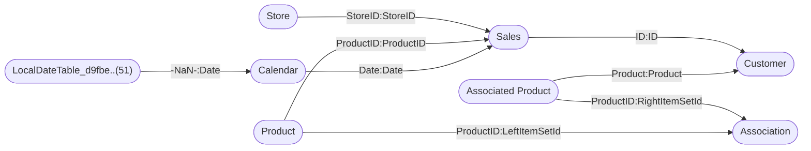

----

[Home](./index.md) > [Sales and Returns Sample v201912.pbix](Sales%20and%20Returns%20Sample%20v201912.pbix_dmv.md)

| [Information](#information) | [Model information](#model-information) | [Model relationships](#model-relationships) | [Business objects](#business-objects) | [Measures](#measures) | [Relationships](#relationships) | [Hierarchies](#hierarchies) | [Columns](#columns) |

----

# Information

Documentation for file **Sales and Returns Sample v201912.pbix**.

# Model information

| Param  | Value  |
|---|---|
| **Analyzed pbix file name** | `Sales and Returns Sample v201912.pbix` | 
| **Catalog name** | `0eebc864-d7dd-4de1-975f-d5e4c5a38dce` | 
| **Port** | `57313`|
| **Description** | `-NaN-` | 
| **Date modified** | `2022-09-22T23:05:11` | 
| **Compatibility level** | `1550` | 

[Up](#information)

# Model relationships

[Up](#information)

# Business objects

| ID | NAME | DESCRIPTION | 
|----|------|-------------|
| 12 | Association | n/a |
| 174 | Sales | n/a |
| 988 | Store | n/a |
| 1502 | Calendar | n/a |
| 2055 | Associated Product | n/a |
| 2962 | Analysis DAX | n/a |
| 3062 | Product | n/a |
| 4517 | Design DAX | n/a |
| 34427 | % Return Rate | n/a |
| 34809 | Customer | n/a |
| 35347 | Issues and Promotions | n/a |
| 36150 | Age | n/a |
| 38954 | STable | n/a |
| 39138 | Tooltip Info | n/a |
| 40780 | Tooltip Info2 | n/a |
| 40909 | Details | n/a |

[Up](#information)

# Measures

<table>
    <tr>
        <th> ID </th><th> TABLE </th><th> NAME </th><th> DESCRIPTION </th><th> EXPRESSION </th><th> IS_HIDDEN </th><th> STATE </th>
    </tr>
<tr>
        <td> 20 </td><td> DateTableTemplate_81..(54) </td><td>  </td><td> n/a </td><td> <code> YEAR([Date]) </code></td><td> True </td><td>  1 </td> 
    </tr>
<tr>
        <td> 21 </td><td> DateTableTemplate_81..(54) </td><td>  </td><td> n/a </td><td> <code> MONTH([Date]) </code></td><td> True </td><td>  1 </td> 
    </tr>
<tr>
        <td> 22 </td><td> DateTableTemplate_81..(54) </td><td>  </td><td> n/a </td><td> <code> FORMAT([Date], "MMMM") </code></td><td> True </td><td>  1 </td> 
    </tr>
<tr>
        <td> 23 </td><td> DateTableTemplate_81..(54) </td><td>  </td><td> n/a </td><td> <code> INT(([MonthNo] + 2) / 3) </code></td><td> True </td><td>  1 </td> 
    </tr>
<tr>
        <td> 24 </td><td> DateTableTemplate_81..(54) </td><td>  </td><td> n/a </td><td> <code> "Qtr " & [QuarterNo] </code></td><td> True </td><td>  1 </td> 
    </tr>
<tr>
        <td> 25 </td><td> DateTableTemplate_81..(54) </td><td>  </td><td> n/a </td><td> <code> DAY([Date]) </code></td><td> True </td><td>  1 </td> 
    </tr>
<tr>
        <td> 39062 </td><td> Calendar </td><td>  </td><td> n/a </td><td> <code> "" </code></td><td> False </td><td>  1 </td> 
    </tr>
<tr>
        <td> 1512 </td><td> LocalDateTable_d9fbe..(51) </td><td>  </td><td> n/a </td><td> <code> YEAR([Date]) </code></td><td> True </td><td>  1 </td> 
    </tr>
<tr>
        <td> 1513 </td><td> LocalDateTable_d9fbe..(51) </td><td>  </td><td> n/a </td><td> <code> MONTH([Date]) </code></td><td> True </td><td>  1 </td> 
    </tr>
<tr>
        <td> 1514 </td><td> LocalDateTable_d9fbe..(51) </td><td>  </td><td> n/a </td><td> <code> FORMAT([Date], "MMMM") </code></td><td> True </td><td>  1 </td> 
    </tr>
<tr>
        <td> 1515 </td><td> LocalDateTable_d9fbe..(51) </td><td>  </td><td> n/a </td><td> <code> INT(([MonthNo] + 2) / 3) </code></td><td> True </td><td>  1 </td> 
    </tr>
<tr>
        <td> 1516 </td><td> LocalDateTable_d9fbe..(51) </td><td>  </td><td> n/a </td><td> <code> "Qtr " & [QuarterNo] </code></td><td> True </td><td>  1 </td> 
    </tr>
<tr>
        <td> 1517 </td><td> LocalDateTable_d9fbe..(51) </td><td>  </td><td> n/a </td><td> <code> DAY([Date]) </code></td><td> True </td><td>  1 </td> 
    </tr>
<tr>
        <td> 40216 </td><td> Associated Product </td><td>  </td><td> n/a </td><td> <code> "#ffffff" </code></td><td> False </td><td>  1 </td> 
    </tr>
<tr>
        <td> 39282 </td><td> Tooltip Info </td><td>  </td><td> n/a </td><td> <code> " " </code></td><td> False </td><td>  1 </td> 
    </tr>
</table>

[Up](#information)

# Relationships 

| ID | FROM_TABLE | TO_TABLE | FROM:TO CARDINALITY | NAME | IS_ACTIVE  |
|----|------------|----------|---------------------|------|------------|
| 1508 | Calendar[Date] | LocalDateTable_d9fbe..(51)[-NaN-] | 2:1 | 677d2c0d-f04e-4bfb-ab65-d6e85634f934 | True |
| 2139 | Association[RightItemSetId] | Associated Product[ProductID] | 2:1 | 708dbd48-5eb4-4303-9248-e96d09238555 | True |
| 31586 | Sales[StoreID] | Store[StoreID] | 2:1 | ebdef1d9-12f1-42bd-8a10-738d6e1c950d | True |
| 32585 | Sales[ProductID] | Product[ProductID] | 2:1 | a826c6b3-bded-41a8-8f05-5a9ee4812391 | True |
| 33685 | Sales[Date] | Calendar[Date] | 2:1 | a3dbf965-d829-4162-96fc-d8c4a82aaefc | True |
| 35266 | Customer[ID] | Sales[ID] | 1:1 | bd728e6c-e5e7-4b83-98c6-677efdcc0eb6 | True |
| 39372 | Association[LeftItemSetId] | Product[ProductID] | 2:1 | fc9659a9-cbb8-4acb-9331-54826be4ab0a | True |
| 40018 | Product[Product] | Associated Product[Product] | 1:1 | 5fb6421a-c1c5-4969-95e5-0939e04d5c72 | False |
| 40023 | Customer[Product] | Associated Product[Product] | 2:1 | a8a5301f-8eb0-4f8a-8182-c2455b89988a | True |

[Up](#information)

# Hierarchies 

| ID | TABLE | NAME | DESCRIPTION  | IS_HIDDEN | 
|----|----------|------|--------------|-----------|
| 28 |DateTableTemplate_81..(54) | Date Hierarchy | n/a | False | 
| 1524 |LocalDateTable_d9fbe..(51) | Date Hierarchy | n/a | False | 

[Up](#information)

# Columns 

<table>
    <tr>
        <th> ID </th><th> TABLE </th><th> EXPLICIT_NAME </th><th> DESCRIPTION </th><th> IS_HIDDEN </th><th> EXPRESSION </th>
    </tr>
<tr>
        <td> 113 </td><td> Association </td><td> RuleID </td><td> n/a </td><td> False </td><td><code> n/a </code></td>
    </tr>

<tr>
        <td> 114 </td><td> Association </td><td> LeftItemSetId </td><td> n/a </td><td> False </td><td><code> n/a </code></td>
    </tr>

<tr>
        <td> 115 </td><td> Association </td><td> RightItemSetId </td><td> n/a </td><td> False </td><td><code> n/a </code></td>
    </tr>

<tr>
        <td> 116 </td><td> Association </td><td> Probability </td><td> n/a </td><td> False </td><td><code> n/a </code></td>
    </tr>

<tr>
        <td> 117 </td><td> Association </td><td> Importance </td><td> n/a </td><td> False </td><td><code> n/a </code></td>
    </tr>

<tr>
        <td> 118 </td><td> Association </td><td> Support </td><td> n/a </td><td> False </td><td><code> n/a </code></td>
    </tr>

<tr>
        <td> 30070 </td><td> Sales </td><td> ProductID </td><td> n/a </td><td> False </td><td><code> n/a </code></td>
    </tr>

<tr>
        <td> 30081 </td><td> Sales </td><td> StoreID </td><td> n/a </td><td> False </td><td><code> n/a </code></td>
    </tr>

<tr>
        <td> 30103 </td><td> Sales </td><td> Status </td><td> n/a </td><td> False </td><td><code> n/a </code></td>
    </tr>

<tr>
        <td> 32332 </td><td> Sales </td><td> ID </td><td> n/a </td><td> False </td><td><code> n/a </code></td>
    </tr>

<tr>
        <td> 32341 </td><td> Sales </td><td> Unit </td><td> n/a </td><td> False </td><td><code> n/a </code></td>
    </tr>

<tr>
        <td> 32620 </td><td> Sales </td><td> Amount </td><td> n/a </td><td> False </td><td><code> n/a </code></td>
    </tr>

<tr>
        <td> 33148 </td><td> Sales </td><td> Date </td><td> n/a </td><td> False </td><td><code> n/a </code></td>
    </tr>

<tr>
        <td> 992 </td><td> Store </td><td> StoreID </td><td> n/a </td><td> False </td><td><code> n/a </code></td>
    </tr>

<tr>
        <td> 993 </td><td> Store </td><td> Store </td><td> n/a </td><td> False </td><td><code> n/a </code></td>
    </tr>

<tr>
        <td> 994 </td><td> Store </td><td> Type </td><td> n/a </td><td> False </td><td><code> n/a </code></td>
    </tr>

<tr>
        <td> 995 </td><td> Store </td><td> Longitude </td><td> n/a </td><td> False </td><td><code> n/a </code></td>
    </tr>

<tr>
        <td> 996 </td><td> Store </td><td> Latitude </td><td> n/a </td><td> False </td><td><code> n/a </code></td>
    </tr>

<tr>
        <td> 997 </td><td> Store </td><td> image </td><td> n/a </td><td> False </td><td><code> n/a </code></td>
    </tr>

<tr>
        <td> 1510 </td><td> Calendar </td><td> Date </td><td> n/a </td><td> False </td><td><code> n/a </code></td>
    </tr>

<tr>
        <td> 1519 </td><td> Calendar </td><td> Month </td><td> n/a </td><td> False </td><td><code> n/a </code></td>
    </tr>

<tr>
        <td> 1520 </td><td> Calendar </td><td> MonthSort </td><td> n/a </td><td> False </td><td><code> n/a </code></td>
    </tr>

<tr>
        <td> 33929 </td><td> Calendar </td><td> Week </td><td> n/a </td><td> False </td><td><code> n/a </code></td>
    </tr>

<tr>
        <td> 39062 </td><td> Calendar </td><td> Empty </td><td> n/a </td><td> False </td><td><code> "" </code></td>
    </tr>

<tr>
        <td> 2059 </td><td> Associated Product </td><td> ProductID </td><td> n/a </td><td> False </td><td><code> n/a </code></td>
    </tr>

<tr>
        <td> 2060 </td><td> Associated Product </td><td> Product Image </td><td> n/a </td><td> False </td><td><code> n/a </code></td>
    </tr>

<tr>
        <td> 39926 </td><td> Associated Product </td><td> Product </td><td> n/a </td><td> False </td><td><code> n/a </code></td>
    </tr>

<tr>
        <td> 40216 </td><td> Associated Product </td><td> Segmented by </td><td> n/a </td><td> False </td><td><code> "#ffffff" </code></td>
    </tr>

<tr>
        <td> 3066 </td><td> Product </td><td> Product </td><td> n/a </td><td> False </td><td><code> n/a </code></td>
    </tr>

<tr>
        <td> 3067 </td><td> Product </td><td> ProductID </td><td> n/a </td><td> False </td><td><code> n/a </code></td>
    </tr>

<tr>
        <td> 3068 </td><td> Product </td><td> Category </td><td> n/a </td><td> False </td><td><code> n/a </code></td>
    </tr>

<tr>
        <td> 3069 </td><td> Product </td><td> CategoryID </td><td> n/a </td><td> False </td><td><code> n/a </code></td>
    </tr>

<tr>
        <td> 3070 </td><td> Product </td><td> Segment </td><td> n/a </td><td> False </td><td><code> n/a </code></td>
    </tr>

<tr>
        <td> 3071 </td><td> Product </td><td> SegmentID </td><td> n/a </td><td> False </td><td><code> n/a </code></td>
    </tr>

<tr>
        <td> 3072 </td><td> Product </td><td> Product Image </td><td> n/a </td><td> False </td><td><code> n/a </code></td>
    </tr>

<tr>
        <td> 3073 </td><td> Product </td><td> Category Image </td><td> n/a </td><td> False </td><td><code> n/a </code></td>
    </tr>

<tr>
        <td> 3074 </td><td> Product </td><td> Segement Color </td><td> n/a </td><td> False </td><td><code> n/a </code></td>
    </tr>

<tr>
        <td> 3075 </td><td> Product </td><td> Segment image </td><td> n/a </td><td> False </td><td><code> n/a </code></td>
    </tr>

<tr>
        <td> 3076 </td><td> Product </td><td> Price </td><td> n/a </td><td> False </td><td><code> n/a </code></td>
    </tr>

<tr>
        <td> 36569 </td><td> Product </td><td> Price Range </td><td> n/a </td><td> False </td><td><code> n/a </code></td>
    </tr>

<tr>
        <td> 34431 </td><td> % Return Rate </td><td> % Return Rate </td><td> n/a </td><td> False </td><td><code> n/a </code></td>
    </tr>

<tr>
        <td> 34813 </td><td> Customer </td><td> ID </td><td> n/a </td><td> False </td><td><code> n/a </code></td>
    </tr>

<tr>
        <td> 34815 </td><td> Customer </td><td> Unit </td><td> n/a </td><td> False </td><td><code> n/a </code></td>
    </tr>

<tr>
        <td> 34817 </td><td> Customer </td><td> Gender </td><td> n/a </td><td> False </td><td><code> n/a </code></td>
    </tr>

<tr>
        <td> 34819 </td><td> Customer </td><td> Product </td><td> n/a </td><td> False </td><td><code> n/a </code></td>
    </tr>

<tr>
        <td> 34820 </td><td> Customer </td><td> Category </td><td> n/a </td><td> False </td><td><code> n/a </code></td>
    </tr>

<tr>
        <td> 34821 </td><td> Customer </td><td> Segment </td><td> n/a </td><td> False </td><td><code> n/a </code></td>
    </tr>

<tr>
        <td> 34823 </td><td> Customer </td><td> Store </td><td> n/a </td><td> False </td><td><code> n/a </code></td>
    </tr>

<tr>
        <td> 34824 </td><td> Customer </td><td> Type </td><td> n/a </td><td> False </td><td><code> n/a </code></td>
    </tr>

<tr>
        <td> 35402 </td><td> Customer </td><td> Issue </td><td> n/a </td><td> False </td><td><code> n/a </code></td>
    </tr>

<tr>
        <td> 35411 </td><td> Customer </td><td> Promotion </td><td> n/a </td><td> False </td><td><code> n/a </code></td>
    </tr>

<tr>
        <td> 35834 </td><td> Customer </td><td> Amount </td><td> n/a </td><td> False </td><td><code> n/a </code></td>
    </tr>

<tr>
        <td> 36252 </td><td> Customer </td><td> Age </td><td> n/a </td><td> False </td><td><code> n/a </code></td>
    </tr>

<tr>
        <td> 37336 </td><td> Customer </td><td> Price Range </td><td> n/a </td><td> False </td><td><code> n/a </code></td>
    </tr>

<tr>
        <td> 35351 </td><td> Issues and Promotion..(21) </td><td> ID </td><td> n/a </td><td> False </td><td><code> n/a </code></td>
    </tr>

<tr>
        <td> 35352 </td><td> Issues and Promotion..(21) </td><td> Issue </td><td> n/a </td><td> False </td><td><code> n/a </code></td>
    </tr>

<tr>
        <td> 35353 </td><td> Issues and Promotion..(21) </td><td> Promotion </td><td> n/a </td><td> False </td><td><code> n/a </code></td>
    </tr>

<tr>
        <td> 36154 </td><td> Age </td><td> Age </td><td> n/a </td><td> False </td><td><code> n/a </code></td>
    </tr>

<tr>
        <td> 36155 </td><td> Age </td><td> Age Bucket </td><td> n/a </td><td> False </td><td><code> n/a </code></td>
    </tr>

<tr>
        <td> 38958 </td><td> STable </td><td> Metric </td><td> n/a </td><td> False </td><td><code> n/a </code></td>
    </tr>

<tr>
        <td> 38959 </td><td> STable </td><td> Sort </td><td> n/a </td><td> False </td><td><code> n/a </code></td>
    </tr>

<tr>
        <td> 39142 </td><td> Tooltip Info </td><td> nombre </td><td> n/a </td><td> False </td><td><code> n/a </code></td>
    </tr>

<tr>
        <td> 39143 </td><td> Tooltip Info </td><td> URL </td><td> n/a </td><td> False </td><td><code> n/a </code></td>
    </tr>

<tr>
        <td> 39144 </td><td> Tooltip Info </td><td> DLINK </td><td> n/a </td><td> False </td><td><code> n/a </code></td>
    </tr>

<tr>
        <td> 39282 </td><td> Tooltip Info </td><td> Empty </td><td> n/a </td><td> False </td><td><code> " " </code></td>
    </tr>

<tr>
        <td> 40784 </td><td> Tooltip Info2 </td><td> Nombre </td><td> n/a </td><td> False </td><td><code> n/a </code></td>
    </tr>

<tr>
        <td> 40785 </td><td> Tooltip Info2 </td><td> URL </td><td> n/a </td><td> False </td><td><code> n/a </code></td>
    </tr>

<tr>
        <td> 40786 </td><td> Tooltip Info2 </td><td> DLINK </td><td> n/a </td><td> False </td><td><code> n/a </code></td>
    </tr>

<tr>
        <td> 40913 </td><td> Details </td><td> Design Factor </td><td> n/a </td><td> False </td><td><code> n/a </code></td>
    </tr>

<tr>
        <td> 40914 </td><td> Details </td><td> DFSort </td><td> n/a </td><td> False </td><td><code> n/a </code></td>
    </tr>

<tr>
        <td> 40915 </td><td> Details </td><td> Topic </td><td> n/a </td><td> False </td><td><code> n/a </code></td>
    </tr>

<tr>
        <td> 40916 </td><td> Details </td><td> TSort </td><td> n/a </td><td> False </td><td><code> n/a </code></td>
    </tr>

</table>

[Up](#information)

----

Generated at 27.03.2024 13:08:36 by <a href='https://github.com/dop12/pbix_doc'>PBIX DOC PROJECT</a> Git version: 82a5419

