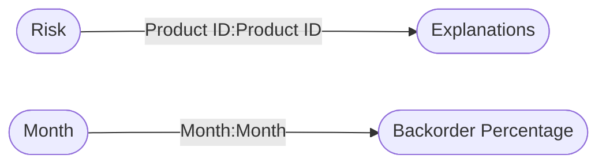

----

[Home](./index.md) > [Supply Chain Sample.pbix](Supply%20Chain%20Sample.pbix.md)

| [Information](#information) | [Model information](#model-information) | [Model relationships](#model-relationships) | [Business objects](#business-objects) | [Measures](#measures) | [Relationships](#relationships) | [Hierarchies](#hierarchies) | [Columns](#columns) | [Report sections](#report-sections) |

----

# Information

Documentation for file **Supply Chain Sample.pbix**.

# Model information

| Param  | Value  |
|---|---|
| **Analyzed pbix file name** | `Supply Chain Sample.pbix` | 
| **Catalog name** | `d94264fc-9118-40bb-81b2-f5c5f0e8fbea` | 
| **Port** | `61420`|
| **Description** | `-NaN-` | 
| **Date modified** | `2023-12-16T19:20:29` | 
| **Compatibility level** | `1567` | 

[Up](#)
# Model relationships

[Up](#)

# Business objects

| ID | NAME | DESCRIPTION | 
|----|------|-------------|
| 276 | Supply Analytics | n/a |
| 13029 | Backorder Percentage | n/a |

[Up](#)
# Measures

<table>
    <tr>
        <th> ID </th><th> TABLE </th><th> NAME </th><th> DESCRIPTION </th><th> EXPRESSION </th><th> IS_HIDDEN </th><th> STATE </th>
    </tr>
<tr>
        <td> 17 </td><td> DateTableTemplate_6d..(54) </td><td>  </td><td> n/a </td><td> <code> YEAR([Date]) </code></td><td> True </td><td>  1 </td> 
    </tr>
<tr>
        <td> 18 </td><td> DateTableTemplate_6d..(54) </td><td>  </td><td> n/a </td><td> <code> MONTH([Date]) </code></td><td> True </td><td>  1 </td> 
    </tr>
<tr>
        <td> 19 </td><td> DateTableTemplate_6d..(54) </td><td>  </td><td> n/a </td><td> <code> FORMAT([Date], "MMMM") </code></td><td> True </td><td>  1 </td> 
    </tr>
<tr>
        <td> 20 </td><td> DateTableTemplate_6d..(54) </td><td>  </td><td> n/a </td><td> <code> INT(([MonthNo] + 2) / 3) </code></td><td> True </td><td>  1 </td> 
    </tr>
<tr>
        <td> 21 </td><td> DateTableTemplate_6d..(54) </td><td>  </td><td> n/a </td><td> <code> "Qtr " & [QuarterNo] </code></td><td> True </td><td>  1 </td> 
    </tr>
<tr>
        <td> 22 </td><td> DateTableTemplate_6d..(54) </td><td>  </td><td> n/a </td><td> <code> DAY([Date]) </code></td><td> True </td><td>  1 </td> 
    </tr>
<tr>
        <td> 745 </td><td> Supply Analytics </td><td>  </td><td> n/a </td><td> <code> If('Supply Analytics'[Manufactured Goods %] <=0.9, ">125%", if('Supply Analytics'[Manufactured Goods %] >0.9 && [Manufactured Goods %] <= 1.2, "Between 100%-125%", if('Supply Analytics'[Manufactured Goods %] > 1.2 && [Manufactured Goods %] <= 1.2, "Between 75%-100%", "<75%"))) </code></td><td> True </td><td>  1 </td> 
    </tr>
<tr>
        <td> 2400 </td><td> Supply Analytics </td><td>  </td><td> n/a </td><td> <code> If('Supply Analytics'[Manufactured Goods %] <=1.1, ">100%", "<70%") </code></td><td> True </td><td>  1 </td> 
    </tr>
</table>

[Up](#)
# Relationships 

| ID | FROM_TABLE | TO_TABLE | FROM:TO CARDINALITY | NAME | IS_ACTIVE  |
|----|------------|----------|---------------------|------|------------|
| 1273 | Explanations[Product ID] | Risk[Product ID] | 2:1 | f1f4dec2-922f-4ec6-8dc1-49554a10a01c | True |
| 13652 | Backorder Percentage[Month] | Month[Month] | 2:1 | 9ed0ec75-78b2-4f82-bffb-1dce5fda3499 | True |

[Up](#)
# Hierarchies 

| ID | TABLE | NAME | DESCRIPTION  | IS_HIDDEN | 
|----|----------|------|--------------|-----------|
| 24 |DateTableTemplate_6d..(54) | Date Hierarchy | n/a | False | 

[Up](#)
# Columns 

<table>
    <tr>
        <th> ID </th><th> TABLE </th><th> EXPLICIT_NAME </th><th> DESCRIPTION </th><th> IS_HIDDEN </th><th> EXPRESSION </th>
    </tr>
<tr>
        <td> 13034 </td><td> Backorder Percentage </td><td> Month </td><td> n/a </td><td> False </td><td><code> n/a </code></td>
    </tr>

<tr>
        <td> 13035 </td><td> Backorder Percentage </td><td> Region </td><td> n/a </td><td> False </td><td><code> n/a </code></td>
    </tr>

<tr>
        <td> 13036 </td><td> Backorder Percentage </td><td> Plant </td><td> n/a </td><td> False </td><td><code> n/a </code></td>
    </tr>

<tr>
        <td> 13037 </td><td> Backorder Percentage </td><td> Product Type </td><td> n/a </td><td> False </td><td><code> n/a </code></td>
    </tr>

<tr>
        <td> 13039 </td><td> Backorder Percentage </td><td> Forecast Bias </td><td> n/a </td><td> False </td><td><code> n/a </code></td>
    </tr>

<tr>
        <td> 13040 </td><td> Backorder Percentage </td><td> Buyer Type </td><td> n/a </td><td> False </td><td><code> n/a </code></td>
    </tr>

<tr>
        <td> 13041 </td><td> Backorder Percentage </td><td> Shipment Destination </td><td> n/a </td><td> False </td><td><code> n/a </code></td>
    </tr>

<tr>
        <td> 13042 </td><td> Backorder Percentage </td><td> Shipment Type </td><td> n/a </td><td> False </td><td><code> n/a </code></td>
    </tr>

<tr>
        <td> 13044 </td><td> Backorder Percentage </td><td> Forecast Accuracy </td><td> n/a </td><td> False </td><td><code> n/a </code></td>
    </tr>

<tr>
        <td> 13045 </td><td> Backorder Percentage </td><td> Brand </td><td> n/a </td><td> False </td><td><code> n/a </code></td>
    </tr>

<tr>
        <td> 13046 </td><td> Backorder Percentage </td><td> Backorder % </td><td> n/a </td><td> False </td><td><code> n/a </code></td>
    </tr>

<tr>
        <td> 13047 </td><td> Backorder Percentage </td><td> Distribution Center </td><td> n/a </td><td> False </td><td><code> n/a </code></td>
    </tr>

<tr>
        <td> 23388 </td><td> Backorder Percentage </td><td> Demand Type </td><td> n/a </td><td> False </td><td><code> n/a </code></td>
    </tr>

</table>

# Report sections

## Risk Analytics

| Param  | Value  |
|---|---|
| **ID** | `` |
| **Name** | `ReportSectionaeffc6c2512def112cfa` |
| **Display Name** | `Risk Analytics` |
| **Filters** | `[]` |
| **Ordinal** | `0` |
| **Visual containers number** | `7` |

[Up](#)

### Container 785e37af27ec534ab424 

| Param  | Value  |
|---|---|
| **Name:** | `785e37af27ec534ab424` |
| **Type:** | `['n/a']` |
| **Business objects:**  | `n/a` | 
| **Attributes:**  | n/a | 

[Up](#)

### Container 7c6a9e1b57ab7ebd6ad8 

| Param  | Value  |
|---|---|
| **Name:** | `7c6a9e1b57ab7ebd6ad8` |
| **Type:** | `['n/a']` |
| **Business objects:**  | `n/a` | 
| **Attributes:**  | n/a | 

[Up](#)

### Container 77f9305cd13f3320304c 

| Param  | Value  |
|---|---|
| **Name:** | `77f9305cd13f3320304c` |
| **Type:** | `PowerApps_PBI_CV_C29F1DCC_81F5_4973_94AD_0517D44CC06A` |
| **Business objects:**  | `Backorder Percentage` | 
| **Attributes:**  | Column: Backorder Percentage.Plant  Column: Backorder Percentage.Product Type | 

[Up](#)

### Container 081c4b66305790c87291 

| Param  | Value  |
|---|---|
| **Name:** | `081c4b66305790c87291` |
| **Type:** | `['n/a']` |
| **Business objects:**  | `n/a` | 
| **Attributes:**  | n/a | 

[Up](#)

### Container 60f36c4ab1755d40a1d3 

| Param  | Value  |
|---|---|
| **Name:** | `60f36c4ab1755d40a1d3` |
| **Type:** | `waterfallChart` |
| **Business objects:**  | `Explanations` | 
| **Attributes:**  | Column: Explanations.Factor  Aggregation: Sum(Explanations.Risk) | 

[Up](#)

### Container 7bf07d56957f69193161 

| Param  | Value  |
|---|---|
| **Name:** | `7bf07d56957f69193161` |
| **Type:** | `tableEx` |
| **Business objects:**  | `Risk` | 
| **Attributes:**  | Column: Risk.Location  Column: Risk.Product ID  Column: Risk.Risk Score  Column: Risk.Backorder Risk  Column: Risk.Distribution Center | 

[Up](#)

### Container 4a9898755b7be14b5605 

| Param  | Value  |
|---|---|
| **Name:** | `4a9898755b7be14b5605` |
| **Type:** | `esriVisual` |
| **Business objects:**  | `Risk` | 
| **Attributes:**  | Column: Risk.Location  Aggregation: CountNonNull(Risk.Product ID) | 

[Up](#)

## Exploratory Analysis

| Param  | Value  |
|---|---|
| **ID** | `` |
| **Name** | `ReportSection0805d6522ced0b422d38` |
| **Display Name** | `Exploratory Analysis` |
| **Filters** | `[]` |
| **Ordinal** | `1` |
| **Visual containers number** | `8` |

[Up](#)

### Container 0d8ec8d54ccfa45ab88f 

| Param  | Value  |
|---|---|
| **Name:** | `0d8ec8d54ccfa45ab88f` |
| **Type:** | `barChart` |
| **Business objects:**  | `Backorder Percentage, Month` | 
| **Attributes:**  | Aggregation: Avg(Backorder Percentage.Backorder %)  Column: Month.Month | 

[Up](#)

### Container 785e37af27ec534ab424 

| Param  | Value  |
|---|---|
| **Name:** | `785e37af27ec534ab424` |
| **Type:** | `['n/a']` |
| **Business objects:**  | `n/a` | 
| **Attributes:**  | n/a | 

[Up](#)

### Container 7c6a9e1b57ab7ebd6ad8 

| Param  | Value  |
|---|---|
| **Name:** | `7c6a9e1b57ab7ebd6ad8` |
| **Type:** | `['n/a']` |
| **Business objects:**  | `n/a` | 
| **Attributes:**  | n/a | 

[Up](#)

### Container 77f9305cd13f3320304c 

| Param  | Value  |
|---|---|
| **Name:** | `77f9305cd13f3320304c` |
| **Type:** | `PowerApps_PBI_CV_C29F1DCC_81F5_4973_94AD_0517D44CC06A` |
| **Business objects:**  | `Backorder Percentage` | 
| **Attributes:**  | Column: Backorder Percentage.Plant  Column: Backorder Percentage.Product Type | 

[Up](#)

### Container cc83889ee3c0277d6686 

| Param  | Value  |
|---|---|
| **Name:** | `cc83889ee3c0277d6686` |
| **Type:** | `decompositionTreeVisual` |
| **Business objects:**  | `Backorder Percentage` | 
| **Attributes:**  | Measure: Backorder Percentage.% on backorder  Column: Backorder Percentage.Forecast Bias  Column: Backorder Percentage.Plant  Column: Backorder Percentage.Product Type  Column: Backorder Percentage.Shipment Destination  Column: Backorder Percentage.Shipment Type  Column: Backorder Percentage.Region  Column: Backorder Percentage.Distribution Center  Column: Backorder Percentage.Demand Type  Column: Backorder Percentage.Forecast Accuracy  Column: Backorder Percentage.Brand  Column: Backorder Percentage.Buyer Type  Measure: Backorder Percentage.Backorder $ | 

[Up](#)

### Container 081c4b66305790c87291 

| Param  | Value  |
|---|---|
| **Name:** | `081c4b66305790c87291` |
| **Type:** | `['n/a']` |
| **Business objects:**  | `n/a` | 
| **Attributes:**  | n/a | 

[Up](#)

### Container 259d088b60d6704886d0 

| Param  | Value  |
|---|---|
| **Name:** | `259d088b60d6704886d0` |
| **Type:** | `['n/a']` |
| **Business objects:**  | `n/a` | 
| **Attributes:**  | n/a | 

[Up](#)

### Container 5649b3e28d77b8aee842 

| Param  | Value  |
|---|---|
| **Name:** | `5649b3e28d77b8aee842` |
| **Type:** | `['n/a']` |
| **Business objects:**  | `n/a` | 
| **Attributes:**  | n/a | 

[Up](#)

## Ask Questions

| Param  | Value  |
|---|---|
| **ID** | `31589085` |
| **Name** | `ReportSection` |
| **Display Name** | `Ask Questions` |
| **Filters** | `[]` |
| **Ordinal** | `2` |
| **Visual containers number** | `4` |

[Up](#)

### Container a3402b31dd4040b1942a 

| Param  | Value  |
|---|---|
| **Name:** | `a3402b31dd4040b1942a` |
| **Type:** | `treemap` |
| **Business objects:**  | `Backorder Percentage` | 
| **Attributes:**  | Measure: Backorder Percentage.% on backorder  Column: Backorder Percentage.Demand Type | 

[Up](#)

### Container 2d77eb4274b5410b420d 

| Param  | Value  |
|---|---|
| **Name:** | `2d77eb4274b5410b420d` |
| **Type:** | `['n/a']` |
| **Business objects:**  | `n/a` | 
| **Attributes:**  | n/a | 

[Up](#)

### Container 2a4dc2b00972cea35e43 

| Param  | Value  |
|---|---|
| **Name:** | `2a4dc2b00972cea35e43` |
| **Type:** | `areaChart` |
| **Business objects:**  | `Month, Backorder Percentage` | 
| **Attributes:**  | Column: Month.Month  Measure: Backorder Percentage.Backorder $ | 

[Up](#)

### Container 44b1eb99372df10740c4 

| Param  | Value  |
|---|---|
| **Name:** | `44b1eb99372df10740c4` |
| **Type:** | `['n/a']` |
| **Business objects:**  | `n/a` | 
| **Attributes:**  | n/a | 

[Up](#)

## Supply Chain Analytics

| Param  | Value  |
|---|---|
| **ID** | `` |
| **Name** | `ReportSectiond48f10a3d83531ea24b4` |
| **Display Name** | `Supply Chain Analytics` |
| **Filters** | `[]` |
| **Ordinal** | `3` |
| **Visual containers number** | `4` |

[Up](#)

### Container f06d7cb16e3ae52d23d3 

| Param  | Value  |
|---|---|
| **Name:** | `f06d7cb16e3ae52d23d3` |
| **Type:** | `columnChart` |
| **Business objects:**  | `Backorder Percentage` | 
| **Attributes:**  | Measure: Backorder Percentage.Backorder $  Column: Backorder Percentage.Region | 

[Up](#)

### Container a3402b31dd4040b1942a 

| Param  | Value  |
|---|---|
| **Name:** | `a3402b31dd4040b1942a` |
| **Type:** | `treemap` |
| **Business objects:**  | `Supply Analytics` | 
| **Attributes:**  | Aggregation: CountNonNull(bank-full2.Product )  Column: Supply Analytics.Demand Type | 

[Up](#)

### Container 47ab9237785e689bbcb5 

| Param  | Value  |
|---|---|
| **Name:** | `47ab9237785e689bbcb5` |
| **Type:** | `['n/a']` |
| **Business objects:**  | `n/a` | 
| **Attributes:**  | n/a | 

[Up](#)

### Container ca1930b86620637c9caa 

| Param  | Value  |
|---|---|
| **Name:** | `ca1930b86620637c9caa` |
| **Type:** | `keyDriversVisual` |
| **Business objects:**  | `Supply Analytics` | 
| **Attributes:**  | Column: Supply Analytics.Product   Column: Supply Analytics.Demand Type  Column: Supply Analytics.Forecast Accuracy  Column: Supply Analytics.Forecast Bias  Column: Supply Analytics.Manufactured Goods | 

[Up](#)

----

Generated at 16.12.2023 22:30:27 by <a href='https://github.com/dop12/pbix_doc'>PBIX DOC PROJECT</a> Git version: ef36a14

