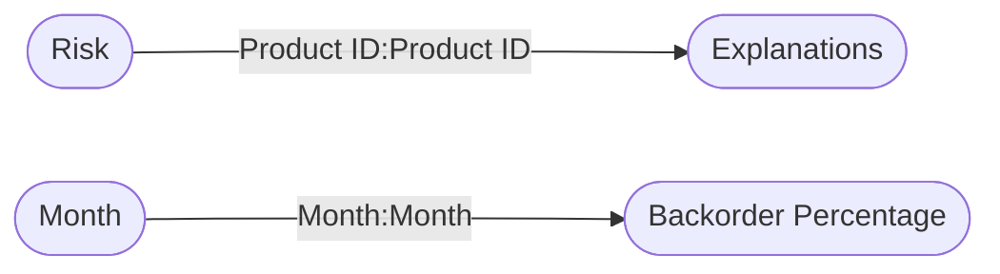

----

[Home](./index.md) > [Supply Chain Sample.pbix](Supply%20Chain%20Sample.pbix_dmv.md)

| [Information](#information) | [Model information](#model-information) | [Model relationships](#model-relationships) | [Business objects](#business-objects) | [Measures](#measures) | [Relationships](#relationships) | [Hierarchies](#hierarchies) | [Columns](#columns) |

----

# Information

Documentation for file **Supply Chain Sample.pbix**.

# Model information

| Param  | Value  |
|---|---|
| **Analyzed pbix file name** | `Supply Chain Sample.pbix` | 
| **Catalog name** | `cfe6b23a-d100-4ea4-b71d-69226c119b08` | 
| **Port** | `64646`|
| **Description** | `-NaN-` | 
| **Date modified** | `2024-01-04T21:54:33` | 
| **Compatibility level** | `1567` | 

[Up](#information)

# Model relationships

[Up](#information)

# Business objects

| ID | NAME | DESCRIPTION | 
|----|------|-------------|
| 276 | Supply Analytics | n/a |
| 13029 | Backorder Percentage | n/a |

[Up](#information)

# Measures

<table>
    <tr>
        <th> ID </th><th> TABLE </th><th> NAME </th><th> DESCRIPTION </th><th> EXPRESSION </th><th> IS_HIDDEN </th><th> STATE </th>
    </tr>
<tr>
        <td> 17 </td><td> DateTableTemplate_6d..(54) </td><td>  </td><td> n/a </td><td> <code> YEAR([Date]) </code></td><td> True </td><td>  1 </td> 
    </tr>
<tr>
        <td> 18 </td><td> DateTableTemplate_6d..(54) </td><td>  </td><td> n/a </td><td> <code> MONTH([Date]) </code></td><td> True </td><td>  1 </td> 
    </tr>
<tr>
        <td> 19 </td><td> DateTableTemplate_6d..(54) </td><td>  </td><td> n/a </td><td> <code> FORMAT([Date], "MMMM") </code></td><td> True </td><td>  1 </td> 
    </tr>
<tr>
        <td> 20 </td><td> DateTableTemplate_6d..(54) </td><td>  </td><td> n/a </td><td> <code> INT(([MonthNo] + 2) / 3) </code></td><td> True </td><td>  1 </td> 
    </tr>
<tr>
        <td> 21 </td><td> DateTableTemplate_6d..(54) </td><td>  </td><td> n/a </td><td> <code> "Qtr " & [QuarterNo] </code></td><td> True </td><td>  1 </td> 
    </tr>
<tr>
        <td> 22 </td><td> DateTableTemplate_6d..(54) </td><td>  </td><td> n/a </td><td> <code> DAY([Date]) </code></td><td> True </td><td>  1 </td> 
    </tr>
<tr>
        <td> 745 </td><td> Supply Analytics </td><td>  </td><td> n/a </td><td> <code> If('Supply Analytics'[Manufactured Goods %] <=0.9, ">125%", if('Supply Analytics'[Manufactured Goods %] >0.9 && [Manufactured Goods %] <= 1.2, "Between 100%-125%", if('Supply Analytics'[Manufactured Goods %] > 1.2 && [Manufactured Goods %] <= 1.2, "Between 75%-100%", "<75%"))) </code></td><td> True </td><td>  1 </td> 
    </tr>
<tr>
        <td> 2400 </td><td> Supply Analytics </td><td>  </td><td> n/a </td><td> <code> If('Supply Analytics'[Manufactured Goods %] <=1.1, ">100%", "<70%") </code></td><td> True </td><td>  1 </td> 
    </tr>
</table>

[Up](#information)

# Relationships 

| ID | FROM_TABLE | TO_TABLE | FROM:TO CARDINALITY | NAME | IS_ACTIVE  |
|----|------------|----------|---------------------|------|------------|
| 1273 | Explanations[Product ID] | Risk[Product ID] | 2:1 | f1f4dec2-922f-4ec6-8dc1-49554a10a01c | True |
| 13652 | Backorder Percentage[Month] | Month[Month] | 2:1 | 9ed0ec75-78b2-4f82-bffb-1dce5fda3499 | True |

[Up](#information)

# Hierarchies 

| ID | TABLE | NAME | DESCRIPTION  | IS_HIDDEN | 
|----|----------|------|--------------|-----------|
| 24 |DateTableTemplate_6d..(54) | Date Hierarchy | n/a | False | 

[Up](#information)

# Columns 

<table>
    <tr>
        <th> ID </th><th> TABLE </th><th> EXPLICIT_NAME </th><th> DESCRIPTION </th><th> IS_HIDDEN </th><th> EXPRESSION </th>
    </tr>
<tr>
        <td> 13034 </td><td> Backorder Percentage </td><td> Month </td><td> n/a </td><td> False </td><td><code> n/a </code></td>
    </tr>

<tr>
        <td> 13035 </td><td> Backorder Percentage </td><td> Region </td><td> n/a </td><td> False </td><td><code> n/a </code></td>
    </tr>

<tr>
        <td> 13036 </td><td> Backorder Percentage </td><td> Plant </td><td> n/a </td><td> False </td><td><code> n/a </code></td>
    </tr>

<tr>
        <td> 13037 </td><td> Backorder Percentage </td><td> Product Type </td><td> n/a </td><td> False </td><td><code> n/a </code></td>
    </tr>

<tr>
        <td> 13039 </td><td> Backorder Percentage </td><td> Forecast Bias </td><td> n/a </td><td> False </td><td><code> n/a </code></td>
    </tr>

<tr>
        <td> 13040 </td><td> Backorder Percentage </td><td> Buyer Type </td><td> n/a </td><td> False </td><td><code> n/a </code></td>
    </tr>

<tr>
        <td> 13041 </td><td> Backorder Percentage </td><td> Shipment Destination </td><td> n/a </td><td> False </td><td><code> n/a </code></td>
    </tr>

<tr>
        <td> 13042 </td><td> Backorder Percentage </td><td> Shipment Type </td><td> n/a </td><td> False </td><td><code> n/a </code></td>
    </tr>

<tr>
        <td> 13044 </td><td> Backorder Percentage </td><td> Forecast Accuracy </td><td> n/a </td><td> False </td><td><code> n/a </code></td>
    </tr>

<tr>
        <td> 13045 </td><td> Backorder Percentage </td><td> Brand </td><td> n/a </td><td> False </td><td><code> n/a </code></td>
    </tr>

<tr>
        <td> 13046 </td><td> Backorder Percentage </td><td> Backorder % </td><td> n/a </td><td> False </td><td><code> n/a </code></td>
    </tr>

<tr>
        <td> 13047 </td><td> Backorder Percentage </td><td> Distribution Center </td><td> n/a </td><td> False </td><td><code> n/a </code></td>
    </tr>

<tr>
        <td> 23388 </td><td> Backorder Percentage </td><td> Demand Type </td><td> n/a </td><td> False </td><td><code> n/a </code></td>
    </tr>

</table>

[Up](#information)

----

Generated at 10.01.2024 22:54:34 by <a href='https://github.com/dop12/pbix_doc'>PBIX DOC PROJECT</a> Git version: f640601

